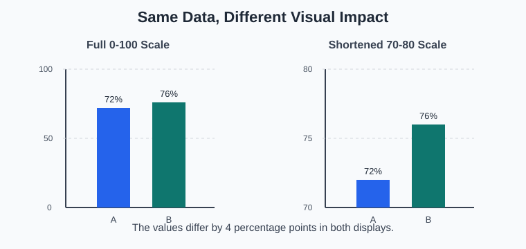
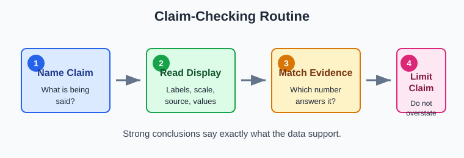
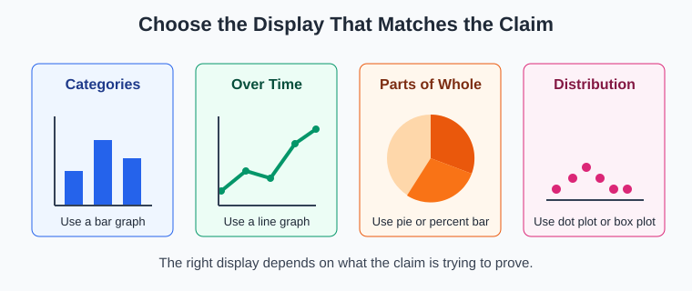
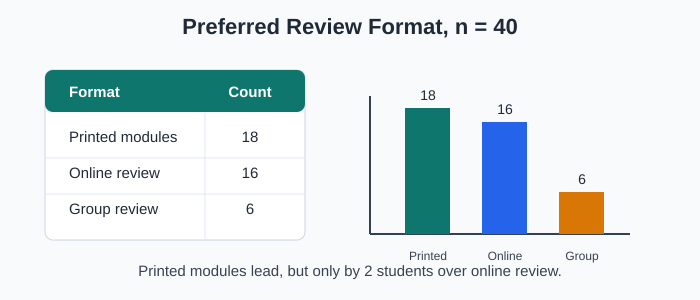
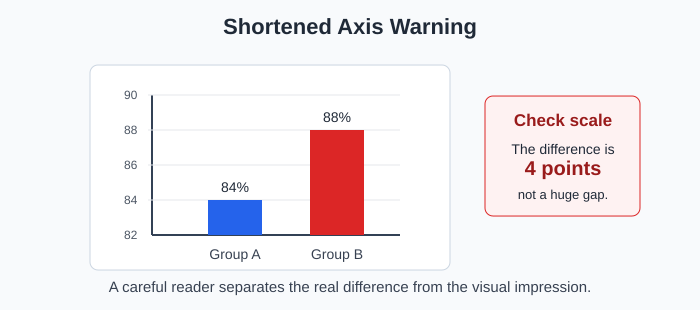

# Statistics - Lesson 3: Claims and Displays

> [!GOAL] Lesson Goal
>
> Judge whether a statistical claim is supported by a graph, table, or summary statistic, and explain your decision with evidence from the display.

**Content domain:** Data and Probability  
**Estimated time:** 50 minutes  
**Target skill:** Match a claim to the data display and evidence that can actually support it.

## Pre-Check

> [!CHECK] Pre-Check
>
> Use these questions to check the skills you will need before reading the lesson.

Try these before reading. Check the answers after you commit to your own response.

1. A survey has 80 students and 52 say they prefer online review. What percent is that?
2. Which graph is better for comparing categories: a bar graph or a line graph?
3. Why can a graph with no axis label be hard to trust?

**Answers:** 1. \(52 \div 80 = 0.65 = 65\%\). 2. A bar graph. 3. You cannot tell what is being counted, measured, or compared.

> [!TARGET] Today You Will
>
> - identify the exact claim being made
> - inspect the display for labels, scale, source, and sample size
> - choose evidence from a graph, table, or statistic
> - write a conclusion that is supported but not exaggerated

## Key Vocabulary

| Term | Meaning | Quick check |
| --- | --- | --- |
| Claim | A statement that says something is true about data. | "Most students improved." |
| Display | A graph, table, chart, or summary used to show data. | Bar graph, line graph, table |
| Evidence | The specific data value, pattern, or statistic used to support a claim. | "18 out of 24 students" |
| Scale | The number spacing on an axis or measurement line. | 0, 10, 20, 30 or 70, 75, 80 |
| Source | Where the data came from. | Class survey, school records |
| Representative data | Data that fairly describe the group named in the claim. | A sample from all Grade 10 sections |
| Misleading display | A display that makes a pattern look stronger, weaker, or different from the data. | Truncated axis, missing labels |

## Visual Introduction

The same two values can feel calm or dramatic depending on the scale.

Both graphs show 72% and 76%. The right graph starts near 70%, so the difference looks much larger. The data did increase by 4 percentage points, but the display makes the increase feel bigger than it is.

> [!IMPORTANT] Core Idea
>
> A display supports a claim only when the claim, data source, graph type, labels, scale, and summary statistic all match.

## The Claim-Checking Routine

Use this four-step routine whenever a report gives you a claim and a display.

| Step | Question to ask | Why it matters |
| --- | --- | --- |
| 1. Name the claim | What exactly is the report saying? | Vague claims are easy to overstate. |
| 2. Read the display | What values, labels, scale, and source are shown? | A neat graph can still be incomplete. |
| 3. Match evidence | Which number or pattern directly supports the claim? | Evidence must answer the same question as the claim. |
| 4. Limit the conclusion | What can you say, and what can you not say? | Good statistics avoid overclaiming. |

## Graph Choice Matters

Different claims need different displays.

| If the claim is about... | Useful display | Example claim |
| --- | --- | --- |
| comparing categories | bar graph or two-way table | "Section B had the most club members." |
| change over time | line graph | "Attendance increased from Monday to Friday." |
| parts of a whole | percent bar or pie chart | "Almost half chose option C." |
| distribution of numerical data | dot plot, histogram, box plot | "Scores are clustered near 80." |
| typical value | mean or median with context | "The typical score was about 84." |

> [!WARNING] Misconception Alert
>
> A colorful graph is not automatically strong evidence. First ask whether the graph type fits the claim.

## Worked Example

**Claim:** "Students strongly preferred printed modules over online review."

The survey table shows responses from 40 Grade 10 students.

| Preferred format | Number of students |
| --- | ---: |
| Printed modules | 18 |
| Online review | 16 |
| Group review | 6 |
| **Total** | **40** |

**Step 1: Name the claim.**  
The claim says printed modules were strongly preferred.

**Step 2: Read the display.**  
Printed modules: 18 students. Online review: 16 students. Group review: 6 students. Total: 40 students.

**Step 3: Match evidence.**  
Printed modules had the highest count, but only by 2 students compared with online review.

$$18 - 16 = 2$$

Printed modules were chosen by:

$$18 \div 40 = 0.45 = 45\%$$

**Step 4: Limit the conclusion.**  
The data support the claim that printed modules were the most selected option in this sample. The word **strongly** is not well supported because the lead over online review was small.

> [!EXAMPLE] Complete Answer
>
> Printed modules were the most selected format, with 18 out of 40 students or 45%. However, the claim that students "strongly preferred" printed modules is too strong because online review had 16 students, only 2 fewer.

## Guided Practice

### Practice 1: Match the Claim

A line graph shows quiz averages for five Fridays: 78, 80, 81, 80, 82.

**Claim A:** "The class improved slightly over the month."  
**Claim B:** "The class doubled its average score over the month."

Which claim is supported?

**Answer:** Claim A. The average increased from 78 to 82, a 4-point increase. Claim B is not supported because 82 is not double 78.

### Practice 2: Inspect the Scale

The chart compares two review groups. Group A scored 84%. Group B scored 88%.

**Question:** What is a careful conclusion?

**Answer:** Group B scored 4 percentage points higher than Group A. The shortened scale makes the difference look larger, so the conclusion should avoid saying Group B was "far better."

### Practice 3: Check the Source

A school poster says, "Most Grade 10 students want longer lunch," based on 12 students from one club.

**Question:** What is the main weakness?

**Answer:** The sample may not represent all Grade 10 students. The claim names all Grade 10 students, but the data came from only 12 club members.

> [!TIP] Evidence Sentence Frame
>
> "The claim is supported/not fully supported because the display shows ___, but ___ needs to be considered."

## Mini-Quiz

1. What four details should you inspect in a display before trusting a claim?
2. Which graph type is usually best for change over time?
3. A graph starts its y-axis at 90 instead of 0. What warning should you consider?
4. Why is "most students" a claim that needs a clear denominator?
5. A survey of 20 students says 11 prefer option A. Is "a majority prefer option A" supported?

**Mini-Quiz Answers**

1. Labels, scale, source, and sample size are key details. The graph type and statistic also matter.
2. A line graph.
3. The difference may look exaggerated because the scale is shortened.
4. "Most" means more than half of the group, so you need to know the total group.
5. Yes. \(11 \div 20 = 55\%\), so more than half prefer option A.

## Independent Practice

Complete these before checking the answer key.

1. A class survey found 24 out of 30 learners use flashcards. Write the percent and a supported claim.
2. A bar graph comparing 61% and 64% starts at 60%. What warning should a reader notice?
3. A report says "boys are better at statistics" from one quiz in one section. Name two weaknesses in the claim.
4. Choose the better display for showing cafeteria sales from Monday to Friday: bar graph or line graph? Explain.
5. A table shows Section A has 14 science club members and Section B has 22. Write a supported comparison.
6. A report says "nearly everyone passed" when 31 out of 40 passed. Is the wording supported? Explain.
7. Give one example of a claim that would need a median instead of only a mean.
8. Write a one-sentence conclusion that includes a number, group, and limitation.

## Answer Key

1. \(24 \div 30 = 0.80 = 80\%\). Supported claim: In this class survey, 80% of learners use flashcards.
2. The shortened axis may exaggerate a 3-percentage-point difference.
3. Sample answers: one quiz may not represent ability, one section may not represent all learners, "better" is vague, and the claim may be biased.
4. A line graph is better if the claim is about change across weekdays. A bar graph is acceptable if the focus is comparing separate days.
5. Section B has 8 more science club members than Section A because \(22 - 14 = 8\).
6. Not fully. \(31 \div 40 = 77.5\%\), so most passed, but "nearly everyone" is too strong.
7. Sample: "The typical family internet cost is about PHP 1,200" may need the median if a few very high bills pull the mean upward.
8. Sample: In this class, 65% chose online review, but the result only describes the 40 students surveyed.

## Misconception Alerts

> [!WARNING] "Higher bar" always means "important difference."
>
> Not always. Check the units and size of the difference. A 2-point gap may look huge on a shortened scale.

> [!WARNING] "Most" means "the biggest category."
>
> Not always. The biggest category may still be less than half. "Most" usually means more than 50%.

> [!WARNING] One sample proves a claim about everyone.
>
> A sample supports a claim only for the group it fairly represents.

> [!WARNING] Mean and median say the same thing.
>
> They can differ when data have outliers. Choose the statistic that matches the claim.

## Self-Explanation Prompts

Answer in your own words.

1. How do you decide whether a graph supports a claim?
2. Why should a conclusion mention the sample or group?
3. When might a graph be technically correct but still misleading?
4. How can one word, such as "strongly" or "nearly everyone," make a claim harder to support?

## Mastery Checklist

Check each statement when you can do it confidently.

- I can restate a statistical claim in precise words.
- I can read values from a table, bar graph, or line graph.
- I can identify missing labels, unclear scales, and weak sources.
- I can choose a graph type that fits a claim.
- I can use percent, difference, mean, or median as evidence when appropriate.
- I can write a conclusion that is supported and limited by the data.

> [!PRACTICE] Practice Plan
>
> Use the practice exam for quick checks on claim wording, graph choice, and misleading displays. Use the assessment when you are ready to judge full scenarios and explain whether the evidence is strong enough.

## Final Summary

Statistical claims need evidence. A strong answer names the claim, reads the display carefully, uses a matching statistic or comparison, and limits the conclusion to what the data can honestly support.
