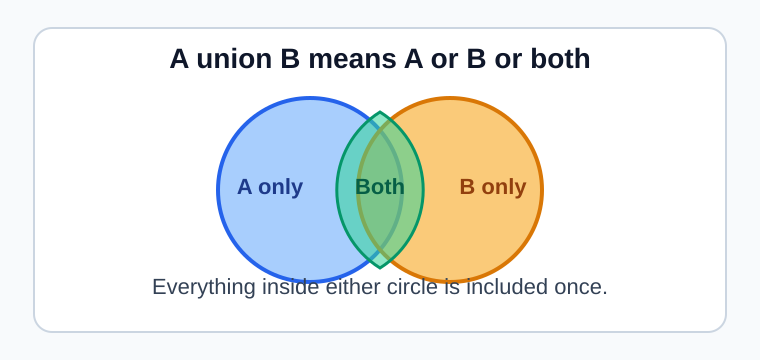
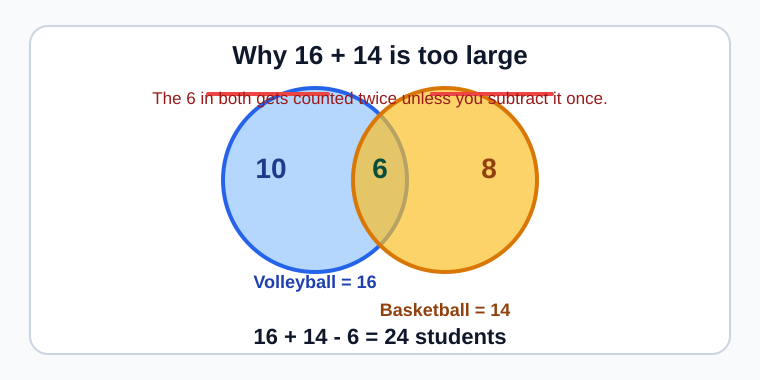
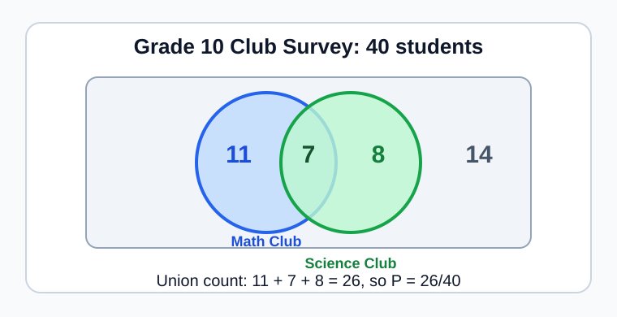
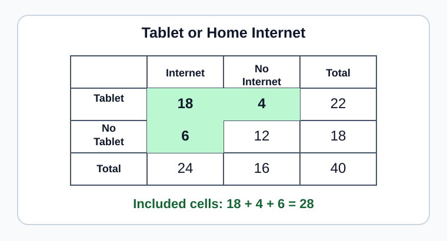
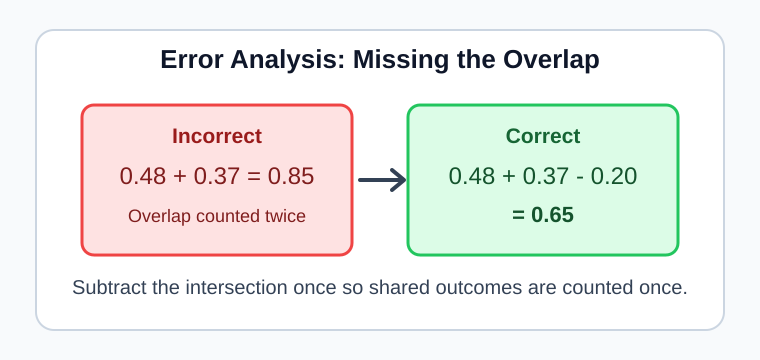

# Statistics - Lesson 6: Union of Events

> [!GOAL] Learning Goal
>
> By the end of this lesson, you should be able to **find and interpret the probability of the union of two events using tables and Venn diagrams.**

**Content domain:** Data and Probability  
**Estimated time:** 50 minutes  
**Difficulty:** Intermediate  
**Target competency:** Solve probability problems involving the union of events using tables or Venn diagrams.

## Lesson Roadmap

| Part | Focus | You should be able to |
| --- | --- | --- |
| 1 | Pre-check | Recall probability totals, overlap, and "or" language |
| 2 | Vocabulary | Use union, intersection, overlap, and mutually exclusive correctly |
| 3 | Visual model | Read the union from a Venn diagram |
| 4 | Addition rule | Use $P(A \cup B)=P(A)+P(B)-P(A \cap B)$ |
| 5 | Tables | Count the union from a two-way table |
| 6 | Practice | Explain answers in context and avoid double-counting |

## Pre-Check

Before reading, answer these without a calculator.

1. If 18 out of 30 learners ride a jeepney to school, what is the probability a randomly chosen learner rides a jeepney?
2. In a Venn diagram, what does the overlapping region mean?
3. If two categories overlap, why might adding their counts give a total that is too large?

> [!CHECK] Quick Answers
>
> 1. $\frac{18}{30}=\frac{3}{5}=0.60$.  
> 2. The same person or outcome belongs to both events.  
> 3. The overlapping outcomes get counted twice.

## Key Vocabulary

| Term | Meaning | Student-friendly cue |
| --- | --- | --- |
| Event | A set of outcomes, such as "likes volleyball" | One condition |
| Union | Outcomes in event $A$, event $B$, or both | $A$ or $B$ |
| Intersection | Outcomes in both event $A$ and event $B$ | $A$ and $B$ |
| Overlap | The shared part of two events | Counted in both groups |
| Mutually exclusive | Events with no overlap | Cannot happen together |
| Addition rule | Rule for finding a union when events may overlap | Add, then subtract the overlap |

## Visual Introduction

The word **or** in probability usually means the **union**. It includes the left-only region, the overlap, and the right-only region.

In the diagram, the union is everything inside either circle:

$$
A \cup B = \text{A only}+\text{both}+\text{B only}
$$

> [!IMPORTANT] Core Idea
>
> A union question asks for **at least one** of the events. If a learner belongs to both events, count that learner once, not twice.

## Why Double-Counting Happens

Suppose 30 students were surveyed.

- 16 like volleyball.
- 14 like basketball.
- 6 like both volleyball and basketball.

If you add $16+14$, the 6 students who like both sports are included twice.

So the union count is:

$$
16+14-6=24
$$

The probability is:

$$
P(\text{volleyball or basketball})=\frac{24}{30}=\frac{4}{5}=0.80
$$

## The Addition Rule

For any two events $A$ and $B$:

$$
P(A \cup B)=P(A)+P(B)-P(A \cap B)
$$

You can also use the same idea with counts:

$$
n(A \cup B)=n(A)+n(B)-n(A \cap B)
$$

| If the problem gives... | Use... |
| --- | --- |
| Counts | Add counts, subtract the overlap, then divide by the total if probability is needed |
| Probabilities | Add probabilities and subtract $P(A \cap B)$ |
| A two-way table | Count every row or column cell that satisfies $A$ or $B$ |
| Mutually exclusive events | Use $P(A \cup B)=P(A)+P(B)$ because $P(A \cap B)=0$ |

> [!TIP] Phrase To Remember
>
> **Union means "one or the other or both."** The overlap belongs in the answer, but it must be counted only once.

## Worked Example: Use a Venn Diagram

In a Grade 10 section of 40 students:

- 18 joined the Math Club.
- 15 joined the Science Club.
- 7 joined both clubs.

**Question:** What is the probability that a randomly selected student joined Math Club or Science Club?

Step 1: Identify the events.

| Symbol | Event |
| --- | --- |
| $M$ | joined Math Club |
| $S$ | joined Science Club |
| $M \cap S$ | joined both clubs |
| $M \cup S$ | joined Math Club or Science Club or both |

Step 2: Use the union rule.

$$
n(M \cup S)=n(M)+n(S)-n(M \cap S)
$$

$$
n(M \cup S)=18+15-7=26
$$

Step 3: Convert to probability.

$$
P(M \cup S)=\frac{26}{40}=\frac{13}{20}=0.65
$$

Step 4: Interpret.

> [!EXAMPLE] Complete Answer
>
> The probability is $\frac{13}{20}$, or 65%. This means 65% of the students in this section joined Math Club, Science Club, or both.

## Reading a Two-Way Table

Union problems do not always come as Venn diagrams. Tables can show the same relationship.

|  | Has home internet | No home internet | Total |
| --- | ---: | ---: | ---: |
| Uses a tablet | 18 | 4 | 22 |
| Does not use a tablet | 6 | 12 | 18 |
| Total | 24 | 16 | 40 |

Let:

- $T$ = uses a tablet
- $H$ = has home internet

To find $P(T \cup H)$, count students who use a tablet, have home internet, or both.

$$
n(T \cup H)=n(T)+n(H)-n(T \cap H)
$$

$$
n(T \cup H)=22+24-18=28
$$

$$
P(T \cup H)=\frac{28}{40}=\frac{7}{10}=0.70
$$

You can check by adding the included table cells: $18+4+6=28$.

## Guided Practice

### Problem 1: Count From a Venn Diagram

A class survey found:

- 12 students read comics.
- 10 students watch anime.
- 4 students do both.
- 25 students were surveyed.

Find $P(\text{comics or anime})$.

**Hint:** Use $12+10-4$ for the union count.  
**Answer:** $\frac{18}{25}=0.72$. There is a 72% chance a randomly chosen student reads comics, watches anime, or does both.

### Problem 2: Use Probabilities Directly

For two events $A$ and $B$, $P(A)=0.55$, $P(B)=0.30$, and $P(A \cap B)=0.10$.

Find $P(A \cup B)$.

**Hint:** Add $0.55$ and $0.30$, then subtract the overlap.  
**Answer:** $0.55+0.30-0.10=0.75$.

### Problem 3: Recognize Mutually Exclusive Events

A spinner has equal sections labeled 1, 2, 3, 4, 5, and 6. Let $E$ = landing on an even number and $O$ = landing on an odd number.

Are $E$ and $O$ mutually exclusive? What is $P(E \cup O)$?

**Answer:** Yes. A spin cannot be both even and odd. $P(E \cup O)=\frac{3}{6}+\frac{3}{6}=1$.

> [!WARNING] Common Trap
>
> Do not subtract the overlap twice. The overlap is included in both $P(A)$ and $P(B)$, so subtract it once.

## Mini-Quiz

Answer before checking below.

1. What does $A \cup B$ mean in words?
2. What does $A \cap B$ mean in words?
3. Use the addition rule: $P(A)=0.40$, $P(B)=0.35$, $P(A \cap B)=0.15$. Find $P(A \cup B)$.
4. True or false: If two events are mutually exclusive, their intersection probability is 0.
5. Why is $P(A)+P(B)$ sometimes too large?

**Mini-Quiz Answers**

1. $A$ or $B$ or both.
2. $A$ and $B$ at the same time.
3. $0.40+0.35-0.15=0.60$.
4. True.
5. It counts the overlap twice when the events are not mutually exclusive.

## Independent Practice

Complete these before checking the answer key.

1. A survey of 50 students found 24 play mobile games, 18 play console games, and 10 play both. Find $n(M \cup C)$.
2. Using the same survey, find $P(M \cup C)$.
3. If $P(A)=0.62$, $P(B)=0.28$, and $P(A \cap B)=0.18$, find $P(A \cup B)$.
4. A die is rolled. Let $A$ = rolling a number less than 3 and $B$ = rolling a number greater than 4. Are the events mutually exclusive?
5. A school activity table shows 20 students in dance, 16 in choir, and 5 in both. There are 45 students total. Find the probability of dance or choir.
6. Explain why "or" does not always mean only one event.
7. A student computes $20+16=36$ for Problem 5. What did the student forget?
8. Write a one-sentence interpretation of the answer to Problem 5.

## Answer Key With Explanations

1. $24+18-10=32$. The 10 students who play both games are subtracted once.
2. $\frac{32}{50}=\frac{16}{25}=0.64$. The probability is 64%.
3. $0.62+0.28-0.18=0.72$.
4. Yes. A die roll cannot be less than 3 and greater than 4 at the same time.
5. $20+16-5=31$, so the probability is $\frac{31}{45}$.
6. In probability, "or" is inclusive unless the problem says otherwise. It includes $A$ only, $B$ only, and both.
7. The student forgot to subtract the overlap of 5 students.
8. Sample: In this group, $\frac{31}{45}$ of the students joined dance, choir, or both.

## Misconception Alerts

> [!WARNING] Misconception 1: "Or means exactly one."
>
> In probability, **or** usually means one event, the other event, or both events.

> [!WARNING] Misconception 2: "Always add the two event probabilities."
>
> Add only is safe for mutually exclusive events. If events overlap, subtract the intersection once.

> [!WARNING] Misconception 3: "The overlap should be removed completely."
>
> The overlap is part of the union. Subtracting the overlap once only fixes double-counting; it does not remove those outcomes from the final answer.

## Error Analysis

A student writes:

$$
P(A \cup B)=0.48+0.37=0.85
$$

The problem also says $P(A \cap B)=0.20$.

**Find the mistake:** The student counted the overlap twice.  
**Correct reasoning:** $P(A \cup B)=0.48+0.37-0.20=0.65$.

## Self-Explanation Prompts

Answer these in your own words.

1. How can you tell whether a problem is asking for a union?
2. Why does the addition rule subtract $P(A \cap B)$?
3. How can a Venn diagram help you avoid double-counting?
4. When can you use $P(A \cup B)=P(A)+P(B)$ without subtracting?

**Sample Responses**

1. I look for language such as "A or B," "at least one," or "either."
2. The overlap was included once in $P(A)$ and once in $P(B)$, so subtracting it once makes it counted one time.
3. The diagram separates A only, both, and B only, so I can see which regions belong in the union.
4. When the events are mutually exclusive, because the overlap is 0.

## Mastery Checklist

Check each statement when you can do it confidently.

- I can explain union as $A$ or $B$ or both.
- I can identify the overlap or intersection in a diagram, table, or word problem.
- I can use $P(A \cup B)=P(A)+P(B)-P(A \cap B)$.
- I can recognize when events are mutually exclusive.
- I can write a probability answer as a fraction, decimal, or percent when appropriate.
- I can interpret the probability in the context of the survey or experiment.

> [!PRACTICE] What To Do Next
>
> Use the practice exam for quick checks on vocabulary, diagrams, and the addition rule. Then use the assessment when you can solve union problems from both Venn diagrams and two-way tables without looking back at the examples.

## Final Summary

A union combines all outcomes in event $A$, event $B$, or both. The key habit is to include the overlap in the final answer while counting it only once. For overlapping events, add the event probabilities and subtract the intersection. For mutually exclusive events, the intersection is 0, so simple addition is enough.
