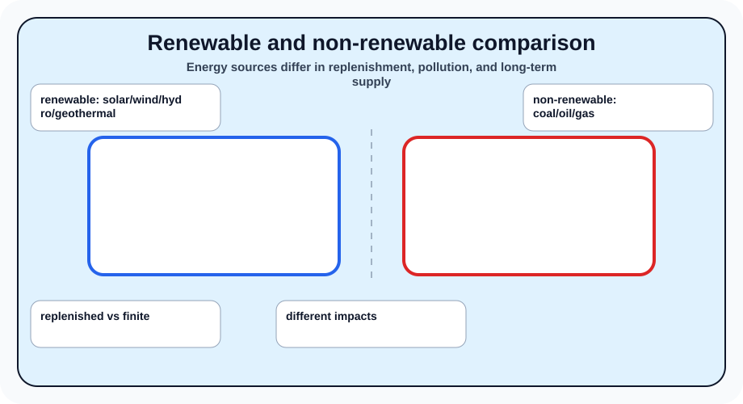
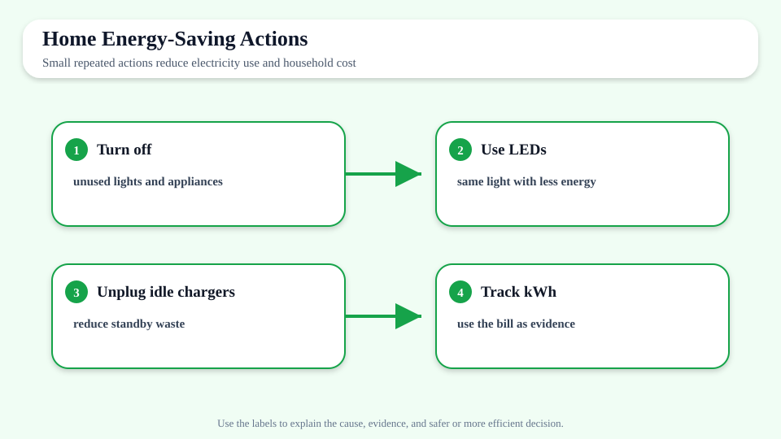
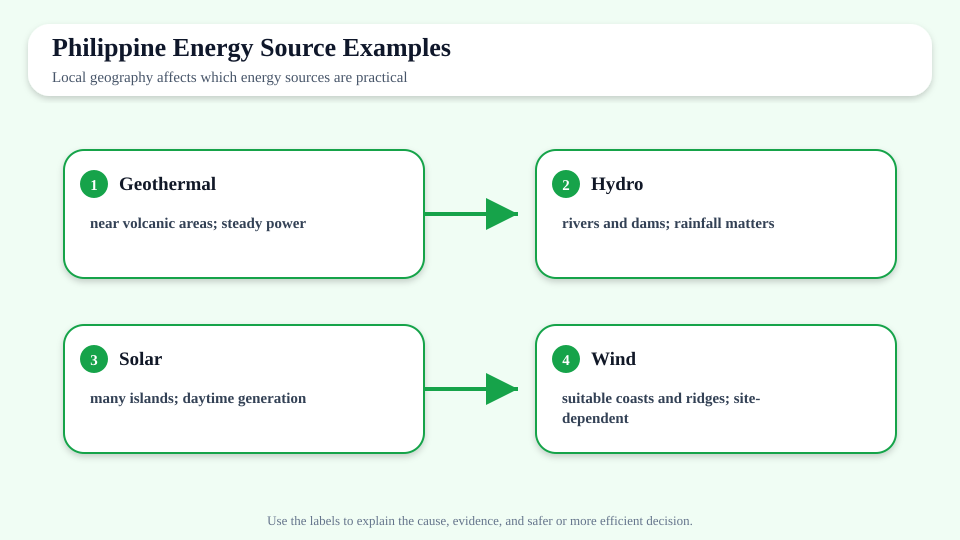
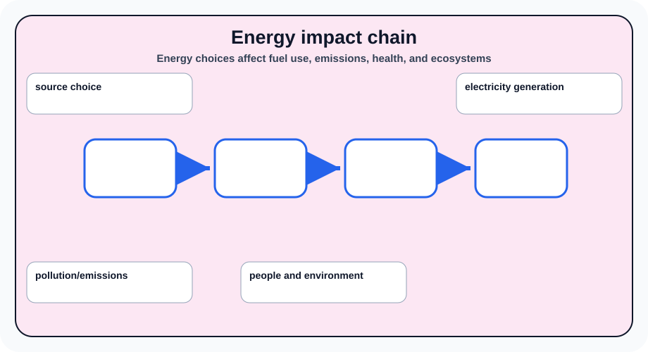
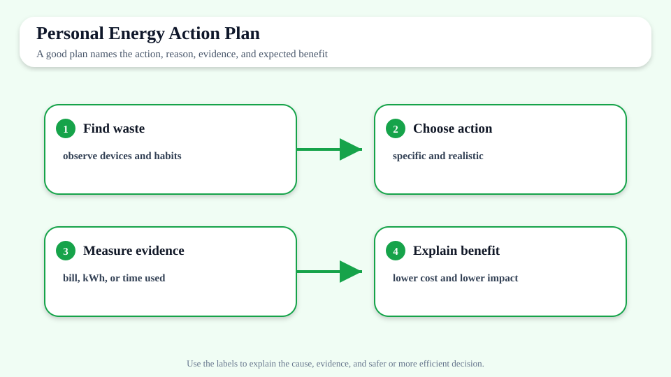

# Energy Use and Energy Sources

> [!GOAL]
> Build Grade 10 Science understanding of energy use and energy sources using the MATATAG Quarter 2 focus on force, motion, energy, momentum, collisions, electricity, and responsible technology use.

## Estimated Time and Difficulty

- **Estimated Time:** 45–60 minutes
- **Difficulty:** Grade 10 self-study

## What You Should Already Know

Before studying this lesson, recall Newton's laws of motion, acceleration, kinetic and potential energy, basic circuits, current, voltage, and resistance from earlier quarters and grades.

## Quick Readiness Check

1. What prior idea from force, motion, energy, or electricity connects to this topic?
2. Which vocabulary word looks most familiar?
3. What diagram would help you understand the lesson before reading?

## Key Vocabulary

- **renewable energy** — energy source naturally replenished on human time scales
- **non-renewable energy** — energy source that can run out because it forms very slowly
- **efficiency** — using less energy to do the same useful work
- **greenhouse gas** — gas that traps heat in the atmosphere
- **energy conservation** — reducing unnecessary energy use

## Predict Before You Read

Write one prediction: *How might energy use and energy sources affect real decisions in sports, transportation, home safety, or electricity use?* Return to this prediction after the lesson.

## Visual Introduction

## Main Concept Explanation

- Saving electricity reduces cost and environmental impact.
- Renewable sources include solar, wind, hydro, and geothermal.
- Non-renewable sources include coal, oil, and natural gas.
- Energy choices affect air quality, climate, communities, and ecosystems.

These ideas come from the Grade 10 Quarter 2 MATATAG physics module. Focus on relationships: what changes, what stays the same, and what evidence would support your explanation.

## Key Idea Box

> **Key Idea:** Saving electricity reduces cost and environmental impact. Use diagrams, examples, and before-and-after reasoning to explain the science clearly instead of memorizing isolated words.

## Worked Examples

- LED bulbs use less electricity than incandescent bulbs.
- The Philippines uses geothermal energy in some areas because of volcanic activity.

**Worked reasoning:** Choose one example above. Identify the important objects, the variable or energy change involved, and the result. Then explain the relationship in one complete sentence.

## Guided Practice

1. Cover the labels of one diagram and explain it from memory.
2. Write a two-column table: *What changes?* and *What stays the same?*
3. Create one everyday example from your home, road, sport, or community.
4. Answer: Which variable or safety choice would you change, and why?

## Misconception Alerts

- Renewable energy is cleaner, but it still needs planning because projects can affect land, water, and communities.
- Do not treat formulas or diagrams as decorations. They are tools for explaining relationships.
- If two situations look similar, compare the variables carefully before deciding they have the same outcome.

## Error Analysis

A learner says: "I can answer this lesson by memorizing one definition and ignoring the diagrams." Explain why this is incomplete. Use at least two vocabulary terms and one diagram from this page in your correction.

## Self-Explanation Prompts

- What is the most important relationship in this lesson?
- Which diagram best shows that relationship?
- How would you explain the idea to a younger student using a local example?

## Extension Challenge

Create a one-week energy-saving plan for your home and predict which action saves the most electricity.

## Mastery Checklist

- [ ] I can define the key vocabulary in my own words.
- [ ] I can explain all five diagrams without reading the captions.
- [ ] I can connect the lesson to a real situation.
- [ ] I can answer practice questions and explain why wrong choices are wrong.

## Final Summary

Energy Use and Energy Sources helps explain how physical systems behave and how people can make safer, more efficient decisions. The lesson is strongest when you connect vocabulary, diagrams, and everyday evidence.

> [!PRACTICE]
> Complete `practice.json` first. Review your explanations, then complete `assessment.json` when you can explain the diagrams confidently.
