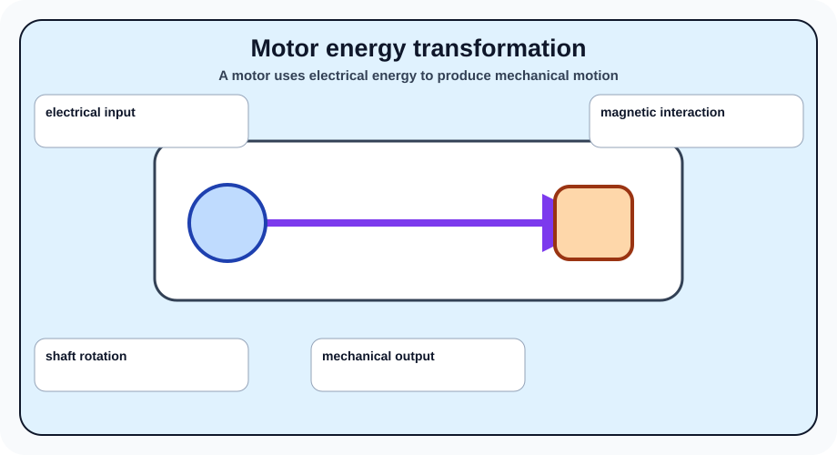
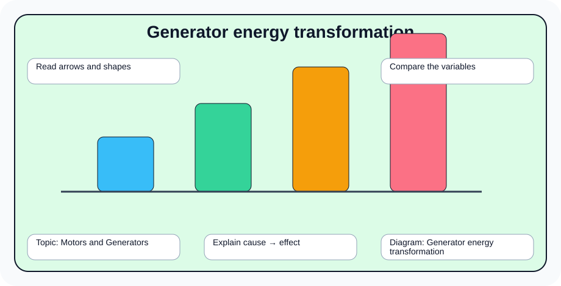
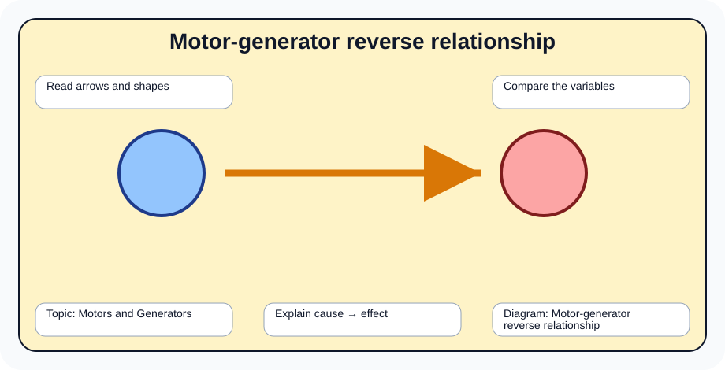
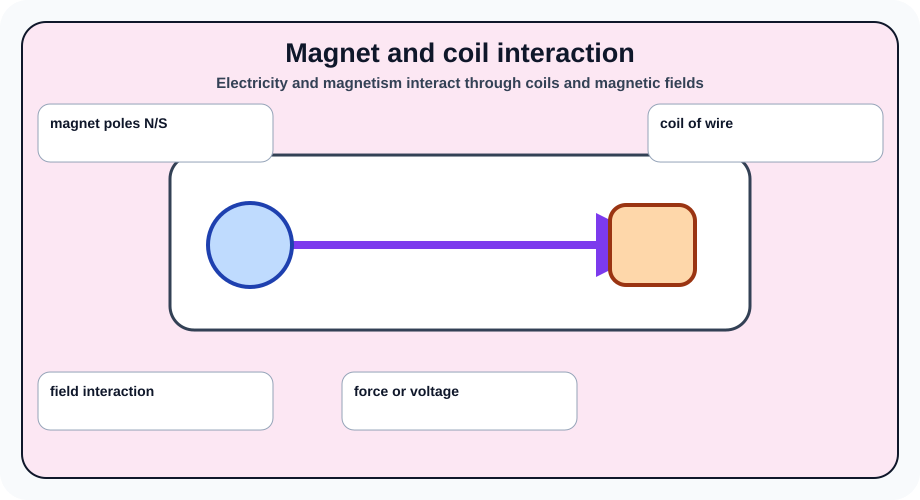
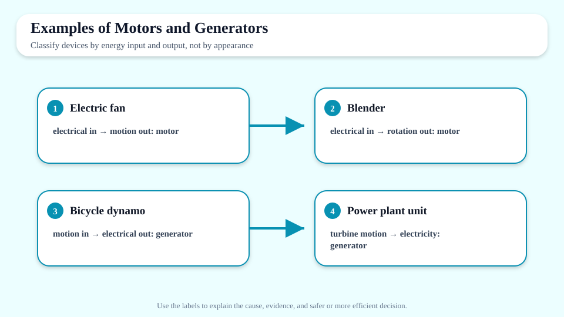

# Motors and Generators

> [!GOAL]
> Build Grade 10 Science understanding of motors and generators using the MATATAG Quarter 2 focus on force, motion, energy, momentum, collisions, electricity, and responsible technology use.

## Estimated Time and Difficulty

- **Estimated Time:** 45–60 minutes
- **Difficulty:** Grade 10 self-study

## What You Should Already Know

Before studying this lesson, recall Newton's laws of motion, acceleration, kinetic and potential energy, basic circuits, current, voltage, and resistance from earlier quarters and grades.

## Quick Readiness Check

1. What prior idea from force, motion, energy, or electricity connects to this topic?
2. Which vocabulary word looks most familiar?
3. What diagram would help you understand the lesson before reading?

## Key Vocabulary

- **electric motor** — device that changes electrical energy into motion
- **generator** — device that changes motion into electrical energy
- **electromagnetism** — relationship between electricity and magnetism
- **mechanical energy** — energy of motion or position
- **energy transformation** — change of energy from one form to another

## Predict Before You Read

Write one prediction: *How might motors and generators affect real decisions in sports, transportation, home safety, or electricity use?* Return to this prediction after the lesson.

## Visual Introduction

## Main Concept Explanation

- A motor converts electrical energy into mechanical motion.
- A generator converts mechanical motion into electrical energy.
- Both devices depend on interactions between electricity and magnetism.
- Motors and generators can be understood as reverse processes.

These ideas come from the Grade 10 Quarter 2 MATATAG physics module. Focus on relationships: what changes, what stays the same, and what evidence would support your explanation.

## Key Idea Box

> **Key Idea:** A motor converts electrical energy into mechanical motion. Use diagrams, examples, and before-and-after reasoning to explain the science clearly instead of memorizing isolated words.

## Worked Examples

- An electric fan uses a motor to turn blades.
- A power plant generator uses turbine motion to produce electricity.

**Worked reasoning:** Choose one example above. Identify the important objects, the variable or energy change involved, and the result. Then explain the relationship in one complete sentence.

## Guided Practice

1. Cover the labels of one diagram and explain it from memory.
2. Write a two-column table: *What changes?* and *What stays the same?*
3. Create one everyday example from your home, road, sport, or community.
4. Answer: Which variable or safety choice would you change, and why?

## Misconception Alerts

- Motors and generators are not unrelated devices; they are closely related electromagnetic machines doing opposite energy conversions.
- Do not treat formulas or diagrams as decorations. They are tools for explaining relationships.
- If two situations look similar, compare the variables carefully before deciding they have the same outcome.

## Error Analysis

A learner says: "I can answer this lesson by memorizing one definition and ignoring the diagrams." Explain why this is incomplete. Use at least two vocabulary terms and one diagram from this page in your correction.

## Self-Explanation Prompts

- What is the most important relationship in this lesson?
- Which diagram best shows that relationship?
- How would you explain the idea to a younger student using a local example?

## Extension Challenge

List five home appliances with motors and identify the motion each produces.

## Mastery Checklist

- [ ] I can define the key vocabulary in my own words.
- [ ] I can explain all five diagrams without reading the captions.
- [ ] I can connect the lesson to a real situation.
- [ ] I can answer practice questions and explain why wrong choices are wrong.

## Final Summary

Motors and Generators helps explain how physical systems behave and how people can make safer, more efficient decisions. The lesson is strongest when you connect vocabulary, diagrams, and everyday evidence.

> [!PRACTICE]
> Complete `practice.json` first. Review your explanations, then complete `assessment.json` when you can explain the diagrams confidently.
