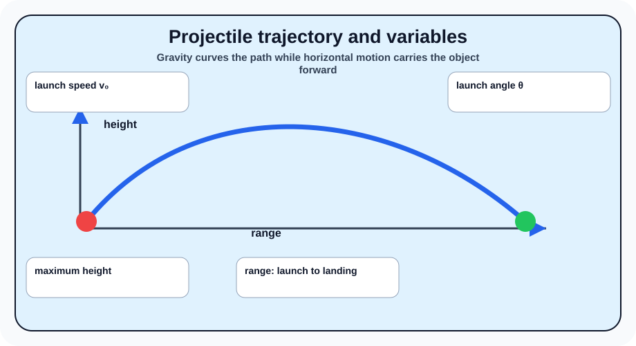
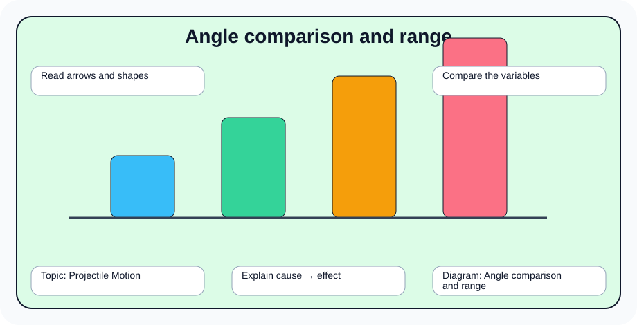
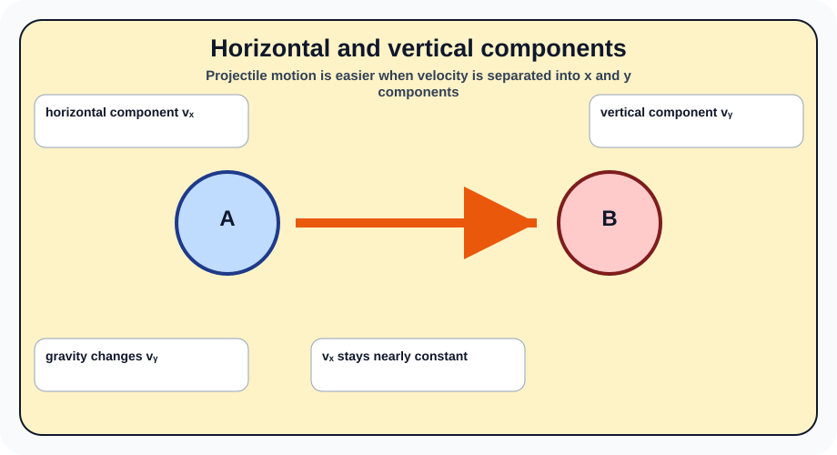
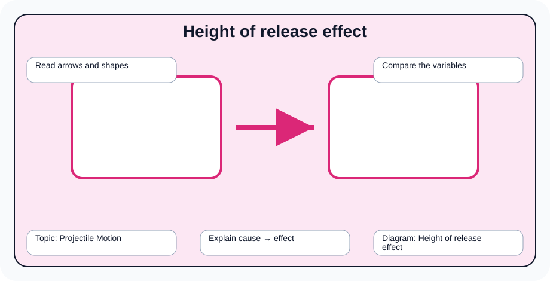
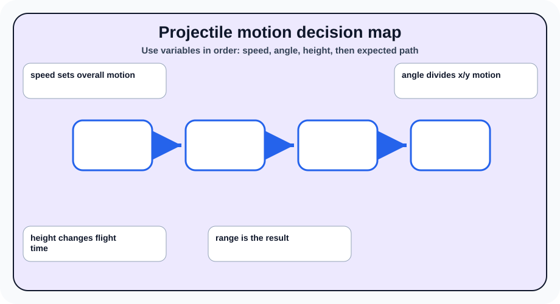

# Projectile Motion

> [!GOAL]
> Build Grade 10 Science understanding of projectile motion using the MATATAG Quarter 2 focus on force, motion, energy, momentum, collisions, electricity, and responsible technology use.

## Estimated Time and Difficulty

- **Estimated Time:** 45–60 minutes
- **Difficulty:** Grade 10 self-study

## What You Should Already Know

Before studying this lesson, recall Newton's laws of motion, acceleration, kinetic and potential energy, basic circuits, current, voltage, and resistance from earlier quarters and grades.

## Quick Readiness Check

1. What prior idea from force, motion, energy, or electricity connects to this topic?
2. Which vocabulary word looks most familiar?
3. What diagram would help you understand the lesson before reading?

## Key Vocabulary

- **projectile** — an object launched into the air that moves mainly under gravity
- **trajectory** — the curved path followed by a projectile
- **range** — the horizontal distance traveled
- **launch angle** — the angle between the launch direction and the horizontal
- **velocity** — speed with direction

## Predict Before You Read

Write one prediction: *How might projectile motion affect real decisions in sports, transportation, home safety, or electricity use?* Return to this prediction after the lesson.

## Visual Introduction

## Main Concept Explanation

- A projectile moves forward horizontally while gravity pulls it downward vertically.
- A launch angle near 45° usually gives the greatest range when launch and landing heights are the same.
- Increasing launch speed increases both height and range.
- Launching from a higher position can increase the range because the projectile stays in the air longer.

These ideas come from the Grade 10 Quarter 2 MATATAG physics module. Focus on relationships: what changes, what stays the same, and what evidence would support your explanation.

## Key Idea Box

> **Key Idea:** A projectile moves forward horizontally while gravity pulls it downward vertically. Use diagrams, examples, and before-and-after reasoning to explain the science clearly instead of memorizing isolated words.

## Worked Examples

- A basketball shot needs enough speed and angle to make an arc toward the hoop.
- A water hose aimed too low reaches a short distance, while a better angle reaches farther.

**Worked reasoning:** Choose one example above. Identify the important objects, the variable or energy change involved, and the result. Then explain the relationship in one complete sentence.

## Guided Practice

1. Cover the labels of one diagram and explain it from memory.
2. Write a two-column table: *What changes?* and *What stays the same?*
3. Create one everyday example from your home, road, sport, or community.
4. Answer: Which variable or safety choice would you change, and why?

## Misconception Alerts

- A projectile does not need a continuing forward force after release; it keeps moving horizontally because of inertia while gravity accelerates it downward.
- Do not treat formulas or diagrams as decorations. They are tools for explaining relationships.
- If two situations look similar, compare the variables carefully before deciding they have the same outcome.

## Error Analysis

A learner says: "I can answer this lesson by memorizing one definition and ignoring the diagrams." Explain why this is incomplete. Use at least two vocabulary terms and one diagram from this page in your correction.

## Self-Explanation Prompts

- What is the most important relationship in this lesson?
- Which diagram best shows that relationship?
- How would you explain the idea to a younger student using a local example?

## Extension Challenge

Compare two launches with the same speed: one at 30° and one at 60°. Predict which goes higher and which stays in the air longer.

## Mastery Checklist

- [ ] I can define the key vocabulary in my own words.
- [ ] I can explain all five diagrams without reading the captions.
- [ ] I can connect the lesson to a real situation.
- [ ] I can answer practice questions and explain why wrong choices are wrong.

## Final Summary

Projectile Motion helps explain how physical systems behave and how people can make safer, more efficient decisions. The lesson is strongest when you connect vocabulary, diagrams, and everyday evidence.

> [!PRACTICE]
> Complete `practice.json` first. Review your explanations, then complete `assessment.json` when you can explain the diagrams confidently.
