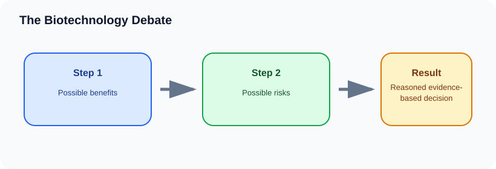

# The Biotechnology Debate

> [!GOAL] Learning Goal
>
> By the end of this lesson, you should be able to evaluate biotechnology using evidence, benefits, risks, stakeholders, and ethical reasoning rather than simple approval or rejection.

## Start Here

A pest-resistant crop might reduce insecticide use and increase yield, but it may also raise questions about seed cost, biodiversity, farmer dependence, and long-term monitoring.

**Estimated time:** 45-60 minutes  
**Difficulty:** Grade 10 Life Science  
**Materials:** notebook, pen, and the lesson diagram

## Warm-Up Recall

Answer before reading, then revise after the lesson.

1. What do you already know from earlier grades that connects to this topic?
2. What variable, organism, or process is changing in this lesson?
3. What evidence would convince you that your explanation is correct?

## Key Vocabulary

| Term | Meaning | Example |
|---|---|---|
| **Stakeholder** | person or group affected by a decision | farmers, patients, consumers |
| **Risk** | possible harm or unwanted effect | gene flow to wild relatives |
| **Benefit** | possible helpful effect | improved food supply |
| **Ethics** | reasoning about what should be done | fair access to medicine |
| **Trade-off** | a benefit paired with a cost or concern | higher yield but higher seed cost |

## Visual Overview

Read the diagram left to right. In your notebook, rewrite the arrows as one cause-and-effect sentence.

## Core Explanation

- A responsible biotechnology argument does not use only fear or excitement. It compares claims with evidence.
- Societal questions include cost, access, food security, patient welfare, farmer livelihood, and fairness.
- Environmental questions include biodiversity, pesticide use, gene flow, waste, and effects on non-target organisms.
- Ethical questions include consent, ownership, animal welfare, equity, and who benefits from the technology.

> [!IMPORTANT] Core Idea
>
> A responsible biotechnology argument does not use only fear or excitement. It compares claims with evidence.

## Worked Example: Evaluating a GMO crop claim

1. State the claim: this crop reduces pest damage.
2. Ask for evidence: yield data, pesticide use, resistance monitoring, ecological studies.
3. Identify stakeholders: farmers, consumers, seed companies, nearby communities, ecosystems.
4. Weigh benefits and concerns before forming a conclusion.

**What this shows:** A balanced decision explains both the science and the values involved.

## Compare The Cases

| Case | What happens | Why it matters |
|---|---|---|
| Societal | Who benefits? Who pays? | seed price, medicine access |
| Environmental | What happens to ecosystems? | biodiversity, pesticide use |
| Ethical | What is fair or responsible? | consent, ownership, animal welfare |
| Evidence | How do we know? | data source, sample size, bias |

> [!WARNING] Common Trap
>
> A debate is not two unsupported opinions. A strong position uses evidence and admits trade-offs.

## Check Your Understanding

Make a two-column chart for one biotechnology: benefits on one side, risks or concerns on the other.

Use this answer frame if you get stuck:

> The starting condition is ____. The process is ____. The result is ____. This supports the idea because ____.

## Extension

Write a short recommendation about one biotechnology and name what evidence would change your mind.

## Mastery Checklist

Before taking the practice exam, confirm that you can:

- [ ] define the main vocabulary without copying the lesson word-for-word
- [ ] explain the visual overview as a cause-and-effect chain
- [ ] apply the idea to a new example
- [ ] avoid the common trap
- [ ] support an answer with evidence from the situation

> [!PRACTICE] Exam Plan
>
> Take the practice exam first as a recall check. Use the explanations to fix gaps. Take the assessment only after you can explain the worked example without looking back.
