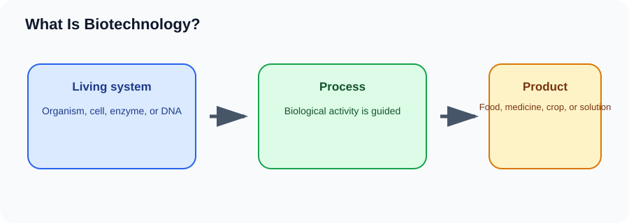

# What Is Biotechnology?

> [!GOAL] Learning Goal
>
> By the end of this lesson, you should be able to explain biotechnology as the use of living organisms, cells, or biological processes to make products or solve problems.

## Estimated Time and Difficulty

| Estimated Time | Difficulty | Best Study Setup |
|---|---|---|
| 45-60 minutes | Grade 10 Life Science | Notebook, pen, and a quiet place to sketch the concept map |

## What You Should Already Know

Before starting, recall these ideas from earlier science lessons:

- Body systems work together to keep an organism alive.
- Traits can be inherited through genes and can vary among individuals.
- Organisms interact with each other and with limited resources in ecosystems.
- Evidence in science is stronger when different observations point to the same explanation.

## Quick Readiness Check

Answer these in your notebook before reading the explanation.

| Prompt | Your Answer |
|---|---|
| What key word or phrase do you already associate with this lesson title? | |
| What is one example from daily life that may connect to this idea? | |
| What would count as evidence that you understand this idea? | |

Check yourself after reading: your answers should connect the lesson to real biological systems, not just memorized words.

## Key Vocabulary

| Term | Student-Friendly Meaning | Example |
|---|---|---|
| **Biotechnology** | using living things or their processes for useful products | making yogurt with bacteria |
| **Microorganism** | tiny living thing such as yeast or bacteria | yeast in bread |
| **Product** | useful material or result made by a process | medicine or fermented food |
| **Process** | a series of steps that changes materials | fermentation |

## Predict Before You Read

Write a quick prediction for each statement.

1. The main concept in this lesson can be explained using a cause-and-effect chain.
2. A biological process can have benefits in one situation and costs in another.
3. Evidence matters more than memorizing a definition.
4. A diagram or flowchart can help explain the process.

Keep your predictions. Revise them after the worked examples.

## Visual Introduction

Use the diagram as a guide: identify what starts the process, what changes during the process, and what result the system reaches.

## Main Concept Explanation

Biotechnology uses life processes for practical purposes in food, medicine, agriculture, industry, and environmental work.

Key points to remember:

- Biotechnology is both ancient and modern.
- Traditional biotechnology uses familiar processes such as fermentation.
- Modern biotechnology often uses cells, genes, or laboratory tools.
- Benefits and risks should be considered using evidence, not fear or hype.

The important study move is to connect the vocabulary word to a process. Instead of asking only “What is the definition?”, ask: **What causes it, what changes, and what evidence would show that it happened?**

> [!IMPORTANT] Key Idea Box
>
> Biotechnology uses life processes for practical purposes in food, medicine, agriculture, industry, and environmental work. In Grade 10 Biology, you should explain this idea using evidence, examples, and cause-and-effect reasoning.

## Worked Examples

| Situation | Biological Explanation |
|---|---|
| Food | Yeast helps dough rise. |
| Medicine | Microorganisms can be used to produce insulin. |
| Agriculture | Crops may be selected or modified for useful traits. |

### How to reason through an example

1. Identify the system: body, population, ecosystem, cell, or society.
2. Identify the change or problem.
3. Name the process from this lesson.
4. Explain the result using evidence from the situation.

## Guided Practice

Try these without looking back first.

1. Define **Biotechnology** in one student-friendly sentence.
2. Choose one worked example and explain the cause-and-effect chain.
3. Write one question a careful scientist or citizen should ask about this topic.
4. Draw a three-box flowchart similar to the visual introduction.

## Misconception Alerts

- Biotechnology is not automatically high-tech. Bread, cheese, vinegar, and nata de coco are also biotechnology examples.
- Do not memorize an example without understanding why it fits the concept.
- Do not treat one observation as final proof; compare it with the full context.

## Error Analysis

A student says: “I know the term, so I understand the lesson.”

**What is wrong with that reasoning?** Knowing the word is only the start. A strong answer also explains the process, gives an example, and uses evidence.

Improved response frame:

> The process is called **Biotechnology**. It matters because biotechnology uses life processes for practical purposes in food, medicine, agriculture, industry, and environmental work. One example is ________, where ________ leads to ________.

## Self-Explanation Prompts

Write 2-3 sentences for each prompt.

1. How does the visual introduction summarize the lesson?
2. Which vocabulary word is easiest for you? Which one needs more review?
3. How could this concept appear in a real health, environmental, or biotechnology issue?

## Extension Challenge

List three biotechnology products at home and identify the organism or biological process involved.

## Mastery Checklist

Before taking the practice exam, confirm that you can:

- [ ] Explain the lesson goal without copying the definition.
- [ ] Use at least two vocabulary terms correctly.
- [ ] Interpret the visual introduction.
- [ ] Apply the concept to a new example.
- [ ] Avoid the misconception listed above.

## Final Summary

What Is Biotechnology? is part of Grade 10 Life Science because it connects living systems to stability, change, technology, or ecosystem limits. Mastery means you can explain the process, not just name it.

> [!PRACTICE] Exam Plan
>
> Complete `practice.json` first. Review any explanation you miss, then take `assessment.json` when you can explain the lesson in your own words.
