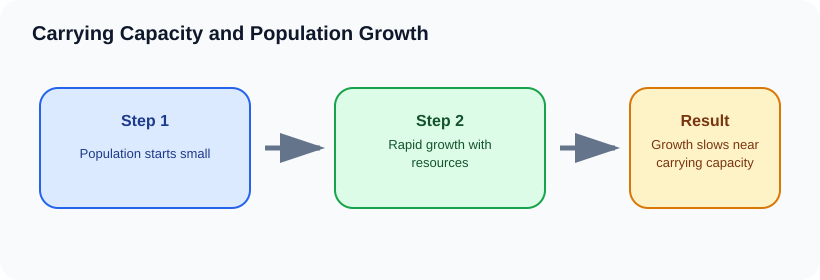

# Carrying Capacity and Population Growth

> [!GOAL] Learning Goal
>
> By the end of this lesson, you should be able to explain how resources and limiting factors shape population growth and why populations tend to slow near carrying capacity.

## Start Here

A pond can support only so many fish. At first, a small fish population may grow quickly. Later, oxygen, food, space, disease, and waste can limit further growth.

**Estimated time:** 45-60 minutes  
**Difficulty:** Grade 10 Life Science  
**Materials:** notebook, pen, and the lesson diagram

## Warm-Up Recall

Answer before reading, then revise after the lesson.

1. What do you already know from earlier grades that connects to this topic?
2. What variable, organism, or process is changing in this lesson?
3. What evidence would convince you that your explanation is correct?

## Key Vocabulary

| Term | Meaning | Example |
|---|---|---|
| **Population** | members of one species in an area | tilapia in a pond |
| **Carrying capacity** | largest population an ecosystem can support over time | maximum deer a forest can sustain |
| **Limiting factor** | resource or condition that restricts growth | food, water, space, disease |
| **Logistic growth** | growth that slows and levels near carrying capacity | S-shaped curve |
| **Overshoot** | population temporarily rises above carrying capacity | too many animals for available food |

## Visual Overview

Read the diagram left to right. In your notebook, rewrite the arrows as one cause-and-effect sentence.

## Core Explanation

- Populations can grow rapidly when resources are abundant and death rates are low.
- As population size increases, individuals compete more for food, water, shelter, mates, space, and other needs.
- Carrying capacity is not a permanent fixed number. It can change with climate, habitat quality, disease, predators, human activity, and resource supply.
- If a population overshoots carrying capacity, resource shortage can cause decline.

> [!IMPORTANT] Core Idea
>
> Populations can grow rapidly when resources are abundant and death rates are low.

## Worked Example: Deer in a forest

1. A small deer population has enough food and shelter, so it grows.
2. As the population becomes larger, food becomes harder to find.
3. Competition, disease, and predation increase pressure.
4. Growth slows near carrying capacity; if deer exceed it, starvation or migration may reduce numbers.

**What this shows:** Carrying capacity is controlled by limiting factors, not by the population's wishes.

## Compare The Cases

| Case | What happens | Why it matters |
|---|---|---|
| Food | less energy for survival and reproduction | grassland grazers decline after drought |
| Space | more crowding and competition | nesting sites become limited |
| Disease | spreads faster in dense populations | crowded animals get sick more easily |
| Predation | prey population pressure | more prey can support more predators |

> [!WARNING] Common Trap
>
> Do not describe carrying capacity as a simple maximum that never changes. Ecosystems change, so carrying capacity can change too.

## Check Your Understanding

Sketch an S-shaped graph and label rapid growth, slowing growth, carrying capacity, and possible overshoot.

Use this answer frame if you get stuck:

> The starting condition is ____. The process is ____. The result is ____. This supports the idea because ____.

## Extension

Explain how a drought could lower carrying capacity in a grassland ecosystem.

## Mastery Checklist

Before taking the practice exam, confirm that you can:

- [ ] define the main vocabulary without copying the lesson word-for-word
- [ ] explain the visual overview as a cause-and-effect chain
- [ ] apply the idea to a new example
- [ ] avoid the common trap
- [ ] support an answer with evidence from the situation

> [!PRACTICE] Exam Plan
>
> Take the practice exam first as a recall check. Use the explanations to fix gaps. Take the assessment only after you can explain the worked example without looking back.
