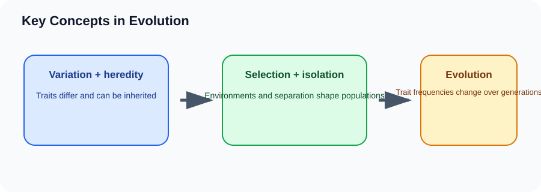

# Key Concepts in Evolution

> [!GOAL] Learning Goal
>
> By the end of this lesson, you should be able to connect the vocabulary of evolution into one explanation of how populations change and may become new species.

## Start Here

Two groups of the same lizard population are separated by a wide river. Over many generations, each group faces different predators, food, and climate.

**Estimated time:** 45-60 minutes  
**Difficulty:** Grade 10 Life Science  
**Materials:** notebook, pen, and the lesson diagram

## Warm-Up Recall

Answer before reading, then revise after the lesson.

1. What do you already know from earlier grades that connects to this topic?
2. What variable, organism, or process is changing in this lesson?
3. What evidence would convince you that your explanation is correct?

## Key Vocabulary

| Term | Meaning | Example |
|---|---|---|
| **Evolution** | change in inherited traits of populations over generations | average beak size shifts |
| **Heredity** | passing traits from parents to offspring | genes inherited from parents |
| **Adaptation** | inherited trait that improves fitness | thick fur in cold environments |
| **Isolation** | separation that reduces breeding between groups | mountains, islands, rivers |
| **Speciation** | formation of new species | isolated groups can no longer interbreed successfully |

## Visual Overview

Read the diagram left to right. In your notebook, rewrite the arrows as one cause-and-effect sentence.

## Core Explanation

- Evolution is about populations and generations. It is not a single animal changing because it wants to.
- Variation supplies the raw material. Heredity allows helpful traits to persist. Selection changes which traits become common.
- Isolation can make two populations follow different evolutionary paths. Over enough time, differences can accumulate into speciation.

> [!IMPORTANT] Core Idea
>
> Evolution is about populations and generations. It is not a single animal changing because it wants to.

## Worked Example: Island insects

1. A storm carries some insects from the mainland to an island.
2. The island population is isolated from the mainland population.
3. Different food and predators favor different traits.
4. After many generations, the island group may become genetically and physically different.

**What this shows:** Isolation does not automatically create a new species, but it can allow populations to diverge.

## Compare The Cases

| Case | What happens | Why it matters |
|---|---|---|
| Variation | differences exist | different wing lengths |
| Heredity | traits pass on | offspring resemble parents |
| Selection | environment filters traits | predators catch slower insects |
| Isolation | gene flow decreases | island and mainland groups separate |

> [!WARNING] Common Trap
>
> Adaptation is not an individual deciding to improve. It is a heritable trait becoming common because it improves fitness in a specific environment.

## Check Your Understanding

Explain how variation and heredity must both be present for evolution by natural selection.

Use this answer frame if you get stuck:

> The starting condition is ____. The process is ____. The result is ____. This supports the idea because ____.

## Extension

Create a concept map linking variation, selection, adaptation, isolation, and speciation.

## Mastery Checklist

Before taking the practice exam, confirm that you can:

- [ ] define the main vocabulary without copying the lesson word-for-word
- [ ] explain the visual overview as a cause-and-effect chain
- [ ] apply the idea to a new example
- [ ] avoid the common trap
- [ ] support an answer with evidence from the situation

> [!PRACTICE] Exam Plan
>
> Take the practice exam first as a recall check. Use the explanations to fix gaps. Take the assessment only after you can explain the worked example without looking back.
