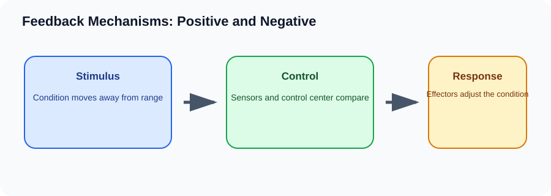

# Feedback Mechanisms: Positive and Negative

> [!GOAL] Learning Goal
>
> By the end of this lesson, you should be able to trace the parts of a feedback loop and explain why negative feedback stabilizes conditions while positive feedback drives a process to completion.

## Start Here

A thermostat turns cooling on when a room gets too hot and turns it off after the room cools. Your body uses a more complex version of this idea.

**Estimated time:** 45-60 minutes  
**Difficulty:** Grade 10 Life Science  
**Materials:** notebook, pen, and the lesson diagram

## Warm-Up Recall

Answer before reading, then revise after the lesson.

1. What do you already know from earlier grades that connects to this topic?
2. What variable, organism, or process is changing in this lesson?
3. What evidence would convince you that your explanation is correct?

## Key Vocabulary

| Term | Meaning | Example |
|---|---|---|
| **Stimulus** | a change that is detected | body temperature rises |
| **Receptor** | sensor that detects the change | temperature receptors |
| **Control center** | part that compares the condition with a target range | brain region regulating temperature |
| **Effector** | organ or tissue that carries out the response | sweat glands |
| **Negative feedback** | response that reverses the original change | sweating cools the body |
| **Positive feedback** | response that intensifies a change until an endpoint | contractions during childbirth |

## Visual Overview

Read the diagram left to right. In your notebook, rewrite the arrows as one cause-and-effect sentence.

## Core Explanation

- A feedback loop uses information about a condition to guide a response.
- Negative feedback is the main homeostasis pattern. If a condition rises too high, the response lowers it; if it falls too low, the response raises it.
- Positive feedback is different. It amplifies a change, but it normally has a clear endpoint. It is useful for processes such as childbirth and blood clotting.

> [!IMPORTANT] Core Idea
>
> A feedback loop uses information about a condition to guide a response.

## Worked Example: Body temperature rises

1. Stimulus: body temperature rises above the comfortable range.
2. Receptors detect the change and the brain acts as the control center.
3. Effectors such as sweat glands and skin blood vessels respond.
4. The response releases heat, reversing the original increase.

**What this shows:** Because the response reverses the original change, this is negative feedback.

## Compare The Cases

| Case | What happens | Why it matters |
|---|---|---|
| Negative feedback | reverses a change | temperature control, blood glucose control |
| Positive feedback | amplifies a change until an endpoint | childbirth contractions, blood clotting |
| No feedback | no adjustment based on results | not useful for homeostasis |

> [!WARNING] Common Trap
>
> Positive and negative do not mean good and bad. They describe the direction of the response.

## Check Your Understanding

Label the stimulus, receptor/control center, effector, and response in one feedback example.

Use this answer frame if you get stuck:

> The starting condition is ____. The process is ____. The result is ____. This supports the idea because ____.

## Extension

Compare a thermostat to body temperature control. Where is the analogy useful, and where is it too simple?

## Mastery Checklist

Before taking the practice exam, confirm that you can:

- [ ] define the main vocabulary without copying the lesson word-for-word
- [ ] explain the visual overview as a cause-and-effect chain
- [ ] apply the idea to a new example
- [ ] avoid the common trap
- [ ] support an answer with evidence from the situation

> [!PRACTICE] Exam Plan
>
> Take the practice exam first as a recall check. Use the explanations to fix gaps. Take the assessment only after you can explain the worked example without looking back.
