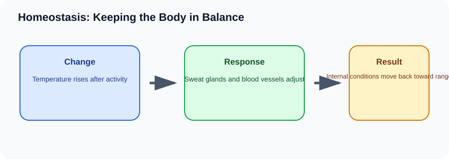

# Homeostasis: Keeping the Body in Balance

> [!GOAL] Learning Goal
>
> By the end of this lesson, you should be able to explain homeostasis as active regulation, not a fixed number, and use examples to show how body systems keep internal conditions within healthy limits.

## Start Here

Think about walking from an air-conditioned room into a hot street. Your surroundings change quickly, but your cells still need a narrow range of temperature, water, oxygen, and glucose to work well.

**Estimated time:** 45-60 minutes  
**Difficulty:** Grade 10 Life Science  
**Materials:** notebook, pen, and the lesson diagram

## Warm-Up Recall

Answer before reading, then revise after the lesson.

1. What do you already know from earlier grades that connects to this topic?
2. What variable, organism, or process is changing in this lesson?
3. What evidence would convince you that your explanation is correct?

## Key Vocabulary

| Term | Meaning | Example |
|---|---|---|
| **Homeostasis** | the regulation of internal conditions within a healthy range | Body temperature stays near a safe range. |
| **Internal environment** | conditions inside the body around cells | blood glucose, water level, and blood pressure |
| **Indicator** | a measurable sign that a condition is changing | temperature, pulse, breathing rate |
| **Regulation** | the process of detecting change and responding | sweating after body temperature rises |

## Visual Overview

Read the diagram left to right. In your notebook, rewrite the arrows as one cause-and-effect sentence.

## Core Explanation

- Homeostasis is dynamic. The body does not freeze every condition at one exact value. Instead, it keeps important variables within ranges that allow cells to function.
- Body systems cooperate. The nervous system detects many rapid changes, the endocrine system sends chemical signals, and organs such as the skin, lungs, kidneys, pancreas, heart, and blood vessels adjust the response.
- Common indicators include body temperature, blood glucose, blood pressure, water balance, breathing rate, and blood pH.

> [!IMPORTANT] Core Idea
>
> Homeostasis is dynamic. The body does not freeze every condition at one exact value. Instead, it keeps important variables within ranges that allow cells to function.

## Worked Example: After running up stairs

1. Your muscles use more oxygen and produce more carbon dioxide and heat.
2. Your breathing rate and heart rate increase to deliver oxygen and remove carbon dioxide.
3. Sweating and wider skin blood vessels help release heat.
4. As conditions return toward the healthy range, these responses slow down.

**What this shows:** A homeostatic response is a chain: change detected -> body response -> condition returns toward a healthy range.

## Compare The Cases

| Case | What happens | Why it matters |
|---|---|---|
| Body temperature rises | sweating, wider skin blood vessels | helps release heat |
| Blood glucose rises after eating | insulin signal from the pancreas | cells take in glucose |
| Water level drops | thirst and kidney water conservation | less water is lost |

> [!WARNING] Common Trap
>
> Do not say homeostasis means the body never changes. A stable body is constantly adjusting.

## Check Your Understanding

Choose one indicator, such as temperature or breathing rate. Describe the change, the body response, and the result.

Use this answer frame if you get stuck:

> The starting condition is ____. The process is ____. The result is ____. This supports the idea because ____.

## Extension

Track pulse at rest, after light activity, and after two minutes of recovery. Explain the pattern as a homeostatic adjustment.

## Mastery Checklist

Before taking the practice exam, confirm that you can:

- [ ] define the main vocabulary without copying the lesson word-for-word
- [ ] explain the visual overview as a cause-and-effect chain
- [ ] apply the idea to a new example
- [ ] avoid the common trap
- [ ] support an answer with evidence from the situation

> [!PRACTICE] Exam Plan
>
> Take the practice exam first as a recall check. Use the explanations to fix gaps. Take the assessment only after you can explain the worked example without looking back.
