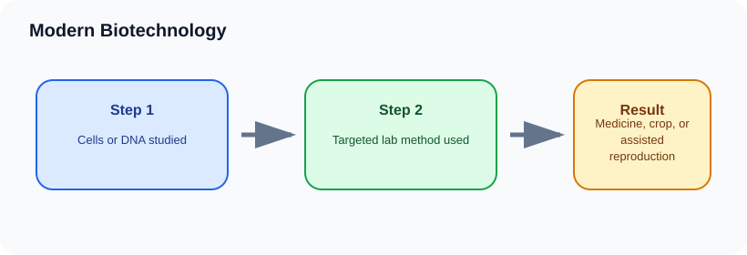

# Modern Biotechnology

> [!GOAL] Learning Goal
>
> By the end of this lesson, you should be able to identify modern biotechnology examples and explain the cell, gene, or reproductive process that makes each one work.

## Start Here

Some medicines are made by microorganisms that have been given human instructions in DNA. Some crops carry traits that help them resist pests. Some families use IVF to have children.

**Estimated time:** 45-60 minutes  
**Difficulty:** Grade 10 Life Science  
**Materials:** notebook, pen, and the lesson diagram

## Warm-Up Recall

Answer before reading, then revise after the lesson.

1. What do you already know from earlier grades that connects to this topic?
2. What variable, organism, or process is changing in this lesson?
3. What evidence would convince you that your explanation is correct?

## Key Vocabulary

| Term | Meaning | Example |
|---|---|---|
| **GMO** | organism with genetic material changed using biotechnology | crop with pest resistance |
| **Genetic engineering** | directly changing DNA for a purpose | adding a gene to bacteria |
| **IVF** | joining egg and sperm outside the body | in vitro fertilization |
| **Recombinant DNA** | DNA made by combining genetic material from different sources | bacteria carrying a human insulin gene |
| **Vaccine** | biological preparation that trains immune response | some vaccines made using modern biotechnology |

## Visual Overview

Read the diagram left to right. In your notebook, rewrite the arrows as one cause-and-effect sentence.

## Core Explanation

- Modern biotechnology often works with DNA, cells, embryos, or purified biological molecules.
- A GMO is one example, not the whole field. Modern biotechnology also includes medical testing, vaccine design, insulin production, IVF, and some environmental applications.
- Scientific explanation and social decision are different tasks. First explain how the technology works; then evaluate risks, benefits, access, and ethics.

> [!IMPORTANT] Core Idea
>
> Modern biotechnology often works with DNA, cells, embryos, or purified biological molecules.

## Worked Example: Insulin from modified bacteria

1. Scientists identify the human gene for insulin.
2. The gene is inserted into bacteria using biotechnology tools.
3. The bacteria produce insulin protein.
4. The insulin is purified and used by people with diabetes.

**What this shows:** Modern biotechnology can use cells as production systems for useful biological molecules.

## Compare The Cases

| Case | What happens | Why it matters |
|---|---|---|
| GMO crop | DNA is changed | adds a useful crop trait |
| IVF | eggs and sperm handled outside the body | helps with reproduction |
| Insulin production | modified microbes make protein | supports diabetes treatment |
| DNA testing | DNA sequences are analyzed | identifies relationships or disease risk |

> [!WARNING] Common Trap
>
> Modern does not automatically mean better or worse. Evaluate the specific use, evidence, risks, and context.

## Check Your Understanding

Choose one example and explain the biological tool used and the problem it addresses.

Use this answer frame if you get stuck:

> The starting condition is ____. The process is ____. The result is ____. This supports the idea because ____.

## Extension

Compare GMO crop development and IVF: what biological material is handled in each case?

## Mastery Checklist

Before taking the practice exam, confirm that you can:

- [ ] define the main vocabulary without copying the lesson word-for-word
- [ ] explain the visual overview as a cause-and-effect chain
- [ ] apply the idea to a new example
- [ ] avoid the common trap
- [ ] support an answer with evidence from the situation

> [!PRACTICE] Exam Plan
>
> Take the practice exam first as a recall check. Use the explanations to fix gaps. Take the assessment only after you can explain the worked example without looking back.
