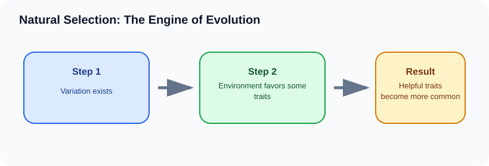

# Natural Selection: The Engine of Evolution

> [!GOAL] Learning Goal
>
> By the end of this lesson, you should be able to explain natural selection using variation, heredity, selection pressure, survival, reproduction, and change across generations.

## Start Here

If a drought leaves mostly hard seeds, birds with slightly stronger beaks may leave more offspring. Over many generations, the average beak type in the population can shift.

**Estimated time:** 45-60 minutes  
**Difficulty:** Grade 10 Life Science  
**Materials:** notebook, pen, and the lesson diagram

## Warm-Up Recall

Answer before reading, then revise after the lesson.

1. What do you already know from earlier grades that connects to this topic?
2. What variable, organism, or process is changing in this lesson?
3. What evidence would convince you that your explanation is correct?

## Key Vocabulary

| Term | Meaning | Example |
|---|---|---|
| **Variation** | differences among individuals | different beak sizes |
| **Heritable trait** | a trait that can be passed to offspring | beak shape influenced by genes |
| **Selection pressure** | environmental factor that affects survival or reproduction | predators, drought, disease |
| **Fitness** | reproductive success in a given environment | leaving more surviving offspring |
| **Adaptation** | inherited trait that improves fitness in an environment | camouflage in a habitat |

## Visual Overview

Read the diagram left to right. In your notebook, rewrite the arrows as one cause-and-effect sentence.

## Core Explanation

- Natural selection requires variation. If all individuals are identical, the environment has no different traits to favor.
- The useful variation must be heritable. A scar gained during life is not passed on like a genetic trait.
- The environment affects survival and reproduction. Traits that increase reproductive success become more common over generations.
- Individuals are selected, but populations evolve. One organism does not evolve during its lifetime.

> [!IMPORTANT] Core Idea
>
> Natural selection requires variation. If all individuals are identical, the environment has no different traits to favor.

## Worked Example: Antibiotic resistance in bacteria

1. A bacterial population contains a few cells with resistance.
2. Antibiotic treatment kills many non-resistant bacteria.
3. Resistant bacteria survive and reproduce.
4. After repeated exposure, resistance becomes more common in the population.

**What this shows:** Natural selection changes trait frequency in a population when a heritable trait affects survival and reproduction.

## Compare The Cases

| Case | What happens | Why it matters |
|---|---|---|
| Variation | individuals differ | some bacteria are resistant |
| Selection pressure | environment favors some traits | antibiotic kills susceptible bacteria |
| Inheritance | survivors reproduce | resistance becomes common |

> [!WARNING] Common Trap
>
> Do not say organisms evolve because they need to. Natural selection works on existing heritable variation.

## Check Your Understanding

Use four words in a chain: variation -> environment -> survival/reproduction -> population change.

Use this answer frame if you get stuck:

> The starting condition is ____. The process is ____. The result is ____. This supports the idea because ____.

## Extension

Explain how a change in predator color or habitat color could affect camouflage over generations.

## Mastery Checklist

Before taking the practice exam, confirm that you can:

- [ ] define the main vocabulary without copying the lesson word-for-word
- [ ] explain the visual overview as a cause-and-effect chain
- [ ] apply the idea to a new example
- [ ] avoid the common trap
- [ ] support an answer with evidence from the situation

> [!PRACTICE] Exam Plan
>
> Take the practice exam first as a recall check. Use the explanations to fix gaps. Take the assessment only after you can explain the worked example without looking back.
