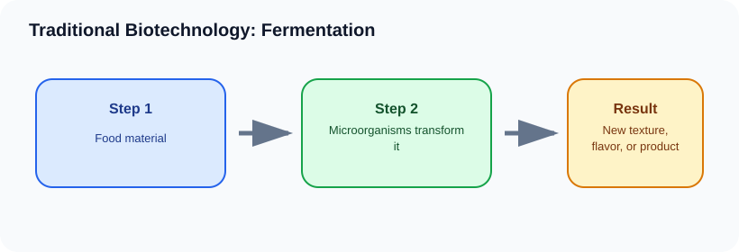

# Traditional Biotechnology: Fermentation

> [!GOAL] Learning Goal
>
> By the end of this lesson, you should be able to explain how microorganisms drive fermentation and why fermented products are examples of traditional biotechnology.

## Start Here

Nata de coco, vinegar, soy sauce, yogurt, cheese, and bread are not just foods. They are evidence that people learned to use microorganisms long before modern laboratories.

**Estimated time:** 45-60 minutes  
**Difficulty:** Grade 10 Life Science  
**Materials:** notebook, pen, and the lesson diagram

## Warm-Up Recall

Answer before reading, then revise after the lesson.

1. What do you already know from earlier grades that connects to this topic?
2. What variable, organism, or process is changing in this lesson?
3. What evidence would convince you that your explanation is correct?

## Key Vocabulary

| Term | Meaning | Example |
|---|---|---|
| **Fermentation** | microbial process that changes sugars or other materials into new products | yeast producing carbon dioxide in dough |
| **Yeast** | fungus used in some fermentation | bread making |
| **Bacteria** | microorganisms used in many fermented foods | yogurt cultures |
| **Culture** | starter microorganisms used to begin fermentation | lactic acid bacteria in yogurt |
| **Traditional biotechnology** | long-used biotechnology based on organisms and processes | vinegar or nata de coco production |

## Visual Overview

Read the diagram left to right. In your notebook, rewrite the arrows as one cause-and-effect sentence.

## Core Explanation

- Fermentation depends on microorganisms. They carry out chemical changes as they get energy and grow.
- Different microorganisms and ingredients produce different products: gas in bread, acid in yogurt and vinegar, or cellulose in nata de coco.
- Fermentation must be controlled. Clean equipment, correct temperature, suitable ingredients, and enough time help produce safe and useful products.

> [!IMPORTANT] Core Idea
>
> Fermentation depends on microorganisms. They carry out chemical changes as they get energy and grow.

## Worked Example: Nata de coco

1. Coconut water provides nutrients.
2. Specific bacteria grow in the liquid.
3. The bacteria produce a thick cellulose layer.
4. The product is harvested, cleaned, and prepared as food.

**What this shows:** Traditional biotechnology uses living microorganisms to transform a starting material into a useful product.

## Compare The Cases

| Case | What happens | Why it matters |
|---|---|---|
| Bread | yeast | carbon dioxide makes dough rise |
| Yogurt | lactic acid bacteria | milk becomes sour and thick |
| Vinegar | acetic acid bacteria | alcohol changes to vinegar |
| Nata de coco | cellulose-producing bacteria | coconut water becomes a gel-like food |

> [!WARNING] Common Trap
>
> Fermentation is not the same as food spoiling. Both can involve microbes, but fermentation uses selected conditions and useful organisms.

## Check Your Understanding

Pick a fermented product and explain the starting material, microorganism, and product.

Use this answer frame if you get stuck:

> The starting condition is ____. The process is ____. The result is ____. This supports the idea because ____.

## Extension

Interview a family member or local seller about one fermented food and identify the biological process involved.

## Mastery Checklist

Before taking the practice exam, confirm that you can:

- [ ] define the main vocabulary without copying the lesson word-for-word
- [ ] explain the visual overview as a cause-and-effect chain
- [ ] apply the idea to a new example
- [ ] avoid the common trap
- [ ] support an answer with evidence from the situation

> [!PRACTICE] Exam Plan
>
> Take the practice exam first as a recall check. Use the explanations to fix gaps. Take the assessment only after you can explain the worked example without looking back.
