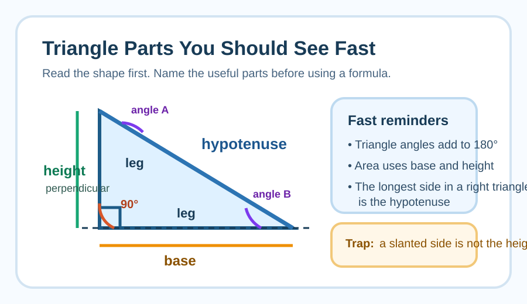
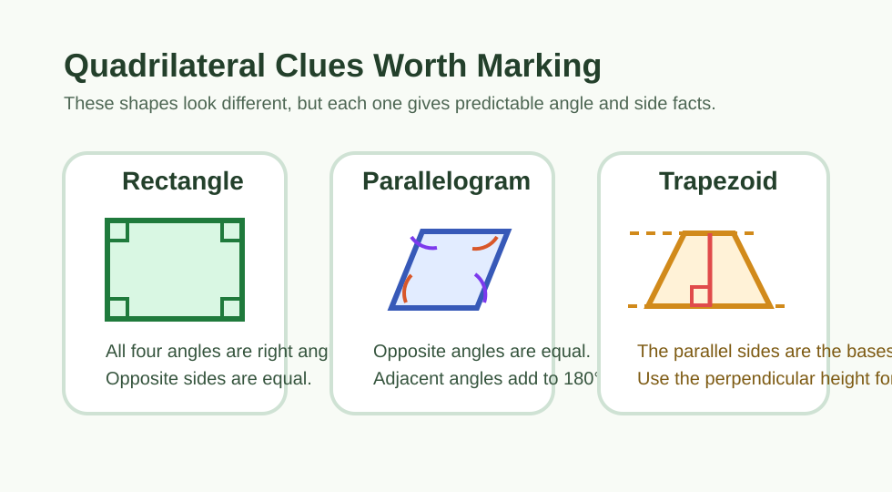
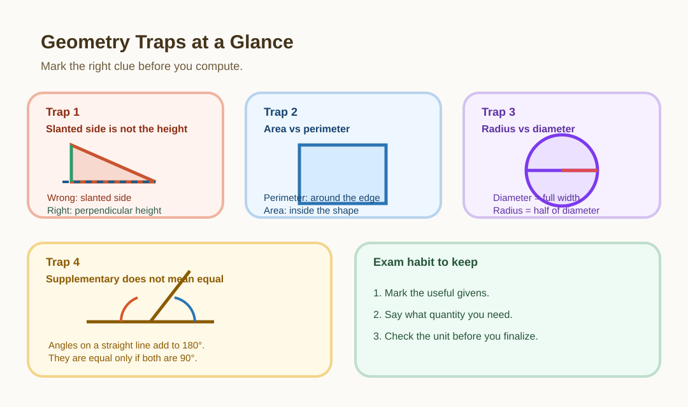

# College Review Week 5: Geometry Foundations

> [!GOAL] Weekly Goal
>
> This week rebuilds the geometry knowledge base that many students try to replace with memory guesses.
>
> **Main habit:** See the figure first, mark the facts second, and choose the formula only after the diagram makes sense.

## Weekly Roadmap

| Session | Main Focus | Target Time | Exam Use |
| --- | --- | --- | --- |
| 1 | Triangles, right triangles, and visual marking | 45-60 minutes | Use the lesson interactives as formula and diagram warm-up |
| 2 | Angle facts, quadrilaterals, and common traps | 45-60 minutes | Use the practice exam as a diagram-reading drill |
| 3 | Mixed figure interpretation under time pressure | 45 minutes | Use the assessment exam as your visual reasoning checkpoint |

---

## Visual Warm-Up

Before solving, look at each figure and ask: **What facts can I mark immediately?**

| Figure | Facts you should notice |
| --- | --- |
| Right triangle | One angle is $90^\circ$, the longest side is the hypotenuse, triangle angles still sum to $180^\circ$ |
| Parallelogram | Opposite sides are parallel, opposite angles are equal, adjacent angles sum to $180^\circ$ |
| Trapezoid | Focus on the parallel bases and the perpendicular height, not the slanted side |

> [!TIP] Shape-to-Facts Routine
>
> 1. Identify the figure.
> 2. Mark known lengths and angles.
> 3. Mark equal or supplementary parts.
> 4. Choose the formula only after the diagram is annotated.

```interactive
{
  "spec": "interactives/geometry-formula-decision-steps.json",
  "mode": "auto",
  "height": 380,
  "title": "Which Formula Comes Next?"
}
```

## Formula Family Table

Use this as a fast visual checklist before solving.

| Figure | Target | Formula | What you must identify first | Unit check |
| --- | --- | --- | --- | --- |
| Triangle | Area | $A = \frac{1}{2}bh$ | Base and perpendicular height | square units |
| Rectangle | Area | $A = lw$ | Length and width | square units |
| Rectangle | Perimeter | $P = 2l + 2w$ | Two side lengths | linear units |
| Trapezoid | Area | $A = \frac{1}{2}(b_1 + b_2)h$ | Both bases and the height | square units |
| Circle | Circumference | $C = 2\pi r$ or $\pi d$ | Radius or diameter | linear units |
| Circle | Area | $A = \pi r^2$ | Radius | square units |
| Right triangle | Missing side | $a^2 + b^2 = c^2$ | The legs and the hypotenuse | linear units after square root |

```interactive
{
  "spec": "interactives/area-perimeter-table.json",
  "mode": "auto",
  "height": 460,
  "title": "Area vs. Perimeter Reference Table"
}
```

---

## Session 1: Triangles and Right Triangles

> [!TARGET] Session Target
>
> **Target time:** 45-60 minutes
>
> Make triangle facts visible before you calculate.

### Warm-Up Recall

Write these from memory:

1. Area of a triangle
2. Area of a rectangle
3. Circumference of a circle
4. Pythagorean theorem



### Triangle Essentials

- Sum of interior angles of a triangle: $180^\circ$
- Right triangle: $a^2 + b^2 = c^2$
- Area of a triangle: $\frac{1}{2}bh$
- The height must be perpendicular to the base, even if it is drawn inside the figure

```interactive
{
  "spec": "interactives/triangle-angle-hotspots.json",
  "mode": "auto",
  "height": 470,
  "title": "Triangle Clue Finder"
}
```

**Example 1: Read the right triangle before solving**  
A right triangle has legs 6 and 8. Find the hypotenuse.

$$c^2 = 6^2 + 8^2 = 36 + 64 = 100$$

$$c = 10$$

What mattered in the picture?

- The right-angle marker tells you this is a Pythagorean theorem problem.
- The side across from the right angle is the hypotenuse.
- The two labeled legs are the values you square first.

> [!CHECK] Try It From the Picture
>
> A right triangle has hypotenuse 13 and one leg 5. Before calculating, say which side is missing and which theorem you will use.

### Example 2: Base and height are not the same as any two sides

A triangle has base 12 cm and height 9 cm. Find the area.

$$A = \frac{1}{2}(12)(9) = 54 \text{ cm}^2$$

What mattered in the picture?

- You need a base and the perpendicular height.
- A slanted side is not automatically the height.
- Area answers should be in square units.

> [!WARNING] Common Triangle Trap
>
> Students often multiply the base by a slanted side and call it height. Only the perpendicular distance counts as height.

---

## Session 2: Angles, Quadrilaterals, and Diagram Reading

> [!TARGET] Session Target
>
> **Target time:** 45-60 minutes
>
> Read angle and side clues from the figure before reaching for a formula.



### Core Facts

- A straight angle is $180^\circ$
- Angles around a point sum to $360^\circ$
- Opposite angles in a parallelogram are equal
- Adjacent angles in a parallelogram are supplementary
- A rectangle is a special quadrilateral with four right angles
- In a trapezoid, the height is the perpendicular distance between the parallel bases

```interactive
{
  "spec": "interactives/quadrilateral-property-match.json",
  "mode": "auto",
  "height": 400,
  "title": "Match the Shape to the Property"
}
```

**Example 3:**  
One angle of a parallelogram is $68^\circ$. Find the other three.

Opposite angle $= 68^\circ$  
Adjacent angles $= 180^\circ - 68^\circ = 112^\circ$

So the angles are:

$$68^\circ,\ 112^\circ,\ 68^\circ,\ 112^\circ$$

> [!TIP] Diagram Translation Habit
>
> When a diagram is given:
>
> 1. Mark known lengths and angles
> 2. Label equal sides or equal angles
> 3. Write one short statement for each fact
> 4. Use only the facts you have actually identified

> [!CHECK] Try It From the Picture
>
> If a parallelogram shows one angle as $118^\circ$, what can you mark immediately without solving anything else?

**Example 4:**  
A rectangle has length 15 cm and width 8 cm. Find its perimeter and area.

Perimeter:

$$P = 2l + 2w = 2(15) + 2(8) = 46 \text{ cm}$$

Area:

$$A = lw = 15(8) = 120 \text{ cm}^2$$

## Common Diagram Traps



> [!IMPORTANT] Stop These Mistakes Early
>
> - Perimeter uses distance around the shape. Area uses surface covered inside the shape.
> - Diameter is twice the radius.
> - A slanted side is not the same as height.
> - Supplementary angles add to $180^\circ$; they are not always equal.
> - The correct formula depends on what the figure gives you, not on what you remember first.

---

## Session 3: Mixed Figure Interpretation

> [!TARGET] Session Target
>
> **Target time:** 45 minutes
>
> Combine formula recall, diagram marking, and sanity checks without losing accuracy.

### Mini Drill

1. A square has side 11 cm. Find perimeter and area.
2. The angles in a triangle are $x$, $2x$, and $3x$. Find each angle.
3. A right triangle has hypotenuse 13 and one leg 5. Find the other leg.

```interactive
{
  "spec": "interactives/geometry-figure-lab.json",
  "mode": "auto",
  "height": 620,
  "title": "Geometry Figure Lab"
}
```

### Final Worked Example

**Example 5:**  
A trapezoid has bases 10 cm and 14 cm and height 6 cm. Find its area.

$$A = \frac{1}{2}(b_1 + b_2)h$$

$$A = \frac{1}{2}(10 + 14)(6) = \frac{1}{2}(24)(6) = 72 \text{ cm}^2$$

What mattered in the picture?

- The two parallel sides are the bases.
- The height is the perpendicular distance between the bases.
- The slanted side is not part of the area formula.

> [!CHECK] End-of-Week Checklist
>
> - I can write the core geometry formulas without help.
> - I can name the facts a diagram gives me before I calculate.
> - I can pull the needed facts out of a diagram before solving.
> - I can estimate whether an area or perimeter answer is reasonable.

## Key Takeaways

- Geometry becomes easier when formulas are connected to visible features of a shape.
- Drawings help only when you convert them into written relationships.
- Approximation and unit checks are powerful sanity checks.

> [!PRACTICE] How to Use the Exams This Week
>
> - Use the **practice exam** as a formula-recall and diagram-reading drill.
> - Use the **assessment exam** after Session 3 to test whether you can read a figure, choose a method, and solve accurately.
