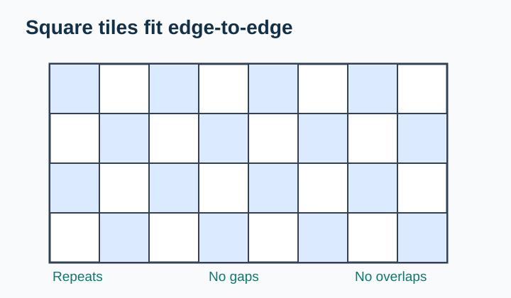
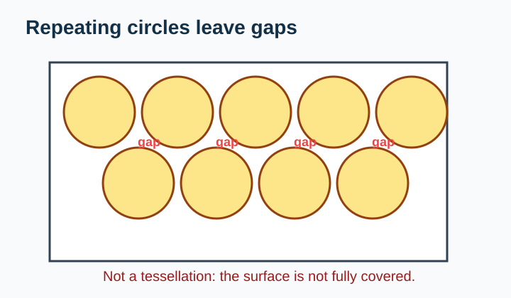
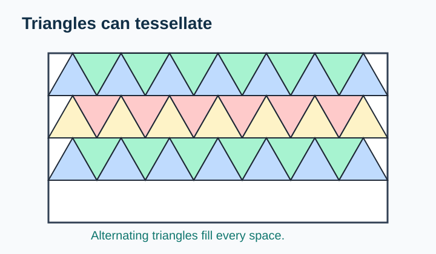
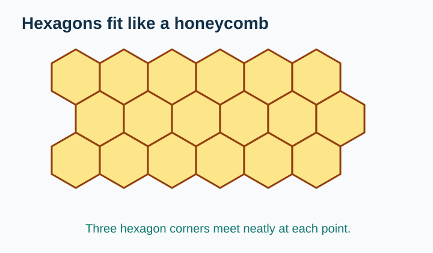
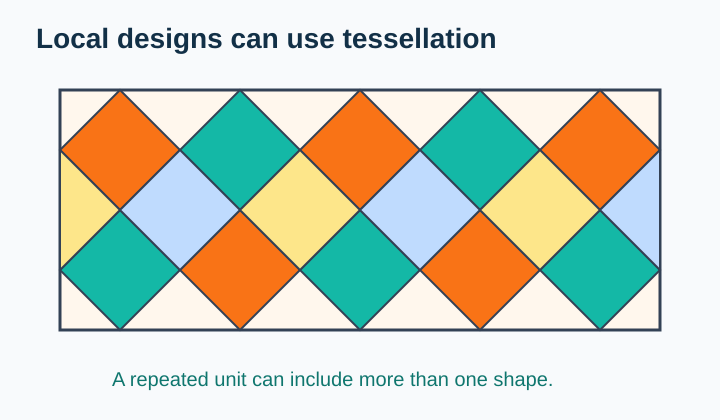
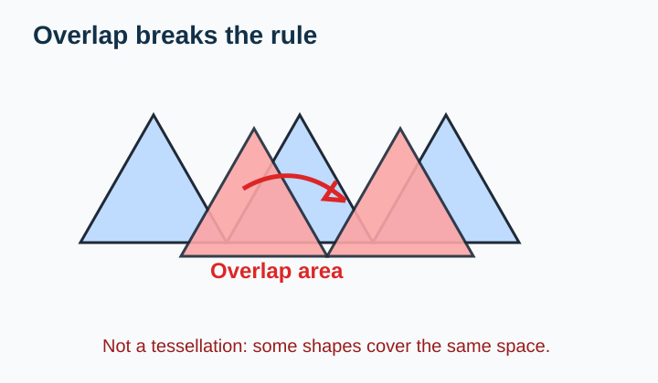

# Tessellation Hunt

> [!GOAL] Learning Goal
>
> I can identify repeating shape patterns in tiles, textiles, and local designs, and I can explain whether a pattern is a tessellation.

## Estimated Time and Difficulty

| Item | Details |
| --- | --- |
| Grade | 6 |
| Subject | Mathematics |
| Quarter | 1 |
| Topic | Geometry - Lesson 1 |
| Estimated time | 35-45 minutes |
| Difficulty | Beginner to moderate |

By the end, you should be able to look at a floor tile, woven pattern, or drawing and say: **This tessellates because the shapes repeat with no gaps and no overlaps.**

## What You Should Already Know

Before starting, check that these ideas feel familiar:

- A **shape** can be moved, turned, or repeated.
- A **polygon** is a closed shape made of straight sides.
- A **pattern** repeats when the same unit or design appears again and again.
- A **gap** is empty space between shapes.
- An **overlap** happens when one shape covers part of another shape.

> [!CHECK] Pre-Check / Readiness Quiz
>
> Answer these quickly before reading:
>
> 1. Which is a polygon: a square or a circle?
> 2. In a repeating pattern `ABABAB`, what comes next after `ABABA`?
> 3. If two tiles cover the same space, is that a gap or an overlap?
> 4. Can rectangles cover a flat floor without leaving spaces?
>
> Check your thinking in the practice mini-app below. If you miss more than one, review the vocabulary table before moving on.

```interactive
{
  "spec": "interactives/tessellation-hunt-lab.json",
  "mode": "auto",
  "height": 760,
  "title": "Tessellation Hunt Lab"
}
```

## Key Vocabulary

| Term | Meaning | Visual or Symbolic Cue | Example |
| --- | --- | --- | --- |
| Tessellation | A pattern of shapes that covers a flat surface with no gaps and no overlaps | shapes fit edge-to-edge | Square floor tiles |
| Tile | One shape or unit that repeats in the pattern | one repeated piece | One square in a checkerboard |
| Gap | Empty space left between shapes | uncovered space | A white hole between circles |
| Overlap | When shapes cover part of the same space | one shape on top of another | Two tiles crossing over each other |
| Repeating unit | The part of the pattern that repeats | pattern block | One square-and-triangle group |
| Vertex | A corner where sides meet | corner point | Four square corners meeting |

## Try Before You Read

Look at the two designs.

| Design A | Design B |
| --- | --- |
|  |  |

**Question:** Which design could cover a whole floor without empty spaces or overlaps?

<details>
<summary>Reveal Thinking Guide</summary>

Ask yourself:

1. Does the same shape repeat?
2. Do the shapes touch edge-to-edge?
3. Is there any uncovered space?
4. Does one shape cover part of another shape?

</details>

<details>
<summary>Reveal Explanation</summary>

Design A is a tessellation. The squares repeat and cover the surface with no gaps and no overlaps. Design B is not a tessellation because circles leave curved spaces between them.

</details>

## Visual Introduction

A tessellation is like a careful floor design: every piece fits with its neighbors.


The important question is not only **Does it repeat?** The better question is:

> Can this pattern keep going and cover a flat surface with **no gaps** and **no overlaps**?

Here are two more shape patterns.

| Triangles | Hexagons |
| --- | --- |
|  |  |

Both are tessellations because the repeated shapes fit together completely.

## Main Concept Explanation

### What Makes a Tessellation?

A design is a tessellation when all three statements are true:

1. The shape or pattern **repeats**.
2. The repeated shapes cover the surface with **no gaps**.
3. The repeated shapes have **no overlaps**.

If even one condition fails, the design is not a tessellation.

> [!IMPORTANT] Rule Box
>
> **Tessellation test:** repeated shapes + no gaps + no overlaps.
>
> Use this test when you classify tile patterns, textiles, wallpapers, mosaics, or local decorative designs.

### Why Squares, Triangles, and Hexagons Work

Some shapes tessellate easily because their corners fit neatly around a point.

- Squares work because four square corners meet cleanly.
- Equilateral triangles work because six triangle corners meet cleanly.
- Regular hexagons work because three hexagon corners meet cleanly.

You do not need to calculate angle measures yet. For this lesson, focus on the visual evidence: **Do the pieces fill the space completely?**

### Local Design Connection

You may see tessellations in floor tiles, woven mats, fabric prints, window grills, baskets, and decorative borders.



The repeated unit in this design is a triangle-and-diamond band. It tessellates because the pieces repeat in rows without gaps or overlaps.

## Worked Examples

### Example 1: Classifying a Tile Pattern

**Problem:** A bathroom floor uses same-size square tiles arranged in rows and columns. Is this a tessellation?


**Solution:**

1. The same square tile repeats.
2. The squares touch edge-to-edge.
3. There are no empty spaces between the squares.
4. No square covers part of another square.

**Final answer:** Yes. The floor pattern is a tessellation.

**Why it works:** Squares fit together around each corner, so the pattern can continue across the whole floor.

### Example 2: Spotting a Non-Example

**Problem:** A design repeats circles in rows. The circles touch some neighbors, but curved empty spaces remain between them. Is this a tessellation?


**Solution:**

1. The circles repeat.
2. The circles do not cover the whole surface.
3. There are gaps between the circles.

**Final answer:** No. The design is not a tessellation.

**Why it does not work:** Repeating alone is not enough. A tessellation must cover the surface completely.

## Guided Practice with Revealable Hints

Try each one before opening the hints.

### Guided Practice 1

**Problem:** A wall design uses regular hexagons that fit like a honeycomb. Is it a tessellation?


<details>
<summary>Hint 1</summary>

Look for gaps first. Are there spaces between the hexagons?

</details>

<details>
<summary>Hint 2</summary>

Check all three parts of the rule: repeat, no gaps, no overlaps.

</details>

<details>
<summary>Show Solution</summary>

Yes. The hexagons repeat, touch edge-to-edge, and leave no gaps or overlaps. It is a tessellation.

</details>

### Guided Practice 2

**Problem:** A pattern has triangles that repeat, but two triangles are drawn on top of each other in one part. Is the whole pattern a tessellation?



<details>
<summary>Hint 1</summary>

A tessellation cannot have gaps or overlaps.

</details>

<details>
<summary>Hint 2</summary>

Find the part where one shape covers another shape.

</details>

<details>
<summary>Show Solution</summary>

No. Even though the triangles repeat, the overlap breaks the tessellation rule.

</details>

### Guided Practice 3

**Problem:** A textile pattern repeats the same diamond-and-triangle unit in rows. The units fill the background completely. Is it a tessellation?


<details>
<summary>Hint 1</summary>

Patterns in cloth or woven designs can be tessellations if their shapes fill the flat surface.

</details>

<details>
<summary>Hint 2</summary>

Focus on whether the repeated unit leaves empty spaces.

</details>

<details>
<summary>Show Solution</summary>

Yes. The repeated unit covers the space without gaps or overlaps, so it can be classified as a tessellation.

</details>

## Mini-Quiz with Answer Checking

Use the Tessellation Hunt Lab near the top of the lesson for instant checking. Try the mini-quiz section there after reading the examples.

## Independent Practice

Answer these on your own, then check the answer key.

1. A kitchen floor is covered with congruent square tiles in straight rows. Tessellation or not?
2. A design repeats circles, but white spaces appear between the circles. Tessellation or not?
3. A honeycomb-style pattern repeats hexagons with no gaps. Tessellation or not?
4. A triangle pattern repeats, but one triangle overlaps another. Tessellation or not?
5. Draw or imagine a pattern using only rectangles. Explain why it can tessellate.
6. A border repeats stars, but the stars do not cover the whole background. Is the star border itself a tessellation of the background?
7. In a woven mat design, the same diamond unit repeats in rows with no spaces. What evidence shows it is a tessellation?

## Answer Key with Explanations

<details>
<summary>Reveal Independent Practice Answers</summary>

1. **Tessellation.** Squares repeat and cover the floor with no gaps or overlaps.
2. **Not a tessellation.** The circles repeat, but the spaces between them are gaps.
3. **Tessellation.** Hexagons can fit edge-to-edge like a honeycomb.
4. **Not a tessellation.** Overlap is not allowed.
5. **Possible answer:** Rectangles can tessellate because they can be arranged in rows and columns that fill a surface completely.
6. **Not a tessellation of the background.** The stars repeat, but they do not cover the whole surface.
7. **Evidence:** The unit repeats, touches neighboring units, and leaves no gaps or overlaps.

</details>

## Misconception Alerts

> [!WARNING] Misconception 1: "Any repeating pattern is a tessellation."
>
> Not always. A pattern can repeat and still leave gaps, like repeated circles.

> [!WARNING] Misconception 2: "A tessellation must use only one shape."
>
> A tessellation can use one shape or a repeated group of shapes, as long as the surface is covered without gaps or overlaps.

> [!WARNING] Misconception 3: "Decorative borders are always tessellations."
>
> A border may repeat, but it is a tessellation only if the repeated shapes cover the surface being considered.

> [!WARNING] Misconception 4: "Small overlaps do not matter."
>
> Any overlap breaks the tessellation rule because two shapes are trying to cover the same space.

## Error Analysis

Fictional student solution:

> "This triangle pattern is a tessellation because all the shapes are triangles and triangles can tessellate."


**What mistake did the student make? How would you fix it?**

<details>
<summary>Reveal Mistake</summary>

The student looked only at the type of shape. They did not check the actual pattern. In this drawing, some triangles overlap, so this particular pattern is not a tessellation.

</details>

<details>
<summary>Reveal Correct Solution</summary>

Correct explanation: "Triangles can make tessellations, but this drawing is not a tessellation because the shapes overlap. To fix it, move the triangles so they touch edge-to-edge without covering each other."

</details>

## Self-Explanation Prompts

Write a short answer to each prompt.

1. In your own words, what does "no gaps and no overlaps" mean?
2. How can you tell whether a repeated textile pattern is a tessellation?
3. Why are repeated circles usually not tessellations by themselves?
4. What evidence would convince you that a floor tile design tessellates?

<details>
<summary>Reveal Sample Responses</summary>

1. "No gaps and no overlaps" means every part of the surface is covered exactly once.
2. I would check whether the same unit repeats and fills the cloth design without empty spaces or stacked shapes.
3. Circles leave curved spaces between them, so they do not cover the whole surface.
4. The tiles repeat, share edges, continue in all directions, and leave no holes or overlaps.

</details>

## Extension Challenge

**Optional challenge:** Create a tessellation using two different shapes, such as squares and triangles. Describe the repeating unit.

<details>
<summary>Hint</summary>

Start with one square. Add triangles along the sides so that the whole group can repeat like a tile.

</details>

<details>
<summary>Full Solution Example</summary>

One possible repeating unit is a square with a triangle attached to the top and another matching triangle attached to the bottom. If every unit repeats in rows, the triangles can fill the spaces above and below the squares. The final pattern tessellates only if the repeated units leave no gaps and no overlaps.

</details>

## Mastery Checklist

Check whether each statement is true for you:

- I can define tessellation.
- I can identify a repeated unit in a pattern.
- I can spot gaps in a design.
- I can spot overlaps in a design.
- I can classify examples and non-examples of tessellations.
- I can explain my answer using visual evidence.
- I can connect tessellations to tiles, textiles, or local designs.

> [!PRACTICE] How to Use the Exams
>
> Use the practice exam as your quick self-check. Then use the assessment exam to prove you can classify new examples and non-examples without hints.

## Final Summary

A **tessellation** is a repeating pattern that covers a flat surface with **no gaps** and **no overlaps**.

The main rule is:

$$\text{repeating shapes} + \text{no gaps} + \text{no overlaps} = \text{tessellation}$$

The most important mistake to avoid is calling every repeated design a tessellation. Repeating is only one part of the test. You must also check that the pattern covers the surface completely and cleanly.
