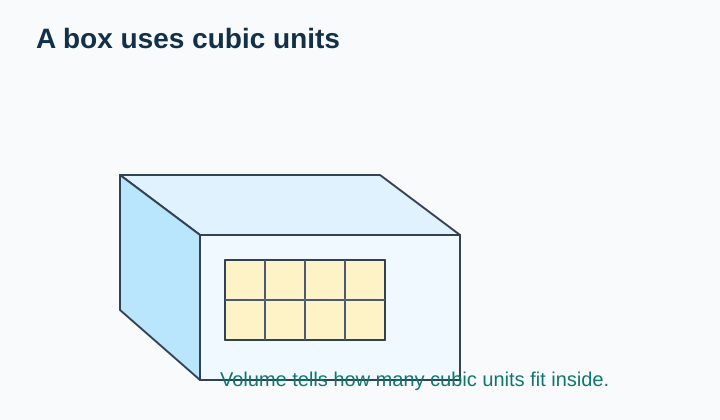
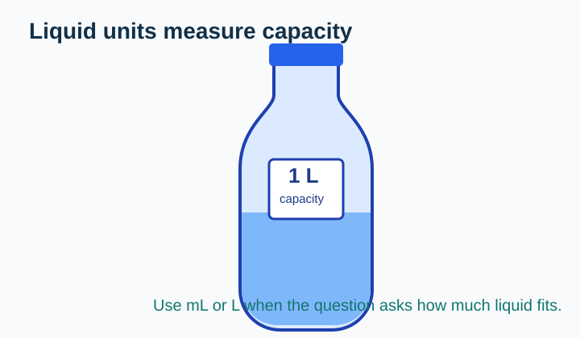
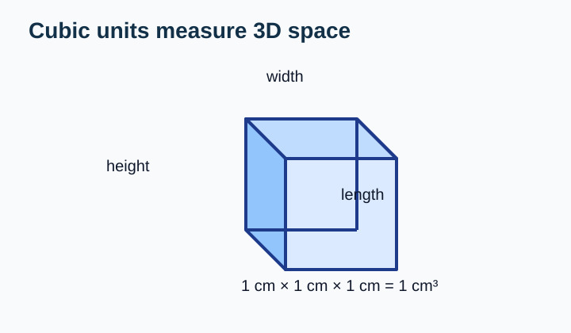
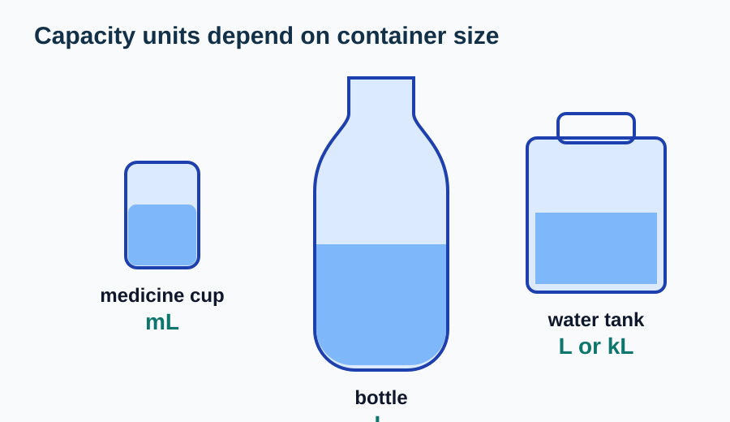
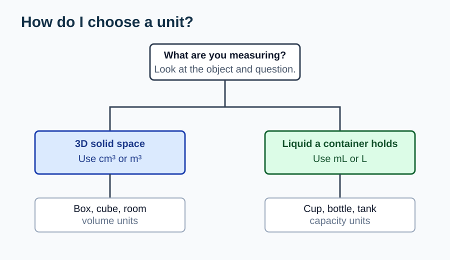
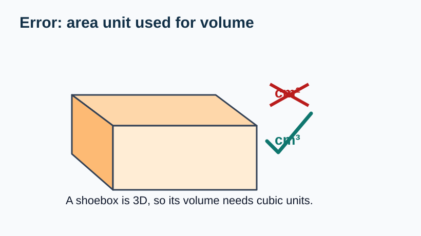

# Choosing Units

> [!GOAL] Learning Goal
>
> I can select suitable units for volume and capacity, and I can explain whether an object should be measured with cubic units or liquid units.

## Estimated Time and Difficulty

| Item | Details |
| --- | --- |
| Grade | 6 |
| Subject | Mathematics |
| Quarter | 3 |
| Topic | Geometry - Lesson 1 |
| Estimated time | 35-45 minutes |
| Difficulty | Beginner |

This lesson helps you choose a sensible unit before you measure. That small decision prevents many measurement mistakes.

## What You Should Already Know

Before starting, check these ideas:

- **Length** measures distance, such as centimeters or meters.
- **Area** measures flat surface and uses square units, such as cm².
- **Volume** measures space inside or occupied by a solid and uses cubic units, such as cm³.
- **Capacity** measures how much liquid a container can hold and often uses mL or L.
- A unit should match the size and type of object being measured.

> [!CHECK] Pre-Check / Readiness Quiz
>
> Try these before reading:
>
> 1. Which unit fits length: cm or cm³?
> 2. Which unit fits a flat notebook cover: cm² or L?
> 3. Which unit fits the water in a drinking glass: mL or m²?
> 4. Which unit fits a small solid cube: cm³ or kg?
>
> Use the interactive lab below to check your answers and practice unit choices.

```interactive
{
  "spec": "interactives/choosing-units-lab.json",
  "mode": "auto",
  "height": 760,
  "title": "Choosing Units Lab"
}
```

## Key Vocabulary

| Term | Meaning | Visual or Symbolic Cue | Example |
| --- | --- | --- | --- |
| Volume | The amount of 3D space an object takes up or the space inside a solid shape | cubic units | A box has volume measured in cm³ or m³ |
| Capacity | The amount a container can hold, usually liquid | liquid units | A bottle has capacity measured in mL or L |
| Cubic unit | A cube-shaped unit used for volume | unit cube | cm³, m³ |
| Milliliter | A small liquid unit | mL | Medicine cup or spoonful |
| Liter | A larger liquid unit | L | Water bottle or pitcher |
| Suitable unit | A unit that matches the object and situation | reasonable choice | L for a bucket, cm³ for a small box |

## Try Before You Read

Look at the two objects:

| Solid box | Water bottle |
| --- | --- |
|  |  |

**Question:** Which object should be measured with cubic units, and which should be measured with liquid units?

<details>
<summary>Reveal Thinking Guide</summary>

Ask:

1. Is this about a solid shape or a container of liquid?
2. Am I measuring space in a 3D object or how much liquid it can hold?
3. Would a cubic unit or a liquid unit make more sense?

</details>

<details>
<summary>Reveal Explanation</summary>

The box is measured with cubic units, such as cm³, because it is a 3D solid space. The bottle is measured with liquid units, such as mL or L, because we usually care how much liquid it can hold.

</details>

## Visual Introduction

Volume and capacity are related, but they are not exactly the same idea.

| Volume | Capacity |
| --- | --- |
|  |  |
| Measures 3D space | Measures how much a container holds |
| Common units: cm³, m³ | Common units: mL, L |

> [!TIP] Fast Decision
>
> If the object is a solid box, cube, room, or tank shape, think **cubic units**.
>
> If the question asks how much liquid a container holds, think **mL or L**.

## Main Concept Explanation

### 1. Use Cubic Units for Volume

A cubic unit is shaped like a cube. A cubic centimeter, written cm³, is the space taken by a cube that is 1 cm long, 1 cm wide, and 1 cm high.


Use cubic units when measuring:

- a small box: cm³
- a large room: m³
- a rectangular prism made from unit cubes: cubic units

### 2. Use Liquid Units for Capacity

Capacity tells how much a container can hold. For liquids, common units are milliliters and liters.



Use liquid units when measuring:

- a medicine cup: mL
- a glass of water: mL
- a pitcher or large bottle: L
- a water tank: L or kL, depending on size

### 3. Choose a Unit That Matches the Size

The same kind of measurement can use smaller or larger units.



| Situation | Better Unit | Why |
| --- | --- | --- |
| Volume of a small dice | cm³ | It is a small solid object |
| Volume of a classroom | m³ | It is a large 3D space |
| Capacity of a spoon | mL | It holds a small amount of liquid |
| Capacity of a water bottle | mL or L | It holds liquid |
| Capacity of a large tank | L or kL | It holds a large amount of liquid |

## Rule Box / Formula Box

> [!IMPORTANT] Unit-Choice Rule
>
> **For solid 3D space, choose cubic units:** cm³, m³, cubic units.
>
> **For liquid capacity, choose liquid units:** mL, L, kL.
>
> **Warning:** Do not use square units like cm² for volume. Square units measure flat area, not space inside a 3D object.

## Worked Examples

### Example 1: Choosing a Unit for a Small Box

**Problem:** You want to describe the space inside a small jewelry box. Which unit is more suitable: cm³ or L?


**Solution:**

1. The object is a small 3D box.
2. We are describing space inside the box.
3. A small solid space is best measured with cubic centimeters.

**Final answer:** cm³

**Why it works:** The box is a solid 3D space, so a cubic unit matches the measurement.

### Example 2: Choosing a Unit for a Water Bottle

**Problem:** You want to describe how much water a bottle can hold. Which unit is more suitable: cm², cm³, or L?


**Solution:**

1. The bottle is a container.
2. The question asks how much water it can hold.
3. Capacity of liquid is usually measured in mL or L.

**Final answer:** L

**Why it works:** Liters are designed for liquid capacity and are reasonable for a bottle.

## Guided Practice with Revealable Hints

### Guided Practice 1

**Problem:** Choose a suitable unit for the volume of a small toy cube.

<details>
<summary>Hint 1</summary>

Is the toy cube a solid object or a liquid container?

</details>

<details>
<summary>Hint 2</summary>

Small solid objects usually use cubic centimeters.

</details>

<details>
<summary>Show Solution</summary>

Use **cm³**. The toy cube is a small 3D solid object.

</details>

### Guided Practice 2

**Problem:** Choose a suitable unit for the capacity of a drinking glass.

<details>
<summary>Hint 1</summary>

The glass holds liquid.

</details>

<details>
<summary>Hint 2</summary>

A glass holds a smaller amount than a large tank, so milliliters often work well.

</details>

<details>
<summary>Show Solution</summary>

Use **mL**. A drinking glass holds liquid, and milliliters are suitable for smaller liquid amounts.

</details>

### Guided Practice 3

**Problem:** Choose a suitable unit for the volume of a classroom.

<details>
<summary>Hint 1</summary>

A classroom is a large 3D space.

</details>

<details>
<summary>Hint 2</summary>

For large spaces, cubic meters are more reasonable than cubic centimeters.

</details>

<details>
<summary>Show Solution</summary>

Use **m³**. A classroom is a large 3D space, so cubic meters are suitable.

</details>

## Mini-Quiz with Answer Checking

Use the Choosing Units Lab near the top of the lesson for instant answer checking. Try the mini-quiz there after reading the examples.

## Independent Practice

Choose a suitable unit for each situation. Then check the answer key.

1. Capacity of a medicine cup
2. Volume of a dice
3. Capacity of a large water jug
4. Volume of a shipping box
5. Capacity of a swimming pool
6. Volume of a classroom
7. Capacity of a spoonful of syrup
8. Volume of a small stack of unit cubes

## Answer Key with Explanations

<details>
<summary>Reveal Independent Practice Answers</summary>

1. **mL.** A medicine cup holds a small amount of liquid.
2. **cm³.** A dice is a small solid object.
3. **L.** A water jug holds liquid.
4. **cm³ or m³, depending on size.** A shipping box is a 3D solid space. A small box may use cm³; a very large box may use m³.
5. **L or kL.** A swimming pool holds a large amount of water.
6. **m³.** A classroom is a large 3D space.
7. **mL.** A spoonful is a small liquid amount.
8. **cubic units or cm³.** The stack is a 3D arrangement of cubes.

</details>

## Misconception Alerts

> [!WARNING] Misconception 1: "Volume and area use the same units."
>
> Area uses square units such as cm². Volume uses cubic units such as cm³.

> [!WARNING] Misconception 2: "All containers should be measured in liters."
>
> Not always. A medicine dropper or spoon is better measured in milliliters.

> [!WARNING] Misconception 3: "Cubic units are only for cubes."
>
> Cubic units can measure any 3D solid space, including boxes, rooms, and rectangular prisms.

> [!WARNING] Misconception 4: "A bigger unit is always better."
>
> The best unit depends on the size. Using meters cubed for a tiny cube would be awkward; using cubic centimeters for a classroom would also be awkward.

## Error Analysis

Fictional student solution:

> "The volume of a shoebox should be measured in cm² because the box has rectangular faces."



**What mistake did the student make? How would you fix it?**

<details>
<summary>Reveal Mistake</summary>

The student focused on the flat faces of the box instead of the 3D space inside the box. cm² measures area, not volume.

</details>

<details>
<summary>Reveal Correct Solution</summary>

The volume of a shoebox should be measured in **cm³** because it is a 3D space. If the box were very large, another cubic unit such as m³ might be more suitable.

</details>

## Self-Explanation Prompts

Write a short answer for each prompt:

1. How do you decide between cm³ and mL?
2. Why is cm² not suitable for the volume of a box?
3. When would liters be more suitable than milliliters?
4. Why might m³ be better than cm³ for a classroom?

<details>
<summary>Reveal Sample Responses</summary>

1. I use cm³ for solid 3D space and mL for small liquid capacity.
2. cm² measures a flat surface, but volume measures 3D space.
3. Liters are better when the container holds a larger liquid amount, like a bottle, jug, or bucket.
4. A classroom is large, so cubic meters are easier and more reasonable than counting many cubic centimeters.

</details>

## Extension Challenge

**Optional challenge:** A rectangular fish tank has two possible descriptions:

- The glass tank's inside space can be described in cubic centimeters.
- The amount of water it can hold can be described in liters.

Explain why both descriptions can be useful.

<details>
<summary>Hint</summary>

Think about the difference between the tank as a 3D object and the water it can hold.

</details>

<details>
<summary>Full Solution Example</summary>

The tank has an inside volume because it is a 3D space, so cm³ can describe the space inside. It also has capacity because it can hold water, so liters can describe the amount of liquid it can hold. The unit depends on the question being asked.

</details>

## Mastery Checklist

Check whether each statement is true for you:

- I can explain the difference between volume and capacity.
- I can choose cm³ for small solid spaces.
- I can choose m³ for large solid spaces.
- I can choose mL for small liquid amounts.
- I can choose L for larger liquid amounts.
- I can avoid using cm² for volume.
- I can explain why my unit choice is reasonable.

> [!PRACTICE] How to Use the Exams
>
> Use the practice exam for quick unit matching. Use the assessment exam to check whether you can explain your choices without hints.

## Final Summary

Choose units by asking what is being measured.

- **Volume** means 3D space. Use cubic units such as cm³ or m³.
- **Capacity** means how much a container can hold. Use liquid units such as mL or L.
- **Area** is flat surface and uses square units, so cm² is not a volume or capacity unit.

The most important mistake to avoid is choosing a unit just because it looks familiar. Match the unit to the object, the size, and the question.
