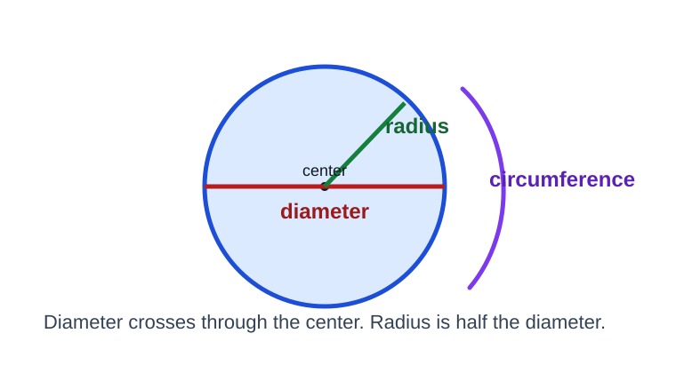
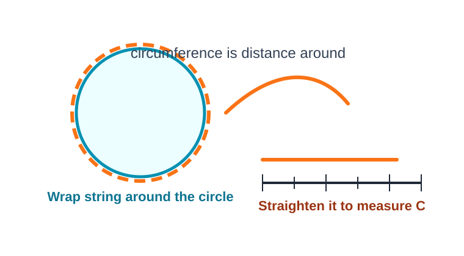
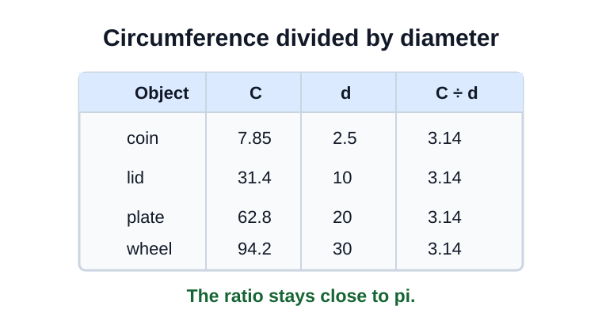
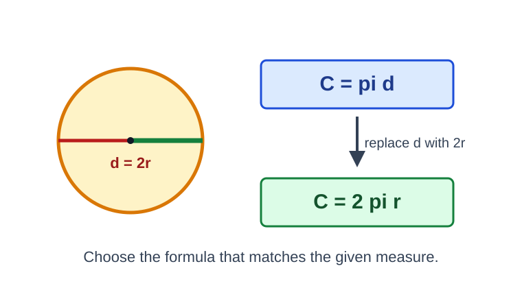
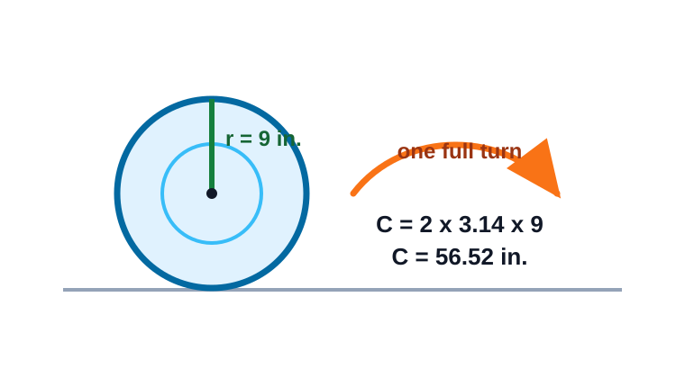
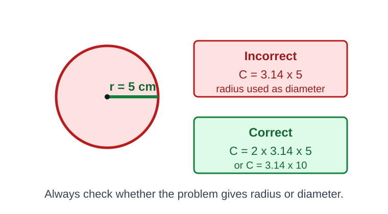

# Circumference and Pi

> [!GOAL] Learning Goal
>
> I can measure circumference and diameter to approximate pi, then use \(C = \pi d\) and \(C = 2\pi r\) to solve circle problems.

## Estimated Time and Difficulty

| Item | Details |
| --- | --- |
| Grade | 6 |
| Subject | Mathematics |
| Quarter | 3 |
| Topic | Geometry - Lesson 10 |
| Estimated time | 40-50 minutes |
| Difficulty | Moderate |

Circles have a special pattern. No matter how large or small a circle is, its circumference is always a little more than 3 times its diameter. That constant ratio is called **pi**, written \(\pi\).

## What You Should Already Know

- A circle is a set of points the same distance from a center.
- The **radius** goes from the center to the circle.
- The **diameter** goes across the circle through the center.
- Diameter is twice the radius: \(d = 2r\).
- Circumference answers use linear units such as cm, m, in., or ft.

> [!CHECK] Pre-Check / Readiness Quiz
>
> Try these before reading:
>
> 1. If a radius is 6 cm, what is the diameter?
> 2. What measurement goes around a circle?
> 3. Estimate \(3.14 \times 10\).
> 4. Which is longer: a radius or a diameter of the same circle?

```interactive
{
  "spec": "interactives/circumference-pi-lab.json",
  "mode": "auto",
  "height": 860,
  "title": "Circumference and Pi Lab"
}
```

## Key Vocabulary

| Term | Meaning | Visual or Symbolic Cue | Example |
| --- | --- | --- | --- |
| Circumference | Distance around a circle | around the outside | a wheel's distance in one turn |
| Diameter | Distance across a circle through the center | \(d\) | 14 cm across |
| Radius | Distance from center to circle | \(r\) | 7 cm from center |
| Pi | Ratio of circumference to diameter | \(\pi \approx 3.14\) | \(C \div d\) |
| Ratio | Comparison by division | \(C:d\) or \(C \div d\) | \(31.4 \div 10\) |
| Formula | Rule using symbols | \(C = \pi d\) | \(C = 3.14 \times 8\) |

## Try Before You Read

Look at this circle.



**Question:** If you know the diameter, how could you estimate the distance around the circle?

<details>
<summary>Reveal Thinking Guide</summary>

Think about measuring several circular objects. The distance around each circle is about 3.14 times the distance across its center.

</details>

<details>
<summary>Reveal Explanation</summary>

Multiply the diameter by pi: \(C = \pi d\). For Grade 6 problems, \(\pi\) is often approximated by 3.14.

</details>

## Visual Introduction

One way to approximate pi is to measure a real circle.



1. Wrap a string around the circle.
2. Mark where the string completes one trip around.
3. Straighten and measure the string. This is the circumference.
4. Measure across the center. This is the diameter.
5. Divide: circumference \(\div\) diameter.

## Main Concept Explanation

### 1. Circumference Compared to Diameter

For every circle:

$$\frac{C}{d} \approx 3.14$$

This number is pi.



Small measurement differences happen because rulers, strings, and rounding are not perfect. A result like 3.13 or 3.15 can still be a good real-world approximation.

### 2. Formula from Diameter

If \(\frac{C}{d} = \pi\), then:

$$C = \pi d$$

Use this when the problem gives the diameter.

### 3. Formula from Radius

The diameter is twice the radius: \(d = 2r\).

Substitute \(2r\) for \(d\):

$$C = \pi d = \pi(2r) = 2\pi r$$

Use \(C = 2\pi r\) when the problem gives the radius.



## Rule Box / Formula Box

> [!IMPORTANT] Circumference Routine
>
> 1. **Identify the given measure:** radius or diameter.
> 2. **Choose a formula:** \(C = \pi d\) or \(C = 2\pi r\).
> 3. **Substitute:** Use \(\pi \approx 3.14\) unless told otherwise.
> 4. **Calculate carefully.**
> 5. **Label the answer with linear units.**
>
> **Warning:** Circumference is a length, not an area, so do not use square units.

## Worked Examples

### Example 1: Diameter Given

**Problem:** A circular sticker has diameter 12 cm. Find its circumference using \(\pi = 3.14\).

**Solution:**

Since diameter is given, use \(C = \pi d\).

$$C = 3.14 \times 12$$

$$C = 37.68\text{ cm}$$

**Final answer:** The circumference is **37.68 cm**.

**Why it works:** Circumference is about 3.14 diameters.

### Example 2: Radius Given

**Problem:** A wheel has radius 9 inches. About how far does the wheel travel in one full turn?



**Solution:**

One full turn is one circumference. Since radius is given, use \(C = 2\pi r\).

$$C = 2 \times 3.14 \times 9$$

$$C = 56.52\text{ inches}$$

**Final answer:** The wheel travels about **56.52 inches** in one full turn.

**Why it works:** The point on the wheel touches the ground for one complete trip around the circle.

## Guided Practice with Revealable Hints

### Guided Practice 1

**Problem:** A circular clock has diameter 10 in. Find its circumference using \(\pi = 3.14\).

<details><summary>Hint 1</summary>The diameter is given.</details>
<details><summary>Hint 2</summary>Use \(C = \pi d\), so compute \(3.14 \times 10\).</details>
<details><summary>Show Solution</summary>\(C = 31.4\text{ in.}\)</details>

### Guided Practice 2

**Problem:** A circle has radius 6 m. Find its circumference using \(\pi = 3.14\).

<details><summary>Hint 1</summary>The radius is given, so use \(C = 2\pi r\).</details>
<details><summary>Hint 2</summary>Compute \(2 \times 3.14 \times 6\).</details>
<details><summary>Show Solution</summary>\(C = 37.68\text{ m}\).</details>

### Guided Practice 3

**Problem:** A measured circle has circumference 47.1 cm and diameter 15 cm. Approximate pi.

<details><summary>Hint 1</summary>Use circumference divided by diameter.</details>
<details><summary>Hint 2</summary>Compute \(47.1 \div 15\).</details>
<details><summary>Show Solution</summary>\(47.1 \div 15 = 3.14\), so \(\pi \approx 3.14\).</details>

## Mini-Quiz with Answer Checking

Use the Circumference and Pi Lab near the top of the lesson for instant checking.

## Independent Practice

Solve each problem. Use \(\pi = 3.14\) unless the problem says otherwise.

1. A circle has diameter 6 cm. Find the circumference.
2. A circle has radius 8 m. Find the circumference.
3. A circular table has diameter 1.5 m. Find the circumference.
4. A jar lid has circumference 28.26 cm and diameter 9 cm. Approximate pi.
5. A bicycle wheel has radius 13 inches. How far does it travel in one full turn?
6. A student says the circumference of a circle with radius 4 cm is \(3.14 \times 4 = 12.56\) cm. Explain the error.
7. A circle has circumference 75.36 ft. If \(\pi = 3.14\), what is the diameter?
8. Which formula would you choose for a circle with diameter 22 mm? Explain why.

## Answer Key with Explanations

<details>
<summary>Reveal Independent Practice Answers</summary>

1. **18.84 cm.** \(C = 3.14 \times 6 = 18.84\).
2. **50.24 m.** \(C = 2 \times 3.14 \times 8 = 50.24\).
3. **4.71 m.** \(C = 3.14 \times 1.5 = 4.71\).
4. **3.14.** \(28.26 \div 9 = 3.14\).
5. **81.64 inches.** \(C = 2 \times 3.14 \times 13 = 81.64\).
6. **The radius was used as the diameter.** Correct setup: \(2 \times 3.14 \times 4 = 25.12\) cm.
7. **24 ft.** \(d = C \div \pi = 75.36 \div 3.14 = 24\).
8. **Use \(C = \pi d\).** The problem gives diameter, so \(C = 3.14 \times 22\).

</details>

## Misconception Alerts

> [!WARNING] Misconception 1: "Diameter and radius are interchangeable."
>
> They are related, but not the same. The diameter is twice the radius.

> [!WARNING] Misconception 2: "Pi is exactly 3.14."
>
> Pi is a non-ending decimal. The number 3.14 is a useful approximation for many Grade 6 problems.

> [!WARNING] Misconception 3: "Circumference answers use square units."
>
> Circumference measures distance around a circle, so use linear units such as cm or m.

> [!WARNING] Misconception 4: "A bigger circle has a different pi."
>
> Bigger circles have bigger circumferences and diameters, but \(C \div d\) stays about 3.14.

## Error Analysis



**Incorrect student solution:**

A circle has radius 5 cm. A student writes:

$$C = 3.14 \times 5 = 15.7\text{ cm}$$

**Question:** What mistake did the student make? How would you fix it?

<details>
<summary>Reveal Mistake</summary>

The student used the radius as if it were the diameter.

</details>

<details>
<summary>Reveal Correct Solution</summary>

Use \(C = 2\pi r\) because radius is given:

$$C = 2 \times 3.14 \times 5 = 31.4\text{ cm}$$

You could also double the radius first: \(d = 10\), then \(C = 3.14 \times 10 = 31.4\text{ cm}\).

</details>

## Self-Explanation Prompts

Use these prompts to test your reasoning.

1. How can you tell whether to use \(C = \pi d\) or \(C = 2\pi r\)?
2. Why does \(C \div d\) approximate pi?
3. What unit should a circumference answer use?
4. Why might measured pi be 3.13 instead of exactly 3.14?
5. How can you check whether your circumference answer is reasonable?

<details>
<summary>Reveal Sample Responses</summary>

1. I use \(C = \pi d\) when diameter is given and \(C = 2\pi r\) when radius is given.
2. Pi is defined as the ratio of circumference to diameter.
3. Circumference uses linear units.
4. Measurement and rounding errors can slightly change the quotient.
5. The circumference should be a little more than 3 times the diameter.

</details>

## Extension Challenge

**Optional challenge:** A circular track has diameter 38 m. A runner completes 3 laps. About how many meters does the runner travel? Use \(\pi = 3.14\).

<details>
<summary>Reveal Hint</summary>

Find one circumference first, then multiply by 3 laps.

</details>

<details>
<summary>Reveal Full Solution</summary>

One lap:

$$C = 3.14 \times 38 = 119.32\text{ m}$$

Three laps:

$$119.32 \times 3 = 357.96\text{ m}$$

The runner travels about **357.96 m**.

</details>

## Mastery Checklist

Check each statement when you can do it confidently.

- [ ] I can identify radius, diameter, and circumference.
- [ ] I can measure circumference and diameter to approximate pi.
- [ ] I can explain why \(\pi \approx C \div d\).
- [ ] I can use \(C = \pi d\) when diameter is given.
- [ ] I can use \(C = 2\pi r\) when radius is given.
- [ ] I can avoid confusing radius and diameter.
- [ ] I can label circumference answers with linear units.

## Final Summary

Circumference is the distance around a circle. Pi is the constant ratio \(C \div d\), approximately 3.14. Use \(C = \pi d\) when diameter is given and \(C = 2\pi r\) when radius is given. Always check whether the problem gives radius or diameter before substituting.

> [!PRACTICE] Next Step
>
> Use the practice exam to strengthen formula choice and calculations. Use the assessment when you can explain pi as a measured ratio and solve circumference problems accurately.
