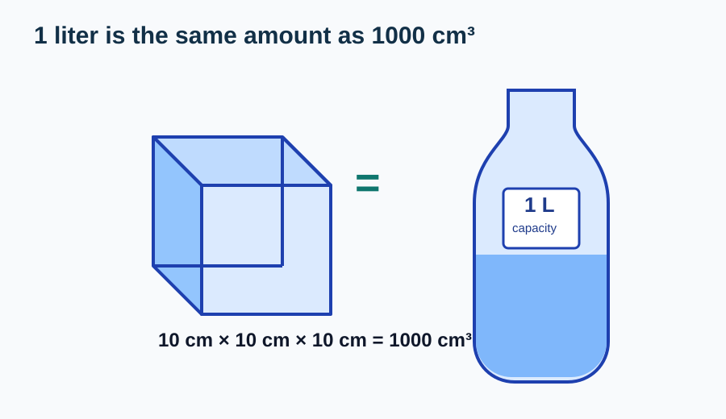
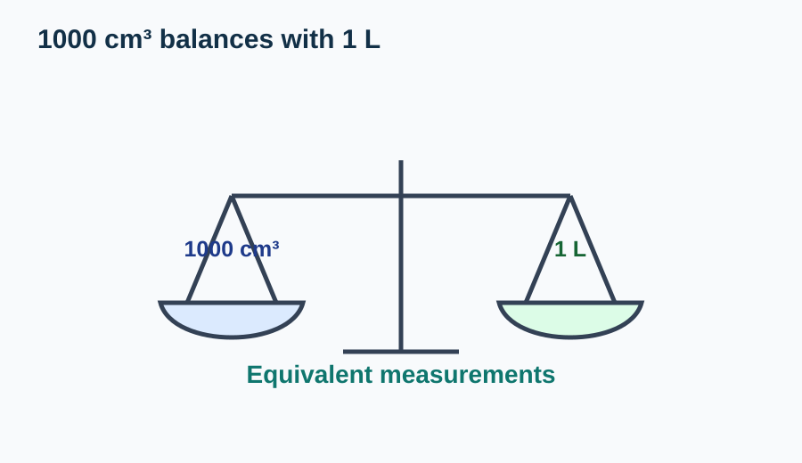
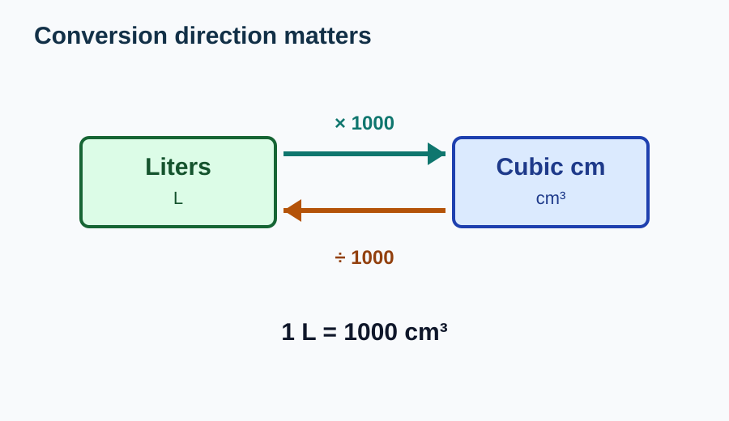
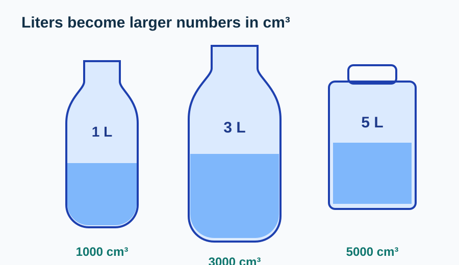
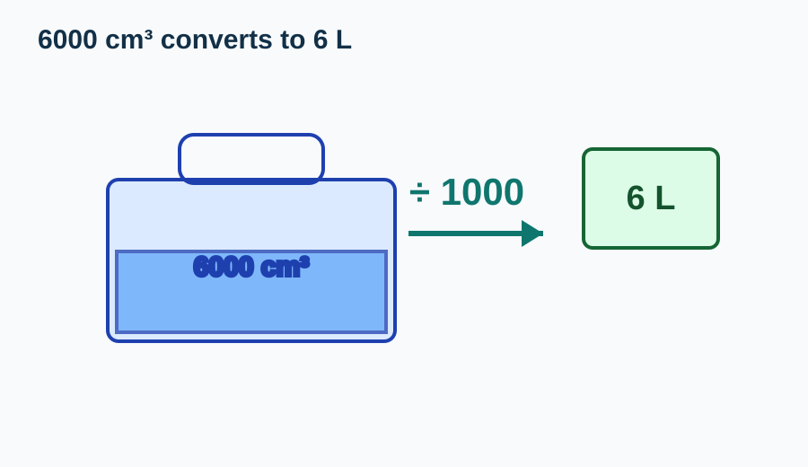
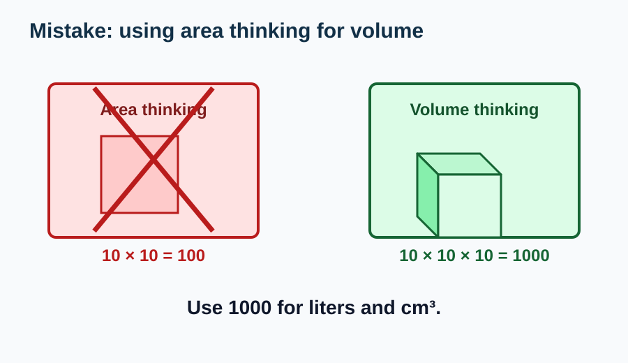

# Cubic Centimeters and Liters

> [!GOAL] Learning Goal
>
> I can connect cubes and containers by converting between cubic centimeters and liters.

## Estimated Time and Difficulty

| Item | Details |
| --- | --- |
| Grade | 6 |
| Subject | Mathematics |
| Quarter | 3 |
| Topic | Geometry - Lesson 2 |
| Estimated time | 40-50 minutes |
| Difficulty | Moderate |

In Lesson 1, you chose suitable units. In this lesson, you connect two useful units: **cubic centimeters** and **liters**.

## What You Should Already Know

Before starting, check these ideas:

- Volume can be measured in cubic centimeters, written cm³.
- Capacity can be measured in liters, written L.
- A rectangular prism's volume can be found by multiplying length × width × height.
- Multiplying by 1000 makes a number larger.
- Dividing by 1000 makes a number smaller.

> [!CHECK] Pre-Check / Readiness Quiz
>
> Try these before reading:
>
> 1. What is 10 × 10 × 10?
> 2. Which is a volume unit: cm³ or cm²?
> 3. Which is a capacity unit: L or m?
> 4. To change 3 L into cm³, should the number get larger or smaller?
>
> Use the interactive lab below to check and practice the conversions.

```interactive
{
  "spec": "interactives/cubic-liters-lab.json",
  "mode": "auto",
  "height": 780,
  "title": "Cubic Centimeters and Liters Lab"
}
```

## Key Vocabulary

| Term | Meaning | Visual or Symbolic Cue | Example |
| --- | --- | --- | --- |
| Cubic centimeter | A cube that is 1 cm by 1 cm by 1 cm | cm³ | A small unit cube |
| Liter | A common unit for liquid capacity | L | A water bottle may hold 1 L |
| Conversion | Changing from one unit to an equivalent unit | same amount, different unit | 2 L = 2000 cm³ |
| Equivalent | Equal in value | = | 1000 cm³ = 1 L |
| Capacity | How much a container can hold | liquid amount | A jug holds 4 L |
| Volume | 3D space measured in cubic units | cubes | A tank has volume 6000 cm³ |

## Try Before You Read

Look at the cube and the container.



**Question:** If a cube is 10 cm long, 10 cm wide, and 10 cm high, how many cubic centimeters are inside it?

<details>
<summary>Reveal Thinking Guide</summary>

Use volume:

$$V = l \times w \times h$$

Then connect the result to liters.

</details>

<details>
<summary>Reveal Explanation</summary>

$$10 \times 10 \times 10 = 1000$$

So the cube has volume **1000 cm³**. This amount is equal to **1 liter**.

</details>

## Visual Introduction

The big idea is:

> **1 liter = 1000 cubic centimeters**



This works because a 10 cm by 10 cm by 10 cm cube contains:

$$10 \times 10 \times 10 = 1000 \text{ cm}^3$$

That same amount of space matches **1 L** of capacity.

## Main Concept Explanation

### 1. Liters to Cubic Centimeters

When you convert liters to cubic centimeters, the number gets larger because cubic centimeters are smaller units.

$$1 \text{ L} = 1000 \text{ cm}^3$$

So:

$$2 \text{ L} = 2000 \text{ cm}^3$$

$$5 \text{ L} = 5000 \text{ cm}^3$$

### 2. Cubic Centimeters to Liters

When you convert cubic centimeters to liters, the number gets smaller because liters are larger units.

$$1000 \text{ cm}^3 = 1 \text{ L}$$

So:

$$3000 \text{ cm}^3 = 3 \text{ L}$$

$$7500 \text{ cm}^3 = 7.5 \text{ L}$$



### 3. Reasonableness Check

Ask:

- Did I multiply when going from L to cm³?
- Did I divide when going from cm³ to L?
- Does the new number make sense?

If you changed 4 L into 0.004 cm³, something went wrong. A liter is much larger than one cubic centimeter, so 4 L should become **4000 cm³**.

## Rule Box / Formula Box

> [!IMPORTANT] Conversion Rule
>
> $$1 \text{ L} = 1000 \text{ cm}^3$$
>
> **Liters to cubic centimeters:** multiply by 1000.
>
> **Cubic centimeters to liters:** divide by 1000.
>
> **Warning:** Do not use 100 as the conversion number. The connection comes from \(10 \times 10 \times 10 = 1000\), not \(10 \times 10 = 100\).

## Worked Examples

### Example 1: Convert Liters to Cubic Centimeters

**Problem:** A small container has a capacity of 3 L. What is this capacity in cubic centimeters?



**Solution:**

1. Start with liters: 3 L.
2. Use \(1 \text{ L} = 1000 \text{ cm}^3\).
3. Multiply by 1000:

$$3 \times 1000 = 3000$$

**Final answer:** \(3 \text{ L} = 3000 \text{ cm}^3\)

**Why it works:** Cubic centimeters are smaller units, so the number of units becomes larger.

### Example 2: Convert Cubic Centimeters to Liters

**Problem:** A rectangular tank has volume 6000 cm³. What is its capacity in liters?



**Solution:**

1. Start with cubic centimeters: 6000 cm³.
2. Use \(1000 \text{ cm}^3 = 1 \text{ L}\).
3. Divide by 1000:

$$6000 \div 1000 = 6$$

**Final answer:** \(6000 \text{ cm}^3 = 6 \text{ L}\)

**Why it works:** Liters are larger units, so fewer liters are needed to describe the same amount.

## Guided Practice with Revealable Hints

### Guided Practice 1

**Problem:** Convert 4 L to cubic centimeters.

<details>
<summary>Hint 1</summary>

You are going from liters to cubic centimeters.

</details>

<details>
<summary>Hint 2</summary>

Multiply by 1000.

</details>

<details>
<summary>Show Solution</summary>

$$4 \times 1000 = 4000$$

So \(4 \text{ L} = 4000 \text{ cm}^3\).

</details>

### Guided Practice 2

**Problem:** Convert 2500 cm³ to liters.

<details>
<summary>Hint 1</summary>

You are going from cubic centimeters to liters.

</details>

<details>
<summary>Hint 2</summary>

Divide by 1000.

</details>

<details>
<summary>Show Solution</summary>

$$2500 \div 1000 = 2.5$$

So \(2500 \text{ cm}^3 = 2.5 \text{ L}\).

</details>

### Guided Practice 3

**Problem:** A container holds 0.75 L. How many cubic centimeters is that?

<details>
<summary>Hint 1</summary>

Liters to cubic centimeters means multiply by 1000.

</details>

<details>
<summary>Hint 2</summary>

Think of 0.75 L as three-fourths of 1 L.

</details>

<details>
<summary>Show Solution</summary>

$$0.75 \times 1000 = 750$$

So \(0.75 \text{ L} = 750 \text{ cm}^3\).

</details>

## Mini-Quiz with Answer Checking

Use the Cubic Centimeters and Liters Lab near the top of the lesson for instant checking. Try the mini-quiz after reading the examples.

## Independent Practice

Convert each measurement.

1. 1 L = _____ cm³
2. 6 L = _____ cm³
3. 2.5 L = _____ cm³
4. 1000 cm³ = _____ L
5. 4500 cm³ = _____ L
6. 800 cm³ = _____ L
7. A container has capacity 12 L. What is this in cm³?
8. A tank has volume 9500 cm³. What is this in liters?

## Answer Key with Explanations

<details>
<summary>Reveal Independent Practice Answers</summary>

1. **1000 cm³.** One liter equals 1000 cubic centimeters.
2. **6000 cm³.** \(6 \times 1000 = 6000\).
3. **2500 cm³.** \(2.5 \times 1000 = 2500\).
4. **1 L.** \(1000 \div 1000 = 1\).
5. **4.5 L.** \(4500 \div 1000 = 4.5\).
6. **0.8 L.** \(800 \div 1000 = 0.8\).
7. **12000 cm³.** \(12 \times 1000 = 12000\).
8. **9.5 L.** \(9500 \div 1000 = 9.5\).

</details>

## Misconception Alerts

> [!WARNING] Misconception 1: "1 L = 100 cm³."
>
> The correct conversion is **1 L = 1000 cm³**. The cube is 10 cm by 10 cm by 10 cm, so \(10 \times 10 \times 10 = 1000\).

> [!WARNING] Misconception 2: "Always divide by 1000."
>
> Divide only when converting from cm³ to L. Multiply when converting from L to cm³.

> [!WARNING] Misconception 3: "cm³ and L measure totally unrelated things."
>
> They are different units, but they can describe the same amount of space or capacity.

> [!WARNING] Misconception 4: "The answer should always be a whole number."
>
> Not always. For example, \(750 \text{ cm}^3 = 0.75 \text{ L}\).

## Error Analysis

Fictional student solution:

> "Since 10 cm × 10 cm = 100 cm², then 1 L = 100 cm³."



**What mistake did the student make? How would you fix it?**

<details>
<summary>Reveal Mistake</summary>

The student used only two dimensions: length and width. Volume needs three dimensions: length, width, and height.

</details>

<details>
<summary>Reveal Correct Solution</summary>

A 1-liter cube is 10 cm by 10 cm by 10 cm:

$$10 \times 10 \times 10 = 1000$$

So \(1 \text{ L} = 1000 \text{ cm}^3\), not 100 cm³.

</details>

## Self-Explanation Prompts

Write a short answer for each prompt:

1. Why is 1 L equal to 1000 cm³?
2. How do you decide whether to multiply or divide by 1000?
3. Why does the number get larger when converting liters to cubic centimeters?
4. How can you check if a conversion answer is reasonable?

<details>
<summary>Reveal Sample Responses</summary>

1. A 10 cm by 10 cm by 10 cm cube has volume 1000 cm³, and that amount is 1 L.
2. I multiply by 1000 from L to cm³ and divide by 1000 from cm³ to L.
3. Cubic centimeters are smaller units, so it takes many of them to make one liter.
4. I check the direction: L to cm³ should make the number larger; cm³ to L should make it smaller.

</details>

## Extension Challenge

**Optional challenge:** A rectangular container is 20 cm long, 10 cm wide, and 15 cm high. If it is filled completely, how many liters does it hold?

<details>
<summary>Hint</summary>

First find volume in cubic centimeters. Then divide by 1000.

</details>

<details>
<summary>Full Solution</summary>

Find the volume:

$$20 \times 10 \times 15 = 3000 \text{ cm}^3$$

Convert to liters:

$$3000 \div 1000 = 3$$

The container holds **3 L**.

</details>

## Mastery Checklist

Check whether each statement is true for you:

- I know that 1 L = 1000 cm³.
- I can explain why the conversion uses 1000.
- I can convert liters to cubic centimeters.
- I can convert cubic centimeters to liters.
- I can solve a simple container problem using the conversion.
- I can avoid the mistake of using 100 instead of 1000.
- I can check whether my answer is reasonable.

> [!PRACTICE] How to Use the Exams
>
> Use the practice exam for quick conversions. Use the assessment exam to check whether you can choose the operation and explain the conversion.

## Final Summary

The key connection is:

$$1 \text{ L} = 1000 \text{ cm}^3$$

Use this rule in two directions:

- **L to cm³:** multiply by 1000.
- **cm³ to L:** divide by 1000.

The most important mistake to avoid is using 100 instead of 1000. Volume is three-dimensional, so the connection comes from \(10 \times 10 \times 10\).
