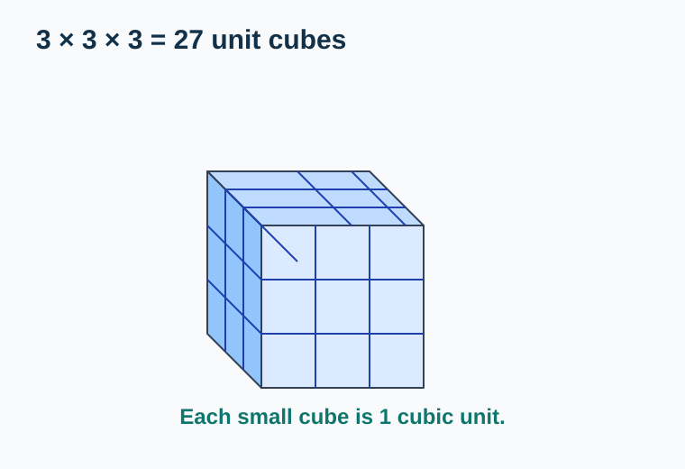
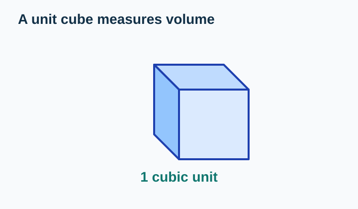
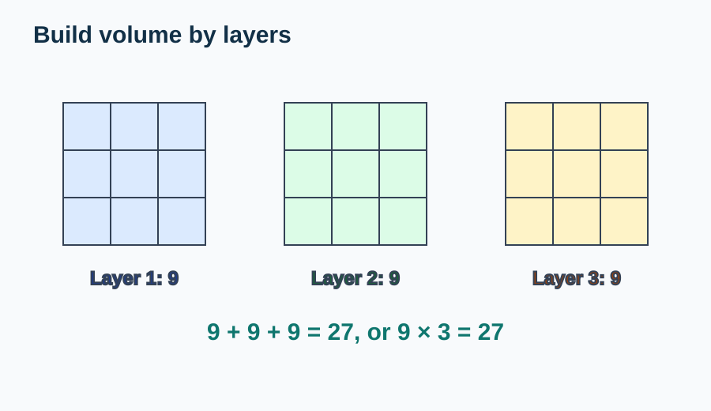
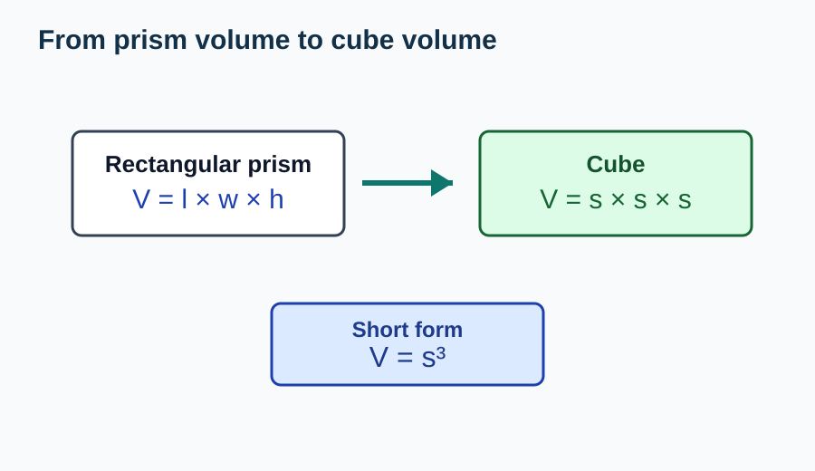
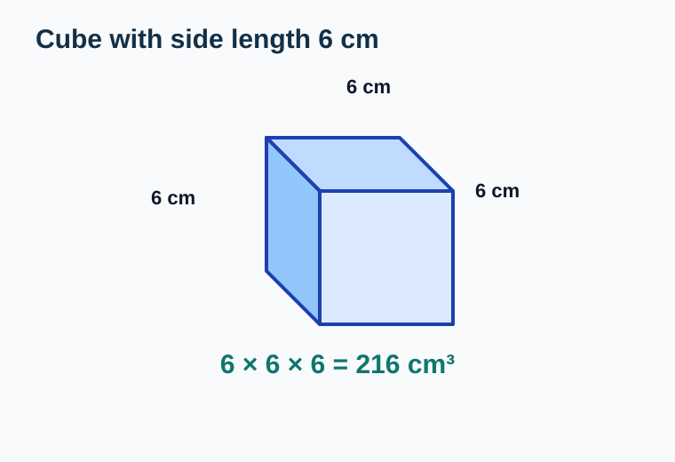
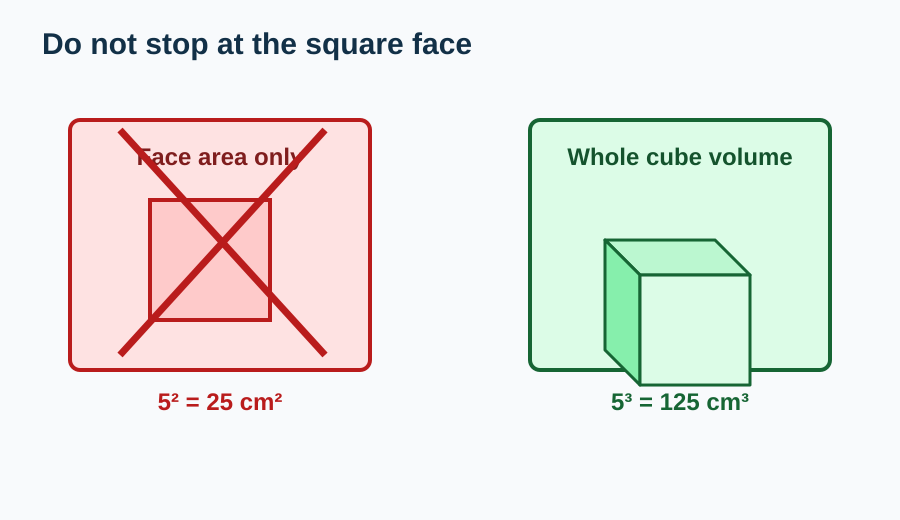

# Volume of Cubes

> [!GOAL] Learning Goal
>
> I can model cube volume with unit cubes and use side length to calculate volume.

## Estimated Time and Difficulty

| Item | Details |
| --- | --- |
| Grade | 6 |
| Subject | Mathematics |
| Quarter | 3 |
| Topic | Geometry - Lesson 3 |
| Estimated time | 35-45 minutes |
| Difficulty | Beginner |

In this lesson, you will see why a cube's volume is not just a memorized formula. It comes from counting layers of unit cubes.

## What You Should Already Know

Before starting, check these ideas:

- A **cube** has equal length, width, and height.
- **Volume** measures 3D space.
- Volume is measured in **cubic units**, such as cm³.
- A **unit cube** is one cube used as a measuring unit.
- Multiplication can count equal groups or layers.

> [!CHECK] Pre-Check / Readiness Quiz
>
> Try these before reading:
>
> 1. How many equal edges does a cube have?
> 2. What unit is better for volume: cm² or cm³?
> 3. What is 3 × 3 × 3?
> 4. If one layer has 9 cubes and there are 3 layers, how many cubes are there?
>
> Use the interactive lab below to check and practice.

```interactive
{
  "spec": "interactives/cube-volume-lab.json",
  "mode": "auto",
  "height": 760,
  "title": "Cube Volume Lab"
}
```

## Key Vocabulary

| Term | Meaning | Visual or Symbolic Cue | Example |
| --- | --- | --- | --- |
| Cube | A 3D shape with 6 equal square faces | all edges equal | A number cube |
| Unit cube | A cube used as one volume unit | 1 cubic unit | One 1 cm by 1 cm by 1 cm cube |
| Volume | The amount of 3D space inside or occupied by a shape | cubic units | 27 cm³ |
| Side length | The length of one edge of a cube | s | A cube with side 4 cm |
| Cubic unit | A unit for volume | cm³, m³ | cubic centimeter |
| Exponent | A small raised number showing repeated multiplication | s³ | 4³ = 4 × 4 × 4 |

## Try Before You Read

Look at this cube made from smaller cubes.



**Question:** How many unit cubes are in the whole cube?

<details>
<summary>Reveal Thinking Guide</summary>

Count by layers:

1. How many cubes are in the front layer?
2. How many identical layers are there?
3. Multiply cubes per layer by number of layers.

</details>

<details>
<summary>Reveal Explanation</summary>

Each layer has \(3 \times 3 = 9\) unit cubes. There are 3 layers.

$$9 \times 3 = 27$$

The cube contains **27 unit cubes**, so its volume is **27 cubic units**.

</details>

## Visual Introduction

A unit cube measures one cubic unit of space.



When unit cubes fill a larger cube with no gaps or overlaps, the number of unit cubes is the cube's volume.



## Main Concept Explanation

### 1. Volume Counts Unit Cubes

For a cube, every edge has the same length. If the side length is 4 units, then:

- the length is 4 units
- the width is 4 units
- the height is 4 units

The cube is filled by unit cubes in rows, columns, and layers.

### 2. Why the Formula Works

For any rectangular prism:

$$V = l \times w \times h$$

For a cube, the length, width, and height are all the same side length \(s\):

$$V = s \times s \times s$$

This can be written as:

$$V = s^3$$



### 3. Always Use Cubic Units

If the side length is measured in centimeters, the volume is measured in cubic centimeters.

Example:

$$5 \text{ cm} \times 5 \text{ cm} \times 5 \text{ cm} = 125 \text{ cm}^3$$

Do not write 125 cm or 125 cm². Volume needs cubic units.

## Rule Box / Formula Box

> [!IMPORTANT] Cube Volume Rule
>
> For a cube with side length \(s\):
>
> $$V = s^3$$
>
> This means:
>
> $$V = s \times s \times s$$
>
> **Warning:** \(s^2\) gives the area of one square face. Cube volume needs \(s^3\).

## Worked Examples

### Example 1: Model with Unit Cubes

**Problem:** A cube is 3 units on each edge. How many unit cubes fill it?


**Solution:**

1. One layer has \(3 \times 3 = 9\) unit cubes.
2. There are 3 layers.
3. Total unit cubes:

$$9 \times 3 = 27$$

**Final answer:** \(27\) cubic units

**Why it works:** Volume counts how many unit cubes fill the 3D space.

### Example 2: Use Side Length

**Problem:** A cube has side length 6 cm. Find its volume.



**Solution:**

1. Use the cube volume formula:

$$V = s^3$$

2. Substitute \(s = 6\):

$$V = 6^3$$

3. Multiply:

$$6 \times 6 \times 6 = 216$$

**Final answer:** \(216 \text{ cm}^3\)

**Why it works:** A cube with side 6 cm has 6 rows, 6 columns, and 6 layers of cubic centimeters.

## Guided Practice with Revealable Hints

### Guided Practice 1

**Problem:** A cube has side length 2 units. What is its volume?

<details>
<summary>Hint 1</summary>

Use \(V = s \times s \times s\).

</details>

<details>
<summary>Hint 2</summary>

Substitute \(s = 2\): \(2 \times 2 \times 2\).

</details>

<details>
<summary>Show Solution</summary>

$$2 \times 2 \times 2 = 8$$

The volume is **8 cubic units**.

</details>

### Guided Practice 2

**Problem:** A cube has side length 4 cm. What is its volume?

<details>
<summary>Hint 1</summary>

The answer should be in cm³.

</details>

<details>
<summary>Hint 2</summary>

Compute \(4^3 = 4 \times 4 \times 4\).

</details>

<details>
<summary>Show Solution</summary>

$$4 \times 4 \times 4 = 64$$

The volume is **64 cm³**.

</details>

### Guided Practice 3

**Problem:** A cube is made of 5 layers. Each layer has 25 unit cubes. What is the volume?

<details>
<summary>Hint 1</summary>

Volume is total number of unit cubes.

</details>

<details>
<summary>Hint 2</summary>

Multiply cubes per layer by number of layers.

</details>

<details>
<summary>Show Solution</summary>

$$25 \times 5 = 125$$

The volume is **125 cubic units**.

</details>

## Mini-Quiz with Answer Checking

Use the Cube Volume Lab near the top of the lesson for instant checking. Try the mini-quiz after reading the examples.

## Independent Practice

Find the volume of each cube.

1. Side length 1 cm
2. Side length 3 cm
3. Side length 5 cm
4. Side length 7 m
5. Side length 10 cm
6. A cube has 16 unit cubes in each layer and 4 layers.
7. A cube has side length 8 units.
8. A cube has side length 12 cm.

## Answer Key with Explanations

<details>
<summary>Reveal Independent Practice Answers</summary>

1. **1 cm³.** \(1 \times 1 \times 1 = 1\).
2. **27 cm³.** \(3 \times 3 \times 3 = 27\).
3. **125 cm³.** \(5 \times 5 \times 5 = 125\).
4. **343 m³.** \(7 \times 7 \times 7 = 343\).
5. **1000 cm³.** \(10 \times 10 \times 10 = 1000\).
6. **64 cubic units.** \(16 \times 4 = 64\).
7. **512 cubic units.** \(8 \times 8 \times 8 = 512\).
8. **1728 cm³.** \(12 \times 12 \times 12 = 1728\).

</details>

## Misconception Alerts

> [!WARNING] Misconception 1: "Cube volume is side × side."
>
> That finds the area of one face. Volume needs three dimensions: side × side × side.

> [!WARNING] Misconception 2: "The unit is cm² because cube faces are squares."
>
> The faces are square, but volume measures inside 3D space. Use cm³.

> [!WARNING] Misconception 3: "3³ means 3 × 3."
>
> \(3^3\) means \(3 \times 3 \times 3\), which equals 27.

> [!WARNING] Misconception 4: "A larger cube only grows by adding one row."
>
> Increasing side length changes length, width, and height, so volume grows quickly.

## Error Analysis

Fictional student solution:

> "A cube has side length 5 cm, so its volume is \(5^2 = 25 \text{ cm}^2\)."



**What mistake did the student make? How would you fix it?**

<details>
<summary>Reveal Mistake</summary>

The student found the area of one square face, not the volume of the cube. They used \(s^2\) instead of \(s^3\).

</details>

<details>
<summary>Reveal Correct Solution</summary>

For volume:

$$V = s^3 = 5^3 = 5 \times 5 \times 5 = 125$$

The volume is **125 cm³**.

</details>

## Self-Explanation Prompts

Write a short answer for each prompt:

1. Why does cube volume use three factors of the side length?
2. How is \(s^2\) different from \(s^3\)?
3. What does each unit cube represent?
4. Why should a cube volume answer use cubic units?

<details>
<summary>Reveal Sample Responses</summary>

1. A cube has length, width, and height, and all three are equal to the side length.
2. \(s^2\) measures one square face, while \(s^3\) measures the whole 3D cube.
3. Each unit cube represents one cubic unit of space.
4. Volume measures 3D space, so the unit must be cubic.

</details>

## Extension Challenge

**Optional challenge:** A cube has volume 216 cm³. What is its side length?

<details>
<summary>Hint</summary>

Find a number that multiplies by itself three times to make 216.

</details>

<details>
<summary>Full Solution</summary>

Try common cube numbers:

$$6 \times 6 \times 6 = 216$$

So the side length is **6 cm**.

</details>

## Mastery Checklist

Check whether each statement is true for you:

- I can describe a cube using equal side lengths.
- I can model cube volume with unit cubes.
- I can count volume by layers.
- I can use \(V = s^3\).
- I can calculate volume from side length.
- I can write volume answers with cubic units.
- I can avoid confusing face area with volume.

> [!PRACTICE] How to Use the Exams
>
> Use the practice exam for basic cube-volume calculations. Use the assessment exam to check whether you can model, calculate, and explain cube volume from side length.

## Final Summary

Cube volume counts how many unit cubes fill the cube.

For a cube with side length \(s\):

$$V = s^3 = s \times s \times s$$

The most important mistake to avoid is using \(s^2\). \(s^2\) is for the area of one square face. Cube volume needs length, width, and height, so it uses \(s^3\) and cubic units.
