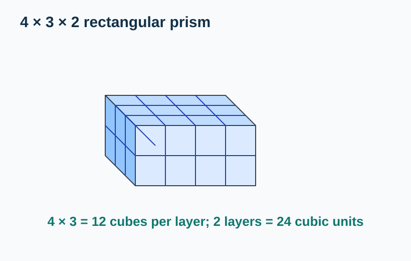
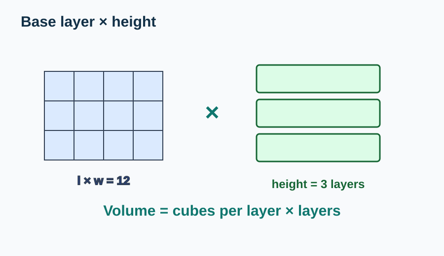
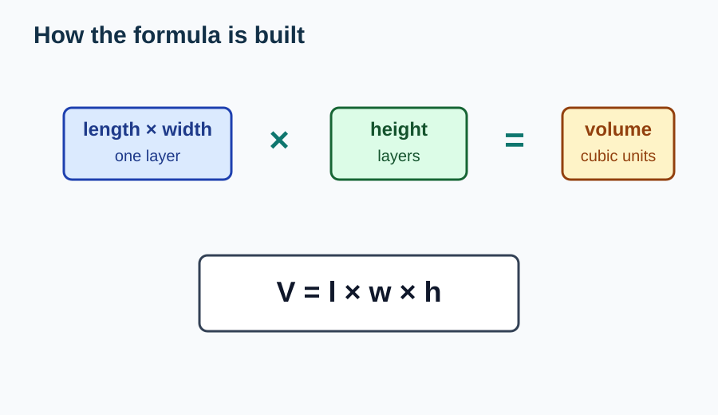
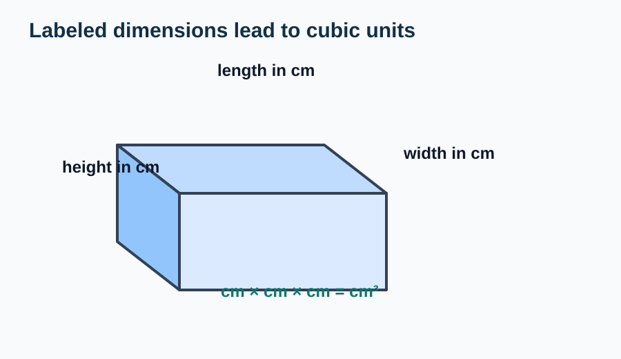
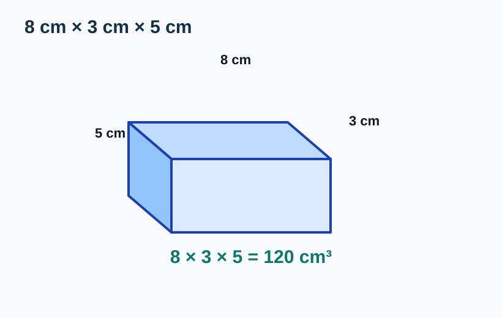
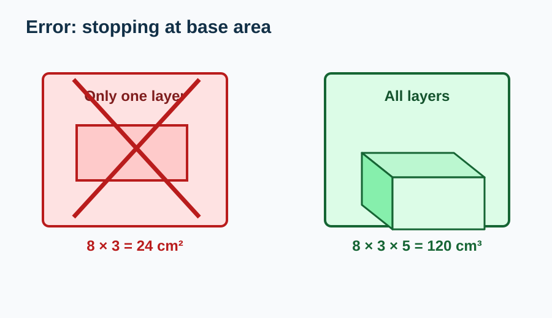

# Volume of Rectangular Prisms

> [!GOAL] Learning Goal
>
> I can derive and use \(V = l \times w \times h\) to find the volume of rectangular prisms.

## Estimated Time and Difficulty

| Item | Details |
| --- | --- |
| Grade | 6 |
| Subject | Mathematics |
| Quarter | 3 |
| Topic | Geometry - Lesson 4 |
| Estimated time | 40-50 minutes |
| Difficulty | Moderate |

A rectangular prism is like a box. To find how much space it holds, count how many unit cubes fit inside.

## What You Should Already Know

- Volume measures 3D space.
- Volume uses cubic units, such as cm³ or m³.
- A rectangle's area is \(l \times w\).
- A rectangular prism has length, width, and height.
- Layers of unit cubes can be counted with multiplication.

> [!CHECK] Pre-Check / Readiness Quiz
>
> Try these before reading:
>
> 1. What is the area of a rectangle that is 5 units long and 3 units wide?
> 2. Which unit fits volume: cm² or cm³?
> 3. If one layer has 12 cubes and there are 4 layers, how many cubes are there?
> 4. A box has length, width, and what third dimension?

```interactive
{
  "spec": "interactives/prism-volume-lab.json",
  "mode": "auto",
  "height": 760,
  "title": "Rectangular Prism Volume Lab"
}
```

## Key Vocabulary

| Term | Meaning | Visual or Symbolic Cue | Example |
| --- | --- | --- | --- |
| Rectangular prism | A 3D shape with rectangular faces | box shape | Shoebox |
| Length | How long the prism is | \(l\) | 8 cm |
| Width | How wide the prism is | \(w\) | 3 cm |
| Height | How tall the prism is | \(h\) | 5 cm |
| Base layer | One rectangular layer of unit cubes | \(l \times w\) | 4 by 3 layer |
| Volume | Amount of 3D space | cubic units | 120 cm³ |

## Try Before You Read

Look at the prism made from unit cubes.



**Question:** If one layer has \(4 \times 3 = 12\) cubes and there are 2 layers, how many unit cubes are in the prism?

<details>
<summary>Reveal Thinking Guide</summary>

Count one rectangular layer first. Then multiply by the number of layers.

</details>

<details>
<summary>Reveal Explanation</summary>

One layer has 12 cubes. There are 2 layers.

$$12 \times 2 = 24$$

The prism has volume **24 cubic units**.

</details>

## Visual Introduction

A rectangular prism's volume can be built from layers.



The base layer is a rectangle:

$$\text{base layer} = l \times w$$

Then stack that layer \(h\) times:

$$V = l \times w \times h$$

## Main Concept Explanation

### 1. Derive the Formula

For a rectangular prism:

- length tells how many unit cubes fit in each row
- width tells how many rows fit in one layer
- height tells how many layers are stacked

So:

$$V = \text{cubes per layer} \times \text{number of layers}$$

Since cubes per layer is \(l \times w\):

$$V = l \times w \times h$$



### 2. Use Labeled Units

If the lengths are measured in centimeters, the volume is in cubic centimeters.



Example:

$$8 \text{ cm} \times 3 \text{ cm} \times 5 \text{ cm} = 120 \text{ cm}^3$$

### 3. Check the Answer

Ask:

- Did I multiply three dimensions?
- Did I use cubic units?
- Does the answer represent space inside the prism?

## Rule Box / Formula Box

> [!IMPORTANT] Rectangular Prism Volume Rule
>
> $$V = l \times w \times h$$
>
> \(l\) = length, \(w\) = width, \(h\) = height.
>
> **Meaning:** Find cubes in one layer, then multiply by the number of layers.
>
> **Warning:** \(l \times w\) alone is only the base area, not the full volume.

## Worked Examples

### Example 1: Use Unit-Cube Layers

**Problem:** A rectangular prism is 4 units long, 3 units wide, and 2 units high. Find the volume.


**Solution:**

1. Find cubes in one layer:

$$4 \times 3 = 12$$

2. Multiply by the number of layers:

$$12 \times 2 = 24$$

**Final answer:** 24 cubic units

### Example 2: Use the Formula

**Problem:** A box is 8 cm long, 3 cm wide, and 5 cm high. Find its volume.



**Solution:**

$$V = l \times w \times h$$

$$V = 8 \times 3 \times 5$$

$$V = 24 \times 5 = 120$$

**Final answer:** \(120 \text{ cm}^3\)

## Guided Practice with Revealable Hints

### Guided Practice 1

**Problem:** A prism is 5 units long, 2 units wide, and 3 units high. Find the volume.

<details><summary>Hint 1</summary>Use \(V = l \times w \times h\).</details>
<details><summary>Hint 2</summary>Compute \(5 \times 2 \times 3\).</details>
<details><summary>Show Solution</summary>\(5 \times 2 \times 3 = 30\). The volume is **30 cubic units**.</details>

### Guided Practice 2

**Problem:** A box is 10 cm long, 4 cm wide, and 6 cm high. Find the volume.

<details><summary>Hint 1</summary>The answer should use cm³.</details>
<details><summary>Hint 2</summary>Compute \(10 \times 4 \times 6\).</details>
<details><summary>Show Solution</summary>\(10 \times 4 \times 6 = 240\). The volume is **240 cm³**.</details>

### Guided Practice 3

**Problem:** One layer of a prism has 18 unit cubes. The prism has 5 layers. Find the volume.

<details><summary>Hint 1</summary>Volume is cubes per layer times number of layers.</details>
<details><summary>Hint 2</summary>Compute \(18 \times 5\).</details>
<details><summary>Show Solution</summary>\(18 \times 5 = 90\). The volume is **90 cubic units**.</details>

## Mini-Quiz with Answer Checking

Use the Rectangular Prism Volume Lab near the top of the lesson for instant checking.

## Independent Practice

Find each volume.

1. \(4 \times 2 \times 3\) rectangular prism
2. \(6 \text{ cm} \times 5 \text{ cm} \times 2 \text{ cm}\)
3. \(9 \text{ m} \times 3 \text{ m} \times 4 \text{ m}\)
4. One layer has 20 cubes, and there are 6 layers.
5. A box is 12 cm long, 4 cm wide, and 5 cm high.
6. A prism has base area 35 square units and height 8 units.
7. A storage bin is 7 dm long, 6 dm wide, and 3 dm high.
8. A rectangular aquarium is 30 cm long, 10 cm wide, and 20 cm high.

## Answer Key with Explanations

<details>
<summary>Reveal Independent Practice Answers</summary>

1. **24 cubic units.** \(4 \times 2 \times 3 = 24\).
2. **60 cm³.** \(6 \times 5 \times 2 = 60\).
3. **108 m³.** \(9 \times 3 \times 4 = 108\).
4. **120 cubic units.** \(20 \times 6 = 120\).
5. **240 cm³.** \(12 \times 4 \times 5 = 240\).
6. **280 cubic units.** \(35 \times 8 = 280\).
7. **126 dm³.** \(7 \times 6 \times 3 = 126\).
8. **6000 cm³.** \(30 \times 10 \times 20 = 6000\).

</details>

## Misconception Alerts

> [!WARNING] Misconception 1: "Length × width is volume."
>
> Length × width is only the area of one layer. Multiply by height to get volume.

> [!WARNING] Misconception 2: "The answer should use square units."
>
> Volume uses cubic units because it measures 3D space.

> [!WARNING] Misconception 3: "Order matters in multiplication."
>
> You can multiply length, width, and height in any order, but you need all three dimensions.

> [!WARNING] Misconception 4: "Height is optional."
>
> Height tells how many layers are stacked, so it is required for volume.

## Error Analysis

Fictional student solution:

> "The box is 8 cm long and 3 cm wide, so its volume is \(8 \times 3 = 24 \text{ cm}^2\)."



**What mistake did the student make? How would you fix it?**

<details>
<summary>Reveal Mistake</summary>

The student found the base area only. They also used square units instead of cubic units.

</details>

<details>
<summary>Reveal Correct Solution</summary>

Include height:

$$8 \times 3 \times 5 = 120$$

The volume is **120 cm³**.

</details>

## Self-Explanation Prompts

1. Why does \(l \times w\) represent one layer?
2. Why does multiplying by height find the full volume?
3. How can you tell whether to use square units or cubic units?
4. What clue in a word problem tells you it is asking for volume?

<details>
<summary>Reveal Sample Responses</summary>

1. \(l \times w\) counts the rows and columns of unit cubes in one rectangular layer.
2. Height tells how many equal layers are stacked.
3. Square units are for area; cubic units are for 3D volume.
4. Words like space inside, capacity of a box, or length-width-height suggest volume.

</details>

## Extension Challenge

**Optional challenge:** A rectangular prism has volume 180 cm³. Its length is 9 cm and width is 4 cm. What is its height?

<details><summary>Hint</summary>Use \(180 = 9 \times 4 \times h\).</details>
<details><summary>Full Solution</summary>\(9 \times 4 = 36\). Then \(180 \div 36 = 5\). The height is **5 cm**.</details>

## Mastery Checklist

- I can model prism volume with unit cubes.
- I can find cubes in one base layer.
- I can explain why \(V = l \times w \times h\).
- I can calculate prism volume from labeled dimensions.
- I can include cubic units in my answer.
- I can avoid using base area as the final volume.

> [!PRACTICE] How to Use the Exams
>
> Use the practice exam for direct volume calculations. Use the assessment exam to check whether you can solve labeled prism tasks and explain the formula.

## Final Summary

Rectangular prism volume comes from unit-cube layers.

$$V = l \times w \times h$$

The base layer has \(l \times w\) cubes. The height tells how many layers are stacked. The biggest mistake to avoid is stopping at base area; volume needs all three dimensions and cubic units.
