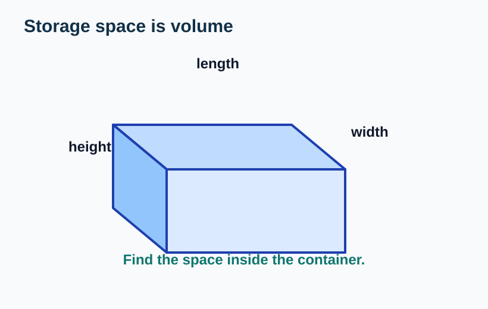
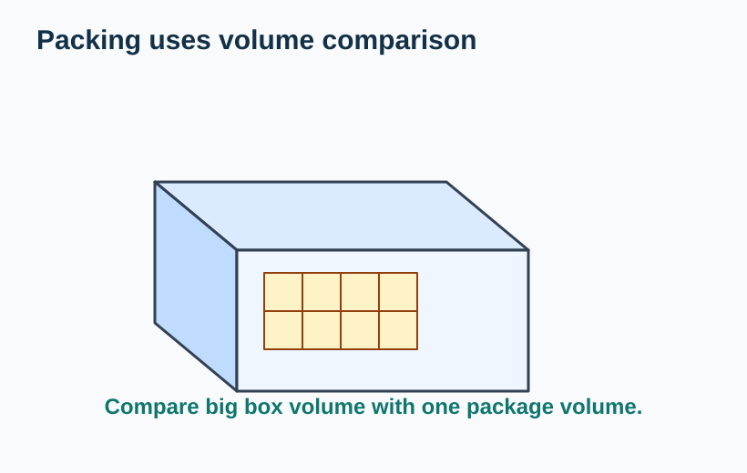
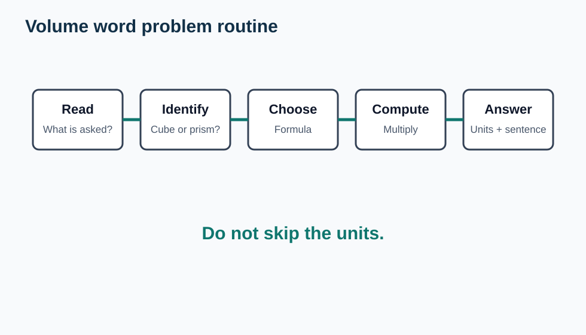
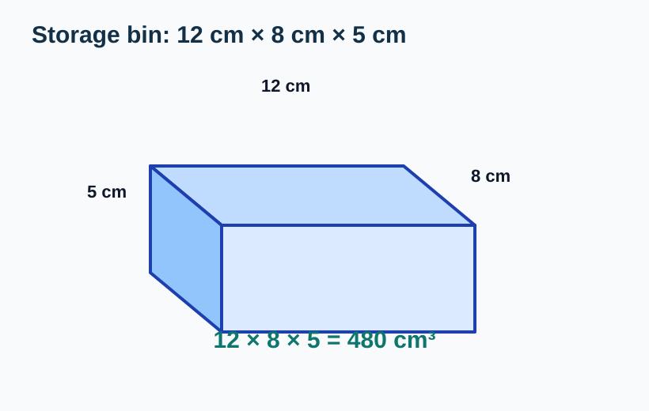
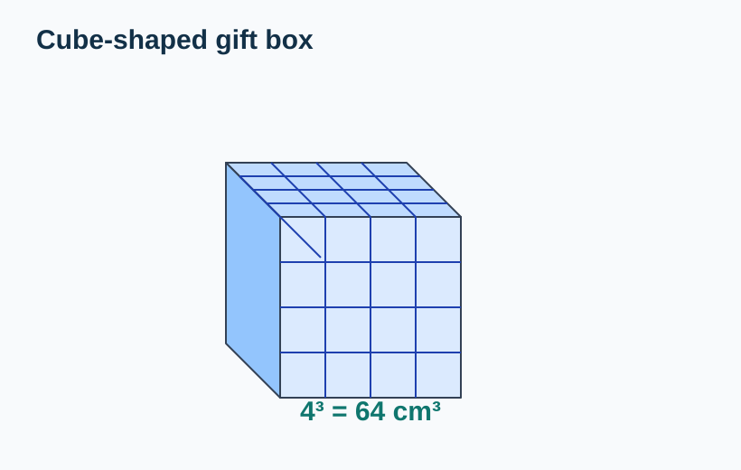
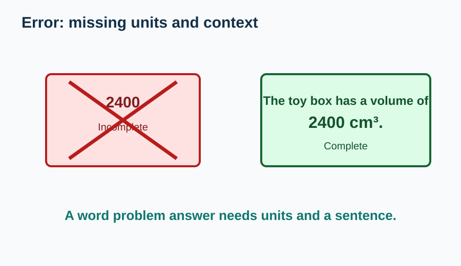

# Volume Word Problems

> [!GOAL] Learning Goal
>
> I can apply cube and rectangular prism volume to storage and packing situations, then write complete solutions with units.

## Estimated Time and Difficulty

| Item | Details |
| --- | --- |
| Grade | 6 |
| Subject | Mathematics |
| Quarter | 3 |
| Topic | Geometry - Lesson 5 |
| Estimated time | 40-50 minutes |
| Difficulty | Moderate |

In earlier lessons, you calculated volume from dimensions. In this lesson, the challenge is deciding what the problem is asking before you calculate.

## What You Should Already Know

- Cube volume: \(V = s^3\)
- Rectangular prism volume: \(V = l \times w \times h\)
- Volume answers use cubic units such as cm³, m³, or cubic units.
- A word problem may include extra information.
- A complete solution includes formula, substitution, calculation, and units.

> [!CHECK] Pre-Check / Readiness Quiz
>
> Try these before reading:
>
> 1. A cube has side length 4 cm. What is its volume?
> 2. A box is 5 cm by 3 cm by 2 cm. What is its volume?
> 3. Which unit fits volume: cm² or cm³?
> 4. What should you write after a numerical volume answer?

```interactive
{
  "spec": "interactives/volume-word-problems-lab.json",
  "mode": "auto",
  "height": 760,
  "title": "Volume Word Problems Lab"
}
```

## Key Vocabulary

| Term | Meaning | Visual or Symbolic Cue | Example |
| --- | --- | --- | --- |
| Storage | Keeping items inside a space or container | box, bin, cabinet | A storage bin holds books |
| Packing | Arranging objects inside a container | fit small boxes inside big box | Packing cubes in a carton |
| Dimensions | Measurements of length, width, and height | \(l, w, h\) | 12 cm by 8 cm by 5 cm |
| Capacity in context | How much space a container can hold | volume of inside space | 480 cm³ |
| Complete solution | Formula, substitution, calculation, and unit | organized work | \(V = 10 \times 4 \times 3 = 120\text{ cm}^3\) |
| Reasonableness check | Making sure the answer fits the situation | estimate or compare | Bigger boxes should have bigger volume |

## Try Before You Read

Look at this storage situation.



**Question:** What information do you need to find how much space is inside the box?

<details>
<summary>Reveal Thinking Guide</summary>

Ask:

1. What shape is the container?
2. What dimensions are given?
3. Which volume formula matches the shape?
4. What unit should the answer use?

</details>

<details>
<summary>Reveal Explanation</summary>

The box is a rectangular prism. To find its volume, use length, width, and height:

$$V = l \times w \times h$$

The answer should use cubic units.

</details>

## Visual Introduction

Storage and packing problems are volume problems when they ask how much 3D space is available or used.

| Storage | Packing |
| --- | --- |
|  |  |
| Find space inside a container | Find how many objects fit or how much space they use |

Use a routine instead of guessing.



## Main Concept Explanation

### 1. Identify the Shape

Most Grade 6 volume word problems in this sequence use:

- a **cube**, where all side lengths are equal
- a **rectangular prism**, where length, width, and height may be different

Choose the formula after naming the shape.

### 2. Organize the Given Information

Write the useful measurements:

- \(l =\) length
- \(w =\) width
- \(h =\) height
- \(s =\) side length for a cube

Ignore extra information unless the question needs it.

### 3. Write a Complete Solution

A complete solution should show:

1. Formula
2. Substitution
3. Calculation
4. Final answer with cubic units
5. A short sentence answering the question

## Rule Box / Formula Box

> [!IMPORTANT] Volume Word Problem Routine
>
> 1. **Read:** What is being asked?
> 2. **Identify:** Cube or rectangular prism?
> 3. **Choose:** \(V = s^3\) or \(V = l \times w \times h\)
> 4. **Compute:** Multiply carefully.
> 5. **Answer:** Write a sentence with cubic units.
>
> **Warning:** A number without units is not a complete volume answer.

## Worked Examples

### Example 1: Storage Bin

**Problem:** A storage bin is 12 cm long, 8 cm wide, and 5 cm high. What is the volume of the bin?



**Solution:**

The bin is a rectangular prism.

$$V = l \times w \times h$$

$$V = 12 \times 8 \times 5$$

$$V = 96 \times 5 = 480$$

**Final answer:** The storage bin has a volume of **480 cm³**.

**Why it works:** The formula counts how many cubic centimeters fit inside the rectangular prism.

### Example 2: Packing Cubes

**Problem:** A cube-shaped gift box has side length 4 cm. Each small cube takes 1 cm³ of space. How much space is inside the gift box?



**Solution:**

The gift box is a cube.

$$V = s^3$$

$$V = 4^3 = 4 \times 4 \times 4 = 64$$

**Final answer:** The gift box has **64 cm³** of space.

**Why it works:** A cube has equal length, width, and height, so the side length is used three times.

## Guided Practice with Revealable Hints

### Guided Practice 1

**Problem:** A lunch box is 15 cm long, 10 cm wide, and 6 cm high. Find its volume.

<details><summary>Hint 1</summary>The lunch box is a rectangular prism.</details>
<details><summary>Hint 2</summary>Use \(15 \times 10 \times 6\).</details>
<details><summary>Show Solution</summary>\(15 \times 10 \times 6 = 900\). The volume is **900 cm³**.</details>

### Guided Practice 2

**Problem:** A cube container has side length 7 cm. Find its volume.

<details><summary>Hint 1</summary>Use the cube formula.</details>
<details><summary>Hint 2</summary>Compute \(7^3 = 7 \times 7 \times 7\).</details>
<details><summary>Show Solution</summary>\(7 \times 7 \times 7 = 343\). The volume is **343 cm³**.</details>

### Guided Practice 3

**Problem:** A carton has a base area of 30 square units and a height of 9 units. Find the volume.

<details><summary>Hint 1</summary>Volume can be base area times height.</details>
<details><summary>Hint 2</summary>Compute \(30 \times 9\).</details>
<details><summary>Show Solution</summary>\(30 \times 9 = 270\). The volume is **270 cubic units**.</details>

## Mini-Quiz with Answer Checking

Use the Volume Word Problems Lab near the top of the lesson for instant checking.

## Independent Practice

Write a complete solution with units.

1. A toy box is 20 cm long, 12 cm wide, and 10 cm high. Find its volume.
2. A cube-shaped storage container has side length 6 m. Find its volume.
3. A rectangular shelf bin is 9 dm long, 4 dm wide, and 5 dm high. Find its volume.
4. A box has base area 48 square units and height 7 units. Find its volume.
5. A packing crate is 30 cm long, 20 cm wide, and 15 cm high. Find its volume.
6. A cube-shaped block has side length 8 cm. Find its volume.
7. A cabinet compartment is 50 cm long, 30 cm wide, and 40 cm high. Find its volume.
8. A small box has volume 240 cm³, length 12 cm, and width 5 cm. Find its height.

## Answer Key with Explanations

<details>
<summary>Reveal Independent Practice Answers</summary>

1. **2400 cm³.** \(20 \times 12 \times 10 = 2400\).
2. **216 m³.** \(6^3 = 216\).
3. **180 dm³.** \(9 \times 4 \times 5 = 180\).
4. **336 cubic units.** \(48 \times 7 = 336\).
5. **9000 cm³.** \(30 \times 20 \times 15 = 9000\).
6. **512 cm³.** \(8^3 = 512\).
7. **60000 cm³.** \(50 \times 30 \times 40 = 60000\).
8. **4 cm.** \(12 \times 5 = 60\), and \(240 \div 60 = 4\).

</details>

## Misconception Alerts

> [!WARNING] Misconception 1: "Use every number in the problem."
>
> Some word problems include extra information. Use only numbers connected to the volume question.

> [!WARNING] Misconception 2: "A final number is enough."
>
> A complete answer needs units and a sentence that answers the question.

> [!WARNING] Misconception 3: "All boxes use the cube formula."
>
> Use \(s^3\) only when all side lengths are equal. Rectangular prisms use \(l \times w \times h\).

> [!WARNING] Misconception 4: "Area and volume units are interchangeable."
>
> Area uses square units. Volume uses cubic units.

## Error Analysis

Fictional student solution:

> "The toy box volume is 2400. Answer: 2400."



**What mistake did the student make? How would you fix it?**

<details>
<summary>Reveal Mistake</summary>

The calculation may be correct, but the answer is incomplete because it does not include cubic units or a sentence.

</details>

<details>
<summary>Reveal Correct Solution</summary>

If the dimensions are in centimeters, the complete answer is:

**The toy box has a volume of 2400 cm³.**

</details>

## Self-Explanation Prompts

1. How do you decide whether a word problem uses \(s^3\) or \(l \times w \times h\)?
2. Why should you label the dimensions before multiplying?
3. What makes a volume solution complete?
4. How can you check if a storage answer is reasonable?

<details>
<summary>Reveal Sample Responses</summary>

1. I use \(s^3\) for a cube and \(l \times w \times h\) for a rectangular prism.
2. Labeling helps me avoid mixing up useful and extra information.
3. It includes the formula, substitution, calculation, unit, and final sentence.
4. I compare it with the dimensions; a larger box should have a larger volume.

</details>

## Extension Challenge

**Optional challenge:** A shipping box is 40 cm long, 25 cm wide, and 20 cm high. Small cube packages have side length 5 cm. If the cubes fit perfectly, how many small cube packages can fit?

<details><summary>Hint</summary>Find the big box volume and the small cube volume, then divide.</details>
<details><summary>Full Solution</summary>The big box volume is \(40 \times 25 \times 20 = 20000\text{ cm}^3\). Each small cube has volume \(5^3 = 125\text{ cm}^3\). \(20000 \div 125 = 160\). So **160 small cube packages** can fit.</details>

## Mastery Checklist

- I can identify the shape in a volume word problem.
- I can choose \(s^3\) or \(l \times w \times h\).
- I can organize dimensions before calculating.
- I can solve storage and packing volume problems.
- I can write cubic units.
- I can write a complete final sentence.
- I can check if the answer makes sense.

> [!PRACTICE] How to Use the Exams
>
> Use the practice exam to solve basic storage and packing problems. Use the assessment exam to check whether your written solutions include formula, work, answer, and units.

## Final Summary

Volume word problems are not only about multiplying. First identify the shape and the question.

- Cube: \(V = s^3\)
- Rectangular prism: \(V = l \times w \times h\)

Always finish with a complete answer using cubic units and a sentence that fits the situation.
