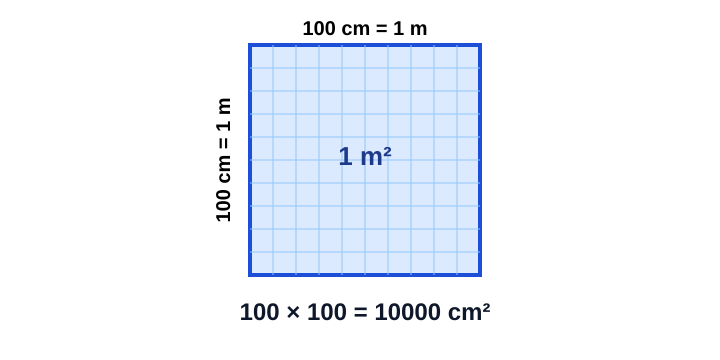
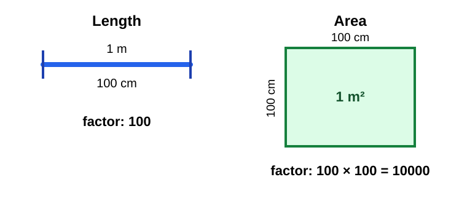
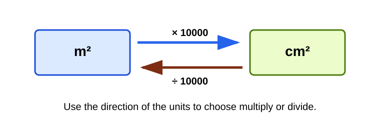
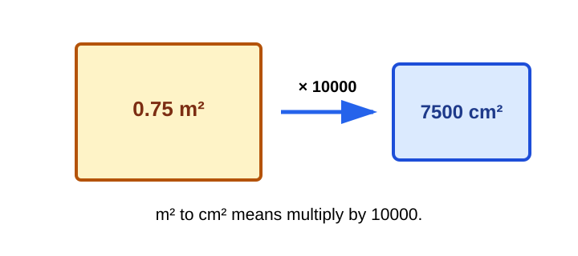
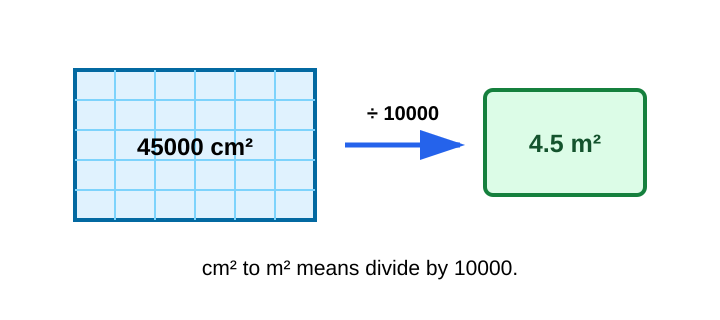
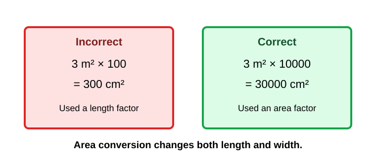

# Area Unit Conversion

> [!GOAL] Learning Goal
>
> I can convert between square centimeters and square meters and explain why area conversion uses squared units.

## Estimated Time and Difficulty

| Item | Details |
| --- | --- |
| Grade | 6 |
| Subject | Mathematics |
| Quarter | 3 |
| Topic | Geometry - Lesson 6 |
| Estimated time | 40-50 minutes |
| Difficulty | Moderate |

This lesson is about area, not length. That distinction matters because converting area uses two dimensions.

## What You Should Already Know

- Area measures the amount of flat surface covered.
- Rectangle area can be found with \(A = l \times w\).
- \(1\text{ m} = 100\text{ cm}\).
- Square centimeters are written as cm².
- Square meters are written as m².

> [!CHECK] Pre-Check / Readiness Quiz
>
> Try these before reading:
>
> 1. What does area measure: distance around, flat surface, or space inside a container?
> 2. A rectangle is 8 cm by 5 cm. What is its area?
> 3. Complete: \(1\text{ m} =\) ___ cm.
> 4. Which unit is an area unit: cm, cm², or cm³?

```interactive
{
  "spec": "interactives/area-unit-conversion-lab.json",
  "mode": "auto",
  "height": 780,
  "title": "Area Unit Conversion Lab"
}
```

## Key Vocabulary

| Term | Meaning | Visual or Symbolic Cue | Example |
| --- | --- | --- | --- |
| Area | Amount of flat surface covered | tiled surface | A tabletop covers 6000 cm² |
| Square centimeter | Area of a square 1 cm by 1 cm | 1 cm × 1 cm | small paper grid square |
| Square meter | Area of a square 1 m by 1 m | 1 m × 1 m | floor mat or wall space |
| Conversion factor | Number used to change units | multiply or divide | \(1\text{ m}^2 = 10000\text{ cm}^2\) |
| Squared unit | Unit made from two length dimensions | cm², m² | length × width |
| Scale | How much a measurement changes | 100 by 100 | meters to centimeters in two directions |

## Try Before You Read

Look at this 1-meter by 1-meter square.



**Question:** If 1 meter is 100 centimeters, why is 1 square meter not just 100 square centimeters?

<details>
<summary>Reveal Thinking Guide</summary>

Area has length and width. Ask:

1. How many centimeter rows fit across 1 meter?
2. How many centimeter columns fit up 1 meter?
3. How many 1 cm² squares are in the whole grid?

</details>

<details>
<summary>Reveal Explanation</summary>

There are 100 centimeters across and 100 centimeters up. That makes:

$$100 \times 100 = 10000$$

So, \(1\text{ m}^2 = 10000\text{ cm}^2\).

</details>

## Visual Introduction

Length conversion changes one direction. Area conversion changes two directions.



For area:

$$1\text{ m}^2 = 1\text{ m} \times 1\text{ m}$$

Since \(1\text{ m} = 100\text{ cm}\):

$$1\text{ m}^2 = 100\text{ cm} \times 100\text{ cm} = 10000\text{ cm}^2$$

## Main Concept Explanation

### 1. Area Units Come From Two Lengths

When you multiply length by width, both measurements bring a unit.

Example:

$$30\text{ cm} \times 20\text{ cm} = 600\text{ cm}^2$$

The unit is cm² because centimeters were used in two directions.

### 2. Convert Square Meters to Square Centimeters

Use:

$$1\text{ m}^2 = 10000\text{ cm}^2$$

To change m² to cm², multiply by 10000.

Example:

$$3\text{ m}^2 = 3 \times 10000 = 30000\text{ cm}^2$$

### 3. Convert Square Centimeters to Square Meters

To change cm² to m², divide by 10000.

Example:

$$25000\text{ cm}^2 = 25000 \div 10000 = 2.5\text{ m}^2$$



## Rule Box / Formula Box

> [!IMPORTANT] Area Conversion Rule
>
> \(1\text{ m}^2 = 10000\text{ cm}^2\)
>
> - m² to cm²: multiply by 10000
> - cm² to m²: divide by 10000
>
> **Why 10000?** A square meter is 100 cm wide and 100 cm tall, so \(100 \times 100 = 10000\).
>
> **Warning:** Do not use 100 for area conversion. The factor 100 is for length, not area.

## Worked Examples

### Example 1: Poster Area

**Problem:** A poster has an area of 0.75 m². What is its area in square centimeters?



**Solution:**

Convert m² to cm², so multiply by 10000.

$$0.75\text{ m}^2 = 0.75 \times 10000$$

$$0.75\text{ m}^2 = 7500\text{ cm}^2$$

**Final answer:** The poster area is **7500 cm²**.

**Why it works:** Each square meter contains 10000 square centimeters, so 0.75 of a square meter contains 0.75 of 10000 square centimeters.

### Example 2: Floor Tile Area

**Problem:** A small tiled area is 45000 cm². What is the area in square meters?



**Solution:**

Convert cm² to m², so divide by 10000.

$$45000\text{ cm}^2 = 45000 \div 10000$$

$$45000\text{ cm}^2 = 4.5\text{ m}^2$$

**Final answer:** The tiled area is **4.5 m²**.

**Why it works:** Square centimeters are smaller than square meters, so the number becomes smaller when converting to m².

## Guided Practice with Revealable Hints

### Guided Practice 1

**Problem:** Convert \(2\text{ m}^2\) to cm².

<details><summary>Hint 1</summary>You are converting from the larger area unit to the smaller area unit.</details>
<details><summary>Hint 2</summary>Multiply \(2\) by \(10000\).</details>
<details><summary>Show Solution</summary>\(2 \times 10000 = 20000\). So, \(2\text{ m}^2 = 20000\text{ cm}^2\).</details>

### Guided Practice 2

**Problem:** Convert \(60000\text{ cm}^2\) to m².

<details><summary>Hint 1</summary>You are converting from the smaller area unit to the larger area unit.</details>
<details><summary>Hint 2</summary>Divide \(60000\) by \(10000\).</details>
<details><summary>Show Solution</summary>\(60000 \div 10000 = 6\). So, \(60000\text{ cm}^2 = 6\text{ m}^2\).</details>

### Guided Practice 3

**Problem:** A bulletin board covers \(1.2\text{ m}^2\). Convert this area to cm².

<details><summary>Hint 1</summary>The unit is m², so convert to cm² by multiplying.</details>
<details><summary>Hint 2</summary>Compute \(1.2 \times 10000\).</details>
<details><summary>Show Solution</summary>\(1.2 \times 10000 = 12000\). The bulletin board covers **12000 cm²**.</details>

## Mini-Quiz with Answer Checking

Use the Area Unit Conversion Lab near the top of the lesson for instant checking.

## Independent Practice

Convert each area. Show the operation and the final unit.

1. \(5\text{ m}^2\) to cm²
2. \(0.4\text{ m}^2\) to cm²
3. \(30000\text{ cm}^2\) to m²
4. \(12500\text{ cm}^2\) to m²
5. A small rug has area \(1.8\text{ m}^2\). Convert to cm².
6. A tabletop has area \(9000\text{ cm}^2\). Convert to m².
7. A square panel is 2 m by 2 m. Find its area in m² and cm².
8. Explain why \(1\text{ m}^2\) equals \(10000\text{ cm}^2\), not \(100\text{ cm}^2\).

## Answer Key with Explanations

<details>
<summary>Reveal Independent Practice Answers</summary>

1. **50000 cm².** \(5 \times 10000 = 50000\).
2. **4000 cm².** \(0.4 \times 10000 = 4000\).
3. **3 m².** \(30000 \div 10000 = 3\).
4. **1.25 m².** \(12500 \div 10000 = 1.25\).
5. **18000 cm².** \(1.8 \times 10000 = 18000\).
6. **0.9 m².** \(9000 \div 10000 = 0.9\).
7. **4 m² and 40000 cm².** \(2 \times 2 = 4\), then \(4 \times 10000 = 40000\).
8. **Area uses two dimensions.** Since 1 m is 100 cm in length and 100 cm in width, \(100 \times 100 = 10000\) square centimeters fit in 1 square meter.

</details>

## Misconception Alerts

> [!WARNING] Misconception 1: "Use 100 for every meter-to-centimeter conversion."
>
> Use 100 for length. Use 10000 for area because area has two dimensions.

> [!WARNING] Misconception 2: "cm² and cm are almost the same unit."
>
> cm measures length. cm² measures area. They answer different questions.

> [!WARNING] Misconception 3: "The larger unit should always have the larger number."
>
> The same area has a smaller number in m² and a larger number in cm² because square centimeters are much smaller.

> [!WARNING] Misconception 4: "A square meter is a line of 100 square centimeters."
>
> A square meter is a 100-by-100 grid of square centimeters, not one row.

## Error Analysis



**Incorrect student solution:**

Convert \(3\text{ m}^2\) to cm².

Student work: \(3 \times 100 = 300\text{ cm}^2\)

**Question:** What mistake did the student make? How would you fix it?

<details>
<summary>Reveal Mistake</summary>

The student used the length conversion factor, \(1\text{ m} = 100\text{ cm}\), but the problem is about area.

</details>

<details>
<summary>Reveal Correct Solution</summary>

Use \(1\text{ m}^2 = 10000\text{ cm}^2\).

$$3\text{ m}^2 = 3 \times 10000 = 30000\text{ cm}^2$$

</details>

## Self-Explanation Prompts

Use these prompts to check whether the rule makes sense to you.

1. In your own words, explain why square-unit conversion uses \(100 \times 100\).
2. How can you tell whether to multiply or divide by 10000?
3. What clue tells you that a problem is about area instead of length?
4. Why does the numerical value get smaller when converting cm² to m²?

<details>
<summary>Reveal Sample Responses</summary>

1. Area has two directions, so meters change to centimeters in both length and width.
2. Multiply when going from m² to cm². Divide when going from cm² to m².
3. Look for words like area, surface, cover, square centimeters, or square meters.
4. Square meters are larger units, so fewer of them are needed to describe the same area.

</details>

## Extension Challenge

**Optional challenge:** A wall section is 2.5 m long and 1.8 m high. Find its area in square meters and in square centimeters.

<details>
<summary>Reveal Hint</summary>

First find the area in m² using length times height. Then convert m² to cm².

</details>

<details>
<summary>Reveal Full Solution</summary>

Area in square meters:

$$2.5 \times 1.8 = 4.5\text{ m}^2$$

Convert to square centimeters:

$$4.5 \times 10000 = 45000\text{ cm}^2$$

The wall section has area **4.5 m²**, or **45000 cm²**.

</details>

## Mastery Checklist

Check each statement when you can do it confidently.

- [ ] I can explain what area measures.
- [ ] I can identify cm² and m² as area units.
- [ ] I can explain why \(1\text{ m}^2 = 10000\text{ cm}^2\).
- [ ] I can multiply by 10000 to convert m² to cm².
- [ ] I can divide by 10000 to convert cm² to m².
- [ ] I can include the correct squared unit in my final answer.
- [ ] I can catch the mistake of using 100 instead of 10000 for area.

## Final Summary

Area measures flat surface, so it uses square units. The key conversion is:

$$1\text{ m}^2 = 10000\text{ cm}^2$$

Multiply by 10000 to convert m² to cm². Divide by 10000 to convert cm² to m². The biggest mistake to avoid is using the length conversion factor \(100\) when the problem is about area.

> [!PRACTICE] Next Step
>
> Use the practice exam to drill conversions. Use the assessment when you can explain why the conversion factor is 10000.
