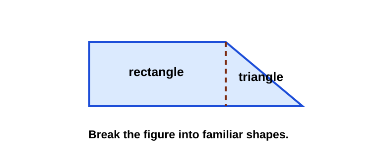
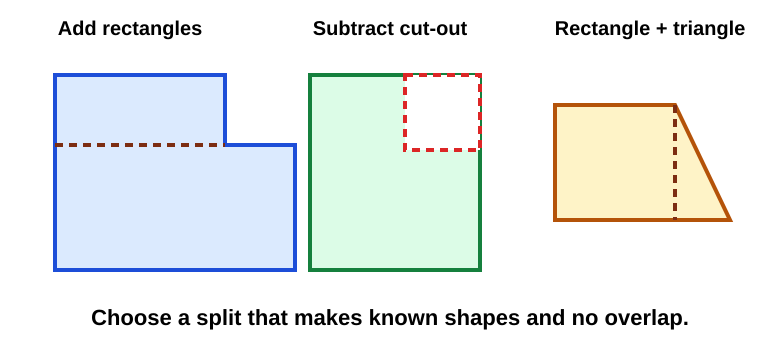
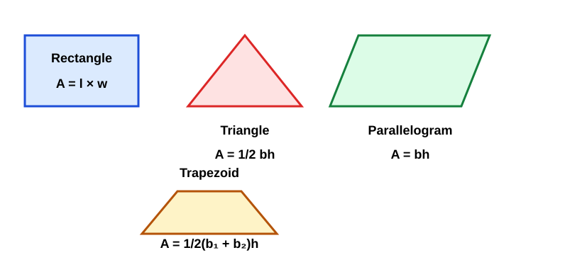
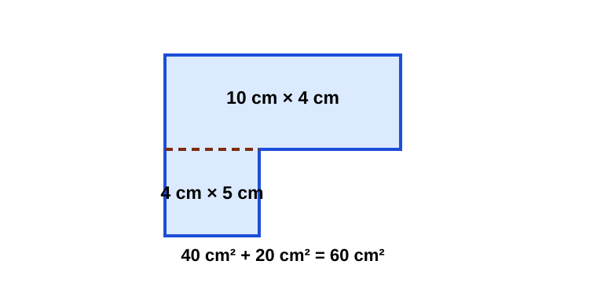
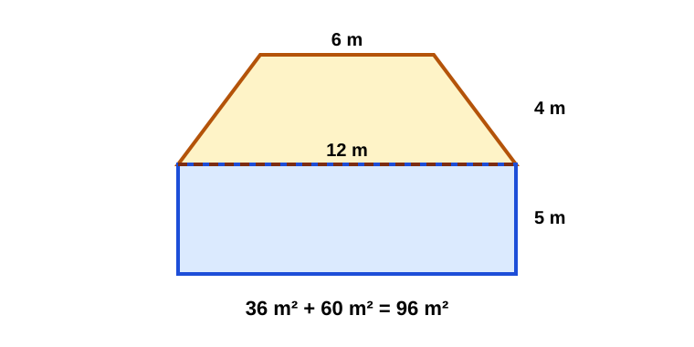
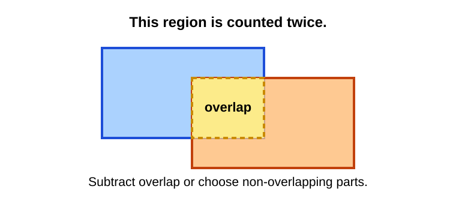

# Composite Area

> [!GOAL] Learning Goal
>
> I can break a composite figure into triangles, rectangles, parallelograms, or trapezoids and find its total area.

## Estimated Time and Difficulty

| Item | Details |
| --- | --- |
| Grade | 6 |
| Subject | Mathematics |
| Quarter | 3 |
| Topic | Geometry - Lesson 7 |
| Estimated time | 40-50 minutes |
| Difficulty | Moderate |

A composite figure is made from smaller shapes. The main skill is seeing the hidden shapes clearly before calculating.

## What You Should Already Know

- Rectangle area: \(A = l \times w\)
- Triangle area: \(A = \frac{1}{2}bh\)
- Parallelogram area: \(A = bh\)
- Trapezoid area: \(A = \frac{1}{2}(b_1 + b_2)h\)
- Area answers use square units.

> [!CHECK] Pre-Check / Readiness Quiz
>
> Try these before reading:
>
> 1. Find the area of a rectangle that is 8 cm by 5 cm.
> 2. Find the area of a triangle with base 10 cm and height 6 cm.
> 3. Which formula matches a parallelogram: \(bh\) or \(\frac{1}{2}bh\)?
> 4. What unit should you use for an area answer?

```interactive
{
  "spec": "interactives/composite-area-lab.json",
  "mode": "auto",
  "height": 800,
  "title": "Composite Area Lab"
}
```

## Key Vocabulary

| Term | Meaning | Visual or Symbolic Cue | Example |
| --- | --- | --- | --- |
| Composite figure | A figure made of two or more simpler shapes | combined outline | rectangle plus triangle |
| Decompose | Break a figure into smaller parts | draw a cut line | split an L-shape into rectangles |
| Total area | Sum of all non-overlapping parts | add areas | \(24 + 18 = 42\text{ cm}^2\) |
| Overlap | Area counted more than once | shared region | two rectangles covering the same corner |
| Missing part | A section removed from a larger shape | subtract area | big rectangle minus small rectangle |
| Height | Perpendicular distance used in area formulas | right-angle marker | triangle height, trapezoid height |

## Try Before You Read

Look at this figure.



**Question:** What smaller shapes can you see inside the figure?

<details>
<summary>Reveal Thinking Guide</summary>

Try drawing a line where the shape changes direction. Ask:

1. Can one part be a rectangle?
2. Can the slanted part be a triangle?
3. Will the parts overlap if you add them?

</details>

<details>
<summary>Reveal Explanation</summary>

One useful decomposition is a rectangle plus a triangle. Find each area separately, then add the areas because the parts do not overlap.

</details>

## Visual Introduction

The same composite figure can often be solved in more than one way.



Good decomposition lines:

- create shapes with known formulas
- use measurements already given
- avoid overlapping parts
- make the arithmetic simpler

## Main Concept Explanation

### 1. Look for Familiar Shapes

A composite figure may hide rectangles, triangles, parallelograms, or trapezoids. Before calculating, name each part.

### 2. Draw or Imagine a Decomposition Line

A decomposition line divides the figure into simpler pieces. The line should connect clear points such as corners, vertices, or straight edges.

### 3. Choose the Formula for Each Part



Use the formula that matches each simple shape:

- Rectangle: \(A = l \times w\)
- Triangle: \(A = \frac{1}{2}bh\)
- Parallelogram: \(A = bh\)
- Trapezoid: \(A = \frac{1}{2}(b_1 + b_2)h\)

### 4. Add or Subtract Area

Use addition when the composite figure is made from non-overlapping parts.

Use subtraction when the figure is easier to see as a large shape with a missing part.

## Rule Box / Formula Box

> [!IMPORTANT] Composite Area Routine
>
> 1. **Decompose:** Break the figure into familiar shapes.
> 2. **Label:** Write the needed dimensions for each part.
> 3. **Calculate:** Find each separate area.
> 4. **Combine:** Add included parts or subtract missing parts.
> 5. **Answer:** Use square units.
>
> **Warning:** Do not add side lengths and call that area. Area comes from multiplying dimensions.

## Worked Examples

### Example 1: L-Shaped Region

**Problem:** Find the area of the L-shaped region.



**Solution:**

Split the L-shape into two rectangles.

Top rectangle:

$$A = 10 \times 4 = 40\text{ cm}^2$$

Lower rectangle:

$$A = 4 \times 5 = 20\text{ cm}^2$$

Total area:

$$40 + 20 = 60\text{ cm}^2$$

**Final answer:** The area is **60 cm²**.

**Why it works:** The two rectangles cover the whole L-shape without overlapping.

### Example 2: Rectangle Plus Trapezoid

**Problem:** A sign is made from a rectangle and a trapezoid. Find the total area.



**Solution:**

Rectangle:

$$A = 12 \times 5 = 60\text{ m}^2$$

Trapezoid:

$$A = \frac{1}{2}(12 + 6)(4)$$

$$A = \frac{1}{2}(18)(4) = 36\text{ m}^2$$

Total area:

$$60 + 36 = 96\text{ m}^2$$

**Final answer:** The sign has area **96 m²**.

**Why it works:** The figure is exactly one rectangle plus one trapezoid, so the total is the sum of both areas.

## Guided Practice with Revealable Hints

### Guided Practice 1

**Problem:** A composite figure is made of a 9 cm by 4 cm rectangle and a triangle with base 9 cm and height 6 cm. Find the total area.

<details><summary>Hint 1</summary>Find the rectangle area and triangle area separately.</details>
<details><summary>Hint 2</summary>Compute \(9 \times 4\) and \(\frac{1}{2}(9)(6)\), then add.</details>
<details><summary>Show Solution</summary>Rectangle: \(36\text{ cm}^2\). Triangle: \(27\text{ cm}^2\). Total: \(36 + 27 = 63\text{ cm}^2\).</details>

### Guided Practice 2

**Problem:** A large rectangle is 14 m by 9 m. A 4 m by 3 m rectangle is cut out from one corner. Find the remaining area.

<details><summary>Hint 1</summary>This is a subtraction strategy.</details>
<details><summary>Hint 2</summary>Find \(14 \times 9\), then subtract \(4 \times 3\).</details>
<details><summary>Show Solution</summary>Large rectangle: \(126\text{ m}^2\). Missing rectangle: \(12\text{ m}^2\). Remaining area: \(126 - 12 = 114\text{ m}^2\).</details>

### Guided Practice 3

**Problem:** A figure is made of a parallelogram with base 8 units and height 5 units plus a rectangle that is 6 units by 5 units. Find the total area.

<details><summary>Hint 1</summary>Both parts use base times height.</details>
<details><summary>Hint 2</summary>Compute \(8 \times 5\) and \(6 \times 5\), then add.</details>
<details><summary>Show Solution</summary>Parallelogram: \(40\) square units. Rectangle: \(30\) square units. Total: \(70\) square units.</details>

## Mini-Quiz with Answer Checking

Use the Composite Area Lab near the top of the lesson for instant checking.

## Independent Practice

Find the total area. Show your decomposition and formulas.

1. A figure is made from a 6 cm by 8 cm rectangle and a triangle with base 6 cm and height 4 cm.
2. An L-shape can be split into rectangles measuring 12 m by 3 m and 5 m by 7 m.
3. A large rectangle is 15 cm by 10 cm with a 4 cm by 6 cm rectangle removed.
4. A sign is made from a trapezoid with bases 14 m and 8 m and height 5 m, attached to a 14 m by 4 m rectangle.
5. A composite figure contains a parallelogram with base 11 units and height 6 units plus a triangle with base 11 units and height 4 units.
6. A garden has two non-overlapping rectangular sections: 9 m by 5 m and 6 m by 4 m.
7. A drawing shows a rectangle 10 cm by 7 cm with a right triangle attached on one side. The triangle has base 7 cm and height 6 cm.
8. Explain why overlapping decomposition parts can give an area that is too large.

## Answer Key with Explanations

<details>
<summary>Reveal Independent Practice Answers</summary>

1. **60 cm².** Rectangle: \(6 \times 8 = 48\). Triangle: \(\frac{1}{2}(6)(4) = 12\). Total: \(60\).
2. **71 m².** \(12 \times 3 = 36\) and \(5 \times 7 = 35\). Total: \(71\).
3. **126 cm².** Large rectangle: \(15 \times 10 = 150\). Removed part: \(4 \times 6 = 24\). Remaining area: \(150 - 24 = 126\).
4. **111 m².** Trapezoid: \(\frac{1}{2}(14 + 8)(5) = 55\). Rectangle: \(14 \times 4 = 56\). Total: \(111\).
5. **88 square units.** Parallelogram: \(11 \times 6 = 66\). Triangle: \(\frac{1}{2}(11)(4) = 22\). Total: \(88\).
6. **69 m².** \(9 \times 5 = 45\) and \(6 \times 4 = 24\). Total: \(69\).
7. **91 cm².** Rectangle: \(10 \times 7 = 70\). Triangle: \(\frac{1}{2}(7)(6) = 21\). Total: \(91\).
8. **Overlap counts the same region twice.** Decomposition parts should cover the figure exactly once.

</details>

## Misconception Alerts

> [!WARNING] Misconception 1: "Composite area means add all side lengths."
>
> Side lengths alone do not give area. Find the area of each smaller shape using an area formula.

> [!WARNING] Misconception 2: "Every decomposition gives the same answer automatically."
>
> A decomposition works only if the parts cover the figure exactly once with no gaps or overlaps.

> [!WARNING] Misconception 3: "Triangles use \(bh\), just like rectangles."
>
> A triangle is half of a related parallelogram or rectangle, so use \(\frac{1}{2}bh\).

> [!WARNING] Misconception 4: "Missing pieces should be added."
>
> If a piece is removed from a larger figure, subtract its area.

## Error Analysis



**Incorrect student solution:**

A student splits a figure into two rectangles, but the rectangles overlap in the middle. The student adds both rectangle areas and gets \(84\text{ cm}^2\).

**Question:** What mistake did the student make? How would you fix it?

<details>
<summary>Reveal Mistake</summary>

The student counted the overlapping region twice. When parts overlap, adding both full areas makes the total too large.

</details>

<details>
<summary>Reveal Correct Solution</summary>

Fix the decomposition so the parts do not overlap, or subtract the overlapping area once:

$$\text{Correct area} = \text{Area 1} + \text{Area 2} - \text{Overlap}$$

</details>

## Self-Explanation Prompts

Use these prompts to test your reasoning.

1. How did you decide where to split the composite figure?
2. Which formula did you use for each part, and why?
3. Did your parts overlap or leave gaps? How can you tell?
4. When would subtraction be easier than addition?
5. Why must the final answer use square units?

<details>
<summary>Reveal Sample Responses</summary>

1. I split the figure along a straight edge to make familiar shapes.
2. I used rectangle, triangle, parallelogram, or trapezoid formulas based on each part.
3. The parts should cover the original outline exactly once.
4. Subtraction is easier when a simple large shape has a missing piece.
5. Area measures surface, so the unit is squared.

</details>

## Extension Challenge

**Optional challenge:** A figure is made from a rectangle 16 cm by 9 cm. A triangular notch with base 6 cm and height 4 cm is removed from one side, and a trapezoid with bases 16 cm and 10 cm and height 5 cm is added on top. Find the total area.

<details>
<summary>Reveal Hint</summary>

Start with the rectangle. Subtract the triangular notch. Add the trapezoid.

</details>

<details>
<summary>Reveal Full Solution</summary>

Rectangle:

$$16 \times 9 = 144\text{ cm}^2$$

Triangular notch:

$$\frac{1}{2}(6)(4) = 12\text{ cm}^2$$

Trapezoid:

$$\frac{1}{2}(16 + 10)(5) = 65\text{ cm}^2$$

Total:

$$144 - 12 + 65 = 197\text{ cm}^2$$

The total area is **197 cm²**.

</details>

## Mastery Checklist

Check each statement when you can do it confidently.

- [ ] I can identify simple shapes inside a composite figure.
- [ ] I can split a figure into non-overlapping parts.
- [ ] I can choose the right area formula for each part.
- [ ] I can add areas for included parts.
- [ ] I can subtract areas for missing parts.
- [ ] I can explain why overlap makes an answer too large.
- [ ] I can write final answers with square units.

## Final Summary

Composite area problems become manageable when you break the figure into familiar shapes. Use rectangle, triangle, parallelogram, and trapezoid formulas for the parts, then add or subtract the areas depending on the situation. The most important mistake to avoid is counting a region twice or leaving a gap.

> [!PRACTICE] Next Step
>
> Use the practice exam to drill decomposition choices. Use the assessment when you can explain your split and compute each part accurately.
