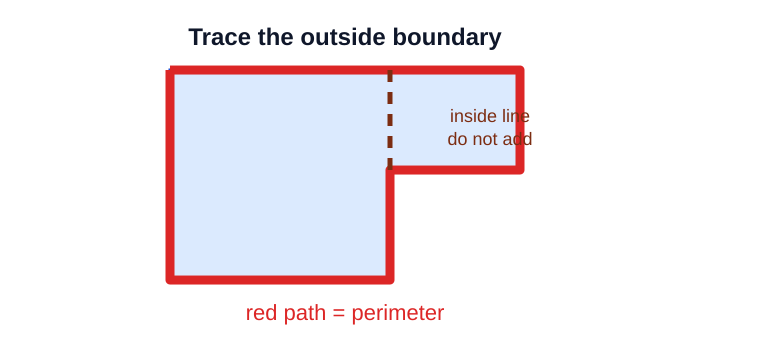
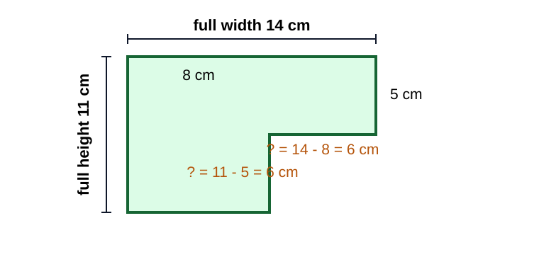
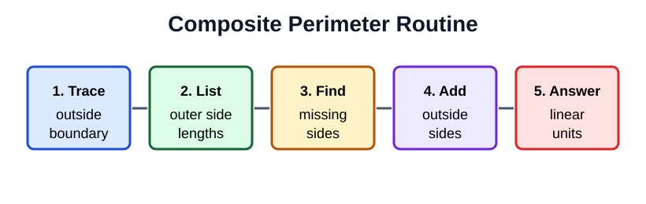
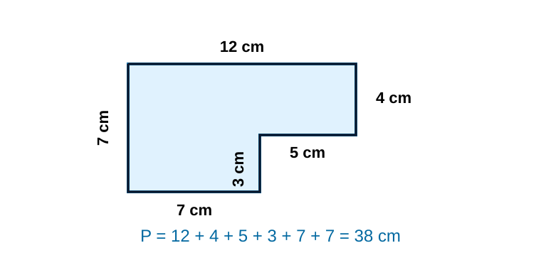
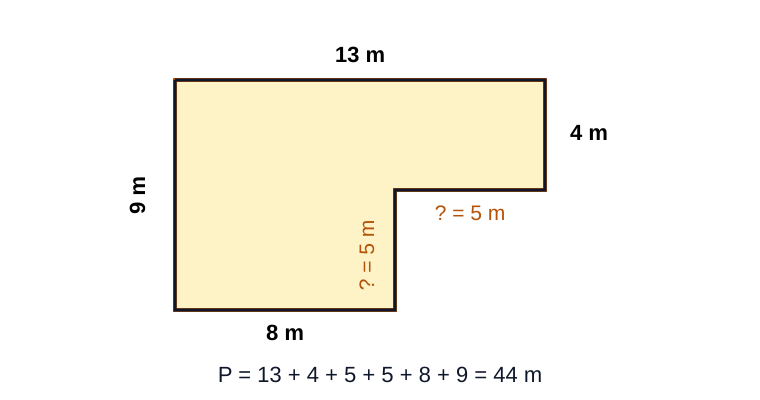
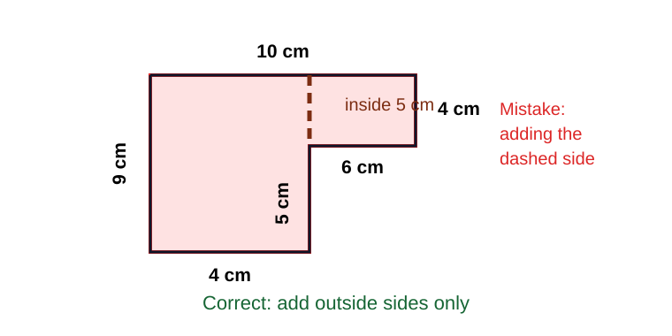

# Perimeter of Composite Figures

> [!GOAL] Learning Goal
>
> I can trace the outside boundary of a composite figure, find missing side lengths, and add the side lengths to find perimeter.

## Estimated Time and Difficulty

| Item | Details |
| --- | --- |
| Grade | 6 |
| Subject | Mathematics |
| Quarter | 3 |
| Topic | Geometry - Lesson 8 |
| Estimated time | 40-50 minutes |
| Difficulty | Moderate |

A composite figure is made from two or more simpler shapes. For perimeter, the important question is not "What parts make the shape?" It is "What distance do I travel if I walk around the outside edge?"

## What You Should Already Know

- Perimeter means distance around a figure.
- Rectangle opposite sides have equal lengths.
- Composite figures can have missing side lengths.
- Perimeter answers use linear units, such as cm, m, or units.
- Area and perimeter are different measurements.

> [!CHECK] Pre-Check / Readiness Quiz
>
> Try these before reading:
>
> 1. What is the perimeter of a 9 cm by 4 cm rectangle?
> 2. Does perimeter use cm or cm^2?
> 3. If a full width is 12 m and one horizontal part is 7 m, what is the missing horizontal part?
> 4. Should an inside dividing line be added to perimeter?

```interactive
{
  "spec": "interactives/perimeter-composite-lab.json",
  "mode": "auto",
  "height": 820,
  "title": "Perimeter Composite Lab"
}
```

## Key Vocabulary

| Term | Meaning | Visual or Symbolic Cue | Example |
| --- | --- | --- | --- |
| Perimeter | Distance around the outside of a figure | trace the boundary | \(P = 2l + 2w\) for a rectangle |
| Composite figure | A figure made from simpler shapes | joined rectangles | L-shape or step shape |
| Boundary | The outside edge of a figure | outline only | the sides you can trace without lifting your pencil |
| Interior segment | A line inside the figure | divider, not outside | a dashed split line |
| Missing side | A side length not directly labeled | use matching totals | \(15 - 9 = 6\) |
| Linear unit | Unit for length | cm, m, units | perimeter is 34 cm |

## Try Before You Read

Look at this figure.



**Question:** Which path gives the perimeter: the outside red boundary or the dashed line inside the shape?

<details>
<summary>Reveal Thinking Guide</summary>

Trace with your finger from one corner all the way around the figure. Count only the sides you touch on the outside.

</details>

<details>
<summary>Reveal Explanation</summary>

The perimeter is the outside red boundary. The dashed interior line can help you see rectangles, but it is not part of the distance around the outside.

</details>

## Visual Introduction

Some composite figures have side lengths that are not labeled. You can find them by matching total horizontal distances or total vertical distances.



In the figure:

- the full top width is 14 cm
- one horizontal part is 8 cm
- the missing horizontal part is \(14 - 8 = 6\) cm
- the full height is 11 cm
- one vertical part is 5 cm
- the missing vertical part is \(11 - 5 = 6\) cm

## Main Concept Explanation

### 1. Trace the Boundary First

Start at any corner. Move around the outside edge in one direction until you return to the starting point. Mark or list each outside side as you go.

### 2. Ignore Interior Lines

Interior lines can help you reason, but they are not part of the outside path. If you add an interior segment, the perimeter will be too large.

### 3. Find Missing Side Lengths

For rectilinear figures, horizontal distances balance with horizontal distances, and vertical distances balance with vertical distances.

For example:

$$\text{missing horizontal side} = \text{full width} - \text{known horizontal part}$$

$$\text{missing vertical side} = \text{full height} - \text{known vertical part}$$

### 4. Add All Outside Sides

After every outside side is known, add them. Use linear units.

## Rule Box / Formula Box



> [!IMPORTANT] Composite Perimeter Routine
>
> 1. **Trace:** Follow the outside boundary.
> 2. **List:** Write every outside side length in order.
> 3. **Find:** Use matching horizontal or vertical totals to find missing sides.
> 4. **Add:** Add all outside side lengths once.
> 5. **Answer:** Use linear units, not square units.

> [!WARNING] Common Trap
>
> Do not multiply length and width unless the question asks for area. Perimeter is found by adding side lengths.

## Worked Examples

### Example 1: Stair-Step Shape

**Problem:** Find the perimeter of the stair-step figure.



**Solution:**

Trace the outside boundary and list the sides:

$$12,\ 4,\ 5,\ 3,\ 7,\ 7$$

Add:

$$12 + 4 + 5 + 3 + 7 + 7 = 38$$

**Final answer:** The perimeter is **38 cm**.

**Why it works:** Every number listed is on the outside boundary, and each outside side is counted once.

### Example 2: Rectangle with a Corner Cut Out

**Problem:** Find the perimeter.



**Solution:**

First find the missing sides.

Horizontal missing side:

$$13 - 8 = 5\text{ m}$$

Vertical missing side:

$$9 - 4 = 5\text{ m}$$

Now add the outside boundary:

$$13 + 4 + 5 + 5 + 8 + 9 = 44$$

**Final answer:** The perimeter is **44 m**.

**Why it works:** The cut-out adds two new outside sides, so both missing sides must be included.

## Guided Practice with Revealable Hints

### Guided Practice 1

**Problem:** An L-shape has outside side lengths 16 cm, 6 cm, 7 cm, 4 cm, 9 cm, and 10 cm. Find the perimeter.

<details><summary>Hint 1</summary>Perimeter means add all outside side lengths.</details>
<details><summary>Hint 2</summary>Compute \(16 + 6 + 7 + 4 + 9 + 10\).</details>
<details><summary>Show Solution</summary>\(16 + 6 + 7 + 4 + 9 + 10 = 52\). The perimeter is **52 cm**.</details>

### Guided Practice 2

**Problem:** A step shape has a full width of 18 m. One horizontal part is 11 m. Find the missing horizontal part.

<details><summary>Hint 1</summary>The horizontal parts must add to the full width.</details>
<details><summary>Hint 2</summary>Compute \(18 - 11\).</details>
<details><summary>Show Solution</summary>\(18 - 11 = 7\). The missing horizontal side is **7 m**.</details>

### Guided Practice 3

**Problem:** A composite figure has outside sides 10 units, 3 units, 4 units, 5 units, 6 units, and 8 units. Find the perimeter.

<details><summary>Hint 1</summary>All six listed sides are on the outside boundary.</details>
<details><summary>Hint 2</summary>Add \(10 + 3 + 4 + 5 + 6 + 8\).</details>
<details><summary>Show Solution</summary>The perimeter is \(36\) units.</details>

## Mini-Quiz with Answer Checking

Use the Perimeter Composite Lab near the top of the lesson for instant checking. It includes:

- a readiness pre-check
- try-before/reveal prompts
- guided missing-side checks
- a mini-quiz
- a mastery checklist

## Independent Practice

Find each answer. Show your boundary trace or list of outside sides.

1. Outside sides: 9 cm, 5 cm, 4 cm, 3 cm, 5 cm, 8 cm.
2. Full width: 20 m. Known horizontal part: 13 m. Find the missing horizontal side.
3. Full height: 15 cm. Known vertical part: 6 cm. Find the missing vertical side.
4. Outside sides: 14 m, 7 m, 5 m, 4 m, 9 m, 11 m.
5. A student adds a dashed interior segment of 6 cm to the perimeter. Explain the mistake.
6. Outside sides: 6 units, 2 units, 4 units, 3 units, 2 units, 5 units.
7. A corner cut-out figure has outside sides 12 cm, 5 cm, 4 cm, 3 cm, 8 cm, and 8 cm. Find the perimeter.
8. Explain why perimeter uses cm, not cm^2.

## Answer Key with Explanations

<details>
<summary>Reveal Independent Practice Answers</summary>

1. **34 cm.** \(9 + 5 + 4 + 3 + 5 + 8 = 34\).
2. **7 m.** \(20 - 13 = 7\).
3. **9 cm.** \(15 - 6 = 9\).
4. **50 m.** \(14 + 7 + 5 + 4 + 9 + 11 = 50\).
5. **The dashed interior segment is not part of the outside boundary.** Adding it makes the answer too large.
6. **22 units.** \(6 + 2 + 4 + 3 + 2 + 5 = 22\).
7. **40 cm.** \(12 + 5 + 4 + 3 + 8 + 8 = 40\).
8. **Perimeter is length around a shape.** Linear measurements use units like cm or m; square units are for area.

</details>

## Misconception Alerts

> [!WARNING] Misconception 1: "Use every number shown."
>
> Only use numbers that belong to outside boundary sides. Interior lines are not part of the perimeter.

> [!WARNING] Misconception 2: "Missing sides can be guessed."
>
> Missing sides should be found from matching totals. Horizontal lengths match horizontal totals; vertical lengths match vertical totals.

> [!WARNING] Misconception 3: "Perimeter and area use the same units."
>
> Perimeter measures length around a shape, so use linear units. Area measures surface, so use square units.

> [!WARNING] Misconception 4: "A corner cut-out always makes perimeter smaller."
>
> A cut-out can remove part of the outside but also create new outside sides. Trace the boundary before deciding.

## Error Analysis



**Incorrect student solution:**

A student adds \(10 + 4 + 6 + 5 + 4 + 9 + 5\) and says the perimeter is \(43\) cm.

**Question:** What mistake did the student make? What should the student do instead?

<details>
<summary>Reveal Mistake</summary>

The student added the dashed interior side of 5 cm. That side helps split the figure, but it is not on the outside boundary.

</details>

<details>
<summary>Reveal Correct Solution</summary>

Add only the outside sides:

$$10 + 4 + 6 + 5 + 4 + 9 = 38$$

The correct perimeter is **38 cm**.

</details>

## Self-Explanation Prompts

Use these prompts to test your reasoning.

1. Where did you start tracing the boundary?
2. Which sides are outside sides?
3. Did you accidentally include any interior segment?
4. How did you find each missing horizontal or vertical side?
5. Why does your answer use linear units?

<details>
<summary>Reveal Sample Responses</summary>

1. I started at a corner and moved around the outside in one direction.
2. Outside sides are the sides on the boundary of the whole figure.
3. I checked that I did not add dashed or dividing lines inside the figure.
4. I subtracted the known part from the total matching length.
5. Perimeter is a distance, so it uses units like cm or m.

</details>

## Extension Challenge

**Optional challenge:** A step-shaped garden has total width 24 m and total height 18 m. The top horizontal part is 15 m, and the right vertical drop is 7 m. The outside sides in order are 24 m, 7 m, missing horizontal, missing vertical, 15 m, and 18 m. Find the perimeter.

<details>
<summary>Reveal Hint</summary>

Find the missing horizontal side from the total width. Find the missing vertical side from the total height.

</details>

<details>
<summary>Reveal Full Solution</summary>

Missing horizontal side:

$$24 - 15 = 9\text{ m}$$

Missing vertical side:

$$18 - 7 = 11\text{ m}$$

Perimeter:

$$24 + 7 + 9 + 11 + 15 + 18 = 84$$

The perimeter is **84 m**.

</details>

## Mastery Checklist

Check each statement when you can do it confidently.

- [ ] I can trace the outside boundary of a composite figure.
- [ ] I can tell whether a side is outside or inside.
- [ ] I can find missing horizontal sides using total widths.
- [ ] I can find missing vertical sides using total heights.
- [ ] I can add all outside side lengths once.
- [ ] I can explain why interior lines should not be added.
- [ ] I can write perimeter answers with linear units.

## Final Summary

Perimeter of a composite figure is the distance around the outside boundary. Trace the figure first, ignore interior lines, find missing side lengths by matching horizontal and vertical totals, then add every outside side once. Use linear units such as cm, m, or units.

> [!PRACTICE] Next Step
>
> Use the practice exam to drill boundary tracing and missing-side reasoning. Use the assessment when you can solve missing-side perimeter problems without adding interior lines.
