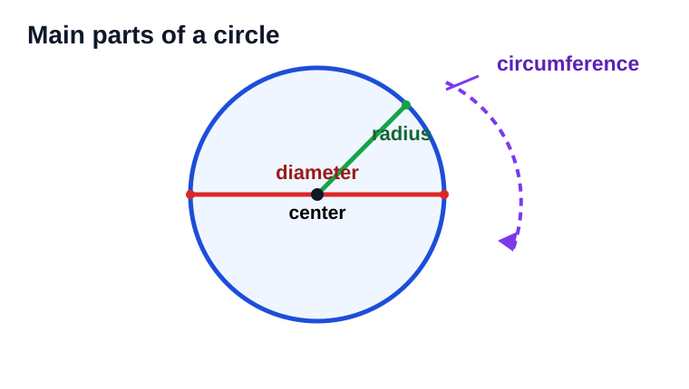
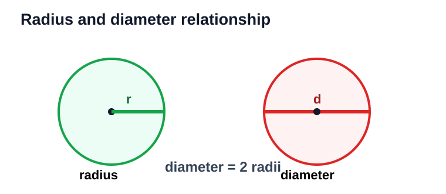
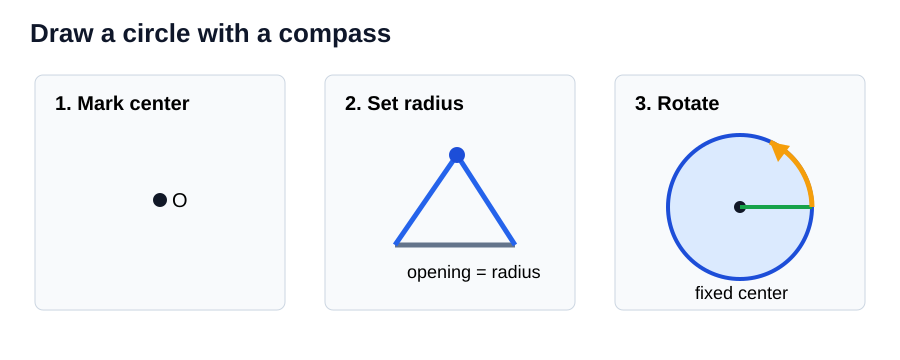
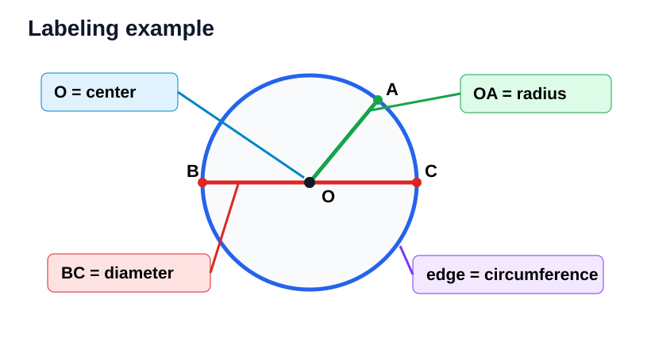
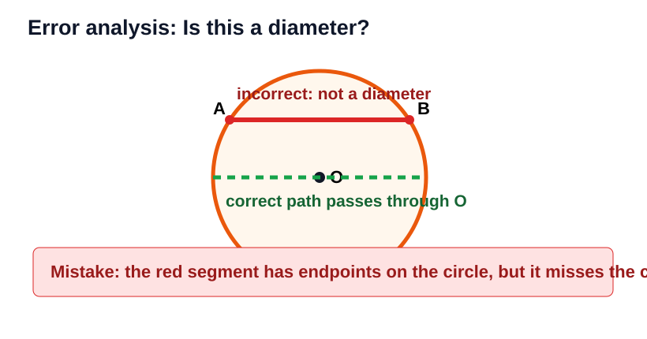
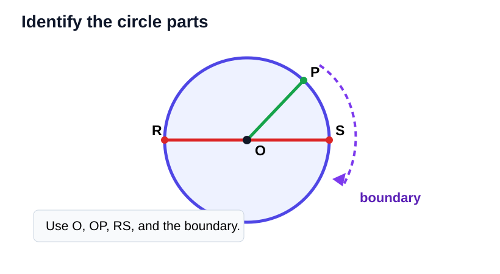

# Circle Parts and Construction

> [!GOAL] Learning Goal
>
> I can draw a circle with a compass and label its center, radius, diameter, and circumference.

## Estimated Time and Difficulty

| Item | Details |
| --- | --- |
| Grade | 6 |
| Subject | Mathematics |
| Quarter | 3 |
| Topic | Geometry - Lesson 9 |
| Estimated time | 40-50 minutes |
| Difficulty | Moderate |

A circle is more than a round shape. It is a set of points that are all the same distance from one fixed point called the center.

## What You Should Already Know

- A point marks an exact location.
- A segment is a straight part of a line with two endpoints.
- A ruler measures distance.
- A compass can keep one distance fixed while turning.

> [!CHECK] Pre-Check / Readiness Quiz
>
> Try these before reading:
>
> 1. What tool can draw a circle with a fixed radius?
> 2. If a segment starts at the center and ends on the circle, what part might it be?
> 3. Which is longer in the same circle: radius or diameter?
> 4. What word means the distance around a circle?

```interactive
{
  "spec": "interactives/circle-parts-lab.json",
  "mode": "auto",
  "height": 850,
  "title": "Circle Parts Lab"
}
```

## Key Vocabulary

| Term | Meaning | Visual Cue | Example |
| --- | --- | --- | --- |
| Circle | All points the same distance from the center | round boundary | bicycle wheel outline |
| Center | Fixed point in the middle of a circle | dot in the middle | point O |
| Radius | Segment from the center to the circle | half-way reach | \(OA\) |
| Diameter | Segment across the circle through the center | full width through center | \(BC\) |
| Circumference | Distance around the circle | outside boundary | rim of a plate |
| Compass | Tool for drawing circles with a fixed distance | point and pencil | construction tool |

## Try Before You Read

Study the diagram.



**Question:** Which label points to the outside boundary, and which label points to the middle?

<details>
<summary>Reveal Thinking Guide</summary>

Look for the only dot inside the circle. Then look for the arrow that touches the outer edge.

</details>

<details>
<summary>Reveal Explanation</summary>

The dot in the middle is the **center**. The outside boundary is the **circumference**.

</details>

## Main Concept Explanation

### 1. The Center Controls the Circle

The center is the fixed point. When you draw with a compass, the sharp point stays on the center.

> [!IMPORTANT] Construction Idea
>
> If the center moves while you draw, the circle will not be accurate.

### 2. A Radius Reaches From Center to Circle

A radius is a segment from the center to any point on the circle. In the same circle, every radius has the same length.

### 3. A Diameter Crosses Through the Center

A diameter goes from one side of the circle to the other side **through the center**.



The diameter is twice the radius:

$$d = 2r$$

The radius is half the diameter:

$$r = \frac{d}{2}$$

### 4. Circumference Is Around the Circle

Circumference means the distance around the circle. In this lesson, you only need to identify and label it, not calculate it.

## Compass Construction Routine



> [!IMPORTANT] Draw a Circle With a Compass
>
> 1. Mark the center point.
> 2. Open the compass to the required radius using a ruler.
> 3. Place the compass point on the center.
> 4. Keep the opening the same.
> 5. Rotate the pencil around the center to draw the circle.
> 6. Label the center, radius, diameter, and circumference.

> [!TIP] Accuracy Tip
>
> Keep one hand steady on the compass point. Turn the compass from the top so the opening does not change.

## Worked Examples

### Example 1: Label the Circle Parts

**Problem:** Label the center, a radius, a diameter, and the circumference.



**Solution:**

- Point O is the **center**.
- Segment \(OA\) is a **radius** because it goes from the center to the circle.
- Segment \(BC\) is a **diameter** because it passes through the center and has endpoints on the circle.
- The outside boundary is the **circumference**.

**Why it works:** Each label is based on where the part is located, not just how long it looks.

### Example 2: Use Radius and Diameter

**Problem:** A circle has radius 6 cm. What is its diameter?

**Solution:**

$$d = 2r$$

$$d = 2(6) = 12$$

**Final answer:** The diameter is **12 cm**.

### Example 3: Construct a Circle

**Problem:** Draw a circle with radius 3 cm.

**Solution:**

1. Mark center point O.
2. Use a ruler to open the compass to 3 cm.
3. Place the compass point on O.
4. Turn the compass without changing the opening.
5. Label one radius from O to the circle.

**Final check:** The distance from O to the circle should be 3 cm in every direction.

## Guided Practice with Revealable Hints

### Guided Practice 1

**Problem:** A circle has diameter 16 cm. Find its radius.

<details><summary>Hint 1</summary>The radius is half the diameter.</details>
<details><summary>Hint 2</summary>Compute \(16 \div 2\).</details>
<details><summary>Show Solution</summary>The radius is \(8\text{ cm}\).</details>

### Guided Practice 2

**Problem:** Segment \(PQ\) has endpoints on a circle, but it does not pass through the center. Is \(PQ\) a diameter?

<details><summary>Hint 1</summary>A diameter must pass through the center.</details>
<details><summary>Hint 2</summary>Check whether the segment crosses the middle point.</details>
<details><summary>Show Solution</summary>No. It has endpoints on the circle, but it is not a diameter because it does not pass through the center.</details>

### Guided Practice 3

**Problem:** You need to draw a circle with radius 5 cm. What compass opening should you use?

<details><summary>Hint 1</summary>The compass opening equals the radius.</details>
<details><summary>Hint 2</summary>Measure from the compass point to the pencil point.</details>
<details><summary>Show Solution</summary>Open the compass to \(5\text{ cm}\).</details>

## Mini-Quiz with Answer Checking

Use the Circle Parts Lab near the top of the lesson for instant checking. It includes a pre-check, try-before/reveal prompts, guided checks, a mini-quiz, and a mastery checklist.

## Independent Practice

Answer each item. Draw a quick sketch when it helps.

1. Identify the center in a circle diagram.
2. Draw one radius from center O to point A on the circle.
3. Draw one diameter through center O.
4. A circle has radius 7 cm. Find its diameter.
5. A circle has diameter 20 m. Find its radius.
6. Describe the circumference in your own words.
7. Explain why all radii in one circle have the same length.
8. Write the steps for constructing a circle with radius 4 cm.

## Answer Key with Explanations

<details>
<summary>Reveal Independent Practice Answers</summary>

1. The center is the point exactly in the middle of the circle.
2. The radius should start at O and end on the circle.
3. The diameter should have endpoints on the circle and pass through O.
4. **14 cm.** Diameter is twice the radius: \(2 \times 7 = 14\).
5. **10 m.** Radius is half the diameter: \(20 \div 2 = 10\).
6. The circumference is the distance around the circle, or the outside boundary.
7. Every radius starts at the same center and ends on the circle, so each one is the fixed circle distance.
8. Mark the center, set the compass opening to 4 cm, place the point on the center, rotate without changing the opening, and label the circle.

</details>

## Misconception Alerts

> [!WARNING] Misconception 1: "Any segment across a circle is a diameter."
>
> A segment across a circle is a diameter only if it passes through the center.

> [!WARNING] Misconception 2: "The circumference is the inside of the circle."
>
> Circumference is the distance around the outside boundary, not the region inside.

> [!WARNING] Misconception 3: "The compass opening is the diameter."
>
> The compass opening is the radius because it measures from the center to the circle.

> [!WARNING] Misconception 4: "The center can be anywhere inside the circle."
>
> The center is the exact fixed point equally distant from all points on the circle.

## Error Analysis



**Incorrect student solution:**

A student labels segment \(AB\) as a diameter because it goes from one side of the circle to the other. The segment does not pass through point O, the center.

**Question:** What mistake did the student make? How would you fix it?

<details>
<summary>Reveal Mistake</summary>

The student forgot that a diameter must pass through the center. Segment \(AB\) is not a diameter.

</details>

<details>
<summary>Reveal Correct Fix</summary>

Draw a new segment with endpoints on the circle that passes through O. Label that segment as the diameter.

</details>

## Diagram Identification Practice



Use the diagram to answer:

1. Which point is the center?
2. Which segment is a radius?
3. Which segment is a diameter?
4. Which label points to the circumference?

<details>
<summary>Reveal Answers</summary>

1. Point O is the center.
2. Segment \(OP\) is a radius.
3. Segment \(RS\) is a diameter.
4. The arrow to the outside boundary labels the circumference.

</details>

## Self-Explanation Prompts

Use these prompts to test your reasoning.

1. How do you know whether a segment is a radius?
2. How do you know whether a segment is a diameter?
3. Why does the compass opening equal the radius?
4. What construction mistake can make a circle uneven?
5. How can you check your labels before submitting an answer?

<details>
<summary>Reveal Sample Responses</summary>

1. A radius starts at the center and ends on the circle.
2. A diameter has endpoints on the circle and passes through the center.
3. The compass point stays at the center and the pencil reaches the circle.
4. Moving the compass point or changing the compass opening can make the circle uneven.
5. Check each label against the definition and make sure the diameter crosses the center.

</details>

## Mastery Checklist

> [!CHECK] I Am Ready When...
>
> - I can point to the center of a circle.
> - I can draw and label a radius.
> - I can draw and label a diameter through the center.
> - I can identify the circumference as the outside distance around the circle.
> - I can construct a circle with a compass using a given radius.
> - I can explain why an off-center segment is not a diameter.

## Final Summary

A circle is built from one fixed center and a constant radius. The radius reaches from the center to the circle. The diameter goes all the way across through the center and is twice the radius. The circumference is the distance around the circle. To draw an accurate circle with a compass, keep the point fixed at the center and keep the compass opening unchanged.

> [!PRACTICE] What To Do Next
>
> Use the practice exam to check vocabulary and basic construction steps. Then use the assessment to show that you can identify circle parts in diagrams and explain common errors.
