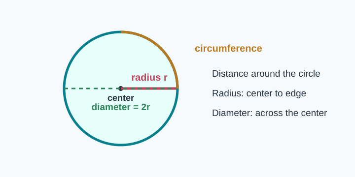
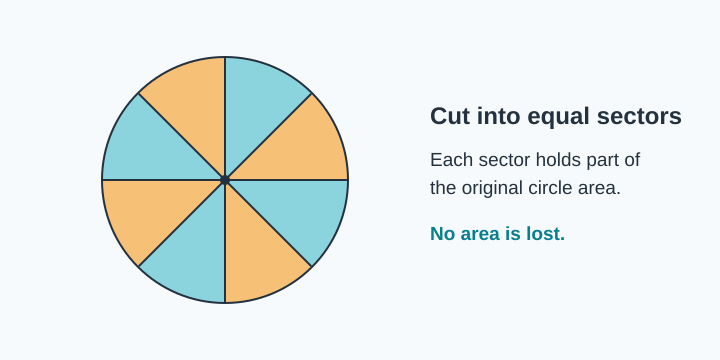
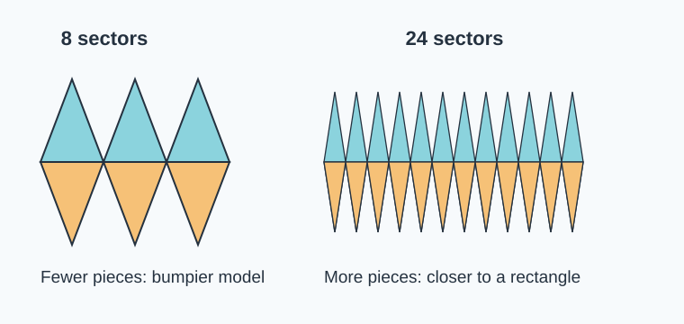
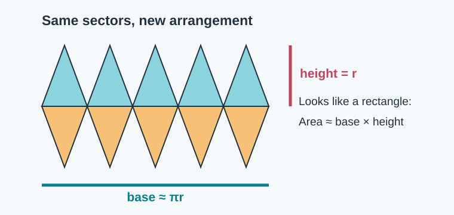
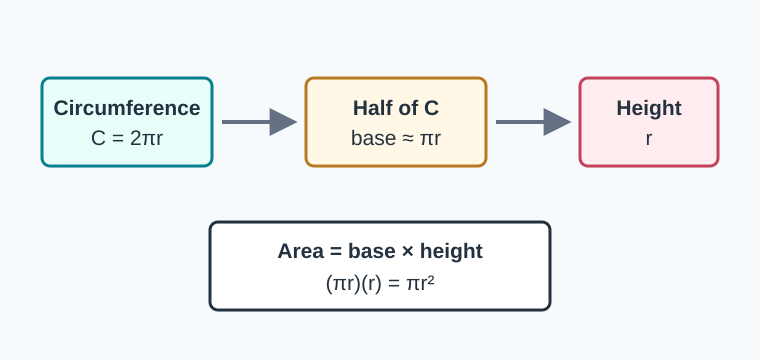
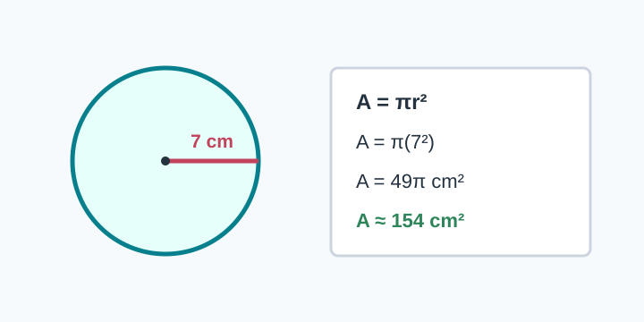
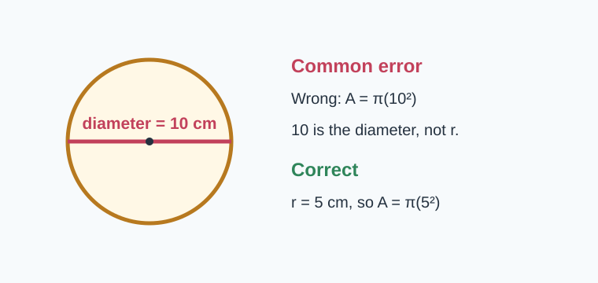

# Geometry - Lesson 1: Circle Area Exploration

> [!GOAL] Learning Goal
>
> By the end of this lesson, you should be able to explain how cutting a circle into sectors and rearranging them helps form the circle area formula: $A = \pi r^2$.

**Content domain:** Geometry  
**Estimated time:** 50 minutes  
**Target competency:** Cut and rearrange circle sectors to estimate area.  
**Assessment focus:** Describe how the area formula is formed.

---

## Visual Intro: What Are We Trying To See?

A circle does not look like a rectangle, but we already know how to find rectangle area. The big idea in this lesson is to **change the arrangement without changing the area**.



When a circle is cut into equal wedges, or **sectors**, each sector keeps a piece of the circle's area. If those same pieces are rearranged, the total area stays the same.

> [!TARGET] Session Target
>
> I can say: "The rearranged sectors look like a rectangle with height $r$ and base about half the circumference, so the area is about $\pi r \times r = \pi r^2$."

## Pre-Check

Answer before reading further.

1. What is the radius of a circle?
2. What is the diameter of a circle?
3. What formula finds the area of a rectangle?
4. If a shape is cut apart and rearranged with no gaps or overlaps, does its area change?

> [!CHECK] Quick Answers
>
> Radius is from center to circle. Diameter goes across the circle through the center. Rectangle area is length times width. Rearranging pieces does not change area if no area is lost or added.

---

## Try Before Reveal

Imagine cutting a pizza into 8 equal slices. Place the slices in a row, alternating point-up and point-down.

What shape does the row start to look like?



> [!TIP] Think Like A Builder
>
> The first arrangement will be bumpy. That is okay. More and thinner sectors make the rearranged shape closer to a rectangle.

```interactive
{
  "spec": "interactives/circle-area-exploration-lab.json",
  "mode": "auto",
  "height": 640,
  "title": "Circle Area Exploration Lab"
}
```

---

## Core Idea 1: Cutting Does Not Change Area

If you cut a circle into sectors, the pieces still contain the same total area as the original circle.

| Action | What happens to area? |
| --- | --- |
| Cut the circle into sectors | Area is divided among pieces |
| Rearrange the sectors | Total area stays the same |
| Use more sectors | Shape becomes less bumpy |
| Estimate with a rectangle | Estimate becomes closer to true circle area |



> [!IMPORTANT] No Gaps, No Overlaps
>
> The area stays the same only when the sectors are rearranged without gaps, overlaps, stretching, or shrinking.

## Core Idea 2: The Rearranged Shape Looks Like A Rectangle

When sectors are placed point-up, point-down, point-up, point-down, their curved edges make two long bumpy sides.



The height is the radius, $r$, because each sector reaches from the center of the circle to the outside edge.

The base is about half of the circle's circumference. The full circumference is:

$$C = 2\pi r$$

Half the circumference is:

$$\frac{1}{2}C = \pi r$$

> [!NOTE] Why Only Half The Circumference?
>
> Half of the curved edges are along the top of the rearranged shape, and half are along the bottom. One long side is about half the circle's circumference.

## Core Idea 3: Build The Formula

Use the rectangle area formula:

$$A = \text{base} \times \text{height}$$

For the rearranged circle sectors:

$$A \approx (\pi r)(r)$$

So:

$$A \approx \pi r^2$$

With more and more sectors, the bumpy shape gets closer to a true rectangle, so the estimate becomes the circle area formula:

$$A = \pi r^2$$



---

## Worked Example 1: Explain The Formula

**Problem:** A circle is cut into many equal sectors and rearranged. Explain why its area is $A = \pi r^2$.

**Reasoning:**

1. The sectors keep the same total area as the circle.
2. The rearranged sectors look like a rectangle.
3. The height of the rectangle is the radius, $r$.
4. The base is about half the circumference: $\pi r$.
5. Area is base times height: $(\pi r)(r) = \pi r^2$.

**Answer:** The circle area formula forms because the circle can be rearranged into an almost rectangle with base $\pi r$ and height $r$, so the area is $\pi r^2$.

## Worked Example 2: Radius 7 cm



For a circle with radius $7$ cm:

$$A = \pi r^2$$

$$A = \pi(7^2) = 49\pi$$

Using $\pi \approx \frac{22}{7}$:

$$A \approx 154\text{ cm}^2$$

> [!EXAMPLE] What The Model Shows
>
> The rearranged base is about $\pi r = 7\pi$, and the height is $7$. The area is about $(7\pi)(7)=49\pi$.

---

## Misconception Alerts

> [!WARNING] Mistake 1: Using Diameter As Radius
>
> If the diameter is 10 cm, the radius is 5 cm. Do not put 10 into $A=\pi r^2$ unless 10 is the radius.



> [!WARNING] Mistake 2: Saying The Base Is The Whole Circumference
>
> In the rearranged sector model, the top bumpy edge is about half the circumference and the bottom bumpy edge is the other half. One base is about $\pi r$, not $2\pi r$.

> [!WARNING] Mistake 3: Thinking The Formula Is Memorized Only
>
> You should be able to describe where the formula comes from: sectors, rearrangement, half circumference, radius, rectangle area.

---

## Error Analysis

A student writes:

> "The rearranged circle has base $2\pi r$ and height $r$, so the area is $2\pi r^2$."

**Find the error:** The student used the whole circumference as one base.

**Correct it:** The whole circumference is split between the top and bottom bumpy edges. One base is about half the circumference, or $\pi r$.

**Correct explanation:** The area is about $(\pi r)(r)=\pi r^2$.

## Guided Practice

Try each one, then check your reasoning.

1. A circle is cut into 16 sectors. What happens to the area when the sectors are rearranged?
2. In the sector model, what measurement becomes the height of the almost rectangle?
3. If the circumference is $24\pi$ cm, what is the approximate base of the rearranged rectangle?
4. Finish this sentence: "The circle area formula forms because..."

> [!CHECK] Guided Answers
>
> 1. The area stays the same.  
> 2. The height is the radius.  
> 3. Half of $24\pi$ is $12\pi$ cm.  
> 4. A strong answer mentions sectors rearranged into an almost rectangle with base $\pi r$ and height $r$.

## Self-Explanation Prompts

Write short answers in your notebook.

- Why does rearranging sectors preserve area?
- Why is the base about half the circumference instead of the full circumference?
- How does using more sectors improve the estimate?
- How would you explain $A=\pi r^2$ to a Grade 5 student?

## Extension Challenge

A circle has diameter $18$ cm.

1. Find the radius.
2. Describe the base and height of the rearranged sector model.
3. Estimate the area using $\pi \approx 3.14$.
4. Explain why your estimate is reasonable using the sector rearrangement idea.

> [!TIP] Challenge Hint
>
> Radius is half the diameter. The rearranged base is about $\pi r$ and the height is $r$.

---

## Mastery Checklist

Before taking the assessment, check that you can:

- identify radius, diameter, circumference, and sector
- explain that cutting and rearranging sectors preserves area
- describe the rearranged sectors as an almost rectangle
- state why the height is $r$
- state why the base is about $\pi r$
- connect rectangle area to $A=\pi r^2$
- avoid using diameter when the formula needs radius

## Final Summary

A circle can be cut into equal sectors and rearranged into a shape that looks almost like a rectangle. The more sectors you use, the closer the shape becomes to a rectangle. The height is the radius, $r$, and the base is about half the circumference, $\pi r$. Since rectangle area is base times height, the circle area formula is:

$$A=\pi r^2$$

> [!PRACTICE] What To Do Next
>
> Use the practice exam to check the main ideas. Use the assessment when you can explain the formula in words, not just calculate with it.
