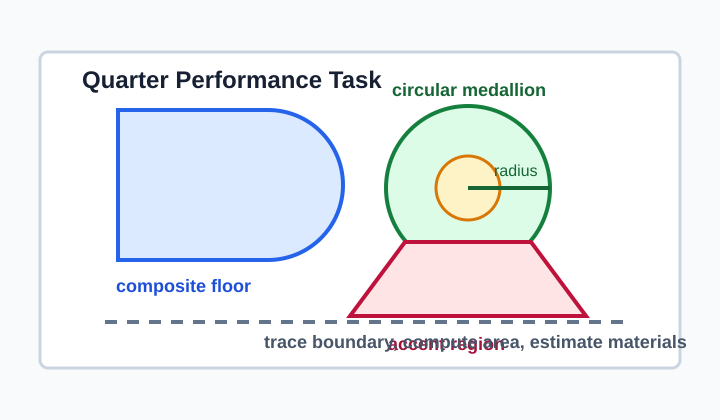
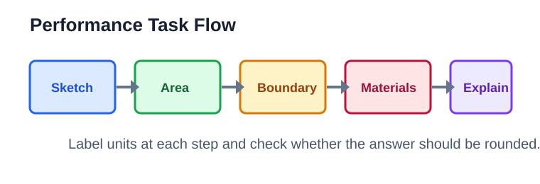
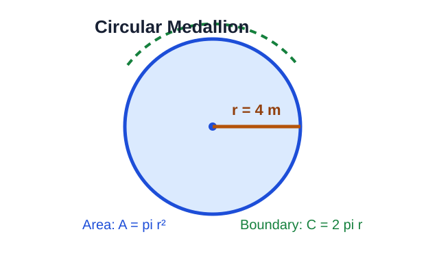
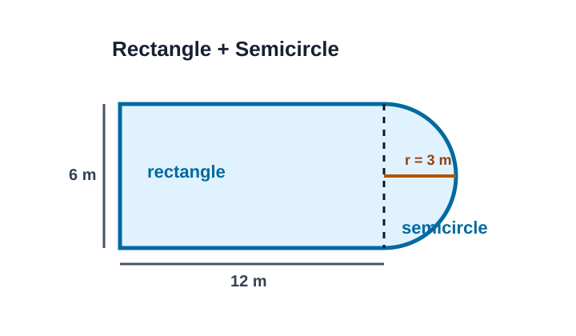
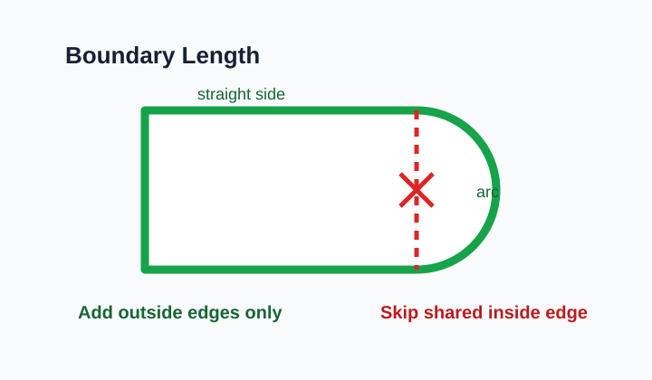
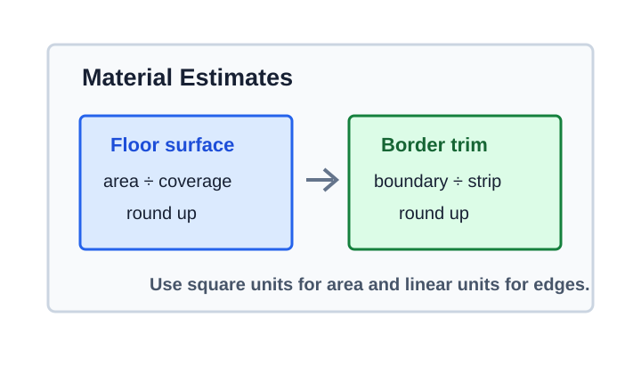
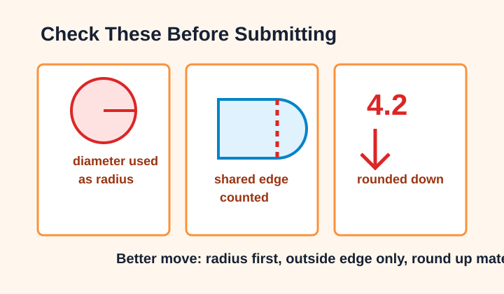

# Quarter Performance Task: Floor Pattern Design

> [!GOAL] Lesson Goal
>
> By the end of this lesson, you will be able to design a circular or composite floor pattern and compute its area, boundary length, and material estimates.

## Visual Intro

A floor pattern is more than a drawing. It is a plan that tells builders how much flooring to cover, how much border trim to buy, and how to explain the design.



> [!TARGET] Target Competency
>
> Design a circular or composite floor pattern.
>
> **Assessment skill:** Compute area, boundary length, and material estimates.

## Performance Task Roadmap

| Task part | What you calculate | Unit to use |
| --- | --- | --- |
| Floor surface | area | square units, such as m² |
| Outer edge or trim | boundary length | linear units, such as m |
| Tiles, adhesive, paint, or carpet | material estimate | pieces, boxes, liters, or packs |
| Explanation | method and reasonableness | complete sentences |

> [!NOTE] Use $\pi \approx 3.14$
>
> Use $3.14$ for $\pi$ in this lesson unless another value is given. Round final material estimates up when you must buy whole items.

```interactive
{
  "spec": "interactives/quarter-performance-task-lab.json",
  "mode": "auto",
  "height": 760,
  "title": "Quarter Performance Task Lab"
}
```

## Warm-Up Recall

Before starting your design, answer these in your notebook.

1. What is the area formula for a rectangle?
2. What is the area formula for a circle?
3. If a circle has diameter 12 m, what is its radius?
4. What formula gives the circumference of a circle?
5. Why does area use square units but boundary length does not?

## The Design-And-Estimate Plan



1. **Sketch the pattern.** Decide whether it is circular, rectangular, or composite.
2. **Label dimensions.** Include radius, diameter, length, width, and heights.
3. **Find total area.** Add non-overlapping parts or subtract cutouts.
4. **Find boundary length.** Add the outside straight sides and curved arcs only.
5. **Estimate materials.** Divide by coverage per unit, then round up when needed.
6. **Explain your choices.** Name formulas, units, and rounding decisions.

> [!IMPORTANT] Area And Boundary Are Different Jobs
>
> Area tells how much floor is covered. Boundary length tells how much edge or trim goes around the design. Do not use an area answer to buy border trim.

## Worked Example 1: Circular Medallion



A school lobby will have a circular floor medallion with radius 4 m. The outside edge needs brass trim. One box of tile covers $5\text{ m}^2$.

### Area For Tile

Use the circle area formula.

$$A = \pi r^2$$

$$A = 3.14(4^2) = 3.14(16) = 50.24$$

The floor area is **$50.24\text{ m}^2$**.

### Boundary Length For Trim

Use the circumference formula.

$$C = 2\pi r$$

$$C = 2(3.14)(4) = 25.12$$

The boundary length is **$25.12\text{ m}$**.

### Material Estimate

Each tile box covers $5\text{ m}^2$.

$$50.24 \div 5 = 10.048$$

You cannot buy $0.048$ of a box, so round up. The project needs **11 boxes of tile**.

> [!CHECK] Self-Explanation Prompt
>
> Explain why the tile estimate uses area, but the brass trim estimate uses boundary length.

## Worked Example 2: Composite Hall Pattern



A hallway pattern is made from a rectangle and a semicircle. The rectangle is 12 m long and 6 m wide. A semicircle is attached to one short side, so its diameter is 6 m.

### Step 1: Find Area

Rectangle:

$$12 \times 6 = 72$$

Semicircle radius:

$$6 \div 2 = 3$$

Semicircle area:

$$\frac{1}{2}(3.14)(3^2)=\frac{1}{2}(3.14)(9)=14.13$$

Total area:

$$72 + 14.13 = 86.13$$

The total floor area is **$86.13\text{ m}^2$**.

### Step 2: Find Boundary Length

The outside boundary has:

- two long sides of 12 m each
- one short straight side of 6 m
- one semicircular arc

The semicircle arc is half a circumference with radius 3 m.

$$\frac{1}{2}(2\pi r)=\pi r=3.14(3)=9.42$$

Boundary:

$$12 + 12 + 6 + 9.42 = 39.42$$

The boundary length is **$39.42\text{ m}$**.

### Step 3: Estimate Materials

If one adhesive container covers $20\text{ m}^2$:

$$86.13 \div 20 = 4.3065$$

Round up to **5 containers**.

> [!WARNING] Common Mistake
>
> The diameter where the semicircle touches the rectangle is inside the composite shape. It is not part of the outside boundary.

## Boundary Length Map



When finding boundary length, trace only the outside edge with your finger.

| Edge type | What to do |
| --- | --- |
| Straight side | Add the side length |
| Full circle edge | Add $2\pi r$ or $\pi d$ |
| Semicircle arc | Add $\pi r$ or $\frac{1}{2}\pi d$ |
| Shared inside edge | Do not add it |

> [!TIP] Trace Before Calculating
>
> If an edge is hidden because two shapes touch, it usually belongs to decomposition, not boundary length.

## Guided Practice: Design Check

Use this design:

- rectangle: 10 m by 8 m
- semicircle attached to one 8 m side
- tile box coverage: $6\text{ m}^2$
- border trim sold in 3 m strips

### Try It

1. What is the semicircle radius?
2. What is the total area?
3. What is the boundary length?
4. How many tile boxes are needed?
5. How many trim strips are needed?

### Reveal

Radius:

$$8 \div 2 = 4$$

Area:

$$10 \times 8 = 80$$

$$\frac{1}{2}(3.14)(4^2)=25.12$$

$$80 + 25.12 = 105.12\text{ m}^2$$

Boundary:

$$10 + 10 + 8 + 3.14(4)=40.56\text{ m}$$

Tile boxes:

$$105.12 \div 6 = 17.52$$

Round up to **18 boxes**.

Trim strips:

$$40.56 \div 3 = 13.52$$

Round up to **14 strips**.

## Material Estimate Board



Material estimates are usually not exact shopping lists until you round.

| Material | Measurement used | Estimate rule |
| --- | --- | --- |
| tiles, carpet, vinyl, paint, adhesive | area | divide by coverage per package |
| border trim, edging tape, rope light | boundary length | divide by length per strip or roll |
| extra allowance | area or length | add the percent requested |

> [!PRACTICE] Quick Check
>
> A circular pattern has radius 5 m. One can of sealant covers $12\text{ m}^2$. Find the area and cans needed.
>
> Area: $3.14(5^2)=78.5\text{ m}^2$. Cans: $78.5\div12=6.54$, so buy **7 cans**.

## Misconception Alerts



| Mistake | Why it is wrong | Better move |
| --- | --- | --- |
| Using diameter as radius | Circle formulas need radius unless written with diameter | Divide diameter by 2 first |
| Adding inside shared edges to boundary | Boundary means outside edge only | Trace the outside path |
| Reporting area in meters | Area covers a surface | Use square meters |
| Rounding material down | A partial package cannot cover the missing area | Round up for whole packages |

## Error Analysis

Arman designs a rectangle with a semicircle on one side. The rectangle is 9 m by 4 m. The semicircle has diameter 4 m.

Arman says:

> Area is $9 \times 4 + \frac{1}{2}(3.14)(4^2)$, so the area is $61.12\text{ m}^2$.

What is the error?

Arman used the diameter 4 m as the radius. The radius is $4 \div 2 = 2$ m.

Correct semicircle area:

$$\frac{1}{2}(3.14)(2^2)=6.28$$

Correct total area:

$$36 + 6.28 = 42.28\text{ m}^2$$

## Self-Explanation Prompts

Answer each prompt in one or two sentences.

1. How did you decide which parts of your design were included in the total area?
2. Which edges are counted in the boundary length? Which edges are not?
3. Why do material estimates often require rounding up?
4. How can you check whether your final answer is reasonable?

## Extension Challenge

Design a school lobby pattern with:

- one rectangle that is 14 m by 8 m
- two semicircles attached to the shorter sides
- a triangular accent with base 14 m and height 3 m
- tile boxes that cover $7\text{ m}^2$
- border trim sold in 2.5 m strips

Find the total area, outside boundary length, number of tile boxes, and number of trim strips.

**Hint:** The two semicircles make one full circle with diameter 8 m, so the radius is 4 m.

**Challenge answer:**  
Rectangle: $14 \times 8 = 112$  
Two semicircles: $3.14(4^2)=50.24$  
Triangle: $\frac{1}{2}(14)(3)=21$  
Total area: $112 + 50.24 + 21 = 183.24\text{ m}^2$  
Tile boxes: $183.24 \div 7 = 26.18$, so buy **27 boxes**  
Curved boundary from two semicircles: $2(3.14)(4)=25.12$  
Straight boundary: two long sides, $14 + 14 = 28$  
Boundary length: $28 + 25.12 = 53.12\text{ m}$  
Trim strips: $53.12 \div 2.5 = 21.248$, so buy **22 strips**

## Mastery Checklist

You are ready for the performance task when you can:

- sketch a circular or composite floor pattern with clear labels
- separate the design into non-overlapping parts for area
- use radius correctly in circle and semicircle formulas
- trace the outside edge for boundary length
- choose area or boundary length for each material estimate
- round up when buying whole packages
- explain your method using correct units

## Final Summary

A strong performance task has a clear design, accurate measurements, and a practical estimate. Use area for the surface, boundary length for the edge, and a short explanation to prove that your plan makes sense.

> [!PRACTICE] Exam Plan
>
> Use the practice exam as a low-stakes design check. Then use the assessment to show you can compute area, boundary length, and material estimates without hints.
