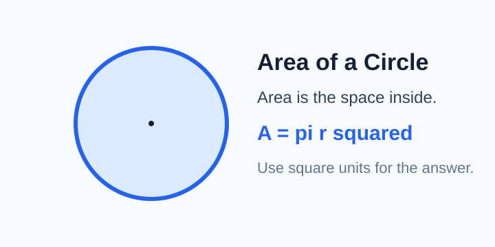
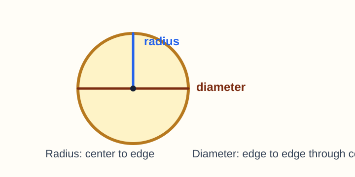
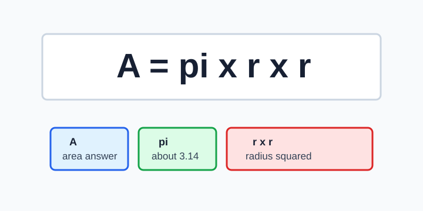
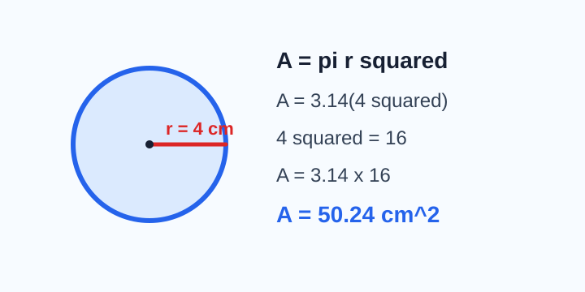
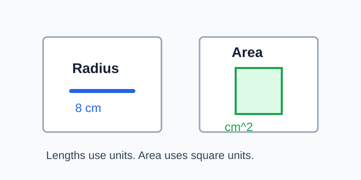
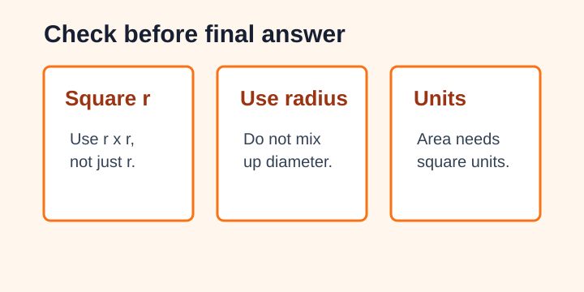

# Using A = pi r squared

> [!GOAL] Lesson Goal
>
> By the end of this lesson, you will compute the area of a circle when the radius is given.
>
> **Target competency:** Use $A = \pi r^2$ for direct circle-area problems and write the answer with square units.

## Visual Intro



A circle's area tells how much flat space is covered inside the circle. Area is measured in **square units**, such as square centimeters, square meters, or square inches.

The formula is:

$$A = \pi r^2$$

| Symbol | Meaning | What to do |
| --- | --- | --- |
| $A$ | area | the answer you are finding |
| $\pi$ | pi, about 3.14 | multiply by this number |
| $r$ | radius | distance from center to edge |
| $r^2$ | radius squared | multiply the radius by itself |

> [!TARGET] Today's Target
>
> Given a radius, find circle area by following this order:
>
> 1. Write the formula.
> 2. Substitute the radius.
> 3. Square the radius.
> 4. Multiply by $\pi$.
> 5. Write square units.

## Pre-Check

Try these before reading the examples.

1. If $r = 5$, what is $r^2$?
2. Is area measured in cm or cm^2?
3. In $A = \pi r^2$, do you square $\pi$ or the radius?

> [!CHECK] Quick Answers
>
> 1. $r^2 = 5^2 = 25$
> 2. Area is measured in cm^2.
> 3. You square the radius.

## Radius First



The **radius** goes from the center of the circle to the edge. The **diameter** goes all the way across the circle through the center.

In this lesson, the radius is given directly. That means you do not need to divide the diameter by 2 yet.

> [!WARNING] Misconception Alert
>
> Do not use the diameter as the radius. If a problem says the radius is 6 cm, then $r = 6$. If it says the diameter is 6 cm, then the radius would be 3 cm. Today, focus on problems where the radius is already given.

## Formula Parts



The most important step is $r^2$.

If $r = 7$, then:

$$r^2 = 7^2 = 7 \times 7 = 49$$

Then:

$$A = \pi r^2 = 49\pi$$

Using $\pi \approx 3.14$:

$$A \approx 3.14 \times 49 = 153.86$$

So the area is about **153.86 square units**.

> [!TIP] Exact and Approximate Answers
>
> Some teachers accept an exact answer like $49\pi$ square units. If the problem asks you to use $3.14$ for $\pi$, give a decimal approximation.

## Worked Example 1: Radius 4 cm



**Problem:** A circle has radius 4 cm. Find its area. Use $\pi \approx 3.14$.

Step 1: Write the formula.

$$A = \pi r^2$$

Step 2: Substitute the radius.

$$A = 3.14(4^2)$$

Step 3: Square the radius.

$$4^2 = 16$$

Step 4: Multiply.

$$A = 3.14(16) = 50.24$$

Step 5: Add square units.

$$A = 50.24 \text{ cm}^2$$

> [!EXAMPLE] What Made This Work?
>
> The radius was 4 cm. We squared 4, not 3.14. Because we found area, the unit became cm^2.

## Guided Practice

Solve each one on paper. Then compare your setup.

| Given radius | Setup | Area using 3.14 |
| --- | --- | --- |
| 3 m | $A = 3.14(3^2)$ | $28.26$ m^2 |
| 5 cm | $A = 3.14(5^2)$ | $78.5$ cm^2 |
| 10 in | $A = 3.14(10^2)$ | $314$ in^2 |

> [!PRACTICE] Try Before Reveal
>
> A circular garden has radius 6 m. Find the area using $\pi \approx 3.14$.
>
> Write your work first:
>
> $$A = 3.14(6^2)$$
>
> $$6^2 = 36$$
>
> $$A = 3.14(36) = 113.04$$
>
> The area is **113.04 m^2**.

```interactive
{
  "spec": "interactives/using-pi-r-squared-lab.json",
  "mode": "auto",
  "height": 720,
  "title": "Using A = pi r squared Lab"
}
```

## Unit Check



Circle area uses square units because area covers a surface.

| Measurement | Unit type | Example |
| --- | --- | --- |
| Radius | linear units | 8 cm |
| Area | square units | 200.96 cm^2 |

> [!IMPORTANT] Final Answer Habit
>
> If the radius is measured in meters, the area is in square meters. If the radius is measured in inches, the area is in square inches.

## Error Analysis



**Student work:**

Problem: A circle has radius 8 cm. Find its area using $3.14$.

Incorrect solution:

$$A = 3.14(8) = 25.12 \text{ cm}$$

What went wrong?

- The student forgot to square the radius.
- The answer should use cm^2, not cm.

Correct solution:

$$A = 3.14(8^2) = 3.14(64) = 200.96 \text{ cm}^2$$

> [!CHECK] Self-Explanation Prompt
>
> In one sentence, explain why $3.14 \times 8$ is not enough when the radius is 8.

## Misconception Alerts

> [!WARNING] Three Common Mistakes
>
> - **Mistake 1:** Multiplying $\pi$ by the radius only.
> - **Mistake 2:** Squaring the answer after multiplying.
> - **Mistake 3:** Writing linear units instead of square units.

Use this checklist:

1. Did I square the radius?
2. Did I multiply by $\pi$ or 3.14?
3. Did I write square units?

## Extension Challenge

A circular rug has radius 9 ft.

1. Find the exact area in terms of $\pi$.
2. Find the approximate area using $3.14$.
3. Explain which answer is more precise.

Answer check:

$$A = \pi(9^2) = 81\pi \text{ ft}^2$$

$$A \approx 3.14(81) = 254.34 \text{ ft}^2$$

The exact answer $81\pi$ ft^2 is more precise because it keeps pi exact.

## Mastery Checklist

Before taking the assessment, make sure you can:

- identify the radius in a circle diagram
- write $A = \pi r^2$ from memory
- square the given radius correctly
- multiply by 3.14 when asked for an approximation
- write answers with square units
- spot the mistake when someone forgets to square the radius

## Final Summary

To find the area of a circle from a radius, use:

$$A = \pi r^2$$

Square the radius first, then multiply by $\pi$. If using $3.14$, your answer is an approximation. Because area measures the inside of the circle, always use square units.

> [!PRACTICE] Exam Plan
>
> Use the practice exam as a low-stakes check. Then use the assessment when you can solve direct area problems without looking back at the examples.
