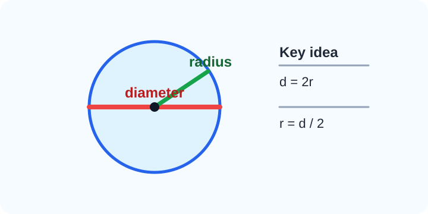
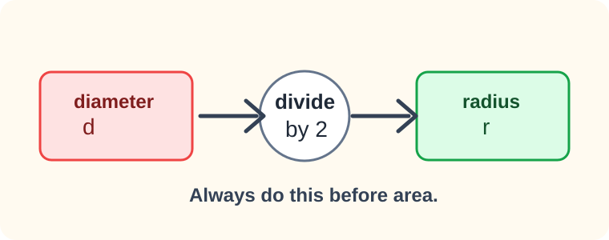
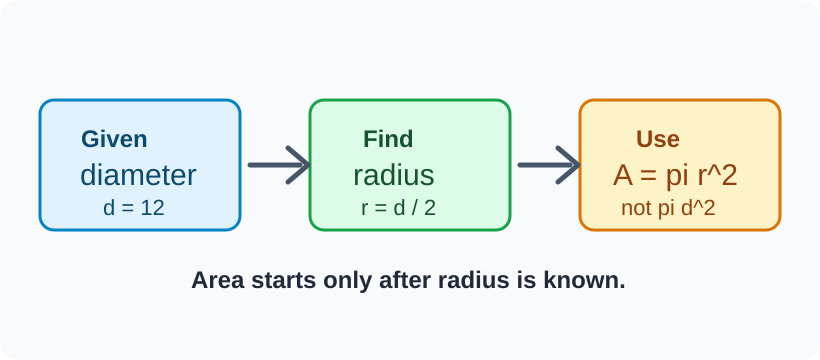
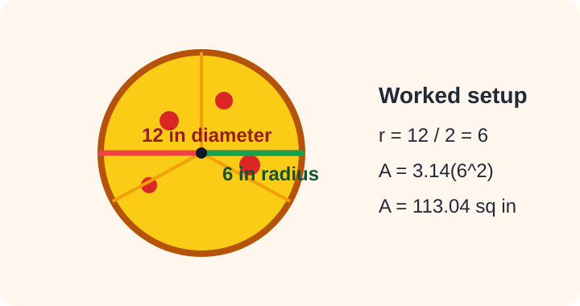
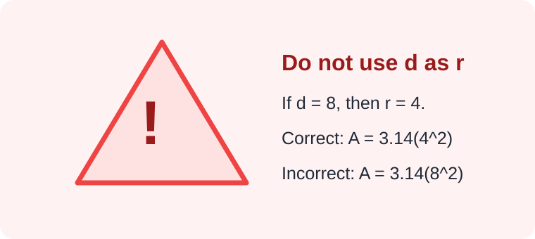
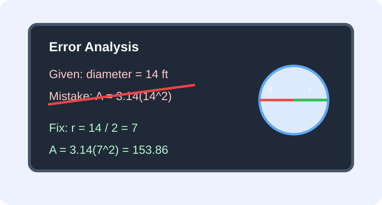

# Geometry - Lesson 3: Diameter to Area

> [!GOAL] Learning Goal
>
> By the end of this lesson, you should be able to find the **radius from a diameter** before calculating the **area of a circle**.

**Content domain:** Measurement and Geometry  
**Estimated time:** 45 minutes  
**Target competency:** Find radius from diameter before calculating area.  
**Key habit:** Never put the diameter directly into $A = \pi r^2$.

---

## Visual Introduction

A circle has two important measurements that are easy to mix up.



| Measurement | What it means | Relationship |
| --- | --- | --- |
| Radius, $r$ | distance from the center to the circle | half the diameter |
| Diameter, $d$ | distance across the circle through the center | twice the radius |

> [!TARGET] Today's Target
>
> When a problem gives the diameter, first write:
>
> $r = d \div 2$
>
> Then use:
>
> $A = \pi r^2$

---

## Pre-Check: What Do You Remember?

Answer these before reading the examples.

1. If the diameter is 10 cm, what is the radius?
2. If the radius is 4 m, what is the diameter?
3. Which formula uses radius: $A = \pi r^2$ or $A = \pi d^2$?

**Check your thinking:** 5 cm, 8 m, and $A = \pi r^2$.

> [!WARNING] Common Trap
>
> The area formula uses **radius**, not diameter. If the diameter is 10, do not use 10 as $r$. Use $r = 10 \div 2 = 5$.

---

## The Two-Step Area Plan



When a circle problem gives the diameter, solve in two steps.

| Step | Question to ask | Action |
| --- | --- | --- |
| 1 | Did the problem give diameter? | Divide by 2 to find radius |
| 2 | Do I now know radius? | Substitute into $A = \pi r^2$ |



> [!TIP] Say It Out Loud
>
> "Diameter is the full width. Radius is half the width. Area needs radius."

---

## Worked Example 1: Pizza Box Problem

A circular pizza has a diameter of 12 inches. What is its area? Use $\pi = 3.14$.



**Step 1: Find the radius.**

$r = d \div 2$  
$r = 12 \div 2$  
$r = 6$

**Step 2: Use the area formula.**

$A = \pi r^2$  
$A = 3.14(6^2)$  
$A = 3.14(36)$  
$A = 113.04$

**Answer:** The area is **113.04 square inches**.

> [!CHECK] Self-Explanation
>
> Why was 6 used in the formula instead of 12?  
> Write one sentence before moving on.

---

## Worked Example 2: Garden Circle

A circular garden has a diameter of 9 meters. Find its area using $\pi = 3.14$.

**Step 1: Convert diameter to radius.**

$r = 9 \div 2 = 4.5$

**Step 2: Square the radius, then multiply by 3.14.**

$A = 3.14(4.5^2)$  
$A = 3.14(20.25)$  
$A = 63.585$

**Answer:** The garden area is **63.585 square meters**.

> [!IMPORTANT] Unit Reminder
>
> Circle area is measured in **square units**: square centimeters, square meters, square inches, and so on.

---

## Misconception Alert: The Diameter-As-Radius Error



Suppose a circle has diameter 8 cm.

| Student move | Work | Result |
| --- | --- | --- |
| Correct | $r = 8 \div 2 = 4$, so $A = 3.14(4^2)$ | $50.24$ sq cm |
| Incorrect | $A = 3.14(8^2)$ | $200.96$ sq cm |

The incorrect answer is much too large because it uses the full diameter as if it were the radius.

> [!WARNING] Quick Error Test
>
> If the problem gives diameter and your solution never shows "divide by 2," pause and fix it.

---

## Error Analysis



Rina solved this problem:

**Problem:** A round mat has diameter 14 ft. Find its area using $\pi = 3.14$.

**Rina's work:**  
$A = 3.14(14^2)$  
$A = 615.44$

What went wrong?

Rina used the diameter as the radius. The radius should be:

$r = 14 \div 2 = 7$

Correct solution:

$A = 3.14(7^2)$  
$A = 3.14(49)$  
$A = 153.86$

**Correct answer:** **153.86 square feet**

> [!CHECK] Explain the Fix
>
> Complete this sentence: "Rina's answer is too large because..."

---

## Interactive Lab

Use the lab to practice the habit: **diameter first, radius second, area third**.

```interactive
{
  "spec": "interactives/diameter-to-area-lab.json",
  "mode": "auto",
  "height": 680,
  "title": "Diameter to Area Lab"
}
```

---

## Guided Practice

Try each problem before reading the answer.

### Problem 1

A circular button has diameter 6 cm. Find its area using $\pi = 3.14$.

**Hint:** First find $r = 6 \div 2$.  
**Answer:** $r = 3$, so $A = 3.14(3^2) = 28.26$ square centimeters.

### Problem 2

A circular table top has diameter 20 inches. Find its area using $\pi = 3.14$.

**Hint:** The radius is half of 20.  
**Answer:** $r = 10$, so $A = 3.14(10^2) = 314$ square inches.

### Problem 3

A circular clock has diameter 15 cm. Find its area using $\pi = 3.14$.

**Hint:** Half of 15 is 7.5.  
**Answer:** $r = 7.5$, so $A = 3.14(7.5^2) = 176.625$ square centimeters.

---

## Try-Before-Reveal Prompts

For each item, write only the radius first. Then calculate the area.

| Diameter | Radius | Area using $\pi = 3.14$ |
| --- | --- | --- |
| 4 cm | 2 cm | $12.56$ sq cm |
| 10 m | 5 m | $78.5$ sq m |
| 18 in | 9 in | $254.34$ sq in |

> [!PRACTICE] Retrieval Move
>
> Cover the last two columns. For each diameter, say the radius out loud before doing any multiplication.

---

## Extension Challenge

A circular rug has diameter 16 ft. A store sells square carpet tiles that each cover 1 square foot.

1. Find the rug's area using $\pi = 3.14$.
2. About how many 1-square-foot tiles would cover the same area?
3. Why does the tile estimate need to be a whole number?

**Challenge answer:**  
$r = 16 \div 2 = 8$  
$A = 3.14(8^2) = 200.96$ square feet  
You would need about **201 tiles** because you cannot buy 0.96 of a tile in this situation.

---

## Mastery Checklist

Before taking the assessment, check that you can:

- identify whether a problem gives radius or diameter
- divide the diameter by 2 to find radius
- substitute the radius into $A = \pi r^2$
- square the radius before multiplying by $\pi$
- write area answers in square units
- spot and correct the diameter-as-radius mistake

---

## Final Summary

Diameter is the full distance across a circle through its center. Radius is half of the diameter. The circle area formula uses radius:

$A = \pi r^2$

When a problem gives diameter, your first move is:

$r = d \div 2$

Then calculate the area using the radius.

> [!PRACTICE] What To Do Next
>
> Take the practice exam first. Watch for questions that try to tempt you into using diameter as radius. After you can show the divide-by-2 step consistently, take the assessment.
