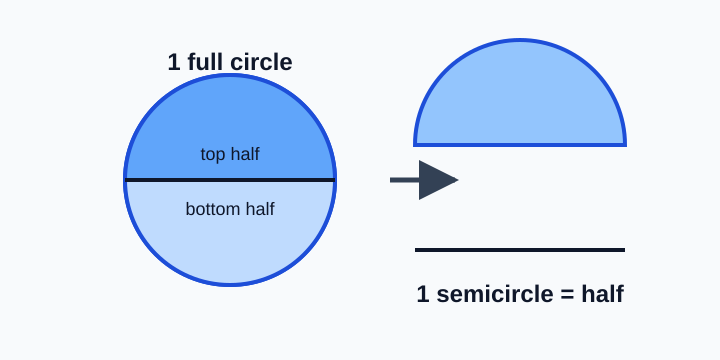
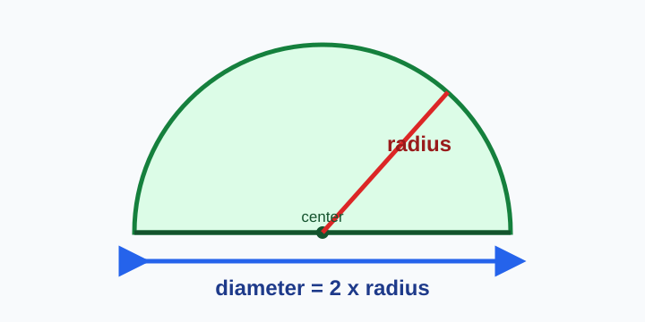
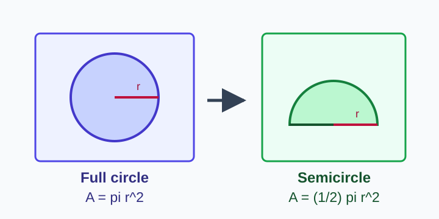
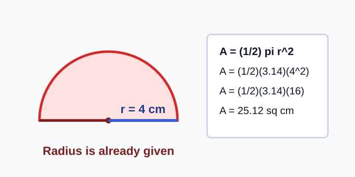
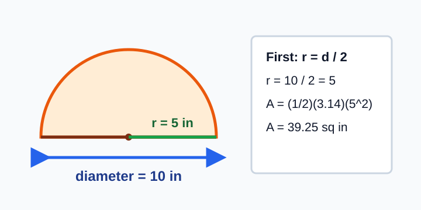
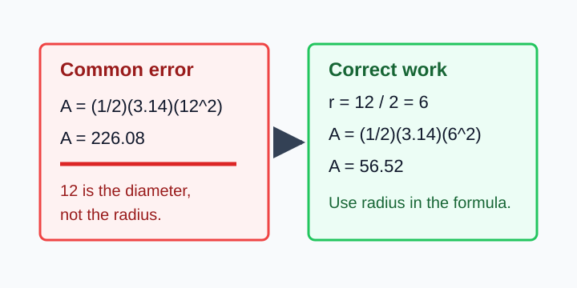

# Geometry - Lesson 4: Semicircle Area

> [!GOAL] Learning Goal
>
> By the end of this lesson, you should be able to **calculate the area of a semicircle** when you are given either the radius or the diameter.

**Content domain:** Geometry and measurement  
**Estimated time:** 45 minutes  
**Target competency:** Calculate half-circle areas.  
**Assessment focus:** Solve semicircle problems from radius or diameter.

---

## What You Should Already Know

Before you begin, check that you can:

- name the **radius** and **diameter** of a circle
- remember that diameter = 2 x radius
- calculate circle area with $A = \pi r^2$
- square a number before multiplying

> [!CHECK] Pre-Check
>
> 1. If a circle has diameter 14 cm, what is its radius?
> 2. What is $6^2$?
> 3. Using $\pi = 3.14$, what is the area of a full circle with radius 5 m?
>
> Answers: 7 cm; 36; $78.5$ square meters.

## Visual Introduction

A **semicircle** is half of a circle. If two identical semicircles are placed together, they make one complete circle.



That means a semicircle's area is exactly **half** of the matching circle's area.

> [!TARGET] Today's Target
>
> Find the area of the full circle first, then take half.

## Key Vocabulary

| Term | Meaning |
| --- | --- |
| Circle | A round figure with all points the same distance from the center |
| Radius | Distance from the center to the circle |
| Diameter | Distance across the circle through the center |
| Semicircle | One half of a circle |
| Area | Amount of space inside a flat figure |



## Formula Box

The area of a full circle is:

$$A = \pi r^2$$

The area of a semicircle is half of that:

$$A = \frac{1}{2}\pi r^2$$



> [!IMPORTANT] Order Matters
>
> Square the radius first. Then multiply by $\pi$. Then divide by 2.

## Worked Example 1: Radius Given

Find the area of a semicircle with radius 4 cm. Use $\pi = 3.14$.



**Step 1: Write the formula.**

$$A = \frac{1}{2}\pi r^2$$

**Step 2: Substitute the radius.**

$$A = \frac{1}{2}(3.14)(4^2)$$

**Step 3: Square the radius.**

$$4^2 = 16$$

**Step 4: Find the full circle area, then halve it.**

$$3.14 \times 16 = 50.24$$

$$50.24 \div 2 = 25.12$$

**Answer:** The semicircle area is **25.12 square centimeters**.

> [!CHECK] Try It
>
> A semicircle has radius 3 m. Use $\pi = 3.14$. What is its area?
>
> Answer: $14.13$ square meters.

## Worked Example 2: Diameter Given

Find the area of a semicircle with diameter 10 in. Use $\pi = 3.14$.



**Step 1: Convert diameter to radius.**

$$r = 10 \div 2 = 5$$

**Step 2: Use the semicircle formula.**

$$A = \frac{1}{2}(3.14)(5^2)$$

**Step 3: Calculate.**

$$5^2 = 25$$

$$3.14 \times 25 = 78.5$$

$$78.5 \div 2 = 39.25$$

**Answer:** The semicircle area is **39.25 square inches**.

> [!WARNING] Misconception Alert
>
> If the problem gives the **diameter**, do not square the diameter. First divide it by 2 to get the radius.

## Error Analysis

Mika solved this problem:

**Problem:** Find the area of a semicircle with diameter 12 cm.

Mika wrote:

$$A = \frac{1}{2}(3.14)(12^2) = 226.08$$



Mika's answer is too large because 12 cm is the **diameter**, not the radius.

Correct work:

$$r = 12 \div 2 = 6$$

$$A = \frac{1}{2}(3.14)(6^2)$$

$$A = \frac{1}{2}(3.14)(36) = 56.52$$

**Correct answer:** $56.52$ square centimeters.

> [!TIP] Quick Reasonableness Check
>
> A semicircle must have **half** the area of its matching full circle. If your answer is bigger than the full circle area, something went wrong.

## Interactive Lab

Use the lab to change radius and diameter values. Try predicting the area before revealing the calculation.

```interactive
{
  "spec": "interactives/semicircle-area-lab.json",
  "mode": "auto",
  "height": 680,
  "title": "Semicircle Area Lab"
}
```

## Guided Practice

### Problem 1

A semicircle has radius 7 cm. Use $\pi = 3.14$. Find its area.

**Hint 1:** Use $A = \frac{1}{2}\pi r^2$.  
**Hint 2:** $7^2 = 49$.  
**Answer:** $76.93$ square centimeters.

### Problem 2

A semicircle has diameter 16 m. Use $\pi = 3.14$. Find its area.

**Hint 1:** First find the radius.  
**Hint 2:** $16 \div 2 = 8$.  
**Answer:** $100.48$ square meters.

### Problem 3

A garden bed is shaped like a semicircle with radius 2.5 m. Use $\pi = 3.14$. Find its area.

**Hint 1:** $2.5^2 = 6.25$.  
**Hint 2:** Find $3.14 \times 6.25$, then divide by 2.  
**Answer:** $9.8125$ square meters, or about $9.81$ square meters.

## Self-Explanation Prompts

Pause and answer these in your own words:

1. Why does the formula include $\frac{1}{2}$?
2. What is the first thing you do when the problem gives diameter?
3. Why are semicircle area answers written in square units?

## Extension Challenge

A semicircular window has diameter 18 inches. A decorative film costs 20 pesos per square inch. Use $\pi = 3.14$.

1. Find the area of the window.
2. Find the total cost of the film.

**Check:** The radius is 9 inches. The area is $127.17$ square inches. The cost is $2543.40$.

## Mastery Checklist

You are ready for the practice exam when you can:

- explain that a semicircle is half of a circle
- use $A = \frac{1}{2}\pi r^2$
- change diameter into radius before calculating
- square the radius before multiplying
- label answers with square units
- check whether an answer is reasonable

> [!PRACTICE] What To Do Next
>
> Take the 8-question practice exam first. Review every explanation. Then take the 10-question assessment when you can solve both radius and diameter problems without hints.

## Final Summary

To find a semicircle area, calculate the matching full circle area and divide by 2. If you are given the diameter, find the radius first. The main formula is:

$$A = \frac{1}{2}\pi r^2$$
