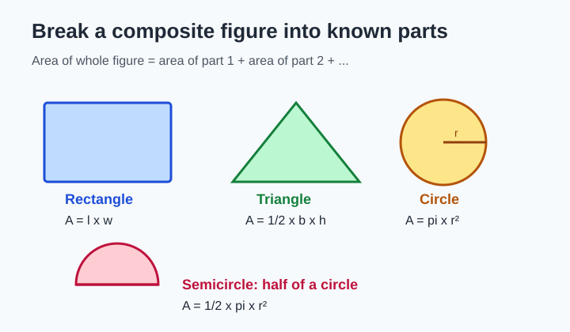
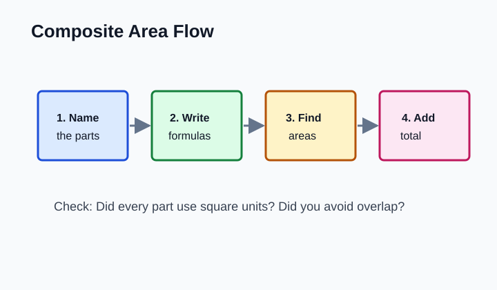
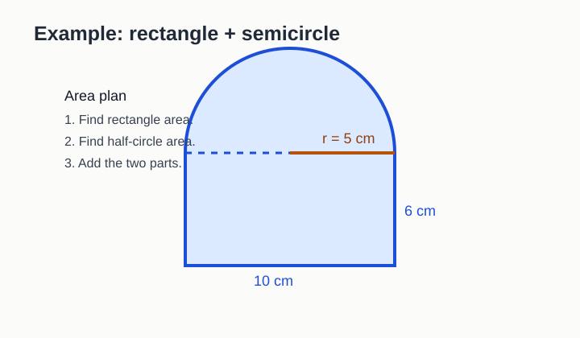
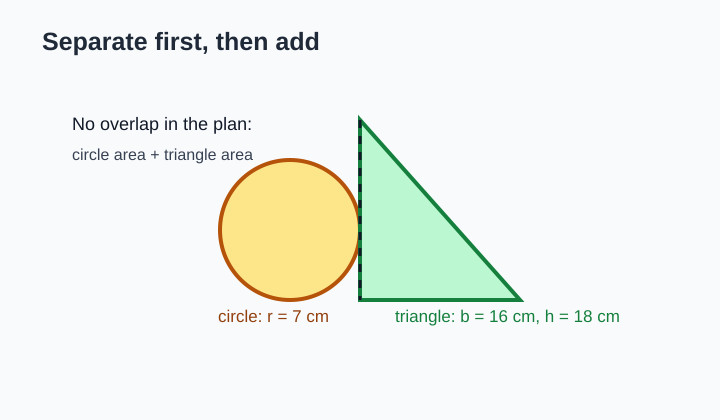
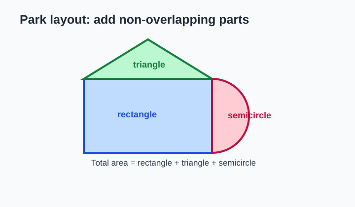
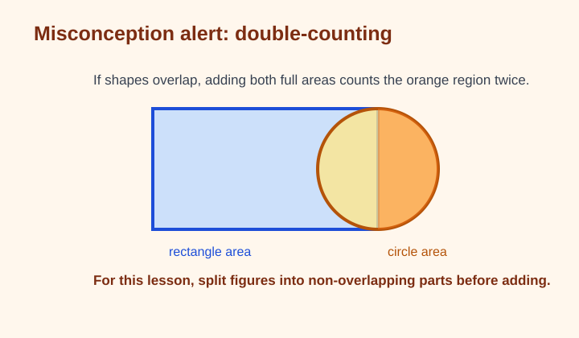

# Composite Figures with Circles

> [!GOAL] Lesson Goal
>
> By the end of this lesson, you should be able to separate a composite figure into rectangles, triangles, circles, and semicircles, then find its total area by adding the parts.

## Visual Intro

Composite figures are made from two or more familiar shapes. Your job is to see the hidden parts before you calculate.



> [!TARGET] Target Competency
>
> Separate figures into rectangles, triangles, circles, and semicircles.
>
> **Assessment skill:** Find total area by adding parts.

## Warm-Up Recall

Before solving, complete this quick recall check in your notebook.

| Shape | Area formula | What you must know |
| --- | --- | --- |
| Rectangle | $A = l \times w$ | length and width |
| Triangle | $A = \frac{1}{2}bh$ | base and perpendicular height |
| Circle | $A = \pi r^2$ | radius |
| Semicircle | $A = \frac{1}{2}\pi r^2$ | radius |

Use $\pi \approx 3.14$ unless your teacher gives a different instruction.

> [!TIP] Radius Reminder
>
> The radius is half the diameter. If a semicircle is attached to a side that is 10 cm long, that side is the diameter, so the radius is 5 cm.

```interactive
{
  "spec": "interactives/composite-figures-circles-lab.json",
  "mode": "auto",
  "height": 680,
  "title": "Composite Figures with Circles Lab"
}
```

## The Four-Step Area Plan



1. **Name the parts.** Look for rectangles, triangles, circles, and semicircles.
2. **Write the formula for each part.** Do this before substituting numbers.
3. **Find each area.** Keep the work separate.
4. **Add the areas.** The total area is the sum of all non-overlapping parts.

> [!IMPORTANT] Non-Overlapping Parts
>
> Add only parts that do not overlap. If two full shapes overlap, the shared area gets counted twice.

## Worked Example 1: A Gate Shape



A gate is made from a rectangle and a semicircle. The rectangle is 10 cm wide and 6 cm high. The semicircle on top has diameter 10 cm.

**Step 1: Name the parts.**  
Rectangle + semicircle.

**Step 2: Find the rectangle area.**

$$A = l \times w = 10 \times 6 = 60$$

The rectangle area is $60\text{ cm}^2$.

**Step 3: Find the semicircle area.**  
The diameter is 10 cm, so the radius is 5 cm.

$$A = \frac{1}{2}\pi r^2$$

$$A = \frac{1}{2}(3.14)(5^2) = \frac{1}{2}(3.14)(25) = 39.25$$

The semicircle area is $39.25\text{ cm}^2$.

**Step 4: Add.**

$$60 + 39.25 = 99.25$$

The total area is **$99.25\text{ cm}^2$**.

> [!CHECK] Self-Explanation Prompt
>
> Say this aloud: "I used 5 as the radius because the 10 cm side is the diameter of the semicircle."

## Worked Example 2: Circle Plus Triangle



A badge is made from a circle with radius 7 cm and a triangle with base 16 cm and height 18 cm.

**Circle area**

$$A = \pi r^2 = 3.14(7^2) = 3.14(49) = 153.86$$

**Triangle area**

$$A = \frac{1}{2}bh = \frac{1}{2}(16)(18) = 144$$

**Total area**

$$153.86 + 144 = 297.86$$

The total area is **$297.86\text{ cm}^2$**.

> [!WARNING] Common Mistake
>
> Do not use the diameter in the circle area formula unless you first divide it by 2. The formula $A = \pi r^2$ needs the radius.

## Guided Practice

Use the figure below. Try each step before reading the answer.



A park is made from:

- a rectangle with length 26 m and width 15 m
- a triangle with base 26 m and height 8 m
- a semicircle with radius 7.5 m

### Try It

1. What three parts make the park?
2. What is the rectangle area?
3. What is the triangle area?
4. What is the semicircle area?
5. What is the total area?

### Reveal

The parts are rectangle, triangle, and semicircle.

Rectangle:

$$26 \times 15 = 390$$

Triangle:

$$\frac{1}{2}(26)(8) = 104$$

Semicircle:

$$\frac{1}{2}(3.14)(7.5^2) = \frac{1}{2}(3.14)(56.25) = 88.3125$$

Total:

$$390 + 104 + 88.3125 = 582.3125$$

The total area is about **$582.31\text{ m}^2$**.

> [!PRACTICE] Quick Check
>
> A rectangle is 12 cm by 5 cm. A semicircle with radius 6 cm is attached to one 12 cm side. Find the total area.
>
> Answer: $60 + 56.52 = 116.52\text{ cm}^2$.

## Misconception Alerts



| Mistake | Why it happens | Better move |
| --- | --- | --- |
| Adding overlapping full shapes | The figure looks like two shapes placed together | Split the figure into non-overlapping parts |
| Using diameter as radius | The diameter is the easiest number to see | Divide diameter by 2 first |
| Forgetting half for a semicircle | A semicircle still looks curved like a circle | Find circle area, then divide by 2 |
| Using linear units for area | Perimeter and area units get mixed | Area uses square units |

> [!WARNING] Error Analysis
>
> Jessa says, "A semicircle has diameter 14 cm, so its area is $\frac{1}{2}(3.14)(14^2)$."
>
> What is wrong?
>
> She used 14 as the radius. The radius is 7 cm, so the area should be $\frac{1}{2}(3.14)(7^2)$.

## Self-Explanation Prompts

Pause and answer these in one or two sentences.

1. How do you know whether a curved part is a circle or a semicircle?
2. Why do you find the radius before using a circle formula?
3. Why is it helpful to write one line of work for each part?
4. How can you tell whether an answer is an area answer and not a perimeter answer?

## Extension Challenge

A school logo is made from a rectangle that is 18 cm by 10 cm, two semicircles attached to the shorter sides, and a triangle on top with base 18 cm and height 6 cm.

Find the total area. Use $\pi \approx 3.14$.

**Hint:** The two semicircles together make one full circle. Each semicircle has diameter 10 cm, so the radius is 5 cm.

**Challenge answer:**  
Rectangle: $18 \times 10 = 180$  
Two semicircles: $3.14(5^2) = 78.5$  
Triangle: $\frac{1}{2}(18)(6) = 54$  
Total: $180 + 78.5 + 54 = 312.5\text{ cm}^2$

## Mastery Checklist

You are ready for the practice exam when you can:

- identify rectangles, triangles, circles, and semicircles inside a composite figure
- explain why a semicircle uses half of the circle area formula
- find the radius when given a diameter
- write separate area work for each part
- add part areas without double-counting
- label final answers in square units

## Final Summary

Composite area problems become easier when you stop looking for one big formula. Break the figure into familiar parts, find each area, and add the non-overlapping pieces.

> [!PRACTICE] Exam Plan
>
> Use the practice exam for low-stakes checking. Then use the assessment to prove you can find total area by adding parts without hints.
