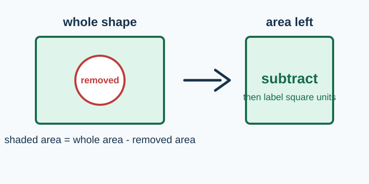
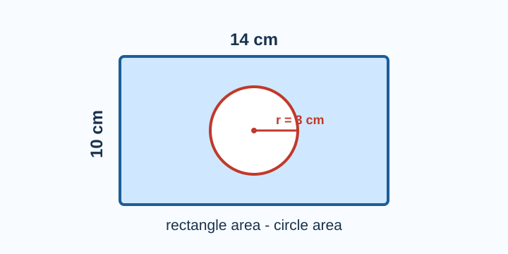
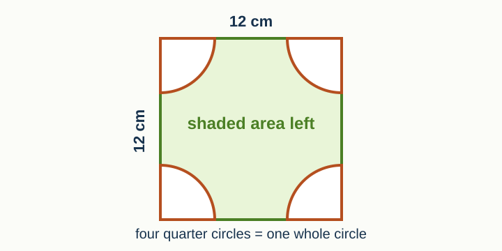
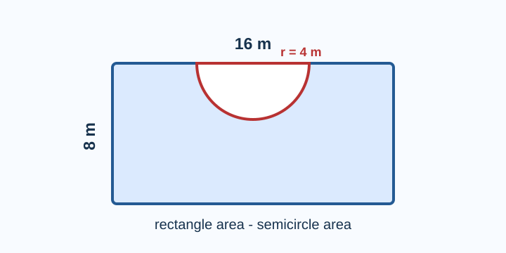
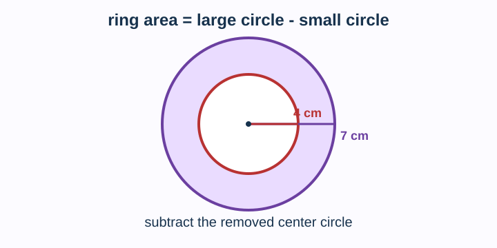
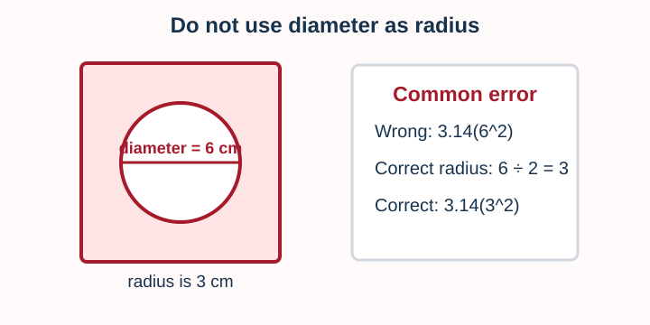

# Shaded Regions

> [!GOAL] Lesson Goal
>
> Find the area left after removing circular parts. You will show the whole area, the removed circular area, the subtraction step, and the final answer in square units.



## Quick Roadmap

| Part | What you will do | Key question |
|---|---|---|
| 1 | Review area formulas | What is the whole shape? |
| 2 | Remove circular parts | What circle, semicircle, or quarter circle is cut out? |
| 3 | Subtract clearly | What area is left? |
| 4 | Check your answer | Is the shaded area smaller than the whole? |

> [!TARGET] Target Competency
>
> I can find the area left after removing circular parts from a larger shape.

## Warm-Up Recall

Before solving shaded regions, recall these formulas.

| Shape | Area formula | Reminder |
|---|---:|---|
| Rectangle | $A = l \times w$ | Multiply length by width. |
| Square | $A = s^2$ | Multiply side by itself. |
| Circle | $A = \pi r^2$ | Radius is half the diameter. |
| Semicircle | $A = \frac{1}{2}\pi r^2$ | Half of a circle. |
| Quarter circle | $A = \frac{1}{4}\pi r^2$ | One fourth of a circle. |

Use $\pi \approx 3.14$ unless a problem gives a different value.

> [!CHECK] Pre-Check
>
> A circle has diameter 10 cm. What is its radius?  
> Answer: $5$ cm, because the radius is half the diameter.

## The Big Idea

A shaded-region problem often means:

$$\text{shaded area} = \text{whole area} - \text{removed area}$$

Write your work in this order:

1. Find the area of the whole shape.
2. Find the area of each circular part removed.
3. Add removed areas if there is more than one.
4. Subtract: whole area minus removed area.
5. Label the answer with square units.

> [!IMPORTANT] Say It Before You Solve
>
> "The whole is ____. The removed part is ____. I will subtract removed area from whole area."

## Interactive Lab

Use the lab to predict first, reveal the subtraction steps, and check your reasoning.

```interactive
{
  "spec": "interactives/shaded-regions-lab.json",
  "mode": "auto",
  "height": 720,
  "title": "Shaded Regions Lab"
}
```

## Worked Example 1: Circle Removed From a Rectangle



**Problem:** A rectangular metal plate is 14 cm long and 10 cm wide. A circular hole with radius 3 cm is removed. Find the shaded area left. Use $\pi = 3.14$.

**Step 1: Find the whole rectangle area.**

$$A = 14 \times 10 = 140$$

**Step 2: Find the removed circle area.**

$$A = \pi r^2 = 3.14(3^2)$$

$$A = 3.14(9) = 28.26$$

**Step 3: Subtract.**

$$140 - 28.26 = 111.74$$

**Answer:** The shaded area is **111.74 square centimeters**.

> [!TIP] Clear Subtraction Step
>
> Do not only write the final number. Show the subtraction: $140 - 28.26 = 111.74$.

## Worked Example 2: Four Quarter Circles Removed



**Problem:** A square tile has side length 12 cm. Four quarter circles with radius 3 cm are removed from the corners. Find the remaining shaded area.

Four quarter circles make one whole circle when their radii are the same.

**Whole square:**

$$A = 12^2 = 144$$

**Removed area:**

$$4 \times \frac{1}{4}\pi r^2 = 1 \times \pi r^2$$

$$A = 3.14(3^2) = 28.26$$

**Subtract:**

$$144 - 28.26 = 115.74$$

**Answer:** The shaded area is **115.74 square centimeters**.

> [!NOTE] Combine Matching Pieces
>
> If the pieces are equal, combine them first. Four quarter circles equal one circle. Two semicircles equal one circle.

## Worked Example 3: Semicircle Removed From a Rectangle



**Problem:** A rectangular banner is 16 m by 8 m. A semicircle with radius 4 m is cut out. Find the area left.

**Whole rectangle:**

$$A = 16 \times 8 = 128$$

**Removed semicircle:**

$$A = \frac{1}{2}\pi r^2 = \frac{1}{2}(3.14)(4^2)$$

$$A = \frac{1}{2}(3.14)(16) = \frac{1}{2}(50.24) = 25.12$$

**Subtract:**

$$128 - 25.12 = 102.88$$

**Answer:** The shaded area is **102.88 square meters**.

## Worked Example 4: Ring Region



**Problem:** A circular mat has radius 7 cm. A smaller circular center with radius 4 cm is removed. Find the area of the ring.

**Whole large circle:**

$$A = 3.14(7^2) = 3.14(49) = 153.86$$

**Removed small circle:**

$$A = 3.14(4^2) = 3.14(16) = 50.24$$

**Subtract:**

$$153.86 - 50.24 = 103.62$$

**Answer:** The shaded ring area is **103.62 square centimeters**.

## Guided Practice

Try each one before looking at the hint.

### Practice A

A rectangle is 20 cm by 12 cm. A circle with radius 5 cm is removed.

> [!PRACTICE] Your Setup
>
> Whole area: $20 \times 12 = 240$  
> Removed area: $3.14(5^2) = 78.5$  
> Shaded area: $240 - 78.5 = 161.5$ square centimeters

### Practice B

A square has side length 10 m. A semicircle with radius 5 m is removed.

> [!PRACTICE] Your Setup
>
> Whole area: $10^2 = 100$  
> Removed area: $\frac{1}{2}(3.14)(5^2) = 39.25$  
> Shaded area: $100 - 39.25 = 60.75$ square meters

### Practice C

A large circle has radius 9 cm. A smaller circle with radius 6 cm is removed from the center.

> [!PRACTICE] Your Setup
>
> Whole area: $3.14(9^2) = 254.34$  
> Removed area: $3.14(6^2) = 113.04$  
> Shaded area: $254.34 - 113.04 = 141.3$ square centimeters

## Misconception Alerts

> [!WARNING] Trap 1: Using Diameter as Radius
>
> If the problem gives diameter, divide by 2 before using $A = \pi r^2$.

> [!WARNING] Trap 2: Adding Instead of Subtracting
>
> Removed parts are holes or cutouts. They do not add area to the shaded region.

> [!WARNING] Trap 3: Forgetting Half or Quarter
>
> A semicircle is half of a circle. A quarter circle is one fourth of a circle.

> [!WARNING] Trap 4: Leaving Off Square Units
>
> Area is measured in square units: square centimeters, square meters, square inches, and so on.

## Error Analysis



**Problem:** A 10 cm by 10 cm square has a circular hole with diameter 6 cm. Find the area left.

**Student work:**

$$10 \times 10 = 100$$

$$3.14(6^2) = 113.04$$

$$100 - 113.04 = -13.04$$

**What went wrong?** The student used the diameter as the radius. The radius should be $6 \div 2 = 3$ cm.

**Correct work:**

$$100 - 3.14(3^2) = 100 - 28.26 = 71.74$$

**Correct answer:** **71.74 square centimeters**.

> [!CHECK] Reasonableness Check
>
> A removed circle inside a 10 by 10 square cannot have area bigger than the whole square when its diameter is only 6 cm.

## Self-Explanation Prompts

Answer these in your notebook or aloud.

1. How do you know which area is the whole?
2. How do you know whether to use a circle, semicircle, or quarter circle formula?
3. Why must the final answer be smaller than the whole area?
4. Where did you show the subtraction step?

## Extension Challenge

A rectangular garden is 18 m by 12 m. Two identical circular ponds, each with diameter 4 m, are removed from the planting area. A semicircular patio with radius 3 m is also removed. Find the planting area left.

**Plan:**

- Whole rectangle: $18 \times 12$
- Two circle areas: $2 \times 3.14(2^2)$
- One semicircle area: $\frac{1}{2}(3.14)(3^2)$
- Subtract all removed parts from the rectangle.

**Check your result:** The planting area should be a little less than $216$ square meters, not close to zero.

## Mastery Checklist

I can:

- Identify the whole shape.
- Identify each removed circular part.
- Change diameter to radius when needed.
- Use $\pi r^2$, $\frac{1}{2}\pi r^2$, or $\frac{1}{4}\pi r^2$ correctly.
- Add removed areas when there is more than one cutout.
- Show subtraction steps clearly.
- Write the answer in square units.
- Check that the shaded area is smaller than the whole area.

## Final Summary

Shaded-region problems are part-whole problems. Find the whole area first, find the circular area removed, then subtract.

$$\text{area left} = \text{whole area} - \text{removed circular area}$$

> [!PRACTICE] What To Do Next
>
> Complete the practice exam for low-stakes review. Then take the assessment when you can show every subtraction step without help.
