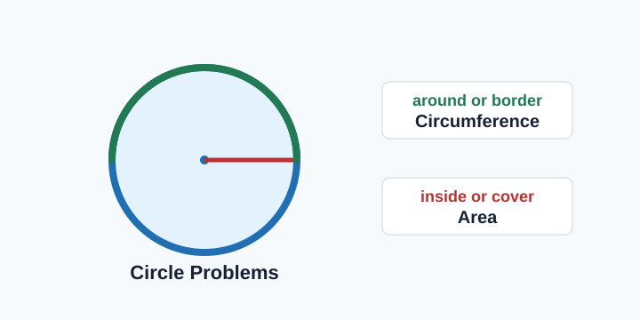
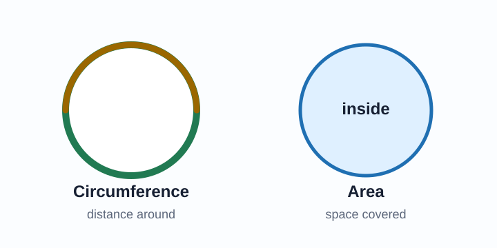
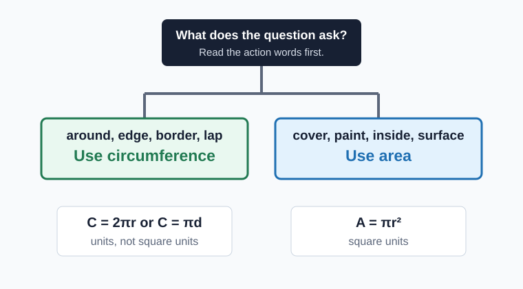
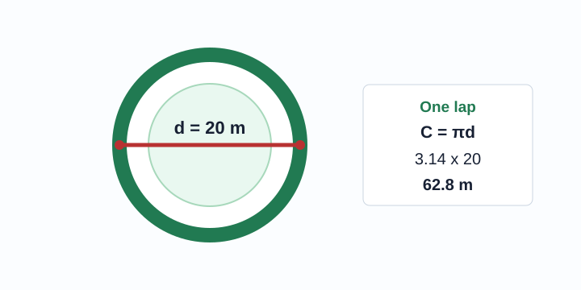
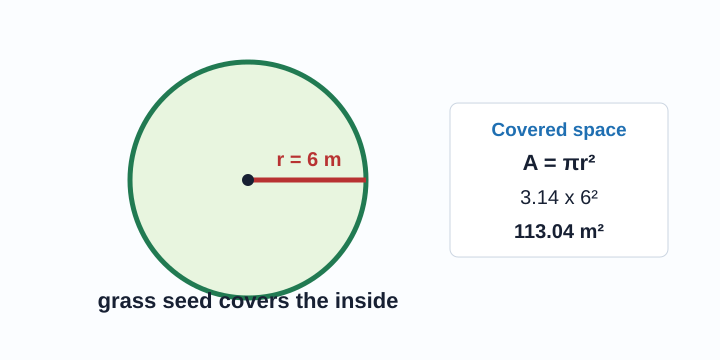
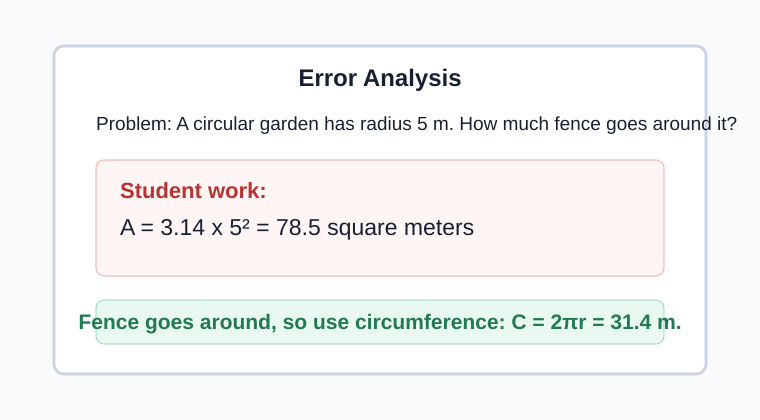

# Circumference Review

> [!GOAL] Lesson Goal
>
> Solve mixed circle problems by choosing the correct measurement first: circumference for distance around, area for space inside.



## Quick Roadmap

| Part | What you will do | Key question |
|---|---|---|
| 1 | Read the situation | Is it asking around or inside? |
| 2 | Choose a formula | Circumference or area? |
| 3 | Check radius and diameter | Do I need to divide the diameter by 2? |
| 4 | Solve and label | Units or square units? |

> [!TARGET] Target Competency
>
> I can choose circumference or area depending on the question and solve mixed circle problems.

## Warm-Up Recall

Use $\pi \approx 3.14$ unless the problem gives a different value.

| Measurement | Formula | Use when the question asks for... | Unit label |
|---|---:|---|---|
| Circumference | $C = 2\pi r$ or $C = \pi d$ | distance around, border, rim, lap, fence | cm, m, in |
| Area | $A = \pi r^2$ | space inside, cover, paint, grass, surface | square cm, square m, square in |

> [!CHECK] Pre-Check
>
> A circle has diameter 12 cm. What is its radius?  
> Answer: $6$ cm, because the radius is half the diameter.

## The Big Decision



The most important step is not multiplying. It is choosing the right idea.

- If something goes **around** the circle, use circumference.
- If something covers the **inside** of the circle, use area.
- If the question gives diameter and asks for area, divide by 2 first.
- If the question gives diameter and asks for circumference, you may use $C = \pi d$ directly.

> [!IMPORTANT] Say It Before You Solve
>
> "The question asks for ____, so I will use ____."

## Formula Decision Map



## Interactive Lab

Use the lab to classify a problem, try an answer before revealing steps, complete guided checks, and finish a mini-quiz.

```interactive
{
  "spec": "interactives/circumference-review-lab.json",
  "mode": "auto",
  "height": 740,
  "title": "Circumference Review Lab"
}
```

## Worked Example 1: Distance Around a Track



**Problem:** A circular track has diameter 20 m. How far is one lap around the track? Use $\pi = 3.14$.

**Step 1: Choose the measurement.**

One lap goes **around** the circle, so use circumference.

**Step 2: Choose the formula.**

The problem gives diameter, so use $C = \pi d$.

$$C = 3.14(20) = 62.8$$

**Answer:** One lap is **62.8 meters**.

> [!TIP] Unit Check
>
> Circumference is a length, so the answer is meters, not square meters.

## Worked Example 2: Space Inside a Garden



**Problem:** A circular garden has radius 6 m. How much ground does the garden cover? Use $\pi = 3.14$.

**Step 1: Choose the measurement.**

"Ground it covers" means the space **inside** the circle, so use area.

**Step 2: Use the area formula.**

$$A = \pi r^2$$

$$A = 3.14(6^2) = 3.14(36) = 113.04$$

**Answer:** The garden covers **113.04 square meters**.

> [!TIP] Square Unit Check
>
> Area covers a surface, so the answer uses square units.

## Worked Example 3: Diameter Given, Area Asked

**Problem:** A round table has diameter 10 ft. What is the area of the tabletop? Use $\pi = 3.14$.

**Step 1: Choose the measurement.**

A tabletop is a surface, so use area.

**Step 2: Convert diameter to radius.**

$$r = 10 \div 2 = 5$$

**Step 3: Find area.**

$$A = 3.14(5^2) = 3.14(25) = 78.5$$

**Answer:** The tabletop area is **78.5 square feet**.

> [!WARNING] Common Trap
>
> Do not put the diameter into $A = \pi r^2$. The formula needs radius.

## Guided Practice

Try each one before reading the solution.

### Practice A

A circular pond has radius 4 m. A rope is placed around the edge. How much rope is needed?

> [!PRACTICE] Check
>
> Around the edge means circumference.  
> $C = 2(3.14)(4) = 25.12$  
> **25.12 meters** of rope are needed.

### Practice B

A circular sign has diameter 14 in. How much paint is needed to cover one side?

> [!PRACTICE] Check
>
> Paint covers the inside, so use area.  
> Radius: $14 \div 2 = 7$  
> $A = 3.14(7^2) = 153.86$  
> **153.86 square inches** are painted.

### Practice C

A circular lid has diameter 9 cm. What is the distance around the lid?

> [!PRACTICE] Check
>
> Distance around means circumference.  
> $C = 3.14(9) = 28.26$  
> The distance around is **28.26 centimeters**.

## Misconception Alerts

> [!WARNING] Trap 1: Key Words Alone Are Not Enough
>
> The word "circle" does not tell you the formula. Ask what is being measured: around or inside.

> [!WARNING] Trap 2: Diameter in the Area Formula
>
> $A = \pi r^2$ uses radius. If you see diameter, divide by 2 first.

> [!WARNING] Trap 3: Squaring in Circumference
>
> Circumference does not use $r^2$. It is a distance around the circle.

> [!WARNING] Trap 4: Wrong Units
>
> Circumference uses regular units. Area uses square units.

## Error Analysis



**Problem:** A circular garden has radius 5 m. How much fence is needed to go around it?

**Student work:**

$$A = 3.14(5^2) = 78.5$$

**What went wrong?** The student found area, but fence goes around the circle. The problem asks for circumference.

**Correct work:**

$$C = 2\pi r = 2(3.14)(5) = 31.4$$

**Correct answer:** **31.4 meters** of fence are needed.

## Self-Explanation Prompts

Answer these in your notebook or aloud.

1. Which words in the problem showed whether it asked for circumference or area?
2. Did you use radius or diameter? How do you know it was the correct one?
3. Should the final unit be regular units or square units?
4. What mistake would someone likely make on this problem?

## Extension Challenge

A circular sprinkler sprays water in a circle with diameter 18 m.

1. How far around the outside edge of the watered circle is it?
2. What area of grass is watered?
3. Explain why the two answers have different units.

**Plan:**

- Circumference uses $C = \pi d$.
- Area needs radius first: $18 \div 2 = 9$.
- Label the first answer in meters and the second answer in square meters.

## Mastery Checklist

Before taking the assessment, make sure you can do each item.

- I can identify whether a question asks for distance around or space inside.
- I can choose $C = 2\pi r$, $C = \pi d$, or $A = \pi r^2$.
- I can change diameter to radius when area is needed.
- I can avoid squaring the radius in a circumference problem.
- I can label circumference with units and area with square units.
- I can explain my formula choice in one sentence.

## Final Summary

Circle review problems often look similar, so start with meaning. **Circumference** measures the distance around a circle. **Area** measures the space inside a circle. Read the question, choose the formula, check radius or diameter, solve, and label the answer with the correct kind of unit.

> [!PRACTICE] Exam Plan
>
> Use the practice exam for low-stakes mixed review. Then use the assessment to show mastery of choosing circumference or area and solving each circle problem accurately.
