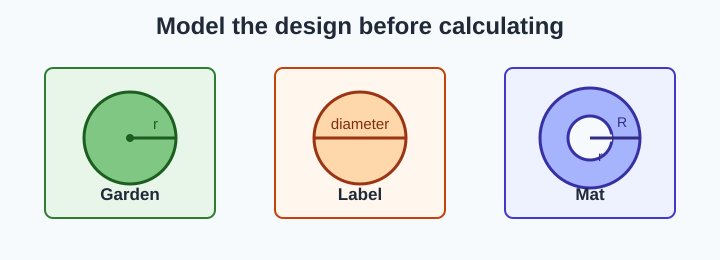
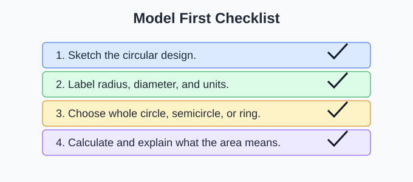
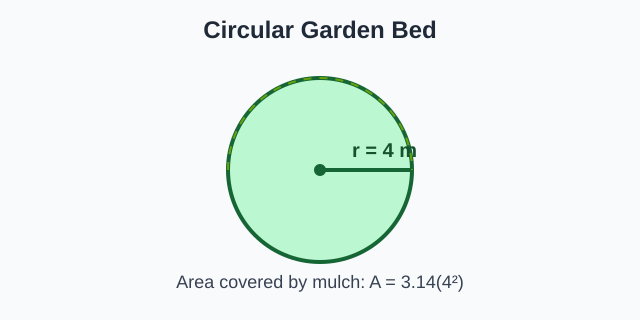
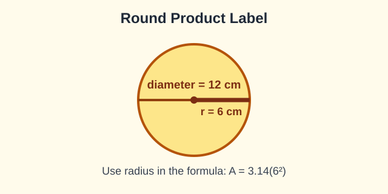
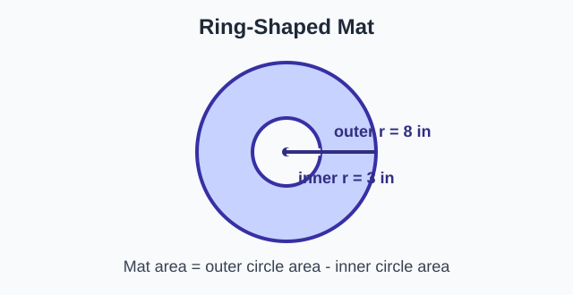
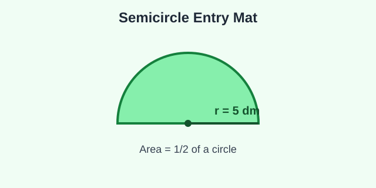
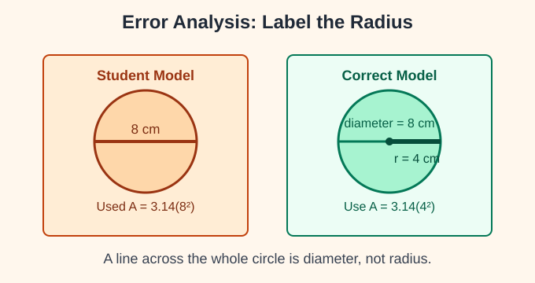

# Circle Design Problems

> [!GOAL] Lesson Goal
>
> Apply circle area to garden, label, and mat designs. You will model each problem with a labeled diagram before calculating.



## Quick Roadmap

| Part | What you will do | Model question |
|---|---|---|
| 1 | Read the design situation | What object is circular? |
| 2 | Draw and label the model | Is the given measure a radius or diameter? |
| 3 | Choose the area expression | Whole circle, semicircle, or ring? |
| 4 | Calculate and explain | What does the area mean in the design? |

> [!TARGET] Target Competency
>
> I can apply circle area to gardens, labels, and mats by drawing a labeled model and explaining my answer.

## Warm-Up Recall

Before solving design problems, make sure these ideas are ready.

| Given information | First move | Why it matters |
|---|---|---|
| Radius | Use it directly in $A = \pi r^2$ | The formula needs radius. |
| Diameter | Divide by 2 to get radius | Diameter is twice the radius. |
| Semicircle | Find half of a circle area | A semicircle is one half. |
| Ring mat | Large circle area minus small circle area | A center hole is removed. |

Use $\pi \approx 3.14$ unless the problem gives a different value.

> [!CHECK] Pre-Check
>
> A circular sticker has diameter 10 cm. What number goes into $A = 3.14r^2$?  
> Answer: $r = 5$ cm, because radius is half of diameter.

## The Big Idea: Model First

Design problems can feel like word problems, but they become easier when you turn them into a labeled diagram.

Use this routine:

1. Sketch the design shape.
2. Label the radius or diameter.
3. Write what area you need.
4. Choose a formula or subtraction expression.
5. Calculate and label with square units.

> [!IMPORTANT] Sentence Frame
>
> "My diagram shows a ____. The radius is ____. I need the area of ____."



## Interactive Lab

Use the lab to label a design, predict the area, reveal the model, complete guided checks, and finish a mini-quiz.

```interactive
{
  "spec": "interactives/circle-design-problems-lab.json",
  "mode": "auto",
  "height": 760,
  "title": "Circle Design Problems Lab"
}
```

## Worked Example 1: Circular Garden Bed



**Problem:** A school garden has a circular flower bed with radius 4 m. The class wants to cover the bed with mulch. What area must be covered? Use $\pi = 3.14$.

**Model:** The garden bed is one whole circle. The radius is 4 m.

**Area expression:**

$$A = \pi r^2$$

$$A = 3.14(4^2) = 3.14(16) = 50.24$$

**Answer:** The class must cover **50.24 square meters**.

> [!TIP] What the Answer Means
>
> In a design problem, the number is not just a calculation. It tells how much surface is covered, painted, printed, or protected.

## Worked Example 2: Round Product Label



**Problem:** A round label for a jar has diameter 12 cm. How much paper is needed for one label?

**Model:** The label is a whole circle. The diagram gives diameter, so divide by 2.

$$r = 12 \div 2 = 6 \text{ cm}$$

**Area expression:**

$$A = 3.14(6^2)$$

$$A = 3.14(36) = 113.04$$

**Answer:** One label needs **113.04 square centimeters** of paper.

> [!WARNING] Misconception Alert: Diameter Is Not Radius
>
> If you put 12 into $A = 3.14r^2$, the answer would be four times too large. Always label the radius on the diagram before calculating.

## Worked Example 3: Ring-Shaped Mat



**Problem:** A round mat has outer radius 8 in. A circular center hole has radius 3 in. Find the area of the mat.

**Model:** This is a ring. Find the large circle area, subtract the small center circle area.

**Large circle:**

$$3.14(8^2) = 3.14(64) = 200.96$$

**Center hole:**

$$3.14(3^2) = 3.14(9) = 28.26$$

**Subtract:**

$$200.96 - 28.26 = 172.70$$

**Answer:** The mat area is **172.70 square inches**.

> [!NOTE] Ring Designs
>
> A ring-shaped mat, wreath, washer, or border usually means large circle area minus small circle area.

## Worked Example 4: Semicircle Entry Mat



**Problem:** An entry mat is shaped like a semicircle with radius 5 dm. How much floor space does it cover?

**Model:** The mat is half of a circle.

$$A = \frac{1}{2}\pi r^2$$

$$A = \frac{1}{2}(3.14)(5^2) = \frac{1}{2}(3.14)(25)$$

$$A = \frac{1}{2}(78.5) = 39.25$$

**Answer:** The mat covers **39.25 square decimeters**.

## Guided Practice

Try each one before reading the check.

### Practice A: Garden Design

A circular herb garden has diameter 14 m. Find the planting area.

> [!PRACTICE] Check Your Model
>
> Diagram label: diameter $14$ m, radius $7$ m  
> Area: $3.14(7^2) = 3.14(49) = 153.86$  
> Planting area: **153.86 square meters**

### Practice B: Label Design

A circular badge label has radius 3 cm. Find the printed area for one badge.

> [!PRACTICE] Check Your Model
>
> Diagram label: radius $3$ cm  
> Area: $3.14(3^2) = 28.26$  
> Printed area: **28.26 square centimeters**

### Practice C: Mat Design

A circular mat has outer radius 6 ft and inner radius 2 ft. Find the mat area.

> [!PRACTICE] Check Your Model
>
> Large circle: $3.14(6^2) = 113.04$  
> Inner hole: $3.14(2^2) = 12.56$  
> Mat area: $113.04 - 12.56 = 100.48$ square feet

## Misconception Alerts

> [!WARNING] Trap 1: Calculating Before Labeling
>
> If you start with numbers too quickly, you may use diameter as radius. Draw and label first.

> [!WARNING] Trap 2: Forgetting What Is Being Asked
>
> A garden bed may need the whole circle area. A ring mat needs a difference of two circles.

> [!WARNING] Trap 3: Dropping Units
>
> Area answers need square units, such as square meters or square centimeters.

> [!WARNING] Trap 4: Drawing an Unlabeled Diagram
>
> The assessment asks for a labeled diagram. Label the radius, diameter, and what region the area represents.

## Error Analysis



**Problem:** A round sticker label has diameter 8 cm. Find its area.

**Student work:**

$$A = 3.14(8^2) = 200.96$$

**What went wrong?** The student used the diameter as the radius.

**Correct model:** Diameter is 8 cm, so radius is $8 \div 2 = 4$ cm.

**Correct work:**

$$A = 3.14(4^2) = 3.14(16) = 50.24$$

**Correct answer:** **50.24 square centimeters**.

> [!CHECK] Reasonableness Check
>
> If the radius is cut in half, the area changes a lot because the radius is squared.

## Self-Explanation Prompts

Answer these in your notebook or aloud.

1. What did you label on your diagram before calculating?
2. Did the problem ask for a whole circle, a semicircle, or a ring?
3. How does your formula match the diagram?
4. What does the area represent in the real design?
5. Why are square units needed?

## Extension Challenge

A school wants a circular garden sign with a ring-shaped border. The whole sign has radius 10 in. The center picture has radius 7 in. The border will be painted green.

**Task:** Draw a labeled diagram and find the area of the green border.

**Plan:**

- Label the outer radius $10$ in.
- Label the inner radius $7$ in.
- Find the large circle area.
- Find the center picture area.
- Subtract to get the border area.

**Check:** Your answer should be less than the area of the whole 10-inch-radius circle.

## Mastery Checklist

I can:

- Draw a quick model for a garden, label, or mat problem.
- Label radius and diameter correctly.
- Convert diameter to radius before using $A = \pi r^2$.
- Choose whole circle, semicircle, or ring area.
- Show subtraction when a center hole or border is involved.
- Explain what the area means in the design.
- Use square units in my final answer.
- Check that my answer is reasonable from the diagram.

## Final Summary

Circle design problems ask you to connect a real object to a geometry model. The diagram is part of the solution.

$$\text{circle area} = \pi r^2$$

For a ring-shaped design:

$$\text{ring area} = \text{large circle area} - \text{small circle area}$$

> [!PRACTICE] What To Do Next
>
> Complete the practice exam for low-stakes review. Then take the assessment when you can model each problem with a labeled diagram before solving.
