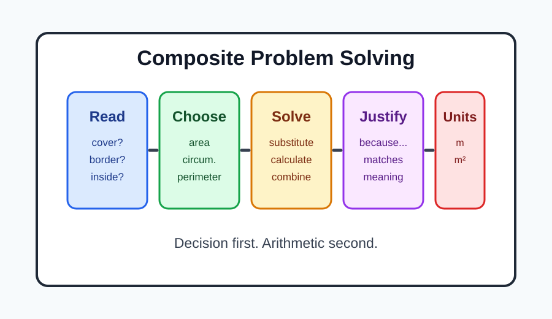
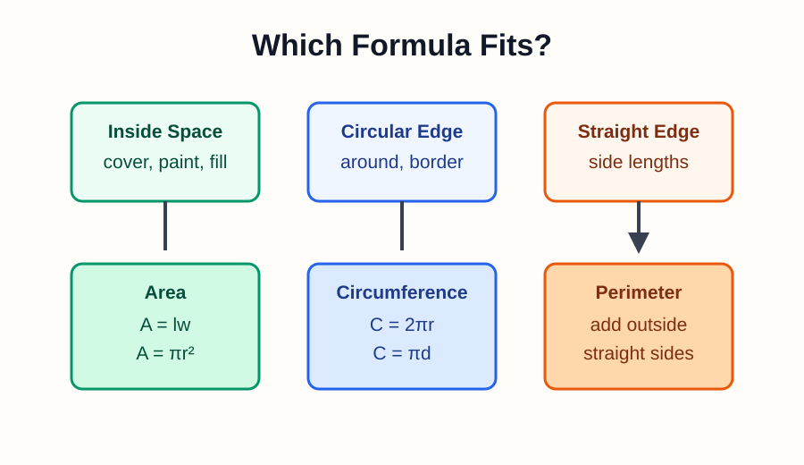
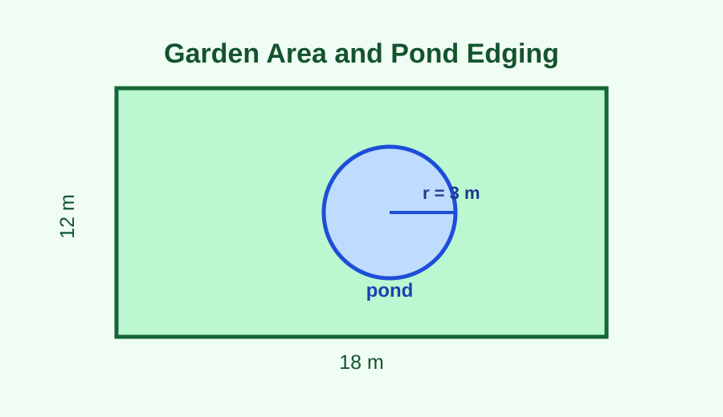
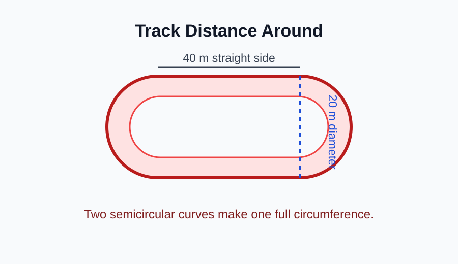
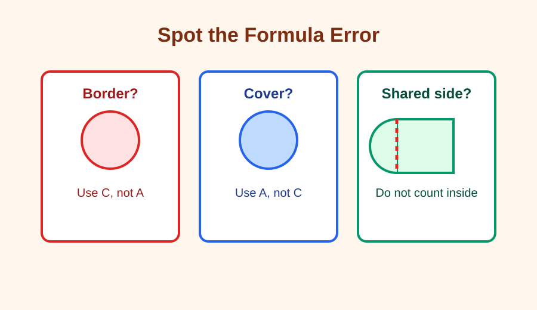
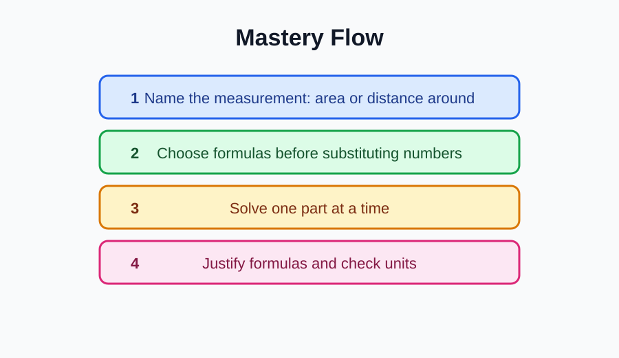

# Composite Problem Solving

> [!GOAL] Lesson Goal
>
> By the end of this lesson, you should be able to solve multi-step area and circumference problems and explain why each formula fits the situation.

## Visual Intro

Real geometry problems often ask for more than one measurement. A garden may need grass area and border length. A track may need space inside and distance around. The key is deciding what each part of the question is really asking.



> [!TARGET] Target Competency
>
> Solve multi-step area and circumference problems.
>
> **Assessment skill:** Justify the formulas you selected.

## Warm-Up Recall

Before solving, complete this quick formula check.

| Situation | Measurement | Formula | Units |
| --- | --- | --- | --- |
| Rectangle space | area | $A = l \times w$ | square units |
| Triangle space | area | $A = \frac{1}{2}bh$ | square units |
| Circle space | area | $A = \pi r^2$ | square units |
| Semicircle space | area | $A = \frac{1}{2}\pi r^2$ | square units |
| Distance around a circle | circumference | $C = 2\pi r$ or $C = \pi d$ | linear units |
| Distance around a semicircle curve | half circumference | $\frac{1}{2}\pi d$ or $\pi r$ | linear units |

Use $\pi \approx 3.14$ unless a problem tells you to use a different value.

> [!TIP] Area Or Circumference?
>
> Area measures covering, painting, flooring, grass, or space inside. Circumference measures edging, fencing, ribbon, border, or distance around.

```interactive
{
  "spec": "interactives/composite-problem-solving-lab.json",
  "mode": "auto",
  "height": 720,
  "title": "Composite Problem Solving Lab"
}
```

## Formula Decision Map



Use this thinking path before calculating:

1. **Read for the action.** Cover, fill, paint, and tile usually mean area. Fence, border, trim, and go around usually mean circumference or perimeter.
2. **Name the shapes.** Separate rectangles, triangles, circles, and semicircles.
3. **Mark the needed numbers.** Convert diameter to radius if an area formula needs $r$.
4. **Write a formula reason.** For example: "I used $C=\pi d$ because the problem asks for the circular border."
5. **Compute and label.** Area uses square units. Circumference and perimeter use regular units.

> [!IMPORTANT] The Justification Sentence
>
> A strong answer does not only show arithmetic. It tells why the formula matches the job: area for inside space, circumference for distance around, and half-circle formulas for semicircles.

## Worked Example 1: Garden With A Circular Pond



A rectangular garden is 18 m long and 12 m wide. A circular pond with radius 3 m sits inside it. The gardener wants to plant grass in the garden area not covered by the pond and place edging around the pond.

Find:

- the grass area
- the length of edging around the pond

**Step 1: Decide the measurements.**

Grass area is area. Pond edging is circumference.

**Step 2: Write formulas and reasons.**

Rectangle area: $A = l \times w$ because the garden is a rectangle.

Circle area: $A = \pi r^2$ because the pond covers circular space.

Circle circumference: $C = 2\pi r$ because edging goes around the pond.

**Step 3: Calculate area.**

Garden area:

$$18 \times 12 = 216$$

Pond area:

$$3.14(3^2) = 3.14(9) = 28.26$$

Grass area:

$$216 - 28.26 = 187.74$$

The grass area is **$187.74\text{ m}^2$**.

**Step 4: Calculate edging.**

$$C = 2(3.14)(3) = 18.84$$

The edging length is **$18.84\text{ m}$**.

> [!CHECK] Self-Explanation Prompt
>
> Explain why the grass answer uses square meters but the edging answer uses meters.

## Worked Example 2: Track With Straight Sides And Semicircles



A small track is shaped like a rectangle with a semicircle on each short end. The straight sides are each 40 m long. Each semicircle has diameter 20 m.

Find the distance around the track.

**Step 1: Decide the measurement.**

Distance around means perimeter. The curved parts use circumference.

**Step 2: Combine the curved parts.**

Two semicircles make one full circle with diameter 20 m.

**Step 3: Write formulas and reasons.**

Straight parts: $40 + 40$ because both straight sides are part of the outside boundary.

Circle circumference: $C = \pi d$ because the two semicircular curves combine to one full circular boundary.

**Step 4: Calculate.**

$$40 + 40 + 3.14(20) = 80 + 62.8 = 142.8$$

The distance around the track is **$142.8\text{ m}$**.

> [!WARNING] Common Mistake
>
> Do not add the two 20 m diameters as outside edges. In this track shape, the diameters are inside the figure where the rectangle joins the semicircles, so they are not part of the outside boundary.

## Guided Practice

Try the problem first. Then check the reveal.

A playground has a rectangular sand area that is 14 m by 9 m. A semicircular climbing area is attached to one 14 m side. The semicircle has diameter 14 m.

Find:

1. the total play area
2. the length of rubber border needed around the outside

### Try Before Reveal

Answer these in your notebook:

- Which parts need area formulas?
- Which outside edges need length formulas?
- What is the radius of the semicircle?
- Which formula should be justified for the curved border?

### Reveal

The semicircle radius is $14 \div 2 = 7$ m.

Rectangle area:

$$14 \times 9 = 126$$

Semicircle area:

$$\frac{1}{2}(3.14)(7^2) = \frac{1}{2}(3.14)(49) = 76.93$$

Total play area:

$$126 + 76.93 = 202.93\text{ m}^2$$

Outside border:

Three rectangle sides are outside: $9 + 14 + 9 = 32$ m.

The curved border is half the circumference of a circle with diameter 14 m:

$$\frac{1}{2}(3.14)(14) = 21.98$$

Total border:

$$32 + 21.98 = 53.98\text{ m}$$

> [!PRACTICE] Justify It
>
> A complete explanation says: "I used rectangle and semicircle area formulas because the first question asks for covered space. I used side lengths and half circumference because the second question asks for the outside border."

## Misconception Alerts



| Mistake | Why it is wrong | Better move |
| --- | --- | --- |
| Using $A=\pi r^2$ for a border | Area measures inside space, not distance around | Use circumference for circular borders |
| Using $C=2\pi r$ for a cover | Circumference measures only the edge | Use area for covering, painting, or grass |
| Counting shared sides | Shared sides are inside the composite figure | Trace only the outside boundary |
| Forgetting to halve a semicircle | A semicircle is half of a circle | Use half area or half circumference when needed |
| Mixing units | Different measurements have different units | Area uses square units; length uses linear units |

> [!WARNING] Error Analysis
>
> Marco says a circular fountain with diameter 10 m needs $3.14(10^2)=314\text{ m}^2$ of metal edging.
>
> What went wrong?
>
> Edging is distance around, so it needs circumference, not area. The correct edging length is $C=\pi d=3.14(10)=31.4\text{ m}$.

## Self-Explanation Prompts

Pause and answer each in one or two sentences.

1. What words in a problem tell you to find area?
2. What words tell you to find circumference or perimeter?
3. Why can two semicircles sometimes be treated as one full circle?
4. How do you decide whether a diameter is part of the outside border?
5. What unit check can catch a formula mistake?

## Extension Challenge

A school wants to paint a logo on the gym floor. The logo is a rectangle that is 16 ft by 10 ft with a semicircle attached to each 10 ft side. The school also wants a tape border around the outside of the logo.

Find:

- the painted area
- the tape border length

Use $\pi \approx 3.14$.

**Hint:** The two semicircles together make one full circle with diameter 10 ft.

**Challenge answer:**

Painted area:

$$16(10) + 3.14(5^2) = 160 + 78.5 = 238.5\text{ ft}^2$$

Tape border:

$$16 + 16 + 3.14(10) = 32 + 31.4 = 63.4\text{ ft}$$

## Mastery Checklist



You are ready for the practice exam when you can:

- identify whether a problem asks for area, circumference, perimeter, or more than one measurement
- choose formulas before substituting numbers
- convert diameter to radius when an area formula needs radius
- use half-circle formulas for semicircles
- avoid counting shared sides as outside border
- justify formulas in words, not only with numbers
- label area answers with square units and length answers with regular units

## Final Summary

Multi-step composite problems are decision problems first and calculation problems second. Read the action, name the shapes, choose formulas that match the measurement, and justify each choice. When your formulas and units agree with the story, your answer is much more likely to be correct.

> [!PRACTICE] Exam Plan
>
> Use the practice exam for formula selection and short computations. Use the assessment when you can also explain why each formula belongs in the solution.
