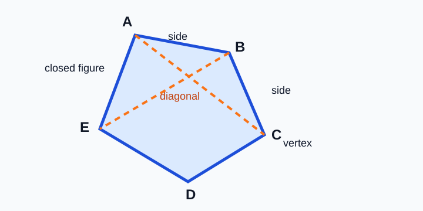

# Polygon Vocabulary

> [!GOAL] Learning Goal
>
> By the end of this lesson, you should be able to define key polygon terms and use them to describe examples, non-examples, regular polygons, and irregular polygons.

## Visual Model

A polygon is easier to read when the sides, vertices, and diagonals are visible.

## Study Setup

| Item | Details |
|---|---|
| Time | About 35 minutes |
| Materials | Board or slides, ruler, graph paper, calculator when needed, and manipulatives or a digital geometry tool if available |
| Main skill | Naming and describing polygon parts |

## Opening: Notice the Shapes

Look around a classroom or home. A tile, stop sign, notebook cover, and window frame all have edges and corners.

What geometric idea do you notice when a shape is made only of straight line segments that close up without gaps?

Reveal thinking guide

The important clues are **straight sides**, **closed shape**, and **corners**. These clues point to polygons.

## What You Should Already Know

- A line segment is a straight part of a line with two endpoints.
- A closed figure has no gaps.
- A corner is where two sides meet.
- Measurements can help compare side lengths and angle sizes.

### Pre-check / Readiness Quiz

Answer before reading further.

1. Does a circle have straight sides?
2. How many sides does a triangle have?
3. How many corners does a rectangle have?

Reveal answers

1. No. A circle is curved.
2. A triangle has 3 sides.
3. A rectangle has 4 corners.

## Key Vocabulary

| Term | Meaning |
|---|---|
| Polygon | A closed plane figure made only of straight line segments |
| Side | One straight line segment that forms part of a polygon |
| Vertex | A corner where two sides meet |
| Vertices | More than one vertex |
| Diagonal | A line segment that connects two non-adjacent vertices of a polygon |
| Regular polygon | A polygon with all sides equal and all angles equal |
| Irregular polygon | A polygon that does not have all sides equal and all angles equal |

> [!IMPORTANT] Core Idea
>
> A polygon must be closed and must use only straight sides. Curves, gaps, and crossing into a shape that is not one closed boundary can make a figure a non-example.

## Model the Concept

Imagine a pentagon labeled \(A, B, C, D, E\) around the outside.

- The sides are \(\overline{AB}, \overline{BC}, \overline{CD}, \overline{DE}, \overline{EA}\).
- The vertices are \(A, B, C, D,\) and \(E\).
- A diagonal could be \(\overline{AC}\), because \(A\) and \(C\) are not next to each other.
- \(\overline{AB}\) is not a diagonal, because \(A\) and \(B\) are adjacent vertices.

## Worked Example

**Problem:** A closed shape has 6 straight sides. All 6 sides are equal, and all 6 angles are equal. Describe the shape using polygon vocabulary.

**Solution:**

1. It is closed and made of straight sides, so it is a polygon.
2. It has 6 sides, so it is a hexagon.
3. All sides and all angles are equal, so it is regular.

**Answer:** The shape is a **regular hexagon**.

> [!TIP] Common Trap
>
> Equal sides alone are not enough to prove a polygon is regular. A regular polygon needs both equal sides and equal angles.

## Pair Task: Build the Vocabulary

Work with a partner or complete both roles yourself.

| Step | Task |
|---|---|
| 1 | Draw a five-sided polygon on graph paper. |
| 2 | Label the vertices \(A, B, C, D, E\). |
| 3 | Trace one side in a different color or mark it with a ruler. |
| 4 | Draw one diagonal and explain why it is not a side. |
| 5 | Decide whether your polygon is regular or irregular. Give one measurement-based reason. |

## Practice in the Lesson

Try these before opening the practice quiz.

1. Is a heart shape a polygon? Explain.
2. Draw a quadrilateral and label all vertices.
3. In quadrilateral \(WXYZ\), is \(\overline{WX}\) a side or a diagonal?
4. In quadrilateral \(WXYZ\), is \(\overline{WY}\) a side or a diagonal?
5. Draw one irregular pentagon and write one sentence explaining why it is irregular.

Reveal sample answers

1. No, if it has curved parts. Polygons must use straight sides only.
2. Answers vary. A correct quadrilateral has 4 straight sides and 4 vertices.
3. \(\overline{WX}\) is a side because \(W\) and \(X\) are adjacent.
4. \(\overline{WY}\) is a diagonal because \(W\) and \(Y\) are not adjacent.
5. Answers vary. A valid explanation names unequal sides or unequal angles.

## Self-Check

You are ready for the practice quiz when you can:

- define polygon, side, vertex, and diagonal;
- identify examples and non-examples of polygons;
- explain why a diagonal connects non-adjacent vertices;
- tell whether a simple polygon is regular or irregular using side and angle information.

> [!PRACTICE] Next Step
>
> Complete the practice quiz first. Then take the assessment to check whether you can classify examples and non-examples on your own.
