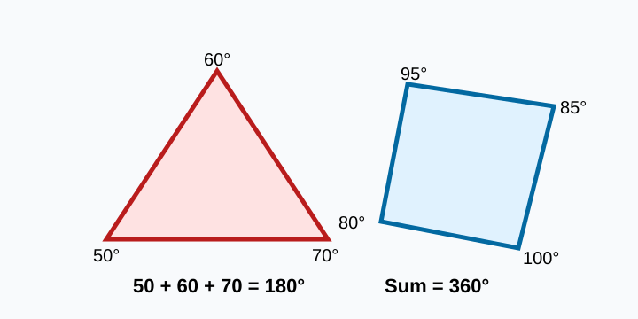

# Triangles and Quadrilaterals by Angles

> [!GOAL] Lesson Goal
>
> Construct or sketch triangles and quadrilaterals from angle conditions, then explain whether the figure is possible.

## Visual Model

A figure can be constructed only when its angle conditions match the shape rules.

## Quick Look

A roof truss, a kite frame, and a folded paper corner all use angles. If the angle conditions do not fit the shape, the drawing cannot be made correctly.

Ask yourself: **What angle sum must this shape have?**

| Shape | Number of sides | Angle sum |
| --- | ---: | ---: |
| Triangle | 3 | 180 degrees |
| Quadrilateral | 4 | 360 degrees |

## What You Should Already Know

Try these before reading on.

1. What type of angle is 90 degrees?
2. What type of angle is greater than 90 degrees but less than 180 degrees?
3. Can an angle inside a polygon be 0 degrees?

Answers: 90 degrees is a right angle. An angle between 90 and 180 degrees is obtuse. An interior angle must be greater than 0 degrees.

## Core Idea 1: Triangles Must Total 180 Degrees

For any triangle:

$$a + b + c = 180^\circ$$

If three given angles add to 180 degrees and each angle is greater than 0 degrees, a triangle with those angle measures is possible.

> [!EXAMPLE] Worked Example
>
> Can you construct a triangle with angles 45 degrees, 60 degrees, and 75 degrees?
>
> Add: \(45 + 60 + 75 = 180\).
>
> Yes. The angles fit the triangle angle sum.

> [!WARNING] Common Trap
>
> A triangle with angles 90 degrees, 60 degrees, and 40 degrees is impossible because \(90 + 60 + 40 = 190\), not 180.

## Core Idea 2: Quadrilaterals Must Total 360 Degrees

For any quadrilateral:

$$a + b + c + d = 360^\circ$$

If four given angles add to 360 degrees and each angle is greater than 0 degrees, a quadrilateral with those angle measures is possible.

> [!EXAMPLE] Worked Example
>
> Can you construct a quadrilateral with angles 80 degrees, 100 degrees, 90 degrees, and 90 degrees?
>
> Add: \(80 + 100 + 90 + 90 = 360\).
>
> Yes. The angle conditions fit a quadrilateral.

## Core Idea 3: Find a Missing Angle Before Drawing

Sometimes one angle is missing. Use the required angle sum.

### Triangle Example

A triangle has angles 35 degrees, 65 degrees, and \(x\).

$$35 + 65 + x = 180$$

$$100 + x = 180$$

$$x = 80$$

The missing angle is 80 degrees.

### Quadrilateral Example

A quadrilateral has angles 70 degrees, 95 degrees, 105 degrees, and \(x\).

$$70 + 95 + 105 + x = 360$$

$$270 + x = 360$$

$$x = 90$$

The missing angle is 90 degrees.

## Construction Check

When you draw from angle conditions:

1. Choose the correct shape: triangle or quadrilateral.
2. Check the angle sum first.
3. Make sure no angle is 0 degrees or negative.
4. Use a ruler for sides and a protractor for angles.
5. Label each angle measure on your sketch.
6. Explain your answer using the angle sum rule.

> [!CHECK] Mini Check
>
> Decide whether each construction is possible.
>
> 1. Triangle: 50 degrees, 50 degrees, 80 degrees
> 2. Triangle: 100 degrees, 45 degrees, 45 degrees
> 3. Quadrilateral: 120 degrees, 80 degrees, 90 degrees, 70 degrees
> 4. Quadrilateral: 100 degrees, 100 degrees, 100 degrees, 70 degrees
>
> Answers: 1 possible, 2 impossible, 3 possible, 4 impossible.

## Pair Task

With a partner, create two angle-condition cards:

- one possible triangle or quadrilateral
- one impossible triangle or quadrilateral

Trade cards. For each card, write an equation and explain whether the construction is possible.

## Final Checklist

Before practice, make sure you can:

- state the triangle angle sum
- state the quadrilateral angle sum
- find a missing angle
- decide whether angle conditions are possible
- explain your decision using an equation

> [!PRACTICE] Next Step
>
> Complete the practice questions first. Then use the assessment as your checkpoint.
