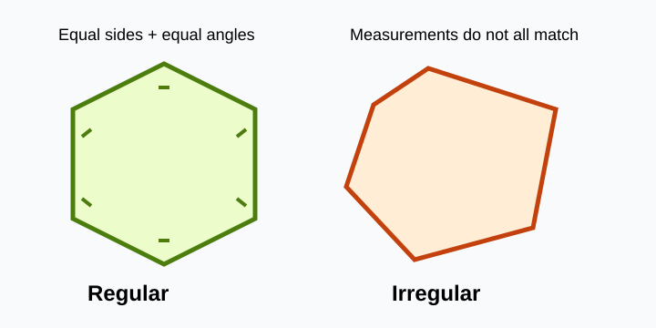

# Regular Polygons

> [!GOAL] Lesson Goal
>
> You will learn how to decide whether a polygon is **regular** by comparing its side lengths and angle measures.

## Visual Model

Regular polygons have equal sides and equal angles; irregular polygons fail at least one test.

## Start With a Shape Check

Look at a floor tile, a stop sign, or a honeycomb pattern. Some shapes look balanced because every side and every angle match. Other shapes have the same number of sides but still look stretched, slanted, or uneven.

Answer these before you continue:

1. What tools could you use to check whether all sides are equal?
2. What tools could you use to check whether all angles are equal?
3. If a polygon has equal sides but unequal angles, should it be called regular?

## Key Vocabulary

| Term | Meaning | Quick Check |
| --- | --- | --- |
| Polygon | A closed figure made only of straight line segments | No curves, no gaps |
| Side | One straight segment of the polygon | Measure with a ruler |
| Vertex | A corner where two sides meet | Count the corners |
| Regular polygon | A polygon with all sides equal and all angles equal | Both tests must pass |
| Irregular polygon | A polygon that fails at least one regularity test | Unequal sides or unequal angles |

> [!IMPORTANT] Regular Means Two Things
>
> A polygon is regular only when **all sides are congruent** and **all interior angles are congruent**. Matching sides alone is not enough. Matching angles alone is not enough.

## What Makes a Polygon Regular?

A regular polygon has:

- the same side length on every side
- the same interior angle measure at every vertex
- straight sides and a closed shape

Examples:

| Shape | Regular when... |
| --- | --- |
| Triangle | all 3 sides are equal and all 3 angles are equal |
| Quadrilateral | all 4 sides are equal and all 4 angles are equal, like a square |
| Pentagon | all 5 sides are equal and all 5 angles are equal |
| Hexagon | all 6 sides are equal and all 6 angles are equal |
| Octagon | all 8 sides are equal and all 8 angles are equal |

## Worked Example 1: Check a Pentagon

A pentagon has these measurements:

| Side Lengths | Interior Angles |
| --- | --- |
| 4 cm, 4 cm, 4 cm, 4 cm, 4 cm | 108°, 108°, 108°, 108°, 108° |

**Question:** Is the pentagon regular?

**Step 1: Compare side lengths.**  
All side lengths are 4 cm, so the side test passes.

**Step 2: Compare angle measures.**  
All interior angles are 108°, so the angle test passes.

**Conclusion:** The pentagon is regular because all sides are equal and all angles are equal.

## Worked Example 2: Same Number of Sides, Not Regular

A hexagon has these measurements:

| Side Lengths | Interior Angles |
| --- | --- |
| 3 cm, 3 cm, 4 cm, 3 cm, 3 cm, 4 cm | 120°, 120°, 120°, 120°, 120°, 120° |

**Question:** Is the hexagon regular?

The angle measures are all equal, but the side lengths are not all equal. Some sides are 3 cm and some are 4 cm.

**Conclusion:** The hexagon is irregular because it fails the equal-side test.

> [!WARNING] Common Mistake
>
> Do not decide regularity by appearance only. A shape can look almost regular but fail when measured. Use ruler and protractor evidence.

## How to Test Regularity

Use this checklist whenever you classify a polygon.

1. Count the sides to name the polygon.
2. Measure every side with the same unit.
3. Measure every interior angle with a protractor.
4. Compare the side lengths.
5. Compare the angle measures.
6. Classify the polygon:
   - **regular** if all sides and all angles match
   - **irregular** if at least one side or angle does not match

## Guided Task

Draw or copy a 5-sided polygon on graph paper. Then complete this table.

| Measurement | Result |
| --- | --- |
| Side 1 | |
| Side 2 | |
| Side 3 | |
| Side 4 | |
| Side 5 | |
| Angle 1 | |
| Angle 2 | |
| Angle 3 | |
| Angle 4 | |
| Angle 5 | |
| Classification | Regular or irregular? |
| Evidence | Which measurements support your answer? |

> [!TIP] Measurement Tolerance
>
> Small drawing errors happen. If a classroom task says to draw a regular polygon by hand, your teacher may allow a small tolerance such as 1 mm or 1°. For exact classification problems, use the measurements given in the question.

## Mini Practice

Classify each polygon as regular or irregular.

1. A triangle has sides 6 cm, 6 cm, 6 cm and angles 60°, 60°, 60°.
2. A quadrilateral has sides 5 cm, 5 cm, 5 cm, 5 cm and angles 80°, 100°, 80°, 100°.
3. A pentagon has all sides 7 cm and all angles 108°.
4. An octagon has all angles 135° but side lengths 2 cm, 2 cm, 3 cm, 2 cm, 2 cm, 3 cm, 2 cm, 2 cm.

Check your reasoning:

1. Regular, because all sides and all angles match.
2. Irregular, because the angles are not all equal.
3. Regular, because both tests pass.
4. Irregular, because the side lengths are not all equal.

## Regular vs. Irregular Summary

| Question | Regular Polygon | Irregular Polygon |
| --- | --- | --- |
| Are all sides equal? | Yes | Not always |
| Are all angles equal? | Yes | Not always |
| Can it have 5, 6, 8, or 10 sides? | Yes | Yes |
| Is the name based only on side count? | No | No |
| What evidence is best? | Side and angle measurements | Side or angle measurements that do not match |

## Exit Check

Before taking the practice quiz, make sure you can do these:

- I can explain why a regular polygon needs equal sides and equal angles.
- I can measure sides and angles to test a polygon.
- I can classify a polygon as regular or irregular using evidence.
- I can avoid calling a polygon regular just because it looks balanced.

> [!PRACTICE] Next Step
>
> Take the practice questions first. Use each explanation to fix mistakes. Then take the assessment when you can justify regular and irregular classifications with measurements.
