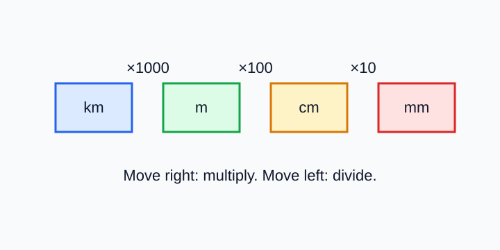

# Measurement Systems

> [!GOAL] Learning Goal
>
> By the end of this lesson, you should be able to name common SI units and complete simple metric conversion ladders.

## Visual Model

A conversion ladder keeps track of whether each move multiplies or divides by 10, 100, or 1000.

## Study Setup

| Item | Details |
|---|---|
| Time | About 35 minutes |
| Materials | Board or slides, ruler, graph paper, calculator when needed, and manipulatives or a digital geometry tool if available |
| Main skill | Converting measurements within the metric system |

## Opening: Same Object, Different Unit

Think about a water bottle. Its height might be measured in **centimeters**, its water capacity in **milliliters**, and its packed weight in **grams**.

What geometric or measurement idea do you notice?

Reveal thinking guide

The same object can be described using different kinds of measurement. The unit must match what is being measured: length, capacity, mass, area, or volume.

## What You Should Already Know

- Multiplying by 10 moves a decimal one place to the right.
- Dividing by 10 moves a decimal one place to the left.
- A larger unit needs fewer units to describe the same amount.
- A smaller unit needs more units to describe the same amount.

### Pre-check / Readiness Quiz

Answer before reading further.

1. Which is longer: \(1\) meter or \(1\) centimeter?
2. How many centimeters are in \(1\) meter?
3. Which unit is better for the mass of a pencil: grams or kilograms?

Reveal answers

1. \(1\) meter is longer.
2. \(1\) meter equals \(100\) centimeters.
3. Grams are better because a pencil has a small mass.

## Core Metric Units

The International System of Units, or SI, is the measurement system used in science and in many everyday settings.

| Measurement | Common SI unit | Symbol | Example use |
|---|---:|---:|---|
| Length | meter | m | height of a door |
| Mass | gram | g | mass of a notebook |
| Capacity | liter | L | amount of water in a bottle |
| Area | square meter | m² | size of a classroom floor |
| Volume | cubic meter | m³ | space inside a large box |

> [!IMPORTANT] Core Idea
>
> A conversion changes the unit, not the actual amount. \(1\) meter and \(100\) centimeters describe the same length.

## Metric Prefix Ladder

Many metric units use the same prefixes.

| Prefix | Meaning | Relationship to the base unit |
|---|---:|---|
| kilo- | thousand | \(1\text{ km} = 1000\text{ m}\) |
| hecto- | hundred | \(1\text{ hm} = 100\text{ m}\) |
| deka- | ten | \(1\text{ dam} = 10\text{ m}\) |
| base unit | one | meter, gram, or liter |
| deci- | tenth | \(10\text{ dm} = 1\text{ m}\) |
| centi- | hundredth | \(100\text{ cm} = 1\text{ m}\) |
| milli- | thousandth | \(1000\text{ mm} = 1\text{ m}\) |

For Grade 7 work, the most common paths are:

- kilometers \(\leftrightarrow\) meters
- meters \(\leftrightarrow\) centimeters
- centimeters \(\leftrightarrow\) millimeters
- kilograms \(\leftrightarrow\) grams
- liters \(\leftrightarrow\) milliliters

## Worked Example: Complete a Conversion Ladder

**Problem:** Complete the path from \(3.4\) meters to centimeters.

**Conversion fact:** \(1\text{ m} = 100\text{ cm}\)

**Solution:**

1. Centimeters are smaller than meters.
2. Smaller units need a larger number.
3. Multiply by \(100\).

\[
3.4\text{ m} \times 100 = 340\text{ cm}
\]

**Answer:** \(3.4\text{ m} = 340\text{ cm}\)

> [!TIP] Direction Check
>
> If you convert from a larger unit to a smaller unit, multiply. If you convert from a smaller unit to a larger unit, divide.

## Model Another Path

**Problem:** Convert \(7500\) grams to kilograms.

**Conversion fact:** \(1000\text{ g} = 1\text{ kg}\)

Grams are smaller than kilograms, so the number should get smaller.

\[
7500\text{ g} \div 1000 = 7.5\text{ kg}
\]

**Answer:** \(7500\text{ g} = 7.5\text{ kg}\)

## Pair Task: Build a Conversion Ladder

Work with a partner or complete both roles yourself.

| Step | Task |
|---|---|
| 1 | Draw a ladder with these units: km, m, cm, mm. |
| 2 | Mark that \(1\text{ km} = 1000\text{ m}\). |
| 3 | Mark that \(1\text{ m} = 100\text{ cm}\). |
| 4 | Mark that \(1\text{ cm} = 10\text{ mm}\). |
| 5 | Convert \(2.5\text{ m}\) to centimeters, then to millimeters. |

Reveal scaffolded answer

\(2.5\text{ m} = 250\text{ cm}\), and \(250\text{ cm} = 2500\text{ mm}\).

## Practice in the Lesson

Try these before opening the practice quiz.

1. Convert \(6\text{ m}\) to centimeters.
2. Convert \(450\text{ cm}\) to meters.
3. Convert \(2.8\text{ L}\) to milliliters.
4. Convert \(5600\text{ g}\) to kilograms.
5. Choose the better unit: the length of a basketball court in meters or millimeters?

Reveal sample answers

1. \(600\text{ cm}\)
2. \(4.5\text{ m}\)
3. \(2800\text{ mL}\)
4. \(5.6\text{ kg}\)
5. Meters are better because the court is large.

## Common Misconceptions

| Mistake | Better thinking |
|---|---|
| Multiplying every time | First decide whether the new unit is smaller or larger. |
| Dropping the unit | A number without a unit does not fully answer a measurement question. |
| Mixing dimensions | Do not convert meters directly to square meters. Length, area, and volume measure different things. |
| Thinking a bigger number means a bigger object | \(100\text{ cm}\) and \(1\text{ m}\) are the same length. |

## Final Checklist

You are ready for the practice quiz when you can:

- name the common SI units for length, mass, capacity, area, and volume;
- use \(1\text{ m} = 100\text{ cm}\), \(1\text{ cm} = 10\text{ mm}\), \(1\text{ km} = 1000\text{ m}\), \(1\text{ kg} = 1000\text{ g}\), and \(1\text{ L} = 1000\text{ mL}\);
- decide whether to multiply or divide during a conversion;
- complete a simple conversion ladder and include correct units.

> [!PRACTICE] Next Step
>
> Complete the practice quiz first. Then take the assessment to check whether you can complete conversion ladders on your own.
