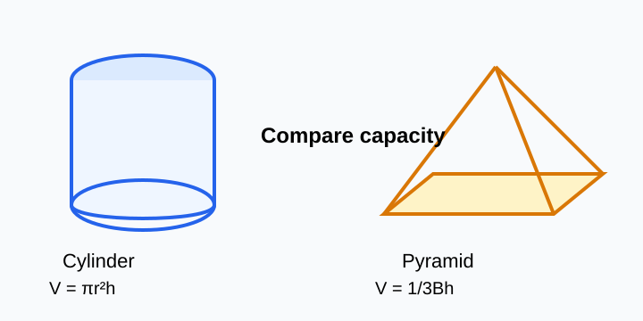

# Measurement and Geometry - Lesson 10: Volume Design Task

> [!GOAL]
> Compare a cylinder container and a pyramid container. Calculate capacity, convert units when needed, and justify which design fits a real need.

## Visual Model

A design choice should compare computed capacities against the required amount.

## Design Situation

A school club wants a container for a display table. Two possible designs are being considered:

- a cylindrical container, like a can or round cup
- a square or rectangular pyramid container, like a pointed display holder

Your job is to compare the containers fairly. A good design answer does more than choose the larger shape. It shows the math, uses correct units, and explains which container fits the need.

## Warm-Up: Notice the Shape

Look around for containers: cans, boxes, cups, bins, cones, and display stands.

Ask:

- Which containers have circular bases?
- Which containers have rectangular or square bases?
- Which ones would hold the most if the base and height were similar?
- What unit would make sense: `cm^3`, `mL`, or `L`?

## Formula Review

| Shape | Volume formula | What each part means |
|---|---|---|
| Cylinder | `V = pi r^2 h` | `r` is radius, `h` is height |
| Square pyramid | `V = (1/3)s^2h` | `s^2` is square base area, `h` is vertical height |
| Rectangular pyramid | `V = (1/3)lwh` | `lw` is rectangular base area, `h` is vertical height |

> [!IMPORTANT]
> For pyramids, use the vertical height from the base straight up to the top point. Do not use a slanted edge unless the problem clearly tells you how to convert it.

## Capacity Conversions

When dimensions are in centimeters, volume is in cubic centimeters.

| Volume | Capacity |
|---|---|
| `1 cm^3` | `1 mL` |
| `1000 cm^3` | `1000 mL` |
| `1000 mL` | `1 L` |

So:

- `850 cm^3 = 850 mL = 0.85 L`
- `1,250 cm^3 = 1,250 mL = 1.25 L`

## Worked Comparison: Cylinder vs Pyramid

A design team needs a container that can hold at least `600 mL` of dry beans.

Option A is a cylinder with radius `4 cm` and height `12 cm`.

Option B is a rectangular pyramid with length `12 cm`, width `10 cm`, and height `15 cm`.

Use `pi = 3.14`.

### Step 1: Find the Cylinder Volume

`V = pi r^2 h`

`V = 3.14(4^2)(12)`

`V = 3.14(16)(12)`

`V = 602.88`

The cylinder volume is `602.88 cm^3`, so its capacity is about `602.88 mL`.

### Step 2: Find the Pyramid Volume

`V = (1/3)lwh`

`V = (1/3)(12)(10)(15)`

`V = (1/3)(1800)`

`V = 600`

The rectangular pyramid volume is `600 cm^3`, so its capacity is `600 mL`.

### Step 3: Compare to the Need

The design needs at least `600 mL`.

| Design | Capacity | Meets the need? |
|---|---:|---|
| Cylinder | `602.88 mL` | Yes |
| Rectangular pyramid | `600 mL` | Yes, exactly |

### Step 4: Justify the Choice

Both containers meet the capacity requirement. The cylinder holds slightly more, so it gives a small safety margin. If the goal is to avoid overflow, the cylinder is the better choice. If the goal is to use the exact amount of material and make a pointed display shape, the rectangular pyramid could also work.

> [!TIP]
> A strong design answer says what matters most: capacity, extra space, material use, stability, or matching the required shape.

## Design Reasoning Checklist

Use this checklist whenever you compare two containers.

1. Write the formula for each shape.
2. Substitute the correct dimensions.
3. Use radius, not diameter, for a cylinder.
4. Use base area times vertical height, then multiply by `1/3`, for a pyramid.
5. Label volume with cubic units.
6. Convert `cm^3` to `mL` or `L` when the problem asks about capacity.
7. Compare each capacity to the required amount.
8. Write a sentence that explains the better design for the situation.

## Mini Design Task

A snack booth needs a container that holds at least `1 L` of popcorn.

Design A: cylinder with radius `5 cm` and height `13 cm`.

Design B: square pyramid with side length `18 cm` and height `10 cm`.

Use `pi = 3.14`.

### Work Space

Cylinder:

`V = 3.14(5^2)(13) = 3.14(25)(13) = 1020.5 cm^3`

Capacity: `1020.5 mL = 1.0205 L`

Square pyramid:

`V = (1/3)(18^2)(10) = (1/3)(324)(10) = 1080 cm^3`

Capacity: `1080 mL = 1.08 L`

Both hold at least `1 L`. The square pyramid holds slightly more, but the cylinder may be easier to fill and less likely to spill. A good final choice depends on which design goal is more important.

## Rubric for Your Final Design Answer

| Criteria | 2 points | 1 point | 0 points |
|---|---|---|---|
| Formulas | Correct formula for both shapes | One formula is correct | Formulas are missing or incorrect |
| Computation | Accurate substitution and volume for both shapes | Minor arithmetic or substitution error | Major errors prevent comparison |
| Units and conversions | Cubic units and capacity units are correct | Units are partly correct | Units are missing or incorrect |
| Comparison | Clearly compares both designs to the need | Compares only sizes, not the need | No clear comparison |
| Justification | Choice is supported by math and context | Choice has math but weak context | Choice is unsupported |

## Common Mistakes

> [!WARNING]
> Do not compare a cylinder volume in `cm^3` to a requirement in liters without converting. For centimeter measurements, remember that `1000 cm^3 = 1 L`.

> [!WARNING]
> Do not forget the `1/3` in pyramid volume. A pyramid with the same base and height as a prism has one-third of the prism's volume.

> [!CHECK]
> If your answer says a hand-held container holds hundreds of liters, stop and check your unit conversion.

## Final Checklist

Before taking the practice exam, make sure you can:

- calculate cylinder volume from radius or diameter and height
- calculate square and rectangular pyramid volume
- convert between `cm^3`, `mL`, and `L`
- compare two capacities to a required amount
- justify a design choice using both math and context

> [!PRACTICE]
> Use the practice questions to check volume and conversion skills. Use the assessment when you are ready to compare designs and defend a container choice.
