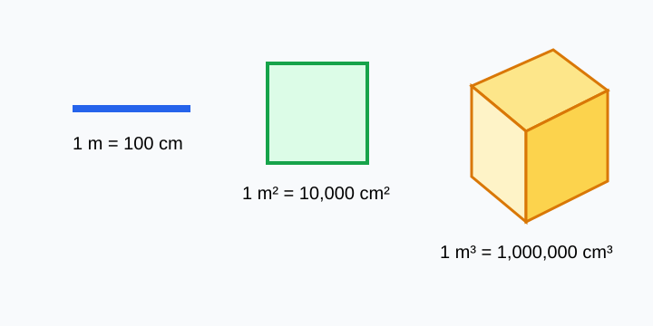

# Length, Area, and Volume Conversion

> [!GOAL] Learning Goal
>
> By the end of this lesson, you should be able to tell whether a measurement is linear, square, or cubic, then use the correct conversion factor.

## Visual Model

When a unit is squared or cubed, the conversion factor is squared or cubed too.

## Estimated Time and Materials

| Item | Details |
|---|---|
| Time | About 40 minutes |
| Difficulty | Beginner |
| Main skill | Converting length, area, and volume units |
| Materials | Pencil, ruler, graph paper, calculator when needed |

## What You Should Already Know

Before this lesson, review these facts:

- \(100\text{ cm} = 1\text{ m}\)
- \(1{,}000\text{ mm} = 1\text{ m}\)
- Length measures one direction.
- Area measures a flat surface.
- Volume measures space inside a solid.

### Pre-check / Readiness Quiz

Try these before reading the lesson.

1. How many centimeters are in 1 meter?
2. Which unit measures area: cm, cm^2, or cm^3?
3. Which unit measures volume: m, m^2, or m^3?
4. What is \(10 \times 10\)?

Reveal pre-check answers

1. There are 100 centimeters in 1 meter.
2. cm^2 measures area.
3. m^3 measures volume.
4. \(10 \times 10 = 100\).

If you missed more than one item, review metric prefixes and the meanings of length, area, and volume before continuing.

## Opening: Same Object, Different Measures

Imagine a small box on your desk.

- Its **height** might be measured in centimeters.
- The **top face** might be measured in square centimeters.
- The **space inside** might be measured in cubic centimeters.

The object is the same, but each measurement tells a different story.

> [!TARGET] Lesson Target
>
> Distinguish **linear**, **square**, and **cubic** conversions, then solve mixed conversion drills accurately.

## Three Kinds of Units

| Measurement type | What it measures | Common units | Dimensions involved |
|---|---|---|---|
| Length | Distance in one direction | cm, m, km | 1 dimension |
| Area | Flat surface | cm^2, m^2 | 2 dimensions |
| Volume | Space inside a solid | cm^3, m^3 | 3 dimensions |

The unit tells you what kind of conversion to use.

## Core Idea: The Factor Changes With the Dimension

Since \(100\text{ cm} = 1\text{ m}\), the linear conversion factor between centimeters and meters is 100.

But area and volume are built from repeated lengths:

- Area uses **length times length**, so the conversion factor is squared.
- Volume uses **length times length times length**, so the conversion factor is cubed.

| Conversion | Factor from meters to centimeters | Why |
|---|---:|---|
| \(1\text{ m}\) to cm | \(100\) | One length |
| \(1\text{ m}^2\) to cm^2 | \(100^2 = 10{,}000\) | Two lengths |
| \(1\text{ m}^3\) to cm^3 | \(100^3 = 1{,}000{,}000\) | Three lengths |

> [!WARNING] Common Trap
>
> Do not use 100 for every conversion. From cm to m uses 100, but from cm^2 to m^2 uses \(100^2\), and from cm^3 to m^3 uses \(100^3\).

## Worked Example 1: Convert Length

**Task:** Convert \(350\text{ cm}\) to meters.

Since \(100\text{ cm} = 1\text{ m}\), divide by 100:

\[
350 \div 100 = 3.5
\]

So:

\[
350\text{ cm} = 3.5\text{ m}
\]

## Worked Example 2: Convert Area

**Task:** Convert \(45{,}000\text{ cm}^2\) to square meters.

The linear conversion is \(100\text{ cm} = 1\text{ m}\).

For area:

\[
1\text{ m}^2 = 100^2\text{ cm}^2 = 10{,}000\text{ cm}^2
\]

Now divide by 10,000:

\[
45{,}000 \div 10{,}000 = 4.5
\]

So:

\[
45{,}000\text{ cm}^2 = 4.5\text{ m}^2
\]

> [!CHECK] Why Not Divide by 100?
>
> Area has two dimensions. A 1 m by 1 m square is 100 cm by 100 cm, so it has \(100 \times 100 = 10{,}000\text{ cm}^2\).

## Worked Example 3: Convert Volume

**Task:** Convert \(2{,}500{,}000\text{ cm}^3\) to cubic meters.

The linear conversion is \(100\text{ cm} = 1\text{ m}\).

For volume:

\[
1\text{ m}^3 = 100^3\text{ cm}^3 = 1{,}000{,}000\text{ cm}^3
\]

Now divide by 1,000,000:

\[
2{,}500{,}000 \div 1{,}000{,}000 = 2.5
\]

So:

\[
2{,}500{,}000\text{ cm}^3 = 2.5\text{ m}^3
\]

## Conversion Direction

Use this table when converting between centimeters and meters.

| Starting unit | Target unit | Operation |
|---|---|---|
| cm to m | Length | Divide by 100 |
| m to cm | Length | Multiply by 100 |
| cm^2 to m^2 | Area | Divide by 10,000 |
| m^2 to cm^2 | Area | Multiply by 10,000 |
| cm^3 to m^3 | Volume | Divide by 1,000,000 |
| m^3 to cm^3 | Volume | Multiply by 1,000,000 |

## Mini Drill

Convert each measurement.

1. \(720\text{ cm}\) to meters
2. \(3.2\text{ m}\) to centimeters
3. \(20{,}000\text{ cm}^2\) to square meters
4. \(7\text{ m}^2\) to square centimeters
5. \(4{,}000{,}000\text{ cm}^3\) to cubic meters

Reveal mini drill answers

1. \(720\text{ cm} = 7.2\text{ m}\)
2. \(3.2\text{ m} = 320\text{ cm}\)
3. \(20{,}000\text{ cm}^2 = 2\text{ m}^2\)
4. \(7\text{ m}^2 = 70{,}000\text{ cm}^2\)
5. \(4{,}000{,}000\text{ cm}^3 = 4\text{ m}^3\)

## Pair Task: Explain the Trap

Work with a partner if possible.

One partner says:

> "Since 100 cm equals 1 m, then 100 cm^2 must equal 1 m^2."

The other partner should explain why this is false using a 1 m by 1 m square.

Use this sentence frame:

**A square meter is not 100 square centimeters because ________.**

## Final Checklist

Before taking the practice quiz, make sure you can:

- identify whether a unit is linear, square, or cubic;
- convert cm to m by dividing by 100;
- convert cm^2 to m^2 by dividing by 10,000;
- convert cm^3 to m^3 by dividing by 1,000,000;
- explain why area factors are squared and volume factors are cubed.

> [!PRACTICE] Practice and Assessment
>
> Use the practice set for quick feedback on the main conversion rules. Use the assessment when you are ready to solve mixed conversion drills without hints.
