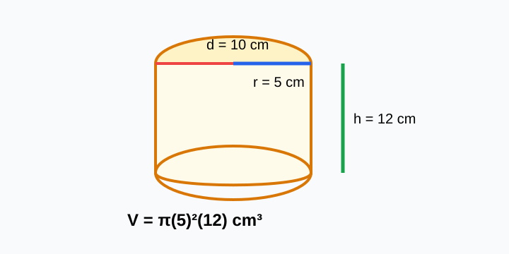

# Cylinder Volume Practice

> [!GOAL] Lesson Goal
>
> Calculate the volume of cylinders when you are given a radius or a diameter and a height. Your final answer must use correct cubic units.

## Visual Model

If the problem gives diameter, divide by 2 before using V = pi r squared h.

## Warm-Up: What Do You Notice?

Think about a drinking glass, a can, or a round water tank.

Answer mentally:

1. What shape is the top or bottom?
2. How tall is the container?
3. Would the answer measure length, area, or space inside?

A cylinder's volume tells how much space it can hold. Because volume measures space, the unit must be cubic, such as cubic centimeters or cubic meters.

## Formula You Need

For a cylinder:

$$V = \pi r^2h$$

| Symbol | Meaning |
|---|---|
| $V$ | volume of the cylinder |
| $r$ | radius of the circular base |
| $h$ | height of the cylinder |
| $\pi$ | about 3.14, or sometimes $\frac{22}{7}$ |

> [!IMPORTANT] Main Rule
>
> Use the radius in the formula. If the problem gives the diameter, divide it by 2 first.

## Core Idea 1: Radius Is Given

When the radius and height are already given, substitute directly.

### Worked Example 1

A cylinder has radius 4 cm and height 10 cm. Use $\pi \approx 3.14$.

$$V = \pi r^2h$$

$$V = 3.14(4^2)(10)$$

$$V = 3.14(16)(10)$$

$$V = 502.4$$

The volume is **502.4 cubic centimeters**, or **502.4 cm^3**.

> [!TIP] Unit Check
>
> The radius and height are in centimeters, so the volume is in cubic centimeters.

## Core Idea 2: Diameter Is Given

The diameter goes across the whole circular base. The radius is half of it.

$$r = \frac{d}{2}$$

### Worked Example 2

A cylinder has diameter 14 m and height 6 m. Use $\pi \approx \frac{22}{7}$.

First find the radius:

$$r = 14 \div 2 = 7$$

Now find the volume:

$$V = \pi r^2h$$

$$V = \frac{22}{7}(7^2)(6)$$

$$V = \frac{22}{7}(49)(6)$$

$$V = 22(7)(6) = 924$$

The volume is **924 cubic meters**, or **924 m^3**.

## Choosing a Pi Approximation

| Situation | Good choice |
|---|---|
| The problem says use 3.14 | Use 3.14 |
| The radius or diameter is a multiple of 7 | $\frac{22}{7}$ may be easier |
| The problem asks for an exact answer in terms of pi | Leave $\pi$ in the answer |

### Worked Example 3: Exact Answer

A cylinder has radius 5 in and height 8 in. Leave the answer in terms of $\pi$.

$$V = \pi(5^2)(8)$$

$$V = 200\pi$$

The exact volume is **200 pi cubic inches**, or **200π in^3**.

## Common Mistakes

> [!WARNING] Do Not Square the Diameter
>
> If the diameter is 12 cm, the radius is 6 cm. Use $6^2$, not $12^2$.

> [!WARNING] Do Not Use Square Units
>
> Area uses square units. Volume uses cubic units. A cylinder volume answer should look like cm^3, m^3, ft^3, or cubic units.

## Guided Practice

Solve each problem. Show the formula, substitution, and unit.

1. Radius 3 cm, height 9 cm. Use $\pi \approx 3.14$.
2. Diameter 10 m, height 4 m. Use $\pi \approx 3.14$.
3. Radius 7 ft, height 3 ft. Use $\pi \approx \frac{22}{7}$.
4. Diameter 18 in, height 5 in. Leave the answer in terms of $\pi$.

### Check Your Thinking

1. $V = 3.14(3^2)(9) = 254.34$ cm^3.
2. Radius is 5 m, so $V = 3.14(5^2)(4) = 314$ m^3.
3. $V = \frac{22}{7}(7^2)(3) = 462$ ft^3.
4. Radius is 9 in, so $V = \pi(9^2)(5) = 405\pi$ in^3.

## Exit Checklist

Before taking the practice quiz, make sure you can:

- write and use $V = \pi r^2h$;
- divide the diameter by 2 to find the radius;
- choose the pi approximation named in the problem;
- label every volume answer with cubic units.

> [!PRACTICE] Next Step
>
> Complete the practice questions first. Then use the assessment to check whether you can calculate cylinder volumes and explain your unit choices without hints.
