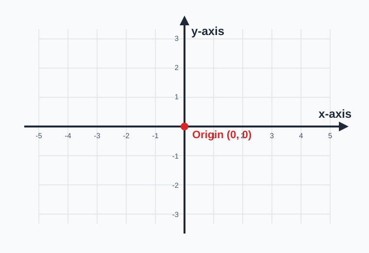
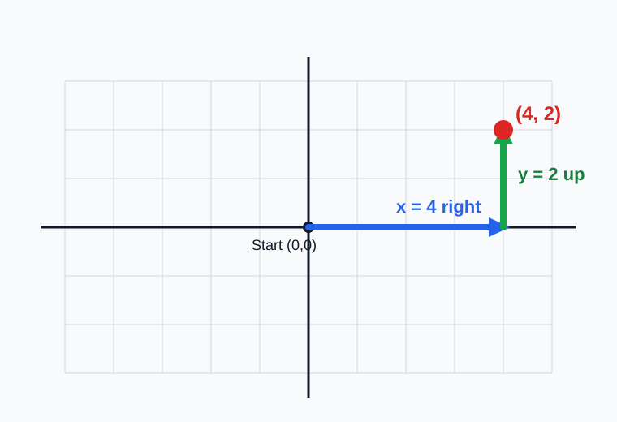
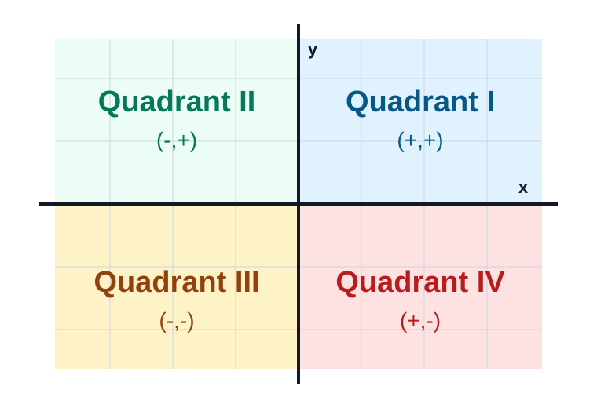
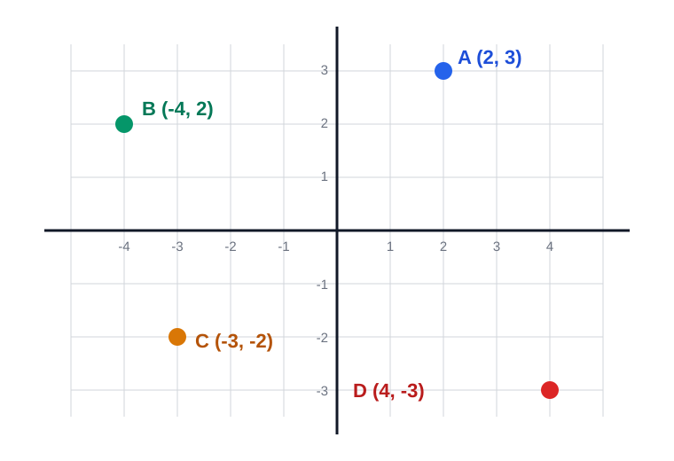
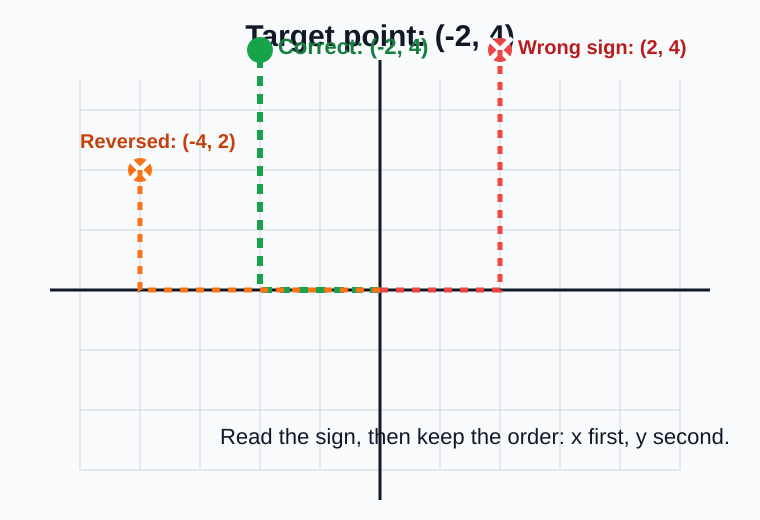

# Coordinate Plane Basics

> [!GOAL] Learning Goal
>
> By the end of this lesson, you should be able to identify axes, the origin, quadrants, and ordered pairs, then plot and name points accurately.

## Study Plan

| Part | What to master | Check yourself |
|---|---|---|
| 1 | Axes and origin | Can you point to the x-axis, y-axis, and (0, 0)? |
| 2 | Ordered pairs | Can you read (x, y) as across first, then up or down? |
| 3 | Quadrants | Can you use signs to name the quadrant? |
| 4 | Plotting and naming points | Can you plot a point and write its ordered pair? |

## Quick Recall

Try these before reading the explanations.

1. On a number line, is -3 left or right of 0?
2. Which direction usually means a positive vertical movement: up or down?
3. Which number is greater: -4 or 2?

Reveal answers

1. -3 is left of 0.
2. Up means positive vertical movement.
3. 2 is greater than -4.

These ideas help you read a coordinate plane because each axis is a number line.

## 1. The Coordinate Plane

A coordinate plane is made from two number lines that cross at right angles.

- The **x-axis** is the horizontal number line.
- The **y-axis** is the vertical number line.
- The **origin** is the point where the axes meet. It is written as **(0, 0)**.

> [!IMPORTANT] Core Idea
>
> Start at the origin before plotting any point. The origin is the zero point for both axes.

## 2. Read Ordered Pairs as (x, y)

An ordered pair has two numbers:

$$ (x, y) $$

The first number is the **x-coordinate**. It tells how far to move left or right.

The second number is the **y-coordinate**. It tells how far to move up or down.

| Coordinate value | Direction |
|---|---|
| Positive x | Move right |
| Negative x | Move left |
| Positive y | Move up |
| Negative y | Move down |

### Example 1: Read a Point

The ordered pair **(4, 2)** means:

1. Start at the origin.
2. Move 4 units right.
3. Move 2 units up.
4. Mark the point.

> [!TIP] Plotting Reminder
>
> Go **across first**, then **up or down**. This matches the order (x, y).

## 3. Quadrants

The axes divide the plane into four regions called quadrants.

| Quadrant | Sign pattern | Example point |
|---|---|---|
| I | (+, +) | (3, 5) |
| II | (-, +) | (-3, 5) |
| III | (-, -) | (-3, -5) |
| IV | (+, -) | (3, -5) |

> [!WARNING] Axis Points
>
> A point on an axis is not in a quadrant. If x = 0, the point is on the y-axis. If y = 0, the point is on the x-axis.

### Example 2: Name the Quadrant

Which quadrant contains **(-5, 3)**?

- x is negative, so the point is left of the y-axis.
- y is positive, so the point is above the x-axis.
- The sign pattern is (-, +).

**Answer:** Quadrant II

## 4. Plot and Name Points

To plot a point, start at (0, 0), move according to the x-coordinate, then move according to the y-coordinate.

To name a plotted point, do the reverse:

1. Count left or right from the origin to find x.
2. Count up or down to find y.
3. Write the answer as (x, y).

### Example 3: Name Plotted Points

From the diagram:

| Point | Ordered pair | Reason |
|---|---|---|
| A | (2, 3) | 2 right, 3 up |
| B | (-4, 2) | 4 left, 2 up |
| C | (-3, -2) | 3 left, 2 down |
| D | (4, -3) | 4 right, 3 down |

## 5. Avoid Common Sign Errors

The most common error is switching the x-coordinate and y-coordinate, or using the wrong sign.

For the point **(-2, 4)**:

- Correct: move 2 units left, then 4 units up.
- Incorrect: moving 2 units right uses the wrong sign.
- Incorrect: moving 4 units left and 2 units up reverses the order.

> [!CHECK] Self-Check
>
> For each point, say the movement and quadrant before looking at the answer.
>
> 1. (5, -1)
> 2. (-2, -6)
> 3. (0, 4)

Reveal self-check answers

1. (5, -1): 5 right, 1 down; Quadrant IV.
2. (-2, -6): 2 left, 6 down; Quadrant III.
3. (0, 4): on the y-axis; not in a quadrant.

## Final Checklist

You are ready for practice when you can:

- identify the x-axis and y-axis,
- name the origin as (0, 0),
- read ordered pairs as (x, y),
- use signs to name quadrants,
- plot points from ordered pairs,
- write ordered pairs for plotted points.

> [!PRACTICE] What to Do Next
>
> Use the practice exam first for a low-stakes check. Review every explanation, especially for any sign or order mistake. Then use the assessment when you can plot and name points without hints.
