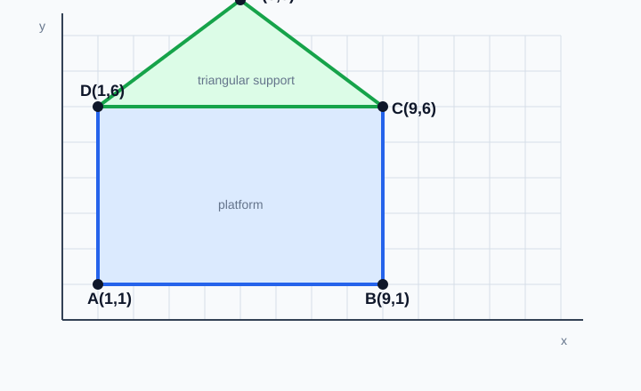
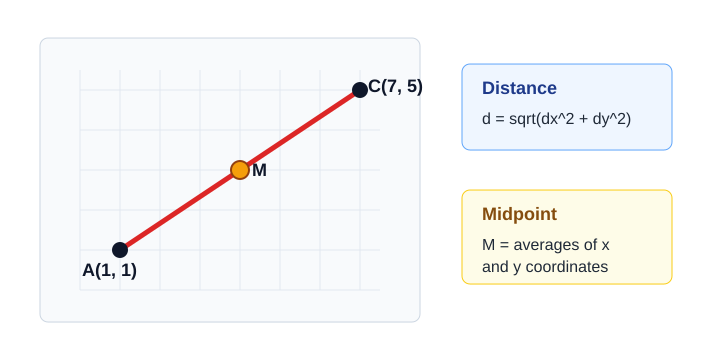
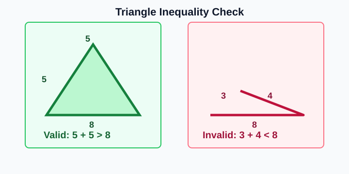
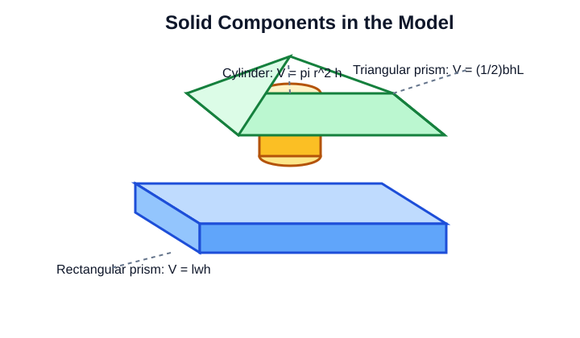
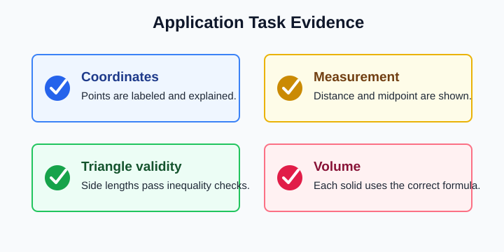

# Quarter Application Task

> [!GOAL]
> Design a coordinate-based structure with triangular and solid components. Use math evidence to compute distances, a midpoint, volumes, and triangle validity.

## Study Roadmap

| Step | Design move | Math evidence to show |
|---|---|---|
| 1 | Place key points on a coordinate site plan | Ordered pairs and labels |
| 2 | Measure paths and spans | Distance calculations |
| 3 | Locate a center or connector | Midpoint calculation |
| 4 | Test triangular supports | Triangle inequality |
| 5 | Size solid components | Volume formulas and cubic units |
| 6 | Review the model | Checklist and short justification |

## The Design Brief

You are planning a small outdoor learning station on a coordinate grid. The station must include:

- a rectangular platform or base
- at least one triangular support
- at least one solid component, such as a box, cylinder, or triangular prism
- a short written explanation of why the design is valid

The task is not only to draw a structure. You must prove that the design works using coordinate and measurement calculations.

> [!TARGET]
> By the end of this lesson, you should be able to read a design from coordinates, calculate the needed measurements, and decide whether the structure meets the requirements.

## Warm-Up: Skills You Will Reuse

Answer these before studying the worked model.

1. What is the horizontal distance from `(2, 3)` to `(9, 3)`?
2. What is the midpoint of `(0, 0)` and `(8, 6)`?
3. Can side lengths `4`, `5`, and `10` form a triangle?
4. What unit should be used for volume?

Answers: `7 units`, `(4, 3)`, `no`, and cubic units such as `units^3`.

## Part 1: Build the Coordinate Site Plan

Start with a coordinate plane. Place the main corners of the structure using ordered pairs.

Example design:

| Point | Coordinate | Design meaning |
|---|---:|---|
| A | `(1, 1)` | front-left corner of platform |
| B | `(9, 1)` | front-right corner of platform |
| C | `(9, 6)` | back-right corner of platform |
| D | `(1, 6)` | back-left corner of platform |
| E | `(5, 9)` | top of triangular roof support |

This gives a rectangular platform `ABCD` and a triangular roof support `DCE`.

> [!TIP]
> Label points clearly before calculating. Most errors in application tasks begin with using the wrong two points.

## Part 2: Compute Distance and Midpoint

For two points `(x_1, y_1)` and `(x_2, y_2)`, the distance formula is:

`d = sqrt((x_2 - x_1)^2 + (y_2 - y_1)^2)`

The midpoint formula is:

`M = ((x_1 + x_2) / 2, (y_1 + y_2) / 2)`

### Worked Example 1: Platform Diagonal

Find the diagonal from `A(1, 1)` to `C(9, 6)`.

`d = sqrt((9 - 1)^2 + (6 - 1)^2)`

`d = sqrt(8^2 + 5^2)`

`d = sqrt(64 + 25)`

`d = sqrt(89)`

`d` is about `9.43 units`.

### Worked Example 2: Center Point

Find the midpoint of diagonal `AC`.

`M = ((1 + 9) / 2, (1 + 6) / 2)`

`M = (10 / 2, 7 / 2)`

`M = (5, 3.5)`

The center of the rectangular platform is `(5, 3.5)`.

> [!CHECK]
> A midpoint answer is an ordered pair, not a single number. A distance answer is a length, not an ordered pair.

## Part 3: Check the Triangular Support

For any triangle, the sum of any two side lengths must be greater than the third side.

This means all three statements must be true:

- `a + b > c`
- `a + c > b`
- `b + c > a`

### Worked Example 3: Roof Support

The support triangle has side lengths `5`, `5`, and `8` units.

Check:

- `5 + 5 > 8` is true because `10 > 8`
- `5 + 8 > 5` is true because `13 > 5`
- `5 + 8 > 5` is true again

The triangular support is valid.

> [!WARNING]
> If the two shorter sides add up to the longest side or less, the triangle fails. The bars would make a straight line or would not meet.

## Part 4: Compute Solid Component Volumes

Your structure must include solid components. Use the correct formula for each one.

| Solid | Formula | Meaning |
|---|---|---|
| Rectangular prism | `V = lwh` | length times width times height |
| Cylinder | `V = pi r^2 h` | circular base area times height |
| Triangular prism | `V = (1/2)bhL` | triangular base area times prism length |

### Worked Example 4: Combined Volume

A model includes:

- rectangular platform: `8 units` by `5 units` by `1 unit`
- cylindrical post: radius `1 unit`, height `4 units`, use `pi = 3.14`
- triangular prism roof: triangular base `8 units`, triangle height `3 units`, prism length `5 units`

Platform:

`V = lwh = 8 * 5 * 1 = 40 units^3`

Post:

`V = pi r^2 h = 3.14 * 1^2 * 4 = 12.56 units^3`

Roof:

`V = (1/2)bhL = (1/2)(8)(3)(5) = 60 units^3`

Total:

`40 + 12.56 + 60 = 112.56 units^3`

The combined model volume is `112.56 units^3`.

## Part 5: Write the Application Task Response

A strong response has four parts:

1. Coordinates: list the key points and explain what each point represents.
2. Measurements: show at least one distance and one midpoint calculation.
3. Validity: prove the triangular component is valid using the triangle inequality.
4. Volume: compute the volume of each solid component and state the total.

## Model Response

My structure uses platform points `A(1, 1)`, `B(9, 1)`, `C(9, 6)`, and `D(1, 6)`. The platform is `8 units` long and `5 units` wide. The midpoint of diagonal `AC` is `(5, 3.5)`, so that point can mark the center connector.

The diagonal `AC` is `sqrt(89)`, or about `9.43 units`. The triangular roof support uses side lengths `5`, `5`, and `8`. It is valid because `5 + 5 > 8`, `5 + 8 > 5`, and `5 + 8 > 5`.

The model includes a rectangular prism platform with volume `40 units^3`, a cylinder with volume `12.56 units^3`, and a triangular prism roof with volume `60 units^3`. The total volume is `112.56 units^3`.

## Final Checklist

Before taking the practice exam, check that you can:

- label points with ordered pairs
- choose the correct points for a distance calculation
- find a midpoint as an ordered pair
- test all needed triangle inequality statements
- choose the correct volume formula for each solid
- write cubic units for volume
- explain your design decisions in complete math sentences

> [!PRACTICE]
> Use the practice exam as a skill check for distances, midpoint, triangle validity, and volume. Use the assessment when you are ready to solve a complete application-task style set.
