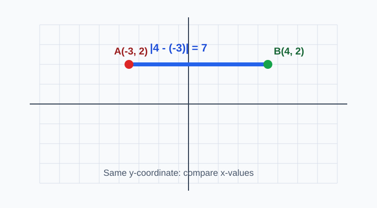
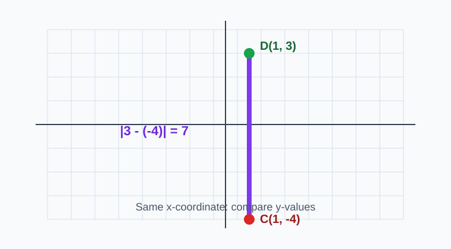
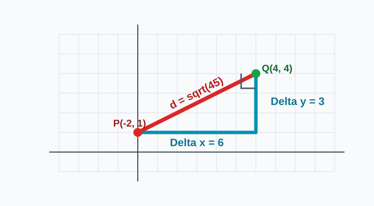
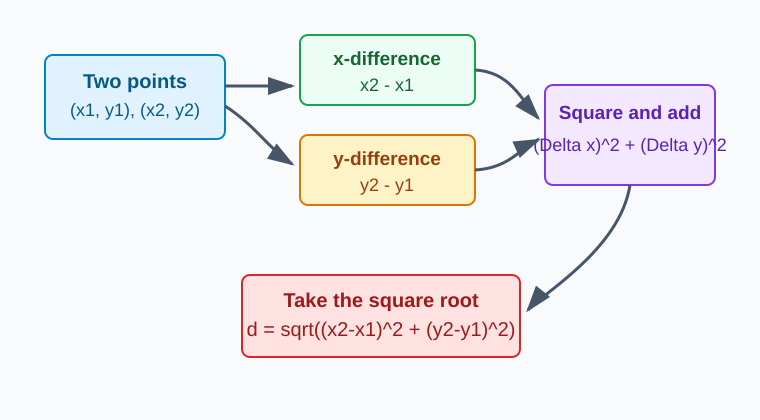
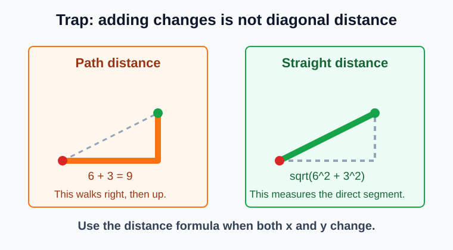

# Distance on the Coordinate Plane

> [!GOAL] Learning Goal
>
> By the end of this lesson, you should be able to find horizontal, vertical, and diagonal distances between points and show your solution using coordinate differences.

## Study Plan

| Part | What to master | Main move |
|---|---|---|
| 1 | Horizontal distance | Compare x-coordinates |
| 2 | Vertical distance | Compare y-coordinates |
| 3 | Diagonal distance | Make a right triangle, then use the distance formula |
| 4 | Solution checking | Use positive differences and include units |

## Visual Study Set

Use these diagrams as anchors while you study. Return to them when a question asks you to explain the coordinate differences.

## Readiness Check

Try these before reading the explanations.

1. What is the distance between -4 and 2 on a number line?
2. What is the absolute value of -7?
3. If a right triangle has legs 3 and 4, what is the hypotenuse?
4. In the point (5, -2), which coordinate tells left or right position?

Reveal answers

1. The distance is 6 because \(2 - (-4) = 6\).
2. \(|-7| = 7\).
3. The hypotenuse is 5.
4. The x-coordinate, 5, tells left or right position.

## Key Vocabulary

| Term | Meaning |
|---|---|
| Horizontal distance | Left-right distance between points |
| Vertical distance | Up-down distance between points |
| Coordinate difference | The change between two x-values or two y-values |
| Absolute value | Distance from zero, always nonnegative |
| Diagonal distance | Straight-line distance between points that are not horizontally or vertically aligned |
| Distance formula | \(d=\sqrt{(x_2-x_1)^2+(y_2-y_1)^2}\) |

> [!IMPORTANT] Core Idea
>
> Distance is never negative. A coordinate difference can be written as a subtraction, but the final distance must be positive.

## 1. Horizontal Distance

When two points have the same y-coordinate, they are on the same horizontal line. The distance depends only on the x-coordinates.

For points \(A(x_1,y)\) and \(B(x_2,y)\):

$$\text{horizontal distance}=|x_2-x_1|$$

### Example 1

**Problem:** Find the distance between \(A(-3,2)\) and \(B(4,2)\).

**Solution:**

The y-coordinates are both 2, so the points are horizontally aligned.

Compare the x-coordinates:

$$|4-(-3)|=|7|=7$$

**Answer:** The distance is **7 units**.

> [!TIP] Horizontal Shortcut
>
> Same y-coordinate means use the x-values. Count left-right units or subtract the x-coordinates.

## 2. Vertical Distance

When two points have the same x-coordinate, they are on the same vertical line. The distance depends only on the y-coordinates.

For points \(A(x,y_1)\) and \(B(x,y_2)\):

$$\text{vertical distance}=|y_2-y_1|$$

### Example 2

**Problem:** Find the distance between \(C(1,-4)\) and \(D(1,3)\).

**Solution:**

The x-coordinates are both 1, so the points are vertically aligned.

Compare the y-coordinates:

$$|3-(-4)|=|7|=7$$

**Answer:** The distance is **7 units**.

> [!CHECK] Quick Check
>
> Points \(E(-5,-1)\) and \(F(2,-1)\) have the same y-coordinate. Which coordinates should you compare?
>
> Answer: Compare the x-coordinates, \(-5\) and \(2\).

## 3. Diagonal Distance

When both coordinates change, the shortest distance is diagonal. Do not just add the changes. Instead, make a right triangle.

For points \(A(x_1,y_1)\) and \(B(x_2,y_2)\):

1. Find the horizontal change: \(\Delta x=x_2-x_1\).
2. Find the vertical change: \(\Delta y=y_2-y_1\).
3. Use the Pythagorean Theorem.

$$d=\sqrt{(\Delta x)^2+(\Delta y)^2}$$

This is the same as:

$$d=\sqrt{(x_2-x_1)^2+(y_2-y_1)^2}$$

### Example 3

**Problem:** Find the distance between \(P(-2,1)\) and \(Q(4,4)\).

**Solution:**

Find the coordinate differences:

$$\Delta x=4-(-2)=6$$

$$\Delta y=4-1=3$$

Use the distance formula:

$$d=\sqrt{6^2+3^2}$$

$$d=\sqrt{36+9}=\sqrt{45}=3\sqrt{5}$$

**Answer:** The exact distance is **\(3\sqrt{5}\) units**, which is about **6.7 units**.

> [!WARNING] Common Trap
>
> For diagonal distance, do not add \(\Delta x+\Delta y\). A 6-unit horizontal change and a 3-unit vertical change give a diagonal of \(\sqrt{45}\), not 9.

## Coordinate-Difference Strategy

Use this table while solving.

| Situation | What to check | Formula |
|---|---|---|
| Same y-coordinate | Horizontal segment | \(|x_2-x_1|\) |
| Same x-coordinate | Vertical segment | \(|y_2-y_1|\) |
| Different x and y | Diagonal segment | \(\sqrt{(x_2-x_1)^2+(y_2-y_1)^2}\) |

## Worked Example: Choose the Right Distance Method

**Problem:** Find the distance between \(M(-6,-2)\) and \(N(2,4)\).

**Step 1: Check alignment.**

The x-coordinates are different. The y-coordinates are different. This is a diagonal distance.

**Step 2: Find coordinate differences.**

$$\Delta x=2-(-6)=8$$

$$\Delta y=4-(-2)=6$$

**Step 3: Use the distance formula.**

$$d=\sqrt{8^2+6^2}=\sqrt{64+36}=\sqrt{100}=10$$

**Answer:** The distance is **10 units**.

## Self-Study Drill

Solve each item before revealing the answer.

1. Distance between \(A(-1,5)\) and \(B(6,5)\)
2. Distance between \(C(3,-2)\) and \(D(3,7)\)
3. Distance between \(E(0,0)\) and \(F(5,12)\)

Reveal drill answers

1. \( |6-(-1)|=7 \), so the distance is 7 units.
2. \( |7-(-2)|=9 \), so the distance is 9 units.
3. \( \sqrt{5^2+12^2}=\sqrt{169}=13 \), so the distance is 13 units.

## Final Checklist

Before taking the practice exam, make sure you can:

- Identify whether a segment is horizontal, vertical, or diagonal.
- Use x-coordinate differences for horizontal distances.
- Use y-coordinate differences for vertical distances.
- Use both coordinate differences for diagonal distances.
- Keep distance positive even when coordinates are negative.
- Write solutions with enough coordinate-difference evidence.

> [!PRACTICE] Exam Plan
>
> Start with the practice exam for quick feedback. Then take the assessment when you can explain which coordinate differences you used and why.
