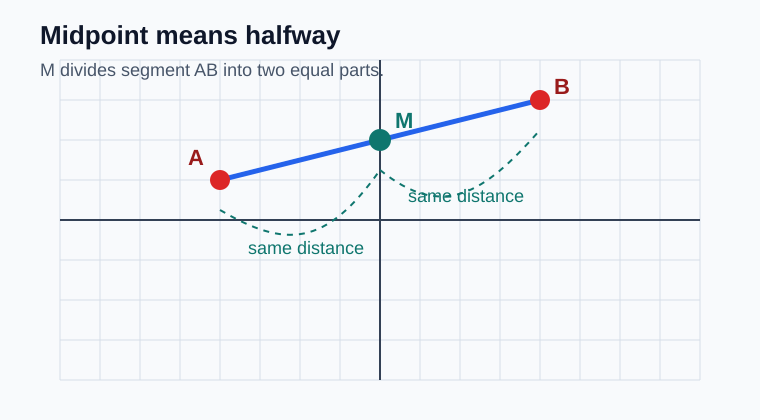
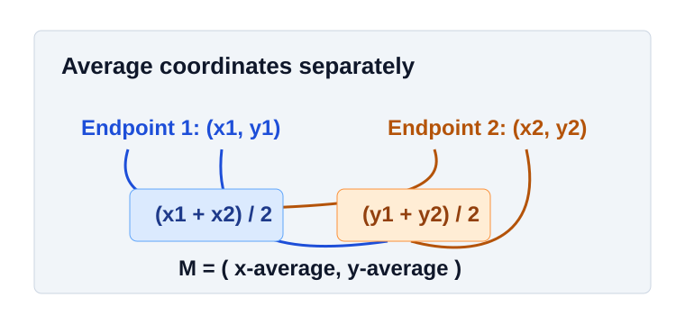
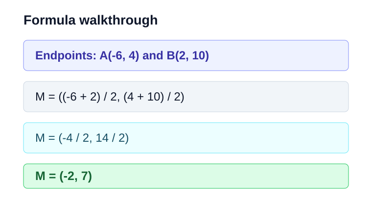
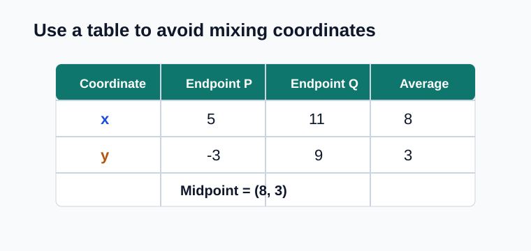
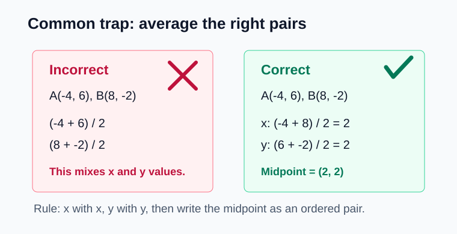

# Midpoint of a Segment

> [!GOAL] Lesson Goal
>
> Learn how to locate the midpoint of a segment visually and by formula, then solve midpoint problems from endpoint coordinates.

## Quick Start

Before using the formula, recall these coordinate skills:

| Skill | Quick check |
|---|---|
| Read an ordered pair | In $(4, -2)$, the $x$-coordinate is $4$ and the $y$-coordinate is $-2$. |
| Count grid spaces | From $x = -3$ to $x = 5$ is $8$ units. |
| Average two numbers | The average of $2$ and $10$ is $\frac{2 + 10}{2} = 6$. |

> [!TARGET] Self-Study Target
>
> By the end, you should be able to find the midpoint of a segment with endpoints such as $(-4, 6)$ and $(8, -2)$ without guessing from a graph.

## 1. What Is a Midpoint?

The **midpoint** of a segment is the point exactly halfway between the two endpoints. It divides the segment into two equal parts.

In the diagram, point $A$ and point $B$ are the endpoints. Point $M$ is halfway between them, so $AM = MB$.

> [!NOTE] Key Meaning
>
> A midpoint is not just any point on the segment. It must be equally far from both endpoints.

## 2. Locate a Midpoint Visually

When a segment is drawn on a grid, you can locate the midpoint by counting equal moves from both ends.

**Example 1: Visual midpoint**

Endpoint $A$ is at $(-4, 1)$ and endpoint $B$ is at $(4, 5)$.

From $A$ to $B$:

- Move $8$ units right.
- Move $4$ units up.

Half of that move is:

- Move $4$ units right.
- Move $2$ units up.

Starting at $A(-4, 1)$, move $4$ right and $2$ up:

$$(-4 + 4, 1 + 2) = (0, 3)$$

So the midpoint is $M(0, 3)$.

## 3. The Midpoint Formula

The midpoint formula averages the two $x$-coordinates and averages the two $y$-coordinates.

If the endpoints are $(x_1, y_1)$ and $(x_2, y_2)$, then:

$$M = \left(\frac{x_1 + x_2}{2}, \frac{y_1 + y_2}{2}\right)$$

> [!TIP] Formula Memory
>
> Average the $x$ values with the $x$ values. Average the $y$ values with the $y$ values. Keep the final answer as an ordered pair.

## 4. Worked Formula Example

**Example 2: Find the midpoint of $A(-6, 4)$ and $B(2, 10)$.**

Use the midpoint formula:

$$M = \left(\frac{-6 + 2}{2}, \frac{4 + 10}{2}\right)$$

Simplify each coordinate:

$$M = \left(\frac{-4}{2}, \frac{14}{2}\right)$$

$$M = (-2, 7)$$

**Answer:** The midpoint is $(-2, 7)$.

## 5. Organize Endpoints in a Table

A table helps prevent mixing the $x$ and $y$ values.

**Example 3: Find the midpoint of $P(5, -3)$ and $Q(11, 9)$.**

| Coordinate | Endpoint 1 | Endpoint 2 | Average |
|---|---:|---:|---:|
| $x$ | $5$ | $11$ | $\frac{5 + 11}{2} = 8$ |
| $y$ | $-3$ | $9$ | $\frac{-3 + 9}{2} = 3$ |

So the midpoint is $(8, 3)$.

## 6. When Coordinates Are Negative

Negative coordinates follow the same formula.

**Example 4: Find the midpoint of $C(-9, -2)$ and $D(3, -8)$.**

$$M = \left(\frac{-9 + 3}{2}, \frac{-2 + (-8)}{2}\right)$$

$$M = \left(\frac{-6}{2}, \frac{-10}{2}\right)$$

$$M = (-3, -5)$$

> [!IMPORTANT] Integer Reminder
>
> Adding a negative number means move farther left or down on the number line. For example, $-2 + (-8) = -10$.

## 7. Common Trap: Averaging the Wrong Values

The most common mistake is averaging $x$ with $y$ from the same point, such as averaging $-4$ and $6$ from $(-4, 6)$. That does not find a midpoint.

Use this check:

1. Put the two $x$ values together.
2. Put the two $y$ values together.
3. Average each pair separately.
4. Write the answer as $(x, y)$.

> [!WARNING] Trap Check
>
> For endpoints $(-4, 6)$ and $(8, -2)$, do not average $-4$ with $6$. The correct setup is $\left(\frac{-4 + 8}{2}, \frac{6 + (-2)}{2}\right)$.

## 8. Practice Before the Exam

Try these without looking back at the examples.

| Endpoints | Midpoint |
|---|---|
| $(0, 0)$ and $(6, 8)$ | ? |
| $(-2, 5)$ and $(4, 5)$ | ? |
| $(-7, -1)$ and $(3, 9)$ | ? |

**Answers**

1. $(3, 4)$
2. $(1, 5)$
3. $(-2, 4)$

## Final Checklist

You are ready for the practice exam when you can:

- Explain that a midpoint is halfway between endpoints.
- Count equal grid moves to locate a midpoint visually.
- Use $M = \left(\frac{x_1 + x_2}{2}, \frac{y_1 + y_2}{2}\right)$.
- Keep $x$ values and $y$ values separate.
- Solve midpoint problems with negative coordinates.

> [!PRACTICE] Exam Plan
>
> Start with the practice exam for low-stakes feedback. Then use the assessment to check whether you can solve midpoint problems from endpoint coordinates independently.
