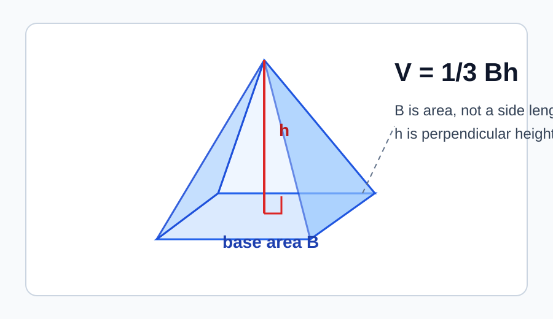
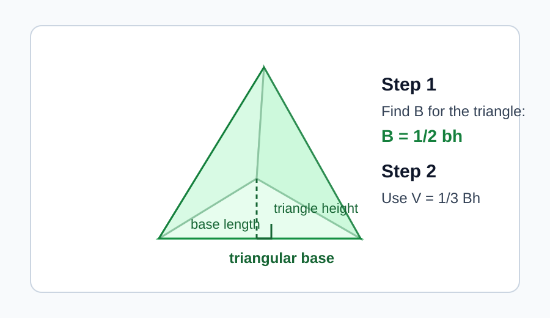
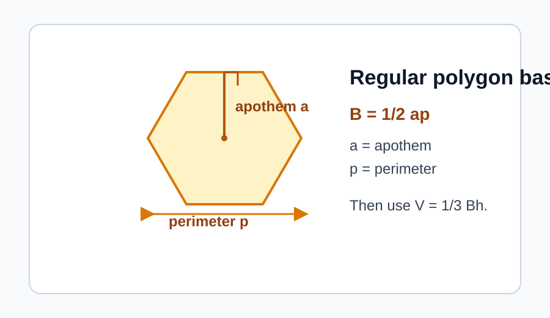
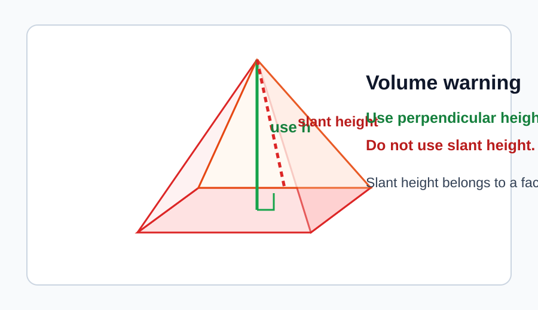
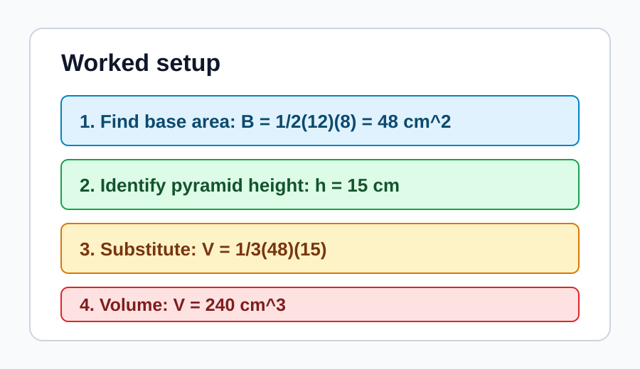

# Pyramid Volume Beyond Rectangular Bases

> [!GOAL] Lesson Goal
>
> Master the pyramid volume formula for bases that are not always rectangles.
>
> By the end, you should be able to pause before calculating and ask: **What is the area of the base?**

## Study Roadmap

| Part | Focus | What to check |
| --- | --- | --- |
| 1 | Formula meaning | $B$ means base area |
| 2 | Varied bases | Triangles, rectangles, and regular polygons can all be bases |
| 3 | Height check | Use perpendicular height, not slant height |
| 4 | Worked setup | Substitute only after the base area is known |

---

## Warm-Up Recall

Before using the pyramid formula, recall these area facts.

| Shape used as a base | Area formula |
| --- | --- |
| Rectangle | $A = lw$ |
| Triangle | $A = \frac{1}{2}bh$ |
| Regular polygon | $A = \frac{1}{2}ap$, where $a$ is apothem and $p$ is perimeter |

> [!CHECK] Quick Self-Check
>
> If a pyramid has a triangular base, do not use only the triangle's base length as $B$. Find the **area of the triangle** first.

## 1. The Formula Anatomy

The volume of any pyramid is:

$$V = \frac{1}{3}Bh$$

In this formula:

- $V$ is the volume.
- $B$ is the **area of the base**.
- $h$ is the **perpendicular height** from the base to the apex.
- The factor $\frac{1}{3}$ tells you that a pyramid with the same base area and height has one-third the volume of a matching prism.

> [!IMPORTANT] The Main Habit
>
> Always solve in this order:
>
> 1. Identify the shape of the base.
> 2. Find the base area $B$.
> 3. Identify the perpendicular height $h$.
> 4. Substitute into $V = \frac{1}{3}Bh$.

---

## 2. Triangular-Base Pyramid

A pyramid can have a triangle as its base. The formula does not change, but $B$ must come from the triangle area formula.

**Example 1: Triangular base**

A pyramid has a triangular base with base length 10 cm and triangle height 6 cm. The pyramid height is 12 cm. Find the volume.

First find the area of the triangular base:

$$B = \frac{1}{2}(10)(6) = 30\text{ cm}^2$$

Then use the pyramid volume formula:

$$V = \frac{1}{3}Bh$$

$$V = \frac{1}{3}(30)(12) = 120\text{ cm}^3$$

The volume is **120 cubic centimeters**.

> [!TIP] Why This Works
>
> The triangular base has square units because it is an area. After multiplying by height, the volume uses cubic units.

---

## 3. Bases Beyond Rectangles

A pyramid may have a regular hexagon, pentagon, or another polygon as its base. You still use:

$$V = \frac{1}{3}Bh$$

The only new work is finding $B$ correctly.

**Example 2: Regular hexagonal base**

A regular hexagonal pyramid has base perimeter 36 cm, apothem 5 cm, and pyramid height 9 cm.

Find the base area:

$$B = \frac{1}{2}ap = \frac{1}{2}(5)(36) = 90\text{ cm}^2$$

Then find the volume:

$$V = \frac{1}{3}(90)(9) = 270\text{ cm}^3$$

The volume is **270 cubic centimeters**.

> [!NOTE] Formula Choice
>
> The pyramid formula stays the same. The base area formula changes depending on the base shape.

---

## 4. Height Is Not Slant Height

The height $h$ in $V = \frac{1}{3}Bh$ is the perpendicular height. It goes straight from the base plane to the apex.

The slant height runs along a triangular face. It is useful for surface area, but not for volume unless extra information lets you find the perpendicular height.

> [!WARNING] Common Error
>
> Do not substitute slant height into the volume formula. If the diagram labels a slanted edge or face height, check whether a right-angle marker shows the perpendicular height.

**Example 3: Spot the usable height**

A pyramid diagram labels a base area of 48 m^2, a perpendicular height of 10 m, and a slant height of 13 m.

Use the perpendicular height:

$$V = \frac{1}{3}(48)(10) = 160\text{ m}^3$$

Do not use 13 m. That is the slant height.

---

## 5. Worked Setup Routine

Use this setup whenever the base is not rectangular.

| Step | Question to ask | Example answer |
| --- | --- | --- |
| 1 | What shape is the base? | Triangle |
| 2 | What is the base area formula? | $B = \frac{1}{2}bh$ |
| 3 | What is $B$? | $B = 24\text{ cm}^2$ |
| 4 | What is the pyramid height? | $h = 15\text{ cm}$ |
| 5 | What is the volume? | $V = \frac{1}{3}(24)(15) = 120\text{ cm}^3$ |

## Mini Drill

Solve these before taking the practice exam.

1. A pyramid has base area 63 cm^2 and height 12 cm. Find its volume.
2. A triangular-base pyramid has triangular base length 8 m, triangular height 5 m, and pyramid height 9 m. Find its volume.
3. A pyramid has a regular polygon base with apothem 4 cm and perimeter 30 cm. Its height is 6 cm. Find its volume.
4. A diagram gives slant height 11 cm and perpendicular height 8 cm. Which height belongs in the volume formula?

## Final Checklist

Before you submit an answer, confirm:

- You found the base **area**, not just a side length.
- You used the pyramid's perpendicular height.
- You multiplied by $\frac{1}{3}$.
- Your answer is in cubic units.

> [!PRACTICE] Exam Plan
>
> Use the practice exam as a low-stakes check on base-area identification. Then use the assessment as your checkpoint for mixed pyramid diagrams and varied bases.
