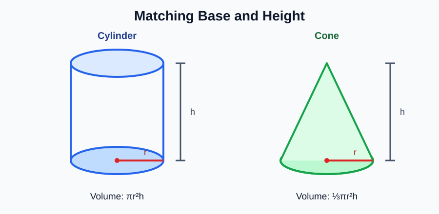
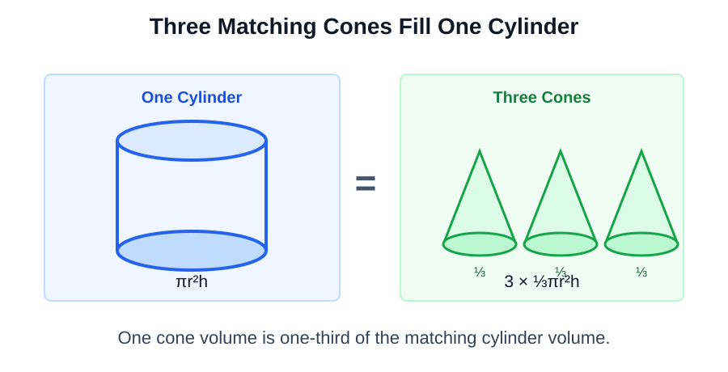
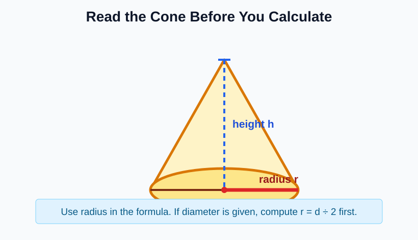
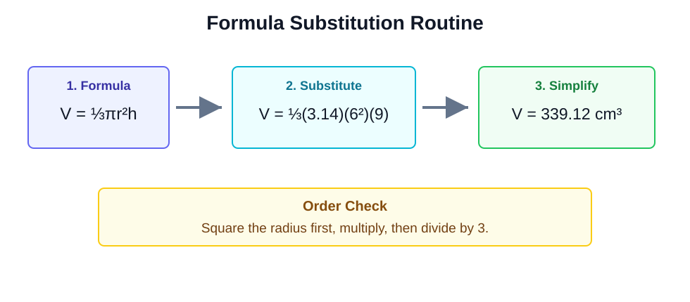
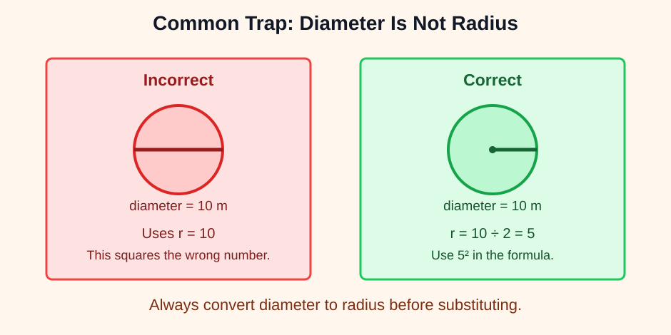
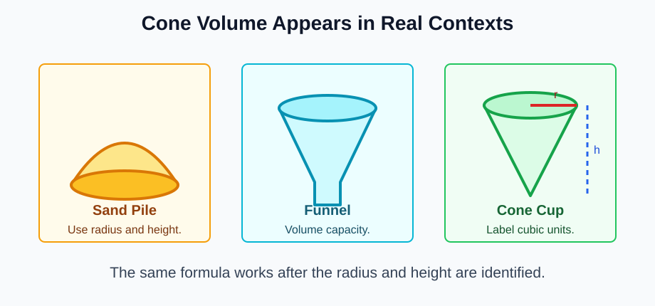

# Cone Volume

> [!GOAL] Learning Goal
>
> I can derive the cone volume formula by comparing a cone to a matching cylinder, then solve cone volume problems accurately.

## Estimated Time and Difficulty

| Item | Details |
| --- | --- |
| Grade | 8 |
| Subject | Mathematics |
| Quarter | 2 |
| Content domains | Number and Algebra; Measurement and Geometry |
| Topic | Geometry - Lesson 5 |
| Estimated time | 45 minutes |
| Difficulty | Moderate |

Cone volume combines geometry with algebra. The geometry part is recognizing the base radius and height. The algebra part is substituting those values into a formula and simplifying carefully.

## What You Should Already Know

- A **circle's area** is \(A = \pi r^2\).
- A **cylinder's volume** is base area times height: \(V = \pi r^2h\).
- A **diameter** is twice the radius: \(d = 2r\).
- Volume answers use **cubic units**, such as \(\text{cm}^3\), \(\text{m}^3\), or \(\text{in}^3\).

> [!CHECK] Pre-Check
>
> Try these before reading.
>
> 1. If a circle has diameter 14 cm, what is its radius?
> 2. What is \(6^2\)?
> 3. What is \(\frac{1}{3} \times 90\)?
> 4. Which unit fits volume: cm, \(\text{cm}^2\), or \(\text{cm}^3\)?

## Key Vocabulary

| Term | Meaning | Symbol or Cue |
| --- | --- | --- |
| Cone | Solid with one circular base and one vertex | ice cream cone shape |
| Cylinder | Solid with two congruent circular bases | can shape |
| Radius | Distance from center of the circular base to the edge | \(r\) |
| Diameter | Distance across the circular base through the center | \(d = 2r\) |
| Height | Perpendicular distance from base to vertex | \(h\) |
| Volume | Amount of space inside a solid | cubic units |

## Big Idea: A Cone Is One-Third of a Matching Cylinder

A cone and a cylinder **match** when they have the same circular base and the same height.

For a matching cylinder:

$$V_{\text{cylinder}} = \pi r^2h$$

For the matching cone:

$$V_{\text{cone}} = \frac{1}{3}\pi r^2h$$

The cone has one-third the volume of the cylinder because three identical cones fill the matching cylinder.

> [!IMPORTANT] Cone Volume Formula
>
> \[
> V = \frac{1}{3}\pi r^2h
> \]
>
> Use the **radius** and the **perpendicular height**. If the problem gives diameter, divide by 2 first.

## Reading the Measurements

Look for the radius, diameter, and height before calculating.

Use this quick decision table:

| Given information | First move |
| --- | --- |
| Radius and height | Substitute directly into \(V = \frac{1}{3}\pi r^2h\). |
| Diameter and height | Divide diameter by 2 to get radius. |
| Cylinder volume with matching cone | Divide cylinder volume by 3. |
| Cone volume and height | Work backward using \(V = \frac{1}{3}\pi r^2h\). |

## Worked Example 1: Radius Given

**Problem:** Find the volume of a cone with radius 6 cm and height 9 cm. Use \(\pi = 3.14\).

**Step 1: Write the formula.**

$$V = \frac{1}{3}\pi r^2h$$

**Step 2: Substitute.**

$$V = \frac{1}{3}(3.14)(6^2)(9)$$

**Step 3: Simplify in order.**

$$6^2 = 36$$

$$V = \frac{1}{3}(3.14)(36)(9)$$

$$36 \times 9 = 324$$

$$V = \frac{1}{3}(3.14)(324)$$

$$V = \frac{1}{3}(1017.36) = 339.12$$

**Final answer:** The cone volume is **339.12 \(\text{cm}^3\)**.

## Worked Example 2: Diameter Given

**Problem:** A cone has diameter 10 m and height 12 m. Find the volume. Use \(\pi = 3.14\).

**Step 1: Convert diameter to radius.**

$$r = 10 \div 2 = 5\text{ m}$$

**Step 2: Substitute.**

$$V = \frac{1}{3}(3.14)(5^2)(12)$$

**Step 3: Simplify.**

$$V = \frac{1}{3}(3.14)(25)(12)$$

$$V = \frac{1}{3}(942) = 314$$

**Final answer:** The cone volume is **314 \(\text{m}^3\)**.

> [!WARNING] Common Trap
>
> Do not use diameter as radius. If the diameter is 10 m, the radius is 5 m. Squaring 10 instead of 5 makes the volume four times too large.

## Worked Example 3: Matching Cylinder Comparison

**Problem:** A cylinder has radius 4 in. and height 15 in. A cone has the same radius and height. What is the cone's volume? Use \(\pi = 3.14\).

**Fast comparison method:**

1. Find the matching cylinder volume.
2. Divide by 3.

$$V_{\text{cylinder}} = (3.14)(4^2)(15)$$

$$V_{\text{cylinder}} = (3.14)(16)(15) = 753.6$$

$$V_{\text{cone}} = 753.6 \div 3 = 251.2$$

**Final answer:** The cone volume is **251.2 \(\text{in}^3\)**.

## Real-World Cone Problems

Cone volume appears in containers, piles, funnels, party hats, and construction shapes. The same formula works when the measurements are clear.

Use this routine:

1. Identify whether the problem gives radius or diameter.
2. If diameter is given, divide by 2.
3. Square the radius.
4. Multiply by \(\pi\) and height.
5. Divide by 3.
6. Label the answer in cubic units.

## Guided Practice

### Guided Practice 1

**Problem:** Find the volume of a cone with radius 3 cm and height 8 cm. Use \(\pi = 3.14\).

Hint 1
Use \(V = \frac{1}{3}\pi r^2h\).

Hint 2
Substitute \(r = 3\) and \(h = 8\): \(V = \frac{1}{3}(3.14)(3^2)(8)\).

Show Solution
\(V = \frac{1}{3}(3.14)(9)(8) = 75.36\). The volume is \(75.36\text{ cm}^3\).

### Guided Practice 2

**Problem:** A cone has diameter 16 ft and height 9 ft. Find the volume using \(\pi = 3.14\).

Hint 1
Find the radius first: \(16 \div 2 = 8\).

Hint 2
Use \(V = \frac{1}{3}(3.14)(8^2)(9)\).

Show Solution
\(V = \frac{1}{3}(3.14)(64)(9) = 602.88\). The volume is \(602.88\text{ ft}^3\).

### Guided Practice 3

**Problem:** A matching cylinder has volume \(480\text{ cm}^3\). What is the volume of the cone?

Hint 1
A matching cone is one-third of the cylinder.

Show Solution
\(480 \div 3 = 160\). The cone volume is \(160\text{ cm}^3\).

## Independent Practice

Use \(\pi = 3.14\) unless a problem says otherwise.

1. Find the volume of a cone with radius 5 cm and height 6 cm.
2. Find the volume of a cone with radius 7 m and height 12 m.
3. A cone has diameter 18 in. and height 10 in. Find its volume.
4. A matching cylinder has volume \(900\text{ mm}^3\). What is the cone volume?
5. A cone-shaped grain pile has radius 4 m and height 3 m. What is its volume?
6. A student uses \(r = 14\) for a cone with diameter 14 cm. Explain the error.
7. A cone has volume \(150.72\text{ ft}^3\), radius 4 ft, and \(\pi = 3.14\). What is its height?
8. Write one sentence explaining why cone volume includes the factor \(\frac{1}{3}\).

## Answer Key with Explanations

Reveal Independent Practice Answers

1. \(V = \frac{1}{3}(3.14)(5^2)(6) = 157\text{ cm}^3\).
2. \(V = \frac{1}{3}(3.14)(7^2)(12) = 615.44\text{ m}^3\).
3. The radius is \(18 \div 2 = 9\) in. \(V = \frac{1}{3}(3.14)(9^2)(10) = 847.8\text{ in}^3\).
4. \(900 \div 3 = 300\text{ mm}^3\).
5. \(V = \frac{1}{3}(3.14)(4^2)(3) = 50.24\text{ m}^3\).
6. The student used the diameter as the radius. The correct radius is \(14 \div 2 = 7\) cm.
7. \(150.72 = \frac{1}{3}(3.14)(4^2)h\). Since \(\frac{1}{3}(3.14)(16) = 16.7466...\), \(h = 9\) ft.
8. A cone with the same base and height as a cylinder has one-third of the cylinder's volume.

## Final Checklist

Before taking the practice exam, check that you can:

- explain the cone-cylinder relationship;
- choose radius instead of diameter;
- substitute into \(V = \frac{1}{3}\pi r^2h\);
- calculate in the correct order;
- use cubic units in the final answer.

> [!PRACTICE] Practice and Assessment Plan
>
> Use the practice exam first for immediate correction. Then use the assessment when you can solve cone volume problems without looking back at the formula routine.
