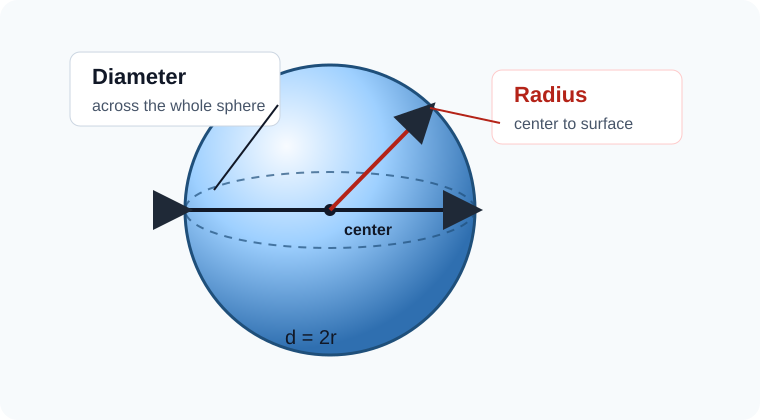
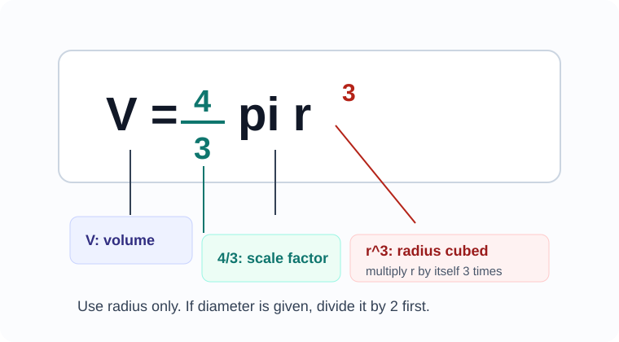
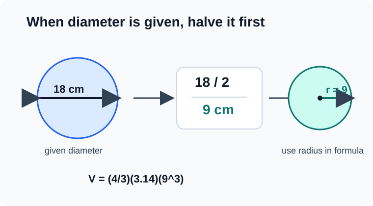
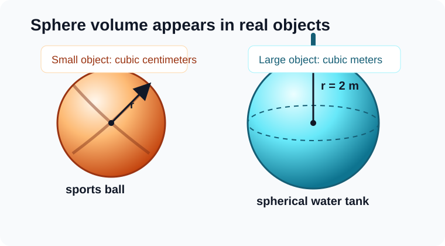
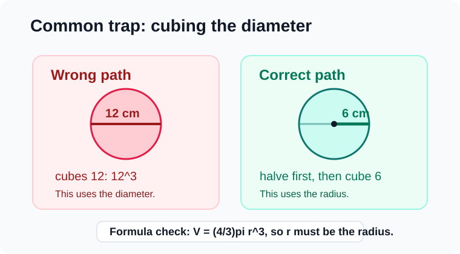

# Geometry - Lesson 6: Sphere Volume

> [!GOAL]
> Use the sphere volume formula in direct and contextual problems. Pay close attention to whether the problem gives a radius or a diameter.

## Study Roadmap

| Step | Skill | What to check |
|---|---|---|
| 1 | Read sphere dimensions | Decide whether the given length is a radius or diameter |
| 2 | Prepare the formula | Use `V = (4/3)pi r^3` |
| 3 | Substitute carefully | Cube the radius, not the diameter |
| 4 | Interpret the answer | Use cubic units and answer the situation |

## Visual Model: Radius and Diameter

A sphere is a perfectly round solid. Every point on its surface is the same distance from the center.

- The `radius` goes from the center to the surface.
- The `diameter` goes all the way across the sphere through the center.
- The diameter is twice the radius: `d = 2r`.
- The radius is half the diameter: `r = d / 2`.

> [!IMPORTANT]
> The sphere volume formula uses radius. If a problem gives the diameter, divide by 2 before using the formula.

## Warm-Up: Quick Recall

Answer these before reading the examples.

1. If a sphere has diameter `18 cm`, what is its radius?
2. If a sphere has radius `5 m`, what is its diameter?
3. Which unit is correct for volume: `cm`, `cm^2`, or `cm^3`?

Answers: `9 cm`, `10 m`, and `cm^3`.

## The Sphere Volume Formula

The volume of a sphere is:

`V = (4/3)pi r^3`

where:

- `V` means volume
- `pi` is about `3.14`
- `r` means radius
- `r^3` means `r * r * r`

The answer is written in cubic units, such as `cm^3`, `m^3`, or `in^3`.

> [!TIP]
> Cubing grows quickly. A sphere with radius `6 cm` has `6^3 = 216`, not `18`.

## Worked Example 1: Radius Is Given

A rubber ball has radius `3 cm`. Use `pi = 3.14` to find its volume.

Step 1: Write the formula.

`V = (4/3)pi r^3`

Step 2: Substitute the radius.

`V = (4/3)(3.14)(3^3)`

Step 3: Cube the radius.

`3^3 = 27`

Step 4: Calculate.

`V = (4/3)(3.14)(27)`

`V = 113.04`

The ball's volume is about `113.04 cm^3`.

## Worked Example 2: Diameter Is Given

A spherical ornament has diameter `18 cm`. Find its volume using `pi = 3.14`.

Step 1: Convert diameter to radius.

`r = 18 / 2 = 9 cm`

Step 2: Substitute the radius.

`V = (4/3)(3.14)(9^3)`

Step 3: Cube the radius.

`9^3 = 729`

Step 4: Calculate.

`V = (4/3)(3.14)(729) = 3052.08`

The ornament's volume is about `3052.08 cm^3`.

> [!WARNING]
> Do not use `18^3` in this problem. The formula needs the radius, and the radius is `9 cm`.

## Worked Example 3: Contextual Problem

A spherical water tank has radius `2 m`. About how much space is inside the tank?

`V = (4/3)(3.14)(2^3)`

`2^3 = 8`

`V = (4/3)(3.14)(8) = 33.49`

The tank has about `33.49 m^3` of space inside.

Sentence answer: The spherical tank can hold about `33.49 cubic meters` of water.

## Common Trap: Cubing the Wrong Number

Suppose a sphere has diameter `12 cm`.

Wrong setup:

`V = (4/3)(3.14)(12^3)`

Correct setup:

`r = 12 / 2 = 6`

`V = (4/3)(3.14)(6^3)`

The wrong setup is much too large because it cubes the diameter.

> [!CHECK]
> Before calculating, point to the value being cubed. Ask: "Is this the radius?" If the answer is no, fix the setup first.

## Guided Practice

Use `pi = 3.14`. Try each item before checking the answers.

1. A sphere has radius `4 cm`. Find its volume.
2. A sphere has diameter `10 m`. What radius should be used?
3. A spherical ball has radius `6 in`. Find its volume.
4. A sphere has diameter `14 cm`. Set up the volume expression before calculating.
5. A student used `16^3` for a sphere with diameter `16 cm`. What should the student cube instead?

Answers:

1. `267.95 cm^3`
2. `5 m`
3. `904.32 in^3`
4. `V = (4/3)(3.14)(7^3)`
5. The student should cube `8`, because the radius is half of `16`.

## Problem-Solving Routine

Use this routine for every sphere volume problem:

1. Read the object and the unit.
2. Decide whether the given length is radius or diameter.
3. If diameter is given, divide by 2.
4. Substitute into `V = (4/3)pi r^3`.
5. Cube the radius.
6. Multiply and round only if the problem asks.
7. Write the answer in cubic units.

## Final Checklist

Before taking the practice exam, make sure you can:

- identify radius and diameter in a sphere diagram
- divide a diameter by 2 to get the radius
- evaluate `r^3` correctly
- use `V = (4/3)pi r^3`
- write sphere volume in cubic units
- explain why cubing the diameter gives an answer that is too large

> [!PRACTICE]
> Use the practice exam for quick skill checks. Use the assessment when you can interpret radius and diameter correctly in both direct and contextual sphere volume problems.
